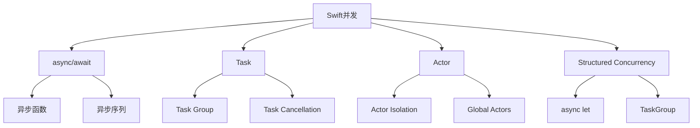

# Swift 并发编程深度指南 (Swift Concurrency Deep Dive)

## 一、概述

Swift 并发编程模型从 Swift 5.5 引入，经过 Swift 5.9 和 Swift 6 的演进，形成了完整的结构化并发体系。核心目标是在编译期保证并发安全，消除数据竞争（Data Race）。

### 1.1 并发模型演进

| 版本 | 特性 | 意义 |
|------|------|------|
| Swift 5.5 | async/await, Task, Actor | 基础并发模型 |
| Swift 5.9 | 参数包 (Parameter Packs) | 泛型改进 |
| Swift 6 | 严格并发检查, typed throws | 编译期数据竞争消除 |
| Swift 6.1 | @Sendable 推断改进 | 减少显式标注 |

### 1.2 核心概念



---

## 二、async/await 基础

### 2.1 异步函数定义

```swift
// 异步函数
func fetchData(from url: URL) async throws -> Data {
    let (data, response) = try await URLSession.shared.data(from: url)
    guard let httpResponse = response as? HTTPURLResponse,
          httpResponse.statusCode == 200 else {
        throw NetworkError.invalidResponse
    }
    return data
}

// 调用异步函数
func loadData() async {
    do {
        let data = try await fetchData(from: myURL)
        let decoded = try JSONDecoder().decode(MyModel.self, from: data)
        // 使用 decoded
    } catch {
        print("Error: \(error)")
    }
}
```

### 2.2 异步属性

```swift
// 异步只读属性
actor UserManager {
    var currentUser: User? {
        get async {
            // 可以在属性中执行异步操作
            await loadUserFromCache()
        }
    }
}

// 使用
let user = await userManager.currentUser
```

### 2.3 异步序列 (Async Sequences)

```swift
// 自定义异步序列
struct AsyncCounter: AsyncSequence {
    typealias Element = Int
    let limit: Int
    
    struct AsyncIterator: AsyncIteratorProtocol {
        var current = 0
        let limit: Int
        
        mutating func next() async -> Int? {
            guard current < limit else { return nil }
            defer { current += 1 }
            try? await Task.sleep(for: .seconds(1))
            return current
        }
    }
    
    func makeAsyncIterator() -> AsyncIterator {
        AsyncIterator(limit: limit)
    }
}

// 使用 for-await-in
for await number in AsyncCounter(limit: 10) {
    print(number)
}

// 内置异步序列
for try await line in URL(string: "https://example.com")!.lines {
    print(line)
}
```

---

## 三、Task 与 TaskGroup

### 3.1 Task 基础

```swift
// 创建非结构化 Task
let task = Task {
    let data = try await fetchData(from: url)
    return data
}

// 等待结果
let result = try await task.value

// 带优先级的 Task
let highPriorityTask = Task(priority: .high) {
    // 高优先级任务
}

// 带超时的 Task
let taskWithTimeout = Task {
    try await withThrowingTaskGroup(of: Data.self) { group in
        group.addTask {
            try await fetchData(from: url)
        }
        
        group.addTask {
            try await Task.sleep(for: .seconds(30))
            throw TimeoutError()
        }
        
        return try await group.next()!
    }
}
```

### 3.2 Task Cancellation

```swift
func performCancellableWork() async throws {
    // 检查取消状态
    try Task.checkCancellation()
    
    // 或者使用 Task.isCancelled
    if Task.isCancelled {
        return
    }
    
    // 长时间运行的任务中定期检查
    for i in 0..<1000 {
        try Task.checkCancellation()
        // 执行工作
        await processItem(i)
    }
}

// 取消任务
let task = Task {
    try await performCancellableWork()
}

// 取消
task.cancel()

// 使用 withTaskCancellationHandler
func withCancellationHandler<T>(
    operation: @Sendable () async throws -> T,
    onCancel: @Sendable () -> Void
) async rethrows -> T {
    try await withTaskCancellationHandler {
        try operation()
    } onCancel: {
        onCancel()
    }
}
```

### 3.3 TaskGroup（结构化并发）

```swift
// 并发执行多个任务并收集结果
func fetchMultipleURLs(_ urls: [URL]) async throws -> [Data] {
    try await withThrowingTaskGroup(of: Data.self) { group in
        for url in urls {
            group.addTask {
                try await self.fetchData(from: url)
            }
        }
        
        var results: [Data] = []
        for try await data in group {
            results.append(data)
        }
        return results
    }
}

// 限制并发数
func fetchWithConcurrencyLimit(
    urls: [URL],
    maxConcurrency: Int
) async throws -> [Data] {
    try await withThrowingTaskGroup(of: (Int, Data).self) { group in
        var results: [(Int, Data)] = []
        var index = 0
        
        for url in urls {
            if index >= maxConcurrency {
                if let result = try await group.next() {
                    results.append(result)
                }
            }
            
            let currentIndex = index
            group.addTask {
                let data = try await self.fetchData(from: url)
                return (currentIndex, data)
            }
            index += 1
        }
        
        for try await result in group {
            results.append(result)
        }
        
        return results.sorted(by: { $0.0 < $1.0 }).map { $0.1 }
    }
}

// 取消所有子任务
func fetchWithCancellation(urls: [URL]) async throws -> [Data] {
    try await withThrowingTaskGroup(of: Data.self) { group in
        for url in urls {
            group.addTask {
                try await self.fetchData(from: url)
            }
        }
        
        // 遇到第一个错误时取消所有任务
        var results: [Data] = []
        do {
            for try await data in group {
                results.append(data)
            }
        } catch {
            group.cancelAll()
            throw error
        }
        
        return results
    }
}
```

---

## 四、Actor 模型

### 4.1 Actor 定义与使用

```swift
// 定义 Actor
actor BankAccount {
    let id: String
    private var balance: Decimal
    
    init(id: String, initialBalance: Decimal) {
        self.id = id
        self.balance = initialBalance
    }
    
    func deposit(_ amount: Decimal) {
        balance += amount
    }
    
    func withdraw(_ amount: Decimal) throws {
        guard balance >= amount else {
            throw BankError.insufficientFunds
        }
        balance -= amount
    }
    
    // 非隔离属性（只读）
    var currentBalance: Decimal {
        balance
    }
}

// 使用 Actor
let account = BankAccount(id: "123", initialBalance: 1000)

// 必须使用 await 访问 Actor 隔离的属性和方法
await account.deposit(500)
let balance = await account.currentBalance

// 不能直接访问隔离状态
// account.balance // 编译错误
```

### 4.2 Actor Reentrancy（重入性）

```swift
actor ImageDownloader {
    private var cache: [URL: UIImage] = [:]
    private var inProgress: [URL: Task<UIImage, Error>] = [:]
    
    func download(from url: URL) async throws -> UIImage {
        // 检查缓存
        if let cached = cache[url] {
            return cached
        }
        
        // 检查是否已有进行中的下载
        if let existingTask = inProgress[url] {
            return try await existingTask.value
        }
        
        // 创建新的下载任务
        let task = Task<UIImage, Error> {
            let (data, _) = try await URLSession.shared.data(from: url)
            guard let image = UIImage(data: data) else {
                throw ImageError.invalidData
            }
            return image
        }
        
        inProgress[url] = task
        
        do {
            let image = try await task.value
            cache[url] = image
            inProgress[url] = nil
            return image
        } catch {
            inProgress[url] = nil
            throw error
        }
    }
}
```

### 4.3 Global Actors（全局 Actor）

```swift
// MainActor - 主线程隔离
@MainActor
class ViewModel: ObservableObject {
    @Published var items: [Item] = []
    @Published var isLoading = false
    
    func loadItems() async {
        isLoading = true
        
        do {
            // 在后台线程执行
            let fetched = try await fetchItemsFromAPI()
            
            // 自动回到主线程更新 UI
            items = fetched
            isLoading = false
        } catch {
            isLoading = false
            // 处理错误
        }
    }
    
    // 非隔离方法可以在任意线程调用
    nonisolated func someUtility() -> String {
        "utility"
    }
}

// 自定义 Global Actor
@globalActor
actor BackgroundActor {
    static let shared = BackgroundActor()
}

@BackgroundActor
func heavyComputation() {
    // 在后台执行
}

// 使用
await heavyComputation()
```

### 4.4 Sendable 协议

```swift
// Sendable 标记可以安全跨并发域传递的类型
struct UserData: Sendable {
    let id: Int
    let name: String
    let email: String
}

// 值类型自动满足 Sendable
struct Point: Sendable {
    let x: Double
    let y: Double
}

// 引用类型需要特殊处理
final class SafeCounter: Sendable {
    private let lock = NSLock()
    private var _count = 0
    
    var count: Int {
        lock.lock()
        defer { lock.unlock() }
        return _count
    }
    
    func increment() {
        lock.lock()
        defer { lock.unlock() }
        _count += 1
    }
}

// @unchecked Sendable - 手动保证线程安全
final class Cache<Key: Hashable, Value>: @unchecked Sendable {
    private var storage: [Key: Value] = [:]
    private let queue = DispatchQueue(label: "com.cache", attributes: .concurrent)
    
    func get(_ key: Key) -> Value? {
        queue.sync { storage[key] }
    }
    
    func set(_ key: Key, value: Value) {
        queue.async(flags: .barrier) {
            self.storage[key] = value
        }
    }
}

// @Sendable 闭包
func performAsync(_ work: @Sendable @escaping () async -> Void) {
    Task {
        await work()
    }
}
```

---

## 五、Swift 6 严格并发

### 5.1 编译期数据竞争检测

```swift
// Swift 6 模式下，以下代码会编译错误
class Counter {
    var value = 0
}

let counter = Counter()

// 错误：跨并发域共享可变状态
Task {
    counter.value += 1
}

Task {
    counter.value += 1
}

// 修复方案 1：使用 Actor
actor SafeCounter {
    var value = 0
}

// 修复方案 2：使用 Sendable 值类型
struct ImmutableCounter: Sendable {
    let value: Int
    
    func incremented() -> ImmutableCounter {
        ImmutableCounter(value: value + 1)
    }
}
```

### 5.2 区域隔离 (Region Isolation)

```swift
// Swift 6 引入区域隔离检查
func process(_ array: inout [Int]) {
    // array 在此函数内是隔离的
}

// 跨 actor 传递
actor Processor {
    func process(_ data: [Int]) -> [Int] {
        data.map { $0 * 2 }
    }
}

let processor = Processor()
let input = [1, 2, 3]
let output = await processor.process(input)  // input 被安全传递
```

### 5.3 Typed Throws

```swift
// Swift 6 支持类型化错误
enum NetworkError: Error {
    case invalidURL
    case noData
    case decodingFailed
}

func fetchData() async throws(NetworkError) -> Data {
    guard let url = URL(string: urlString) else {
        throw .invalidURL
    }
    // ...
}

// 调用时可以精确捕获错误类型
do {
    let data = try await fetchData()
} catch {
    // error 类型为 NetworkError
    switch error {
    case .invalidURL: break
    case .noData: break
    case .decodingFailed: break
    }
}
```

---

## 六、异步序列高级用法

### 6.1 AsyncSequence 操作符

```swift
// map
let doubled = numbers.async.map { $0 * 2 }

// filter
let evens = numbers.async.filter { $0 % 2 == 0 }

// reduce
let sum = try await numbers.async.reduce(0, +)

// flatMap
let allItems = urls.async.flatMap { url in
    try await fetchItems(from: url)
}

// 手动实现操作符
extension AsyncSequence {
    func asyncMap<T>(_ transform: @Sendable (Element) async throws -> T) -> AsyncThrowingMapSequence<Self, T> {
        AsyncThrowingMapSequence(self, transform: transform)
    }
}
```

### 6.2 AsyncChannel

```swift
// 使用 AsyncStream 创建异步序列
let (stream, continuation) = AsyncStream<Int>.makeStream()

// 生产者
Task {
    for i in 0..<10 {
        continuation.yield(i)
        try await Task.sleep(for: .seconds(1))
    }
    continuation.finish()
}

// 消费者
for await value in stream {
    print(value)
}

// 带缓冲的 AsyncStream
let bufferedStream = AsyncStream(bufferingPolicy: .bufferingOldest(10)) { continuation in
    // 生产者代码
}
```

---

## 七、实际应用模式

### 7.1 网络层并发模式

```swift
actor NetworkManager {
    private let session: URLSession
    private var activeTasks: [URL: Task<Data, Error>] = [:]
    
    init(session: URLSession = .shared) {
        self.session = session
    }
    
    func fetch<T: Decodable>(_ type: T.Type, from url: URL) async throws -> T {
        // 去重：相同 URL 的请求只执行一次
        if let existingTask = activeTasks[url] {
            let data = try await existingTask.value
            return try JSONDecoder().decode(type, from: data)
        }
        
        let task = Task<Data, Error> {
            let (data, response) = try await session.data(from: url)
            guard let httpResponse = response as? HTTPURLResponse,
                  (200...299).contains(httpResponse.statusCode) else {
                throw NetworkError.invalidResponse
            }
            return data
        }
        
        activeTasks[url] = task
        
        do {
            let data = try await task.value
            activeTasks[url] = nil
            return try JSONDecoder().decode(type, from: data)
        } catch {
            activeTasks[url] = nil
            throw error
        }
    }
    
    // 并发批量请求
    func fetchAll<T: Decodable>(_ type: T.Type, from urls: [URL]) async throws -> [T] {
        try await withThrowingTaskGroup(of: T.self) { group in
            for url in urls {
                group.addTask {
                    try await self.fetch(type, from: url)
                }
            }
            
            var results: [T] = []
            for try await result in group {
                results.append(result)
            }
            return results
        }
    }
}
```

### 7.2 缓存并发模式

```swift
actor Cache<Key: Hashable, Value> {
    private var storage: [Key: CacheEntry<Value>] = [:]
    private let expiration: TimeInterval
    
    init(expiration: TimeInterval = 300) {
        self.expiration = expiration
    }
    
    func get(_ key: Key) -> Value? {
        guard let entry = storage[key] else { return nil }
        if entry.isExpired {
            storage[key] = nil
            return nil
        }
        return entry.value
    }
    
    func set(_ key: Key, value: Value) {
        storage[key] = CacheEntry(value: value, expiration: expiration)
    }
    
    func remove(_ key: Key) {
        storage[key] = nil
    }
    
    func removeAll() {
        storage.removeAll()
    }
}

struct CacheEntry<Value> {
    let value: Value
    let createdAt: Date
    let expiration: TimeInterval
    
    init(value: Value, expiration: TimeInterval) {
        self.value = value
        self.createdAt = Date()
        self.expiration = expiration
    }
    
    var isExpired: Bool {
        Date().timeIntervalSince(createdAt) > expiration
    }
}
```

### 7.3 依赖注入并发模式

```swift
// 使用 Actor 实现线程安全的依赖容器
actor DependencyContainer {
    private var factories: [String: () -> Any] = [:]
    private var singletons: [String: Any] = [:]
    
    func register<T>(_ type: T.Type, factory: @escaping () -> T) {
        factories[String(describing: type)] = factory
    }
    
    func registerSingleton<T>(_ type: T.Type, instance: T) {
        singletons[String(describing: type)] = instance
    }
    
    func resolve<T>(_ type: T.Type) -> T {
        let key = String(describing: type)
        
        if let singleton = singletons[key] as? T {
            return singleton
        }
        
        guard let factory = factories[key] else {
            fatalError("No registration for \(type)")
        }
        
        return factory() as! T
    }
}

// 使用
let container = DependencyContainer()
await container.register(NetworkService.self) { URLSessionNetworkService() }
await container.registerSingleton(Database.self, instance: SQLiteDatabase())

let service: NetworkService = await container.resolve(NetworkService.self)
```

---

## 八、调试与性能

### 8.1 并发调试工具

| 工具 | 用途 |
|------|------|
| **Thread Sanitizer (TSan)** | 检测数据竞争 |
| **Swift Concurrency Debug** | Xcode 并发调试 |
| **Instruments - Thread** | 线程分析 |
| **Instruments - Swift Concurrency** | 并发性能分析 |

### 8.2 常见并发陷阱

```swift
// 陷阱 1：在非主线程更新 UI
// 错误
func updateUI() {
    Task {
        let data = await fetchData()
        label.text = data.title  // 可能在非主线程
    }
}

// 正确
func updateUI() {
    Task { @MainActor in
        let data = await fetchData()
        label.text = data.title  // 保证在主线程
    }
}

// 陷阱 2：忘记处理取消
// 错误
func longRunningTask() async {
    for i in 0..<10000 {
        await process(i)
    }
}

// 正确
func longRunningTask() async throws {
    for i in 0..<10000 {
        try Task.checkCancellation()
        await process(i)
    }
}

// 陷阱 3：Actor 死锁
actor A {
    func callB(_ b: B) async {
        await b.doSomething()  // 等待 B
    }
}

actor B {
    func callA(_ a: A) async {
        await a.doSomething()  // 等待 A，可能死锁
    }
}
```

---

## 相关条目

- [[Swift]]
- [[SwiftUI与iOS开发]]
- [[Combine]]
- [[AppArchitecture]]

## 参考资源

1. Apple. "Swift Concurrency Documentation." developer.apple.com
2. Apple. "Swift Evolution Proposals." github.com/apple/swift-evolution
3. Sundell, J. "Swift Concurrency by Example." hackingwithswift.com
4. Hudson, P. "Hacking with Swift: Concurrency." hackingwithswift.com
5. Apple. "Migrating to Swift 6." WWDC 2024
