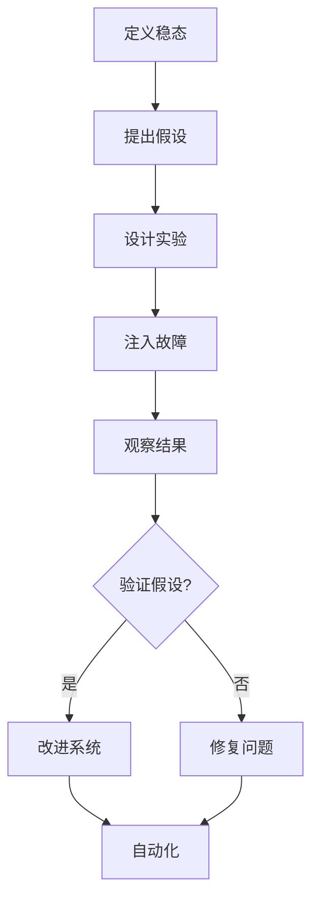
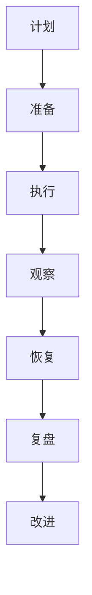

# 混沌工程 (Chaos Engineering)

## 一、概述

混沌工程是一种通过在系统中主动注入故障来发现潜在问题的工程实践。目的是提高系统的韧性和可靠性。

### 1.1 核心原则

| 原则 | 描述 |
|------|------|
| **建立稳态假设** | 定义系统正常行为的指标 |
| **多样化真实事件** | 模拟各种可能的故障场景 |
| **在生产环境运行** | 在真实环境中验证假设 |
| **自动化持续运行** | 将混沌实验集成到CI/CD |
| **最小化爆炸半径** | 控制实验影响范围 |

### 1.2 混沌工程流程



---

## 二、故障类型

### 2.1 故障分类

| 类型 | 描述 | 示例 |
|------|------|------|
| **基础设施** | 服务器、网络故障 | 服务器宕机、网络分区 |
| **应用** | 服务不可用 | 进程崩溃、内存泄漏 |
| **依赖** | 外部服务故障 | 数据库宕机、API超时 |
| **网络** | 网络问题 | 延迟、丢包、DNS故障 |
| **资源** | 资源耗尽 | CPU满载、磁盘满、内存不足 |

### 2.2 常见故障场景

```python
# 故障场景定义
fault_scenarios = {
    "pod_kill": {
        "description": "随机杀死Pod",
        "impact": "验证服务自愈能力",
        "recovery_time": "30s"
    },
    "network_delay": {
        "description": "添加网络延迟",
        "impact": "验证超时处理",
        "recovery_time": "0s"
    },
    "cpu_stress": {
        "description": "CPU压力测试",
        "impact": "验证资源限制",
        "recovery_time": "0s"
    },
    "disk_fill": {
        "description": "磁盘填充",
        "impact": "验证磁盘清理",
        "recovery_time": "0s"
    },
    "dns_failure": {
        "description": "DNS解析失败",
        "impact": "验证DNS容错",
        "recovery_time": "0s"
    }
}
```

---

## 三、Chaos Mesh

### 3.1 安装

```bash
# 安装 Chaos Mesh
helm repo add chaos-mesh https://charts.chaos-mesh.org
helm install chaos-mesh chaos-mesh/chaos-mesh --namespace chaos-testing --create-namespace

# 验证安装
kubectl get pods -n chaos-testing
```

### 3.2 Pod 故障

```yaml
# 随机杀死Pod
apiVersion: chaos-mesh.org/v1alpha1
kind: PodChaos
metadata:
  name: pod-kill
  namespace: chaos-testing
spec:
  action: pod-kill
  mode: one
  selector:
    namespaces:
      - default
    labelSelectors:
      app: my-app
  scheduler:
    cron: '@every 1h'

---
# Pod 故障（持续）
apiVersion: chaos-mesh.org/v1alpha1
kind: PodChaos
metadata:
  name: pod-failure
  namespace: chaos-testing
spec:
  action: pod-failure
  mode: one
  duration: '5m'
  selector:
    namespaces:
      - default
    labelSelectors:
      app: my-app
```

### 3.3 网络故障

```yaml
# 网络延迟
apiVersion: chaos-mesh.org/v1alpha1
kind: NetworkChaos
metadata:
  name: network-delay
  namespace: chaos-testing
spec:
  action: delay
  mode: all
  selector:
    namespaces:
      - default
    labelSelectors:
      app: my-app
  delay:
    latency: '100ms'
    jitter: '50ms'
    correlation: '50'
  duration: '5m'

---
# 网络丢包
apiVersion: chaos-mesh.org/v1alpha1
kind: NetworkChaos
metadata:
  name: network-loss
  namespace: chaos-testing
spec:
  action: loss
  mode: all
  selector:
    namespaces:
      - default
    labelSelectors:
      app: my-app
  loss:
    loss: '30'
    correlation: '50'
  duration: '5m'

---
# 网络分区
apiVersion: chaos-mesh.org/v1alpha1
kind: NetworkChaos
metadata:
  name: network-partition
  namespace: chaos-testing
spec:
  action: partition
  mode: all
  selector:
    namespaces:
      - default
    labelSelectors:
      app: my-app
  direction: to
  target:
    selector:
      namespaces:
        - default
      labelSelectors:
        app: database
```

### 3.4 CPU/内存压力

```yaml
# CPU压力
apiVersion: chaos-mesh.org/v1alpha1
kind: StressChaos
metadata:
  name: cpu-stress
  namespace: chaos-testing
spec:
  mode: all
  selector:
    namespaces:
      - default
    labelSelectors:
      app: my-app
  stressors:
    cpu:
      workers: 4
      load: 100
  duration: '5m'

---
# 内存压力
apiVersion: chaos-mesh.org/v1alpha1
kind: StressChaos
metadata:
  name: memory-stress
  namespace: chaos-testing
spec:
  mode: all
  selector:
    namespaces:
      - default
    labelSelectors:
      app: my-app
  stressors:
    memory:
      workers: 4
      size: '1GB'
  duration: '5m'
```

### 3.5 磁盘故障

```yaml
# 磁盘填充
apiVersion: chaos-mesh.org/v1alpha1
kind: IOChaos
metadata:
  name: disk-fill
  namespace: chaos-testing
spec:
  action: latency
  mode: all
  selector:
    namespaces:
      - default
    labelSelectors:
      app: my-app
  volumePath: /data
  delay: '100ms'
  duration: '5m'

---
# IO延迟
apiVersion: chaos-mesh.org/v1alpha1
kind: IOChaos
metadata:
  name: io-delay
  namespace: chaos-testing
spec:
  action: latency
  mode: all
  selector:
    namespaces:
      - default
    labelSelectors:
      app: my-app
  delay: '100ms'
  percent: 50
  duration: '5m'
```

---

## 四、Litmus

### 4.1 安装

```bash
# 安装 Litmus
helm repo add litmuschaos https://litmuschaos.github.io/litmus-helm/
helm install litmus litmuschaos/litmus --namespace litmus --create-namespace
```

### 4.2 ChaosEngine

```yaml
apiVersion: litmuschaos.io/v1alpha1
kind: ChaosEngine
metadata:
  name: pod-delete
  namespace: litmus
spec:
  appinfo:
    appns: default
    applabel: app=my-app
    appkind: deployment
  chaosServiceAccount: litmus-admin
  experiments:
    - name: pod-delete
      spec:
        components:
          env:
            - name: TOTAL_CHAOS_DURATION
              value: '30'
            - name: CHAOS_INTERVAL
              value: '10'
            - name: FORCE
              value: 'false'
```

---

## 五、AWS Fault Injection Simulator

### 5.1 实验模板

```json
{
  "description": "Terminate random EC2 instances",
  "targets": {
    "my-asg": {
      "resourceType": "aws:ec2:instance",
      "selectionMode": "PERCENT(50)",
      "parameters": {
        "tag:Name": "my-app-*"
      }
    }
  },
  "actions": {
    "terminateInstances": {
      "actionId": "aws:ec2:terminate-instances",
      "parameters": {},
      "targets": {
        "Instances": "my-asg"
      }
    }
  },
  "stopConditions": [
    {
      "source": "aws:cloudwatch:alarm",
      "value": "arn:aws:cloudwatch:us-east-1:123456789012:alarm:my-alarm"
    }
  ],
  "roleArn": "arn:aws:iam::123456789012:role/FISRole"
}
```

---

## 六、混沌实验编程

### 6.1 Python 混沌库

```python
from chaoslib import experiment
from chaoslib.k8s import pod as k8s_pod
import requests

@experiment
def test_service_resilience():
    """测试服务韧性"""
    
    # 稳态指标
    def steady_state():
        response = requests.get("http://my-app/health")
        assert response.status_code == 200
        assert response.json()["status"] == "healthy"
    
    # 验证稳态
    steady_state()
    
    # 注入故障
    k8s_pod.terminate_pods(
        label_selector="app=my-app",
        count=1,
        grace_period=0
    )
    
    # 等待恢复
    time.sleep(30)
    
    # 再次验证稳态
    steady_state()
```

### 6.2 自定义混沌实验

```python
from chaoslib import experiment
import requests
import time

@experiment
def test_circuit_breaker():
    """测试熔断器"""
    
    # 发送大量请求触发熔断
    for i in range(100):
        try:
            response = requests.get(
                "http://my-app/api/slow",
                timeout=5
            )
            print(f"Request {i}: {response.status_code}")
        except requests.Timeout:
            print(f"Request {i}: Timeout")
    
    # 验证熔断状态
    response = requests.get("http://my-app/health")
    assert response.json()["circuit_breaker"] == "open"
    
    # 等待恢复
    time.sleep(60)
    
    # 验证恢复
    response = requests.get("http://my-app/health")
    assert response.json()["circuit_breaker"] == "closed"
```

### 6.3 使用 Toxiproxy

```python
from toxiproxy import Toxiproxy

# 创建代理
toxi = Toxiproxy()
proxy = toxi.create(
    name="my-service",
    listen="localhost:18080",
    upstream="localhost:8080"
)

# 添加延迟
proxy.add_toxic(
    name="latency",
    type="latency",
    attributes={"latency": 1000}
)

# 添加丢包
proxy.add_toxic(
    name="packet_loss",
    type="timeout",
    attributes={"timeout": 5000}
)

# 移除故障
proxy.remove_toxic("latency")

# 销毁代理
proxy.destroy()
```

---

## 七、Game Day

### 7.1 Game Day 流程



### 7.2 Game Day 检查清单

```markdown
## Game Day 检查清单

### 准备阶段
- [ ] 定义实验目标和范围
- [ ] 通知相关团队
- [ ] 准备回滚方案
- [ ] 确认监控告警正常
- [ ] 准备应急联系人

### 执行阶段
- [ ] 建立稳态基准
- [ ] 注入故障
- [ ] 观察系统行为
- [ ] 记录发现的问题

### 恢复阶段
- [ ] 停止故障注入
- [ ] 验证系统恢复
- [ ] 确认业务正常

### 复盘阶段
- [ ] 分析实验结果
- [ ] 记录发现的问题
- [ ] 制定改进计划
- [ ] 更新应急文档
```

---

## 八、混沌工程最佳实践

### 8.1 爆炸半径控制

| 策略 | 描述 |
|------|------|
| **环境隔离** | 先在测试环境验证 |
| **流量控制** | 使用小比例流量 |
| **时间控制** | 限制实验持续时间 |
| **回滚机制** | 准备快速回滚方案 |
| **监控告警** | 实时监控系统状态 |

### 8.2 自动化混沌实验

```yaml
# GitHub Actions 混沌实验
name: Chaos Experiment

on:
  schedule:
    - cron: '0 2 * * 1'  # 每周一凌晨2点
  workflow_dispatch:

jobs:
  chaos:
    runs-on: ubuntu-latest
    
    steps:
      - uses: actions/checkout@v4
      
      - name: Setup kubectl
        uses: azure/setup-kubectl@v3
      
      - name: Run chaos experiment
        run: |
          kubectl apply -f chaos-experiments/pod-kill.yaml
          sleep 300
          kubectl delete -f chaos-experiments/pod-kill.yaml
      
      - name: Verify system health
        run: |
          curl -f https://my-app.com/health || exit 1
      
      - name: Send notification
        if: failure()
        uses: slackapi/slack-github-action@v1
        with:
          payload: |
            {
              "text": "Chaos experiment failed! Check system health."
            }
```

### 8.3 渐进式采用

| 阶段 | 内容 | 风险 |
|------|------|------|
| **1. 开发环境** | 在开发环境验证 | 极低 |
| **2. 测试环境** | 在测试环境验证 | 低 |
| **3. 预发布环境** | 在预发布环境验证 | 中 |
| **4. 生产环境（低峰）** | 在生产低峰期验证 | 中高 |
| **5. 生产环境（常态化）** | 定期执行混沌实验 | 可控 |

---

## 相关条目

- [[Microservices]]
- [[KubernetesDeep]]
- [[Observability]]
- [[HighConcurrencyDesign]]

## 参考资源

1. Netflix. "Chaos Engineering Principles." principlesofchaos.org
2. Chaos Mesh. "Official Documentation." chaos-mesh.org
3. Litmus. "Official Documentation." litmuschaos.io
4. AWS. "Fault Injection Simulator." aws.amazon.com/fis
5. Gremlin. "Chaos Engineering Guide." gremlin.com
