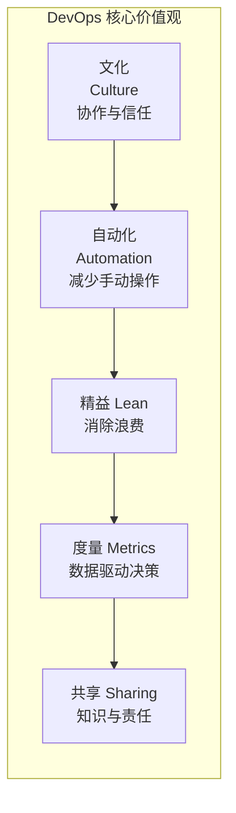
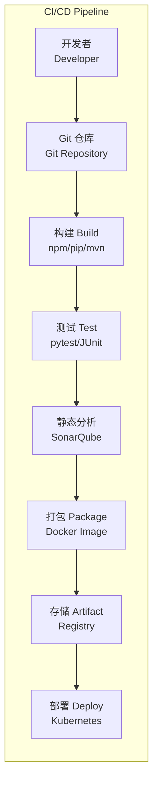
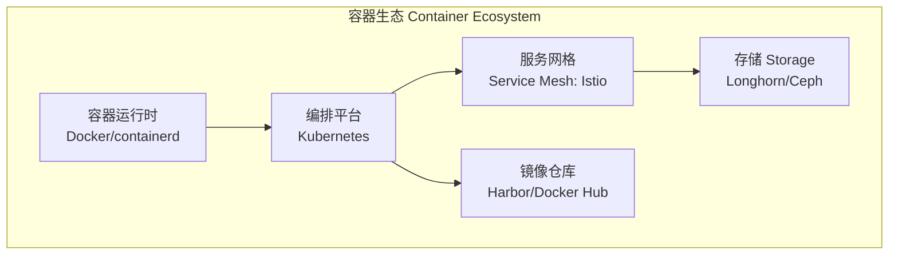

---
aliases:
  - DevOps
  - DevSecOps
  - CI_CD
  - 开发运维
tags:
  - '05_ComputerScience'
  - 'SoftwareEngineering'
  - 'DevOpsAndCI_CD'
  - 'Infrastructure'
---

# DevOps 实践 DevOps Practices

DevOps 是一组实践、文化和工具的结合，旨在打破软件开发（Development）和 IT 运维（Operations）之间的隔阂，通过自动化、协作和持续改进来加速软件交付。DevOps 强调沟通、协作、集成和自动化，以更快、更可靠地交付软件价值。

## 核心支柱 Core Pillars

## 持续集成与持续交付 CI/CD

CI/CD（Continuous Integration / Continuous Delivery）是 DevOps 的核心实践。

| 阶段 | 活动 | 工具示例 |
|------|------|----------|
| 持续集成 CI | 代码合并、自动构建、自动测试 | Jenkins, GitHub Actions, GitLab CI |
| 持续交付 CD | 自动部署到预发布/生产 | ArgoCD, Spinnaker, Octopus Deploy |
| 持续部署 Continuous Deployment | 每次通过测试的变更自动上线 | 同上 + Feature Flags |

CI/CD 洞察公式：

$$ \text{部署频率} = \frac{\text{成功部署数}}{\text{部署尝试数}} \times \frac{1}{\text{平均部署时间}} $$

$$ \text{变更失败率} = \frac{\text{导致故障的变更数}}{\text{总变更数}} $$

理想目标：高频部署 + 低变更失败率 + 快速恢复。

## 基础设施即代码 Infrastructure as Code (IaC)

IaC 通过机器可读的配置文件管理基础设施，实现版本控制和自动化运维。

| 工具 | 类型 | 语言/格式 | 适用场景 |
|------|------|-----------|----------|
| Terraform | 声明式 | HCL | 多云资源编排 |
| Ansible | 声明式 | YAML | 配置管理与应用部署 |
| Pulumi | 命令式 | TypeScript/Python | 用代码定义云资源 |
| CloudFormation | 声明式 | JSON/YAML | AWS 资源编排 |
| ARM Template | 声明式 | JSON | Azure 资源编排 |

## 监控与可观测性 Monitoring & Observability

可观测性（Observability）的三个支柱：

1. **指标 Metrics**：Prometheus, Grafana — 聚合的时间序列数据
2. **日志 Logs**：ELK Stack, Loki — 结构化的事件记录
3. **链路追踪 Traces**：Jaeger, OpenTelemetry — 请求端到端路径追踪

### SRE 核心指标

- **SLI**（Service Level Indicator）：服务质量度量指标（如响应时间 &lt; 200ms 的请求占比）
- **SLO**（Service Level Objective）：SLI 的目标值（如 99.9% 请求满足条件）
- **SLA**（Service Level Agreement）：对客户的服务水平承诺

$$ \text{可用性} = \frac{\text{正常运行时间}}{\text{总运行时间}} \times 100\% $$

$$ \text{错误预算} = 100\% - \text{SLO} $$

## 容器化与编排 Containers & Orchestration

工具栈：

## DevOps 文化 Culture

- **共享责任**（Shared Responsibility）：开发和运维共同为系统可靠性负责
- **快速反馈**（Fast Feedback）：从构建到生产全链路反馈
- **实验精神**（Experimentation）：允许失败，鼓励改进
- **知识共享**（Knowledge Sharing）：文档化、复盘、内部培训

## 成熟度模型 DevOps Maturity Model

| 等级 | 特点 | 文化状态 |
|------|------|----------|
| 初始 Initial | 手动部署、无标准化 | 团队隔离 |
| 可重复 Repeatable | 少数自动化流水线 | 开始协作 |
| 已定义 Defined | 标准化 CI/CD、IaC | 跨团队协作 |
| 已管理 Managed | 度量驱动、自动扩缩 | 数据驱动决策 |
| 优化 Optimizing | 自愈系统、A/B 实验 | 持续改进 |

## 相关条目

- [[TestingOverview]]
- [[SoftwareArchitecture]]
- [[SoftwareEngineering]]
- [[ServerlessComputing]]
- [[Virtualization]]
