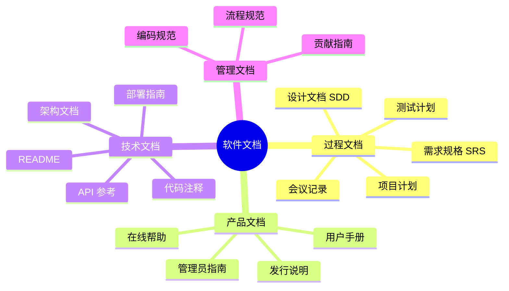

---
aliases: [Documentation]
tags: ['05_ComputerScience', 'SoftwareEngineering']
created: 2026-05-17
updated: 2026-05-17
---

# 软件文档 (Software Documentation)

## 一、概述 (Overview)

软件文档是软件开发生命周期中产生的所有书面材料和记录的总称。良好的文档降低知识传递成本（Bus Factor），提高团队效率，减少维护风险，是高质量软件的标志之一。

### 为什么文档很重要

- **知识传递**：减少"公交因素"（Bus Factor = 关键人员的离职风险）
- **降低入门成本**：新成员更快上手
- **减少重复沟通**：常见问题文档化后无需重复解答
- **法规合规**：医疗、金融等行业要求文档记录
- **质量保证**：文档隐式要求设计先于编码

## 二、文档分类 (Documentation Classification)



### 按受众分类

| 文档类型 | 主要受众 | 内容特点 | 典型格式 |
|---------|---------|---------|---------|
| **README** | 开发者/用户 | 项目介绍、快速开始、安装步骤 | Markdown |
| **API 文档** | 集成开发者 | 接口/参数/返回值/错误码 | OpenAPI/Swagger |
| **架构文档 (ADR)** | 架构师/开发者 | 架构决策、权衡、上下文 | Markdown/AsciiDoc |
| **用户手册** | 最终用户 | 功能操作、配置、故障排除 | PDF/Web |
| **运维手册** | 运维/SRE | 部署拓扑、备份、监控 | Confluence/Wiki |
| **贡献指南** | 贡献者 | 代码风格、PR 流程、开发环境设置 | CONTRIBUTING.md |

## 三、文档即代码 (Docs as Code)

将文档视为软件代码一样管理：

| 实践 | 说明 | 工具/标准 |
|------|------|----------|
| **版本控制** | 文档与代码同仓库 | Git, Markdown |
| **自动化构建** | 从源码生成可发布格式 | MkDocs, Sphinx, Docusaurus |
| **持续集成** | PR 审核文档变更 | GitHub Actions, Vale |
| **自动化测试** | 验证文档示例代码、链接 | markdown-link-check, doctest |
| **设计即文档** | 代码 + 注释足够清晰时减少独立文档 | Literate Programming |

### README 标准结构

```markdown
# 项目名称

[](ci_url)
[](license_url)

## 简介
用 1-3 句话说明项目是什么、解决什么问题。

## 快速开始
```bash
pip install mypackage
mypackage run
```

## 使用示例
```python
from mypackage import Client
client = Client()
result = client.process(data)
```

## 文档
- [完整文档](link)
- [API 参考](link)

## 贡献
请阅读 [CONTRIBUTING.md](CONTRIBUTING.md)

## 许可
MIT License
```

## 四、架构决策记录 (Architecture Decision Record, ADR)

ADR 记录重要的架构决策及其中文和后果，是"轻量级架构文档"的推荐形式。

### ADR 模板

```markdown
# ADR-001: 选择 PostgreSQL 作为主数据库

## 状态 (Status)
[Proposed | Accepted | Deprecated | Superseded]

## 上下文 (Context)
项目需要支持复杂查询和事务，用户量预计 10 万。

## 决策 (Decision)
使用 PostgreSQL 16 作为主数据库。

## 理由 (Rationale)
- 成熟的 ACID 事务支持
- 复杂的 SQL 查询和索引能力
- 活跃的开源社区
- JSONB 支持灵活的 Schema

## 后果 (Consequences)
- 需要 DBA 专业技能
- 水平扩展比 NoSQL 复杂（需分片或读写分离）

## 替代方案 (Alternatives)
- MySQL: 生态类似但功能略弱（缺少部分索引类型）
- MongoDB: 灵活性高但事务支持弱
```

## 五、代码注释 (Code Comments)

### 注释层次

```text
层次 1 — 为什么 (Why): 解释业务逻辑或复杂算法的背景
层次 2 — 怎么做 (How): 说明代码的实现方式（通常可以重构为自文档代码）
层次 3 — 是什么 (What): 除非必要，避免（好代码本身应说明做什么）
```

### 何时注释

```python
# ❌ 不必要的注释（重复代码）
x = x + 1  # Increment x by 1

# ✅ 解释"为什么"
# 使用指数退避策略避免 API 限流
backoff = min(2 ** retry_count, MAX_BACKOFF)
time.sleep(backoff)

# ✅ 文档注释 (Docstring)
def calculate_interest(principal: float, rate: float, years: int) -> float:
    """计算复利金额。

    Args:
        principal: 本金
        rate: 年利率（如 0.05 表示 5%）
        years: 投资年数

    Returns:
        复利终值: principal * (1 + rate)^years
    """
    return principal * (1 + rate) ** years
```

## 六、文档维护策略 (Documentation Maintenance)

| 策略 | 描述 | 适用场景 |
|------|------|---------|
| **定期审核** | 每季度/半年评审文档时效性 | 所有文档 |
| **与代码同步** | 代码变更时必须更新关联文档 | API 文档、配置文件 |
| **自动化检查** | CI 检测死链接、失效示例 | 技术文档 |
| **社区驱动** | 用户/贡献者发现并更新文档 | 开源项目 |
| **文档清理日** | 团队定期集中清理旧文档 | 内部知识库 |

### 文档债务 (Documentation Debt)

与"技术债务"类似，文档债务指文档缺失、过时或不准确带来的维护成本：

$$\text{文档债务} \approx \sum_{\text{each outdated doc}} (\text{误导时间} \times \text{受影响人数})$$

## 七、文档质量评估 (Quality Assessment)

| 评估维度 | 检查点 |
|---------|--------|
| **完整性 (Completeness)** | 所有功能有对应文档吗？边界情况有说明吗？ |
| **准确性 (Accuracy)** | 示例代码能运行吗？版本信息正确吗？ |
| **可读性 (Readability)** | Flesch 可读性评分？句子长度 ≤ 25 词？ |
| **可搜索性 (Findability)** | 关键术语用户能搜索到吗？有索引吗？ |
| **时效性 (Currency)** | 最后更新时间？与当前版本匹配？ |
| **一致性 (Consistency)** | 术语、格式、风格一致吗？ |

### 文档工具对比

| 工具 | 语法 | 输出格式 | 版本控制 | 社区/生态 | 适合场景 |
|------|------|---------|---------|----------|---------|
| **MkDocs** | Markdown | HTML/PDF | Git 友好 | 大（Material 主题） | 项目文档站点 |
| **Sphinx** | RST/MD | HTML/PDF/ePub | Git 友好 | 大（Python 生态）| Python 项目/API |
| **Docusaurus** | MDX/MD | React SPA | Git 友好 | 大（Facebook）| 开源项目主页 |
| **GitBook** | Markdown | HTML/PDF | Git 同步 | 中（SaaS/自托管）| 商业产品文档 |
| **VuePress** | Markdown | Vue SPA | Git 友好 | 中 | Vue 项目 |
| **AsciiDoc (Antora)** | AsciiDoc | HTML/PDF | Git 友好 | 中 | 多组件大型文档 |

### 文档风格指南对比

| 风格指南 | 制定者 | 主要特点 | 受众 |
|---------|--------|---------|------|
| **Google Developer Documentation Style Guide** | Google | 清晰、简洁、面向开发者 | 开发者文档 |
| **Microsoft Style Guide** | 微软 | 技术写作 + UI 文本规范 | 应用程序文档 |
| **Apple Style Guide** | Apple | 强调简洁和易读 | iOS/macOS 文档 |
| **Chicago Manual of Style** | Chicago UP | 学术写作通用规范 | 学术/出版 |
| **The Economist Style Guide** | The Economist | 简洁精确 | 新闻/通信 |

## 八、文档评审清单 (Review Checklist)

```text
内容评审:
  ☐ 信息准确？有事实错误吗？
  ☐ 示例代码可运行？版本兼容？
  ☐ 没有过时的内容？
  ☐ 覆盖所有边界情况？

结构评审:
  ☐ 有清晰的标题层次？
  ☐ 信息容易被找到（搜索/索引）？
  ☐ 内容按照 Divio 模型正确分类？
  ☐ 链接有效？

风格评审:
  ☐ 术语一致（没有混用同义词）？
  ☐ 主动语态？
  ☐ 句子长度 ≤ 25 词？
  ☐ 没有拼写/语法错误？
```

## 九、模板速查 (Quick Templates)

### API 文档模板 (OpenAPI 3.0)

```yaml
openapi: 3.0.0
info:
  title: User API
  version: 1.0.0
paths:
  /users/{id}:
    get:
      summary: 获取用户信息
      parameters:
        - name: id
          in: path
          required: true
          schema: { type: integer }
      responses:
        '200':
          description: 用户信息
          content:
            application/json:
              schema:
                type: object
                properties:
                  id: { type: integer }
                  name: { type: string }
```

### README 标准模板

```markdown
# Project Name

[]()
[]()

## 简介
> 一句话描述项目做什么

## 快速开始
```bash
# 安装
pip install project
# 运行
project --help
```

## 功能特性
- ✅ 功能 A
- ✅ 功能 B

## 文档
完整文档: [link](docs/)

## 贡献
请阅读 CONTRIBUTING.md

## 许可
MIT
```

文档质量的最终标准：**新团队成员只看 README 加 API 文档就能在 1 小时内独立完成一个功能开发**。

## 相关条目
- [[05_ComputerScience/ProfessionalEnglish/TechnicalWriting|TechnicalWriting]]
- [[RequirementsEngineering]]
- [[VersionControl]]
- [[05_ComputerScience/SoftwareEngineering/INDEX]]

