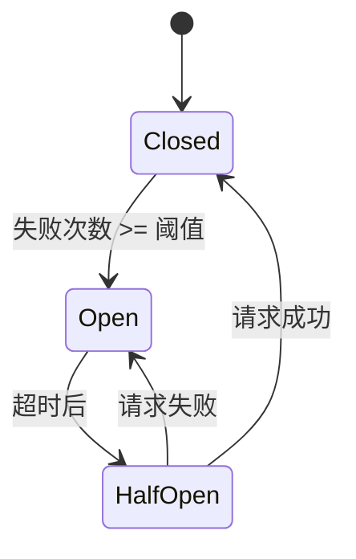

---
aliases: [HighConcurrencyDesign, 高并发设计, 限流, 熔断, 缓存策略]
tags: ['05_ComputerScience', 'SoftwareEngineering', 'HighConcurrency', 'SystemDesign']
created: 2026-06-27
updated: 2026-06-27
---

# 高并发系统设计 (High Concurrency System Design)

## 一、概述

高并发系统设计是应对大量并发请求的系统架构方法。核心目标是在保证系统稳定性的前提下，最大化吞吐量、最小化响应时间。

### 1.1 高并发指标

| 指标 | 描述 | 计算公式 |
|------|------|---------|
| **QPS** | 每秒查询数 | 请求数/时间(秒) |
| **TPS** | 每秒事务数 | 事务数/时间(秒) |
| **RT** | 响应时间 | 请求到响应的时间 |
| **并发数** | 同时处理的请求数 | QPS × RT |
| **吞吐量** | 单位时间处理量 | 请求数/时间 |

### 1.2 高并发架构原则

| 原则 | 描述 |
|------|------|
| **水平扩展** | 增加服务器提升处理能力 |
| **无状态设计** | 服务不保存会话状态 |
| **缓存优先** | 优先从缓存读取数据 |
| **异步处理** | 非核心流程异步执行 |
| **降级熔断** | 异常时保护核心链路 |

---

## 二、限流 (Rate Limiting)

### 2.1 令牌桶算法 (Token Bucket)

```python
import time
import threading

class TokenBucket:
    def __init__(self, rate, capacity):
        """
        rate: 令牌生成速率（个/秒）
        capacity: 桶容量
        """
        self.rate = rate
        self.capacity = capacity
        self.tokens = capacity
        self.last_time = time.time()
        self.lock = threading.Lock()
    
    def acquire(self):
        with self.lock:
            now = time.time()
            # 生成令牌
            self.tokens = min(
                self.capacity,
                self.tokens + (now - self.last_time) * self.rate
            )
            self.last_time = now
            
            if self.tokens >= 1:
                self.tokens -= 1
                return True
            return False
    
    def try_acquire(self, timeout=0):
        start = time.time()
        while True:
            if self.acquire():
                return True
            if time.time() - start >= timeout:
                return False
            time.sleep(0.01)

# 使用
bucket = TokenBucket(rate=100, capacity=200)  # 100 QPS，突发200

if bucket.acquire():
    # 处理请求
    pass
else:
    # 限流，返回429
    pass
```

### 2.2 漏桶算法 (Leaky Bucket)

```python
import time
import threading
from collections import deque

class LeakyBucket:
    def __init__(self, rate, capacity):
        """
        rate: 漏出速率（个/秒）
        capacity: 桶容量
        """
        self.rate = rate
        self.capacity = capacity
        self.queue = deque()
        self.last_time = time.time()
        self.lock = threading.Lock()
    
    def add(self, item):
        with self.lock:
            now = time.time()
            # 漏出
            while self.queue and now - self.last_time >= 1 / self.rate:
                self.queue.popleft()
                self.last_time += 1 / self.rate
            
            if len(self.queue) < self.capacity:
                self.queue.append(item)
                return True
            return False

# 使用
bucket = LeakyBucket(rate=100, capacity=200)

if bucket.add(request):
    # 处理请求
    pass
else:
    # 桶满，拒绝请求
    pass
```

### 2.3 滑动窗口算法 (Sliding Window)

```python
import time
import threading
from collections import deque

class SlidingWindowRateLimiter:
    def __init__(self, max_requests, window_seconds):
        """
        max_requests: 窗口内最大请求数
        window_seconds: 窗口大小（秒）
        """
        self.max_requests = max_requests
        self.window_seconds = window_seconds
        self.requests = deque()
        self.lock = threading.Lock()
    
    def allow(self):
        with self.lock:
            now = time.time()
            
            # 移除过期请求
            while self.requests and self.requests[0] <= now - self.window_seconds:
                self.requests.popleft()
            
            # 检查是否超限
            if len(self.requests) < self.max_requests:
                self.requests.append(now)
                return True
            return False

# 使用
limiter = SlidingWindowRateLimiter(max_requests=100, window_seconds=1)

if limiter.allow():
    # 处理请求
    pass
else:
    # 限流
    pass
```

### 2.4 固定窗口计数器

```python
import time
import threading

class FixedWindowRateLimiter:
    def __init__(self, max_requests, window_seconds):
        self.max_requests = max_requests
        self.window_seconds = window_seconds
        self.count = 0
        self.window_start = time.time()
        self.lock = threading.Lock()
    
    def allow(self):
        with self.lock:
            now = time.time()
            
            # 检查是否进入新窗口
            if now - self.window_start >= self.window_seconds:
                self.count = 0
                self.window_start = now
            
            if self.count < self.max_requests:
                self.count += 1
                return True
            return False
```

### 2.5 分布式限流（Redis）

```python
import redis
import time

class RedisRateLimiter:
    def __init__(self, redis_client, key, max_requests, window_seconds):
        self.redis = redis_client
        self.key = key
        self.max_requests = max_requests
        self.window_seconds = window_seconds
    
    def allow(self):
        now = time.time()
        pipeline = self.redis.pipeline()
        
        # 使用滑动窗口
        window_start = now - self.window_seconds
        
        # 移除过期请求
        pipeline.zremrangebyscore(self.key, 0, window_start)
        
        # 统计当前窗口请求数
        pipeline.zcard(self.key)
        
        # 添加当前请求
        pipeline.zadd(self.key, {f"{now}": now})
        
        # 设置过期时间
        pipeline.expire(self.key, self.window_seconds)
        
        results = pipeline.execute()
        current_count = results[1]
        
        if current_count < self.max_requests:
            return True
        
        # 移除刚添加的请求
        self.redis.zrem(self.key, f"{now}")
        return False

# 使用
redis_client = redis.Redis(host='localhost', port=6379)
limiter = RedisRateLimiter(redis_client, "rate:api", max_requests=100, window_seconds=60)

if limiter.allow():
    # 处理请求
    pass
else:
    # 限流
    pass
```

### 2.6 Nginx 限流配置

```nginx
# 定义限流区域
http {
    # 基于IP的限流
    limit_req_zone $binary_remote_addr zone=api:10m rate=100r/s;
    
    # 基于服务器的限流
    limit_req_zone $server_name zone=server:10m rate=1000r/s;
}

server {
    location /api/ {
        # 应用限流
        limit_req zone=api burst=200 nodelay;
        
        # 限流返回429
        limit_req_status 429;
    }
}
```

---

## 三、熔断器 (Circuit Breaker)

### 3.1 熔断器实现

```python
import time
import threading
from enum import Enum

class CircuitState(Enum):
    CLOSED = "closed"  # 正常状态
    OPEN = "open"  # 熔断状态
    HALF_OPEN = "half_open"  # 半开状态

class CircuitBreaker:
    def __init__(self, failure_threshold=5, recovery_timeout=30, half_open_max=3):
        """
        failure_threshold: 失败次数阈值
        recovery_timeout: 恢复超时时间（秒）
        half_open_max: 半开状态最大尝试次数
        """
        self.failure_threshold = failure_threshold
        self.recovery_timeout = recovery_timeout
        self.half_open_max = half_open_max
        
        self.state = CircuitState.CLOSED
        self.failure_count = 0
        self.last_failure_time = 0
        self.half_open_count = 0
        self.lock = threading.Lock()
    
    def call(self, func, *args, **kwargs):
        with self.lock:
            if self.state == CircuitState.OPEN:
                if time.time() - self.last_failure_time >= self.recovery_timeout:
                    self.state = CircuitState.HALF_OPEN
                    self.half_open_count = 0
                else:
                    raise CircuitOpenError("Circuit is open")
            
            if self.state == CircuitState.HALF_OPEN:
                if self.half_open_count >= self.half_open_max:
                    raise CircuitOpenError("Circuit half-open limit reached")
        
        try:
            result = func(*args, **kwargs)
            self._on_success()
            return result
        except Exception as e:
            self._on_failure()
            raise
    
    def _on_success(self):
        with self.lock:
            if self.state == CircuitState.HALF_OPEN:
                self.state = CircuitState.CLOSED
            self.failure_count = 0
    
    def _on_failure(self):
        with self.lock:
            self.failure_count += 1
            self.last_failure_time = time.time()
            
            if self.state == CircuitState.HALF_OPEN:
                self.state = CircuitState.OPEN
            elif self.failure_count >= self.failure_threshold:
                self.state = CircuitState.OPEN

class CircuitOpenError(Exception):
    pass

# 使用
breaker = CircuitBreaker(failure_threshold=5, recovery_timeout=30)

try:
    result = breaker.call(api_service.call_external_api)
except CircuitOpenError:
    # 熔断，返回降级结果
    result = get_fallback_result()
except Exception:
    # 业务异常
    raise
```

### 3.2 熔断器状态机



### 3.3 Nginx 熔断配置

```nginx
upstream backend {
    server 192.168.1.1:8080 max_fails=3 fail_timeout=30s;
    server 192.168.1.2:8080 max_fails=3 fail_timeout=30s;
    
    # 连接超时
    proxy_connect_timeout 5s;
    proxy_read_timeout 60s;
    
    # 重试机制
    proxy_next_upstream error timeout http_500 http_502 http_503;
    proxy_next_upstream_tries 3;
}
```

---

## 四、缓存策略

### 4.1 Cache-Aside（旁路缓存）

```python
class CacheAsidePattern:
    def __init__(self, cache, database):
        self.cache = cache
        self.database = database
    
    def get(self, key):
        # 1. 先查缓存
        value = self.cache.get(key)
        if value is not None:
            return value
        
        # 2. 缓存未命中，查数据库
        value = self.database.get(key)
        if value is not None:
            # 3. 写入缓存
            self.cache.set(key, value, ttl=300)
        
        return value
    
    def set(self, key, value):
        # 1. 更新数据库
        self.database.set(key, value)
        
        # 2. 删除缓存（而不是更新）
        self.cache.delete(key)
    
    def delete(self, key):
        # 1. 删除数据库
        self.database.delete(key)
        
        # 2. 删除缓存
        self.cache.delete(key)

# 使用
cache = RedisCache()
db = Database()
pattern = CacheAsidePattern(cache, db)

# 读取
user = pattern.get("user:123")

# 写入
pattern.set("user:123", user_data)
```

### 4.2 Write-Through（写穿透）

```python
class WriteThroughPattern:
    def __init__(self, cache, database):
        self.cache = cache
        self.database = database
    
    def get(self, key):
        # 只查缓存
        return self.cache.get(key)
    
    def set(self, key, value):
        # 同时写入缓存和数据库
        self.cache.set(key, value)
        self.database.set(key, value)
```

### 4.3 Write-Back（写回）

```python
class WriteBackPattern:
    def __init__(self, cache, database):
        self.cache = cache
        self.database = database
        self.dirty_keys = set()
    
    def get(self, key):
        return self.cache.get(key)
    
    def set(self, key, value):
        # 只写缓存，标记为脏数据
        self.cache.set(key, value)
        self.dirty_keys.add(key)
    
    def flush(self):
        # 批量写回数据库
        for key in self.dirty_keys:
            value = self.cache.get(key)
            self.database.set(key, value)
        self.dirty_keys.clear()
```

### 4.4 缓存穿透防护

```python
class BloomFilterCache:
    def __init__(self, cache, database, bloom_filter):
        self.cache = cache
        self.database = database
        self.bloom_filter = bloom_filter
    
    def get(self, key):
        # 1. 布隆过滤器判断
        if not self.bloom_filter.might_contain(key):
            return None  # 一定不存在
        
        # 2. 查缓存
        value = self.cache.get(key)
        if value is not None:
            return value
        
        # 3. 查数据库
        value = self.database.get(key)
        if value is not None:
            self.cache.set(key, value, ttl=300)
        else:
            # 缓存空值，防止穿透
            self.cache.set(key, "__NULL__", ttl=60)
        
        return value
```

### 4.5 缓存击穿防护

```python
import threading

class CacheBreakdownProtection:
    def __init__(self, cache, database):
        self.cache = cache
        self.database = database
        self.locks = {}
        self.lock = threading.Lock()
    
    def get(self, key):
        # 1. 查缓存
        value = self.cache.get(key)
        if value is not None:
            return value
        
        # 2. 获取分布式锁
        with self.lock:
            if key not in self.locks:
                self.locks[key] = threading.Lock()
        
        lock = self.locks[key]
        
        # 3. 双重检查
        with lock:
            value = self.cache.get(key)
            if value is not None:
                return value
            
            # 4. 查数据库
            value = self.database.get(key)
            if value is not None:
                self.cache.set(key, value, ttl=300)
            
            return value
```

### 4.6 缓存雪崩防护

```python
import random

class CacheAvalancheProtection:
    def __init__(self, cache, database):
        self.cache = cache
        self.database = database
    
    def get(self, key):
        value = self.cache.get(key)
        if value is not None:
            return value
        
        value = self.database.get(key)
        if value is not None:
            # 随机 TTL，防止同时过期
            ttl = 300 + random.randint(0, 60)
            self.cache.set(key, value, ttl=ttl)
        
        return value
```

---

## 五、连接池

### 5.1 数据库连接池

```python
import threading
import queue
import time

class ConnectionPool:
    def __init__(self, create_connection, max_size=10, min_size=2, max_idle_time=300):
        self.create_connection = create_connection
        self.max_size = max_size
        self.min_size = min_size
        self.max_idle_time = max_idle_time
        
        self.pool = queue.Queue(maxsize=max_size)
        self.active_count = 0
        self.lock = threading.Lock()
        
        # 初始化最小连接数
        for _ in range(min_size):
            conn = create_connection()
            self.pool.put(conn)
            self.active_count += 1
    
    def get_connection(self):
        try:
            # 尝试从池中获取
            conn = self.pool.get_nowait()
            return conn
        except queue.Empty:
            # 池为空，创建新连接
            with self.lock:
                if self.active_count < self.max_size:
                    conn = self.create_connection()
                    self.active_count += 1
                    return conn
            
            # 达到最大连接数，等待
            conn = self.pool.get(timeout=30)
            return conn
    
    def release_connection(self, conn):
        try:
            self.pool.put_nowait(conn)
        except queue.Full:
            # 池已满，关闭连接
            conn.close()
            with self.lock:
                self.active_count -= 1
    
    def close_all(self):
        while not self.pool.empty():
            conn = self.pool.get_nowait()
            conn.close()
        self.active_count = 0

# 使用
def create_db_connection():
    return psycopg2.connect(host="localhost", database="mydb")

pool = ConnectionPool(create_db_connection, max_size=20)

# 获取连接
conn = pool.get_connection()
try:
    cursor = conn.cursor()
    cursor.execute("SELECT * FROM users")
finally:
    pool.release_connection(conn)
```

### 5.2 HTTP 连接池

```python
import requests
from requests.adapters import HTTPAdapter
from urllib3.util.retry import Retry

class HTTPClient:
    def __init__(self, max_retries=3, pool_connections=10, pool_maxsize=20):
        self.session = requests.Session()
        
        # 重试策略
        retry_strategy = Retry(
            total=max_retries,
            backoff_factor=0.5,
            status_forcelist=[429, 500, 502, 503, 504]
        )
        
        # 连接池适配器
        adapter = HTTPAdapter(
            max_retries=retry_strategy,
            pool_connections=pool_connections,
            pool_maxsize=pool_maxsize
        )
        
        self.session.mount("http://", adapter)
        self.session.mount("https://", adapter)
    
    def get(self, url, **kwargs):
        return self.session.get(url, **kwargs)
    
    def post(self, url, **kwargs):
        return self.session.post(url, **kwargs)

# 使用
client = HTTPClient(max_retries=3, pool_connections=10, pool_maxsize=20)
response = client.get("https://api.example.com/users")
```

---

## 六、异步处理

### 6.1 生产者-消费者模式

```python
import asyncio
import aiohttp

class AsyncTaskQueue:
    def __init__(self, max_workers=10):
        self.queue = asyncio.Queue()
        self.max_workers = max_workers
        self.workers = []
    
    async def start(self):
        for i in range(self.max_workers):
            worker = asyncio.create_task(self._worker(f"worker-{i}"))
            self.workers.append(worker)
    
    async def _worker(self, name):
        while True:
            task = await self.queue.get()
            try:
                await task()
            except Exception as e:
                print(f"{name} error: {e}")
            finally:
                self.queue.task_done()
    
    async def submit(self, task):
        await self.queue.put(task)
    
    async def wait_all(self):
        await self.queue.join()
    
    async def stop(self):
        for worker in self.workers:
            worker.cancel()

# 使用
async def main():
    queue = AsyncTaskQueue(max_workers=10)
    await queue.start()
    
    async def process_item(item):
        # 处理逻辑
        await asyncio.sleep(0.1)
        print(f"Processed: {item}")
    
    # 提交任务
    for i in range(100):
        await queue.submit(lambda i=i: process_item(i))
    
    # 等待所有任务完成
    await queue.wait_all()
    await queue.stop()
```

### 6.2 批量处理

```python
import asyncio
from typing import List, TypeVar, Callable

T = TypeVar('T')
R = TypeVar('R')

async def batch_process(
    items: List[T],
    process_func: Callable[[T], R],
    batch_size: int = 100,
    max_concurrency: int = 10
) -> List[R]:
    semaphore = asyncio.Semaphore(max_concurrency)
    results = []
    
    async def process_with_semaphore(item):
        async with semaphore:
            return await process_func(item)
    
    # 分批处理
    for i in range(0, len(items), batch_size):
        batch = items[i:i + batch_size]
        batch_results = await asyncio.gather(
            *[process_with_semaphore(item) for item in batch]
        )
        results.extend(batch_results)
    
    return results

# 使用
async def process_user(user):
    # 处理用户
    await asyncio.sleep(0.1)
    return user

users = list(range(1000))
results = asyncio.run(batch_process(users, process_user, batch_size=100, max_concurrency=10))
```

---

## 七、数据库优化

### 7.1 读写分离

```python
class ReadWriteSplitRouter:
    def __init__(self, master_db, slave_dbs):
        self.master = master_db
        self.slaves = slave_dbs
        self.current_slave = 0
    
    def get_connection(self, is_write=False):
        if is_write:
            return self.master
        else:
            # 轮询选择从库
            slave = self.slaves[self.current_slave]
            self.current_slave = (self.current_slave + 1) % len(self.slaves)
            return slave

# 使用
router = ReadWriteSplitRouter(master_db, [slave1, slave2, slave3])

# 写操作
conn = router.get_connection(is_write=True)
conn.execute("INSERT INTO users ...")

# 读操作
conn = router.get_connection(is_write=False)
conn.execute("SELECT * FROM users ...")
```

### 7.2 分库分表

```python
class ShardingRouter:
    def __init__(self, shards, shard_key_func):
        self.shards = shards
        self.shard_key_func = shard_key_func
    
    def get_shard(self, key):
        shard_key = self.shard_key_func(key)
        shard_index = shard_key % len(self.shards)
        return self.shards[shard_index]

# 基于用户ID分片
def user_shard_key(user_id):
    return hash(user_id)

router = ShardingRouter(
    shards=["db_0", "db_1", "db_2", "db_3"],
    shard_key_func=user_shard_key
)

# 获取分片
shard = router.get_shard(user_id=12345)
```

---

## 八、监控与告警

### 8.1 关键监控指标

| 指标 | 描述 | 告警阈值 |
|------|------|---------|
| **QPS** | 每秒请求数 | 根据容量 |
| **RT** | 响应时间 | P99 > 500ms |
| **错误率** | 请求失败率 | > 1% |
| **CPU 使用率** | 服务器 CPU | > 80% |
| **内存使用率** | 服务器内存 | > 85% |
| **连接数** | 数据库连接 | > 80% 最大值 |
| **缓存命中率** | 缓存命中比例 | < 90% |

### 8.2 监控实现

```python
import time
from functools import wraps

def monitor_metrics(func):
    @wraps(func)
    async def wrapper(*args, **kwargs):
        start = time.time()
        try:
            result = await func(*args, **kwargs)
            # 记录成功
            metrics.increment(f"{func.__name__}.success")
            return result
        except Exception as e:
            # 记录失败
            metrics.increment(f"{func.__name__}.error")
            raise
        finally:
            # 记录耗时
            duration = time.time() - start
            metrics.timing(f"{func.__name__}.duration", duration)
    return wrapper

# 使用
@monitor_metrics
async def handle_request(request):
    # 处理请求
    pass
```

---

## 相关条目

- [[05_ComputerScience/CloudComputingAndDistributedSystems/CloudComputingAndDistributedSystems|CloudComputingAndDistributedSystems]]
- [[05_ComputerScience/CloudComputingAndDistributedSystems/LoadBalancing|LoadBalancing]]
- [[05_ComputerScience/CloudComputingAndDistributedSystems/MessageQueues|MessageQueues]]
- [[05_ComputerScience/DatabasesAndInformationSystems/RedisDeep|RedisDeep]]

## 参考资源

1. Martin Kleppmann. "Designing Data-Intensive Applications." O'Reilly, 2017.
2. Google. "SRE Book." sre.google
3. Netflix. "Hystrix Wiki." github.com/Netflix/Hystrix
4. Alibaba. "Sentinel Documentation." github.com/alibaba/Sentinel

