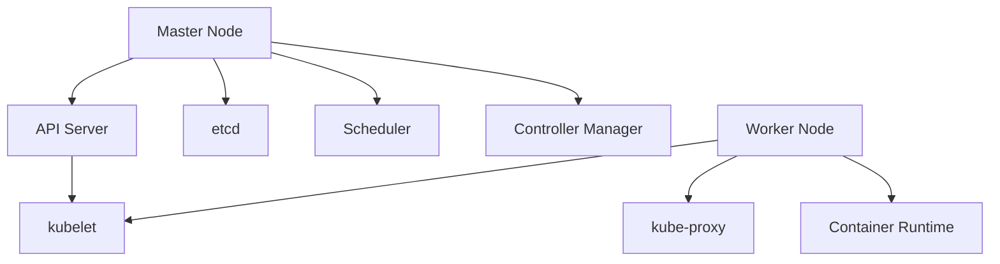

# Kubernetes 深度指南 (Kubernetes Deep Dive)

## 一、概述

Kubernetes (K8s) 是一个开源的容器编排平台，用于自动化容器化应用的部署、扩展和管理。

### 1.1 核心概念

| 概念 | 描述 |
|------|------|
| **Cluster** | K8s 集群，包含 Master 和 Worker 节点 |
| **Node** | 集群中的物理/虚拟机 |
| **Pod** | 最小部署单元，包含一个或多个容器 |
| **Service** | 一组 Pod 的网络抽象 |
| **Deployment** | 声明式部署管理 |
| **Namespace** | 逻辑隔离 |

### 1.2 架构组件



---

## 二、Pod

### 2.1 Pod 定义

```yaml
apiVersion: v1
kind: Pod
metadata:
  name: my-pod
  labels:
    app: my-app
spec:
  containers:
    - name: main
      image: nginx:latest
      ports:
        - containerPort: 80
      resources:
        requests:
          memory: "64Mi"
          cpu: "250m"
        limits:
          memory: "128Mi"
          cpu: "500m"
      livenessProbe:
        httpGet:
          path: /health
          port: 80
        initialDelaySeconds: 30
        periodSeconds: 10
      readinessProbe:
        httpGet:
          path: /ready
          port: 80
        initialDelaySeconds: 5
        periodSeconds: 5
```

### 2.2 多容器 Pod

```yaml
apiVersion: v1
kind: Pod
metadata:
  name: multi-container
spec:
  containers:
    # 主应用容器
    - name: app
      image: my-app:latest
      ports:
        - containerPort: 8080
    
    # Sidecar: 日志收集
    - name: log-collector
      image: fluentd:latest
      volumeMounts:
        - name: logs
          mountPath: /var/log/app
    
    # Sidecar: 代理
    - name: proxy
      image: envoy:latest
      ports:
        - containerPort: 8081
  
  volumes:
    - name: logs
      emptyDir: {}
```

---

## 三、Deployment

### 3.1 Deployment 定义

```yaml
apiVersion: apps/v1
kind: Deployment
metadata:
  name: my-app
spec:
  replicas: 3
  selector:
    matchLabels:
      app: my-app
  strategy:
    type: RollingUpdate
    rollingUpdate:
      maxSurge: 1
      maxUnavailable: 0
  template:
    metadata:
      labels:
        app: my-app
    spec:
      containers:
        - name: my-app
          image: my-app:1.0.0
          ports:
            - containerPort: 8080
          resources:
            requests:
              memory: "256Mi"
              cpu: "250m"
            limits:
              memory: "512Mi"
              cpu: "500m"
          env:
            - name: DATABASE_URL
              valueFrom:
                secretKeyRef:
                  name: db-secret
                  key: url
```

### 3.2 滚动更新

```bash
# 更新镜像
kubectl set image deployment/my-app my-app=my-app:2.0.0

# 查看更新状态
kubectl rollout status deployment/my-app

# 回滚
kubectl rollout undo deployment/my-app

# 查看历史
kubectl rollout history deployment/my-app
```

### 3.3 自动扩缩容

```yaml
apiVersion: autoscaling/v2
kind: HorizontalPodAutoscaler
metadata:
  name: my-app-hpa
spec:
  scaleTargetRef:
    apiVersion: apps/v1
    kind: Deployment
    name: my-app
  minReplicas: 2
  maxReplicas: 10
  metrics:
    - type: Resource
      resource:
        name: cpu
        target:
          type: Utilization
          averageUtilization: 70
    - type: Resource
      resource:
        name: memory
        target:
          type: Utilization
          averageUtilization: 80
```

---

## 四、Service

### 4.1 Service 类型

```yaml
# ClusterIP (默认)
apiVersion: v1
kind: Service
metadata:
  name: my-service
spec:
  type: ClusterIP
  selector:
    app: my-app
  ports:
    - port: 80
      targetPort: 8080

---
# NodePort
apiVersion: v1
kind: Service
metadata:
  name: my-nodeport
spec:
  type: NodePort
  selector:
    app: my-app
  ports:
    - port: 80
      targetPort: 8080
      nodePort: 30080

---
# LoadBalancer
apiVersion: v1
kind: Service
metadata:
  name: my-lb
spec:
  type: LoadBalancer
  selector:
    app: my-app
  ports:
    - port: 80
      targetPort: 8080
```

### 4.2 Ingress

```yaml
apiVersion: networking.k8s.io/v1
kind: Ingress
metadata:
  name: my-ingress
  annotations:
    nginx.ingress.kubernetes.io/rewrite-target: /
spec:
  rules:
    - host: example.com
      http:
        paths:
          - path: /api
            pathType: Prefix
            backend:
              service:
                name: api-service
                port:
                  number: 80
          - path: /
            pathType: Prefix
            backend:
              service:
                name: web-service
                port:
                  number: 80
  tls:
    - hosts:
        - example.com
      secretName: tls-secret
```

---

## 五、配置管理

### 5.1 ConfigMap

```yaml
apiVersion: v1
kind: ConfigMap
metadata:
  name: my-config
data:
  APP_ENV: production
  LOG_LEVEL: info
  config.json: |
    {
      "database": {
        "host": "db.example.com",
        "port": 5432
      }
    }
```

### 5.2 Secret

```yaml
apiVersion: v1
kind: Secret
metadata:
  name: my-secret
type: Opaque
data:
  username: YWRtaW4=  # base64 encoded
  password: cGFzc3dvcmQ=  # base64 encoded
```

### 5.3 使用配置

```yaml
apiVersion: v1
kind: Pod
metadata:
  name: my-pod
spec:
  containers:
    - name: my-app
      image: my-app:latest
      envFrom:
        - configMapRef:
            name: my-config
        - secretRef:
            name: my-secret
      volumeMounts:
        - name: config-volume
          mountPath: /app/config
  volumes:
    - name: config-volume
      configMap:
        name: my-config
```

---

## 六、存储

### 6.1 PersistentVolume

```yaml
apiVersion: v1
kind: PersistentVolume
metadata:
  name: my-pv
spec:
  capacity:
    storage: 10Gi
  accessModes:
    - ReadWriteOnce
  persistentVolumeReclaimPolicy: Retain
  storageClassName: standard
  hostPath:
    path: /data

---
apiVersion: v1
kind: PersistentVolumeClaim
metadata:
  name: my-pvc
spec:
  accessModes:
    - ReadWriteOnce
  resources:
    requests:
      storage: 5Gi
  storageClassName: standard
```

### 6.2 StatefulSet

```yaml
apiVersion: apps/v1
kind: StatefulSet
metadata:
  name: my-db
spec:
  serviceName: my-db
  replicas: 3
  selector:
    matchLabels:
      app: my-db
  template:
    metadata:
      labels:
        app: my-db
    spec:
      containers:
        - name: postgres
          image: postgres:15
          ports:
            - containerPort: 5432
          volumeMounts:
            - name: data
              mountPath: /var/lib/postgresql/data
  volumeClaimTemplates:
    - metadata:
        name: data
      spec:
        accessModes: ["ReadWriteOnce"]
        resources:
          requests:
            storage: 10Gi
```

---

## 七、RBAC 权限控制

### 7.1 Role 和 RoleBinding

```yaml
apiVersion: rbac.authorization.k8s.io/v1
kind: Role
metadata:
  name: pod-reader
rules:
  - apiGroups: [""]
    resources: ["pods"]
    verbs: ["get", "list", "watch"]

---
apiVersion: rbac.authorization.k8s.io/v1
kind: RoleBinding
metadata:
  name: read-pods
subjects:
  - kind: User
    name: jane
    apiGroup: rbac.authorization.k8s.io
roleRef:
  kind: Role
  name: pod-reader
  apiGroup: rbac.authorization.k8s.io
```

### 7.2 ClusterRole

```yaml
apiVersion: rbac.authorization.k8s.io/v1
kind: ClusterRole
metadata:
  name: secret-reader
rules:
  - apiGroups: [""]
    resources: ["secrets"]
    verbs: ["get", "list"]

---
apiVersion: rbac.authorization.k8s.io/v1
kind: ClusterRoleBinding
metadata:
  name: read-secrets-global
subjects:
  - kind: Group
    name: dev-team
    apiGroup: rbac.authorization.k8s.io
roleRef:
  kind: ClusterRole
  name: secret-reader
  apiGroup: rbac.authorization.k8s.io
```

---

## 八、网络策略

```yaml
apiVersion: networking.k8s.io/v1
kind: NetworkPolicy
metadata:
  name: api-network-policy
spec:
  podSelector:
    matchLabels:
      app: api
  policyTypes:
    - Ingress
    - Egress
  ingress:
    - from:
        - podSelector:
            matchLabels:
              app: web
      ports:
        - port: 8080
  egress:
    - to:
        - podSelector:
            matchLabels:
              app: db
      ports:
        - port: 5432
```

---

## 九、Helm 包管理

### 9.1 Helm Chart

```yaml
# Chart.yaml
apiVersion: v2
name: my-app
version: 1.0.0
dependencies:
  - name: postgresql
    version: 12.x.x
    repository: https://charts.bitnami.com/bitnami

# values.yaml
replicaCount: 3
image:
  repository: my-app
  tag: "1.0.0"
  pullPolicy: IfNotPresent
service:
  type: ClusterIP
  port: 80
resources:
  limits:
    cpu: 500m
    memory: 512Mi
```

### 9.2 Helm 命令

```bash
# 安装 Chart
helm install my-app ./my-chart

# 升级
helm upgrade my-app ./my-chart --set image.tag=2.0.0

# 回滚
helm rollback my-app 1

# 查看历史
helm history my-app

# 卸载
helm uninstall my-app
```

---

## 十、监控与日志

### 10.1 Prometheus 集成

```yaml
# ServiceMonitor
apiVersion: monitoring.coreos.com/v1
kind: ServiceMonitor
metadata:
  name: my-app-monitor
spec:
  selector:
    matchLabels:
      app: my-app
  endpoints:
    - port: metrics
      path: /metrics
      interval: 15s
```

### 10.2 日志收集

```yaml
# Fluentd DaemonSet
apiVersion: apps/v1
kind: DaemonSet
metadata:
  name: fluentd
spec:
  selector:
    matchLabels:
      name: fluentd
  template:
    metadata:
      labels:
        name: fluentd
    spec:
      containers:
        - name: fluentd
          image: fluentd:latest
          volumeMounts:
            - name: varlog
              mountPath: /var/log
            - name: containers
              mountPath: /var/lib/docker/containers
              readOnly: true
      volumes:
        - name: varlog
          hostPath:
            path: /var/log
        - name: containers
          hostPath:
            path: /var/lib/docker/containers
```

---

## 相关条目

- [[DockerAndContainerization]]
- [[K8s]]
- [[DevOps]]

## 参考资源

1. Kubernetes. "Official Documentation." kubernetes.io
2. Kubernetes. "Best Practices." kubernetes.io/docs
3. Helm. "Documentation." helm.sh
