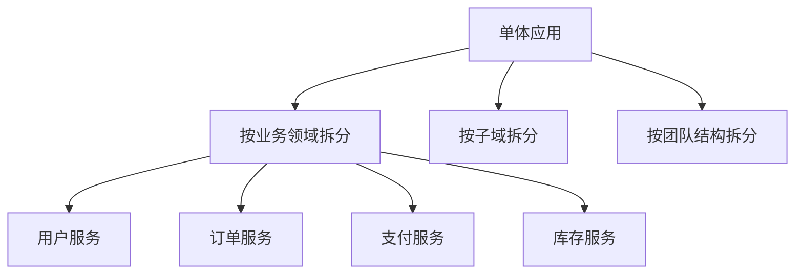
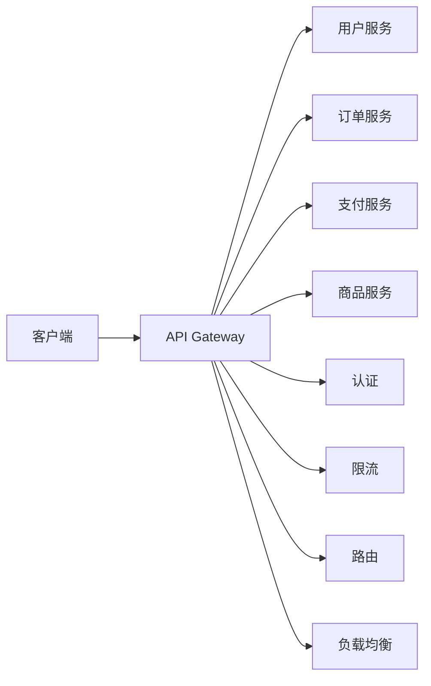

---
aliases: [Microservices, 微服务架构, 微服务设计]
tags: ['05_ComputerScience', 'SoftwareEngineering', 'Microservices', 'Architecture']
created: 2026-06-27
updated: 2026-06-27
---

# 微服务架构 (Microservices Architecture)

## 一、概述

微服务架构是一种将应用程序构建为小型、独立部署的服务集合的架构风格。每个服务运行在自己的进程中，通过轻量级机制（通常是 HTTP/gRPC）通信。

### 1.1 微服务 vs 单体架构

| 特性 | 单体架构 | 微服务架构 |
|------|---------|-----------|
| 部署 | 整体部署 | 独立部署 |
| 技术栈 | 统一 | 可异构 |
| 扩展 | 整体扩展 | 按需扩展 |
| 故障隔离 | 差 | 好 |
| 复杂度 | 低（初期） | 高 |
| 团队协作 | 困难 | 容易 |

### 1.2 微服务原则

| 原则 | 描述 |
|------|------|
| **单一职责** | 每个服务只负责一个业务功能 |
| **服务自治** | 独立开发、测试、部署 |
| **去中心化治理** | 各服务可选择不同技术栈 |
| **容错设计** | 服务故障不影响整体 |
| **演进式设计** | 支持逐步重构 |

---

## 二、服务拆分

### 2.1 拆分策略



### 2.2 DDD 领域驱动设计

```python
# 领域模型示例
class Order:
    """订单聚合根"""
    
    def __init__(self, order_id: str, customer_id: str):
        self.order_id = order_id
        self.customer_id = customer_id
        self.items: List[OrderItem] = []
        self.status = OrderStatus.CREATED
        self.created_at = datetime.now()
    
    def add_item(self, product_id: str, quantity: int, price: Decimal):
        if self.status != OrderStatus.CREATED:
            raise ValueError("Cannot add items to non-draft order")
        
        item = OrderItem(product_id, quantity, price)
        self.items.append(item)
    
    def confirm(self):
        if not self.items:
            raise ValueError("Cannot confirm empty order")
        self.status = OrderStatus.CONFIRMED
        # 发布领域事件
        self._publish_event(OrderConfirmed(self.order_id))
    
    def cancel(self):
        if self.status in [OrderStatus.SHIPPED, OrderStatus.DELIVERED]:
            raise ValueError("Cannot cancel shipped order")
        self.status = OrderStatus.CANCELLED
        self._publish_event(OrderCancelled(self.order_id))

class OrderItem:
    def __init__(self, product_id: str, quantity: int, price: Decimal):
        self.product_id = product_id
        self.quantity = quantity
        self.price = price
    
    @property
    def total(self) -> Decimal:
        return self.price * self.quantity
```

### 2.3 限界上下文

| 限界上下文 | 核心实体 | 服务 |
|-----------|---------|------|
| **用户上下文** | User, Profile, Address | 用户服务 |
| **商品上下文** | Product, Category, Inventory | 商品服务 |
| **订单上下文** | Order, OrderItem | 订单服务 |
| **支付上下文** | Payment, Refund | 支付服务 |
| **物流上下文** | Shipment, Tracking | 物流服务 |

---

## 三、服务通信

### 3.1 同步通信 (REST/gRPC)

```python
# REST API 客户端
import httpx

class OrderServiceClient:
    def __init__(self, base_url: str):
        self.base_url = base_url
        self.client = httpx.AsyncClient()
    
    async def create_order(self, customer_id: str, items: list) -> dict:
        response = await self.client.post(
            f"{self.base_url}/orders",
            json={
                "customer_id": customer_id,
                "items": items
            }
        )
        response.raise_for_status()
        return response.json()
    
    async def get_order(self, order_id: str) -> dict:
        response = await self.client.get(f"{self.base_url}/orders/{order_id}")
        response.raise_for_status()
        return response.json()

# gRPC 服务定义 (order.proto)
"""
syntax = "proto3";

service OrderService {
    rpc CreateOrder(CreateOrderRequest) returns (Order);
    rpc GetOrder(GetOrderRequest) returns (Order);
    rpc ListOrders(ListOrdersRequest) returns (ListOrdersResponse);
}

message CreateOrderRequest {
    string customer_id = 1;
    repeated OrderItem items = 2;
}

message Order {
    string order_id = 1;
    string customer_id = 2;
    repeated OrderItem items = 3;
    string status = 4;
}

message OrderItem {
    string product_id = 1;
    int32 quantity = 2;
    double price = 3;
}
"""
```

### 3.2 异步通信 (消息队列)

```python
# 事件驱动通信
class OrderService:
    def __init__(self, event_bus, payment_client, inventory_client):
        self.event_bus = event_bus
        self.payment_client = payment_client
        self.inventory_client = inventory_client
    
    async def create_order(self, order_data: dict):
        # 创建订单
        order = Order(**order_data)
        
        # 发布事件
        await self.event_bus.publish("OrderCreated", {
            "order_id": order.order_id,
            "customer_id": order.customer_id,
            "items": order.items,
            "total": order.total
        })
        
        return order

class PaymentService:
    def __init__(self, event_bus):
        self.event_bus = event_bus
        self.event_bus.subscribe("OrderCreated", self.handle_order_created)
    
    async def handle_order_created(self, event: dict):
        # 处理支付
        payment = await self.process_payment(event["order_id"], event["total"])
        
        # 发布支付完成事件
        await self.event_bus.publish("PaymentCompleted", {
            "order_id": event["order_id"],
            "payment_id": payment.id
        })

class InventoryService:
    def __init__(self, event_bus):
        self.event_bus = event_bus
        self.event_bus.subscribe("OrderCreated", self.handle_order_created)
    
    async def handle_order_created(self, event: dict):
        # 预留库存
        await self.reserve_items(event["items"])
        
        # 发布库存预留事件
        await self.event_bus.publish("InventoryReserved", {
            "order_id": event["order_id"]
        })
```

---

## 四、API 网关

### 4.1 网关功能



### 4.2 Kong 网关配置

```yaml
# Kong 服务配置
services:
  - name: user-service
    url: http://user-service:8080
    routes:
      - name: user-routes
        paths: ["/api/users"]
        methods: ["GET", "POST"]
    
  - name: order-service
    url: http://order-service:8080
    routes:
      - name: order-routes
        paths: ["/api/orders"]
        methods: ["GET", "POST", "PUT", "DELETE"]

# 插件配置
plugins:
  - name: rate-limiting
    config:
      minute: 100
      hour: 1000
  
  - name: jwt
    config:
      secret: "your-secret-key"
  
  - name: cors
    config:
      origins: ["*"]
      methods: ["GET", "POST", "PUT", "DELETE"]
```

### 4.3 BFF (Backend For Frontend)

```python
# BFF 层聚合多个微服务
class MobileBFF:
    def __init__(self, user_client, order_client, product_client):
        self.user_client = user_client
        self.order_client = order_client
        self.product_client = product_client
    
    async def get_user_dashboard(self, user_id: str) -> dict:
        # 并行获取数据
        user, orders, recommendations = await asyncio.gather(
            self.user_client.get_user(user_id),
            self.order_client.get_recent_orders(user_id, limit=5),
            self.product_client.get_recommendations(user_id)
        )
        
        return {
            "user": user,
            "recent_orders": orders,
            "recommendations": recommendations
        }
```

---

## 五、服务发现与注册

### 5.1 Consul 服务注册

```python
import consul

class ServiceRegistry:
    def __init__(self, host='localhost', port=8500):
        self.consul = consul.Consul(host=host, port=port)
    
    def register(self, service_name: str, service_id: str, address: str, port: int, tags: list = None):
        self.consul.agent.service.register(
            name=service_name,
            service_id=service_id,
            address=address,
            port=port,
            tags=tags or [],
            check=consul.Check.http(f"http://{address}:{port}/health", interval="10s")
        )
    
    def deregister(self, service_id: str):
        self.consul.agent.service.deregister(service_id)
    
    def discover(self, service_name: str) -> list:
        _, services = self.consul.health.service(service_name, passing=True)
        return [
            {
                "address": s["Service"]["Address"],
                "port": s["Service"]["Port"]
            }
            for s in services
        ]
```

### 5.2 客户端负载均衡

```python
import random

class ServiceDiscoveryClient:
    def __init__(self, registry: ServiceRegistry):
        self.registry = registry
        self.cache = {}
    
    async def get_service_url(self, service_name: str) -> str:
        # 检查缓存
        if service_name in self.cache:
            services = self.cache[service_name]
        else:
            services = self.registry.discover(service_name)
            self.cache[service_name] = services
        
        if not services:
            raise ServiceNotFoundError(f"Service {service_name} not found")
        
        # 随机选择一个实例
        service = random.choice(services)
        return f"http://{service['address']}:{service['port']}"
```

---

## 六、熔断与降级

### 6.1 Hystrix 模式

```python
import time
from enum import Enum

class CircuitState(Enum):
    CLOSED = "closed"
    OPEN = "open"
    HALF_OPEN = "half_open"

class CircuitBreaker:
    def __init__(self, failure_threshold=5, recovery_timeout=30):
        self.failure_threshold = failure_threshold
        self.recovery_timeout = recovery_timeout
        self.state = CircuitState.CLOSED
        self.failure_count = 0
        self.last_failure_time = 0
    
    async def call(self, func, *args, **kwargs):
        if self.state == CircuitState.OPEN:
            if time.time() - self.last_failure_time > self.recovery_timeout:
                self.state = CircuitState.HALF_OPEN
            else:
                raise CircuitOpenError("Circuit is open")
        
        try:
            result = await func(*args, **kwargs)
            self._on_success()
            return result
        except Exception as e:
            self._on_failure()
            raise
    
    def _on_success(self):
        self.failure_count = 0
        self.state = CircuitState.CLOSED
    
    def _on_failure(self):
        self.failure_count += 1
        self.last_failure_time = time.time()
        
        if self.failure_count >= self.failure_threshold:
            self.state = CircuitState.OPEN

# 使用
breaker = CircuitBreaker(failure_threshold=3, recovery_timeout=60)

async def call_payment_service(order_id: str):
    try:
        return await breaker.call(payment_client.process, order_id)
    except CircuitOpenError:
        # 降级处理
        return {"status": "pending", "message": "支付服务暂时不可用"}
```

---

## 七、分布式追踪

### 7.1 OpenTelemetry 集成

```python
from opentelemetry import trace
from opentelemetry.sdk.trace import TracerProvider
from opentelemetry.sdk.trace.export import BatchSpanProcessor
from opentelemetry.exporter.jaeger.thrift import JaegerExporter

# 配置追踪
provider = TracerProvider()
jaeger_exporter = JaegerExporter(
    agent_host_name="localhost",
    agent_port=6831,
)
provider.add_span_processor(BatchSpanProcessor(jaeger_exporter))
trace.set_tracer_provider(provider)

tracer = trace.get_tracer(__name__)

# 使用追踪
async def create_order(order_data: dict):
    with tracer.start_as_current_span("create_order") as span:
        span.set_attribute("order.customer_id", order_data["customer_id"])
        
        # 调用其他服务
        with tracer.start_as_current_span("validate_inventory"):
            await inventory_service.validate(order_data["items"])
        
        with tracer.start_as_current_span("process_payment"):
            await payment_service.process(order_data["total"])
        
        with tracer.start_as_current_span("save_order"):
            order = await order_repository.save(order_data)
        
        span.set_attribute("order.id", order.id)
        return order
```

---

## 八、数据管理

### 8.1 Saga 模式

```python
class OrderSaga:
    def __init__(self):
        self.steps = [
            SagaStep("create_order", self.create_order, self.compensate_order),
            SagaStep("reserve_inventory", self.reserve_inventory, self.release_inventory),
            SagaStep("process_payment", self.process_payment, self.refund_payment),
            SagaStep("confirm_order", self.confirm_order, None)
        ]
    
    async def execute(self, order_data: dict):
        completed_steps = []
        
        try:
            for step in self.steps:
                result = await step.action(order_data)
                completed_steps.append(step)
                order_data.update(result)
        except Exception as e:
            # 补偿操作
            for step in reversed(completed_steps):
                if step.compensation:
                    await step.compensation(order_data)
            raise
```

### 8.2 CQRS 模式

```python
# 命令端
class OrderCommandHandler:
    async def handle_create_order(self, command: CreateOrderCommand):
        order = Order(command.customer_id, command.items)
        await self.repository.save(order)
        await self.event_bus.publish(OrderCreated(order))

# 查询端
class OrderQueryHandler:
    async def get_order_summary(self, order_id: str):
        # 从读模型查询
        return await self.read_model.get_order(order_id)
```

---

## 相关条目

- [[05_ComputerScience/CloudComputingAndDistributedSystems/CloudComputingAndDistributedSystems|CloudComputingAndDistributedSystems]]
- [[DockerAndContainerization]]
- [[KubernetesDeep]]
- [[05_ComputerScience/CloudComputingAndDistributedSystems/ServiceMesh|ServiceMesh]]

## 参考资源

1. Sam Newman. "Building Microservices." O'Reilly, 2015
2. Chris Richardson. "Microservices Patterns." Manning, 2018
3. Martin Fowler. "Microservices." martinfowler.com
4. Netflix. "Microservices Architecture." netflix.github.io

