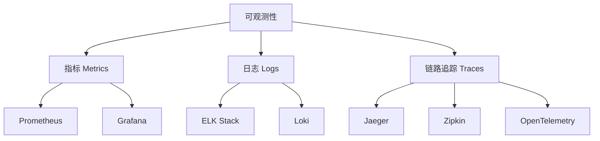

# 可观测性 (Observability)

## 一、概述

可观测性是通过系统的外部输出来理解其内部状态的能力。三大支柱：指标（Metrics）、日志（Logs）、链路追踪（Traces）。

### 1.1 三大支柱



### 1.2 对比

| 支柱 | 数据类型 | 用途 | 工具 |
|------|---------|------|------|
| **指标** | 数值时间序列 | 性能监控、告警 | Prometheus, Grafana |
| **日志** | 文本事件记录 | 问题排查、审计 | ELK, Loki |
| **链路追踪** | 请求调用链 | 分布式调试 | Jaeger, Zipkin |

---

## 二、Prometheus

### 2.1 指标类型

```python
from prometheus_client import Counter, Histogram, Gauge, Summary

# Counter - 只增不减
REQUEST_COUNT = Counter(
    'http_requests_total',
    'Total HTTP requests',
    ['method', 'endpoint', 'status']
)

# Histogram - 分布统计
REQUEST_DURATION = Histogram(
    'http_request_duration_seconds',
    'HTTP request duration',
    ['method', 'endpoint'],
    buckets=[0.1, 0.5, 1.0, 2.0, 5.0]
)

# Gauge - 可增可减
ACTIVE_CONNECTIONS = Gauge(
    'active_connections',
    'Active connections'
)

# Summary - 分位数统计
REQUEST_LATENCY = Summary(
    'http_request_latency_seconds',
    'HTTP request latency',
    ['method', 'endpoint']
)

# 使用
REQUEST_COUNT.labels(method='GET', endpoint='/api', status=200).inc()
REQUEST_DURATION.labels(method='GET', endpoint='/api').observe(0.5)
ACTIVE_CONNECTIONS.set(100)
ACTIVE_CONNECTIONS.inc()
```

### 2.2 Prometheus 配置

```yaml
# prometheus.yml
global:
  scrape_interval: 15s
  evaluation_interval: 15s

rule_files:
  - "alert_rules.yml"

alerting:
  alertmanagers:
    - static_configs:
        - targets: ['alertmanager:9093']

scrape_configs:
  - job_name: 'my-app'
    static_configs:
      - targets: ['app:8080']
    metrics_path: '/metrics'
  
  - job_name: 'node-exporter'
    static_configs:
      - targets: ['node-exporter:9100']
```

### 2.3 告警规则

```yaml
# alert_rules.yml
groups:
  - name: my-app
    rules:
      - alert: HighErrorRate
        expr: |
          sum(rate(http_requests_total{status=~"5.."}[5m]))
          /
          sum(rate(http_requests_total[5m]))
          > 0.05
        for: 5m
        labels:
          severity: critical
        annotations:
          summary: "High error rate detected"
          description: "Error rate is {{ $value | humanizePercentage }}"
      
      - alert: HighLatency
        expr: |
          histogram_quantile(0.95, 
            rate(http_request_duration_seconds_bucket[5m])
          ) > 2
        for: 5m
        labels:
          severity: warning
        annotations:
          summary: "High latency detected"
          description: "P95 latency is {{ $value }}s"
```

---

## 三、Grafana

### 3.1 Dashboard JSON

```json
{
  "dashboard": {
    "title": "My App Dashboard",
    "panels": [
      {
        "title": "Request Rate",
        "type": "graph",
        "targets": [
          {
            "expr": "sum(rate(http_requests_total[5m]))",
            "legendFormat": "{{method}} {{endpoint}}"
          }
        ]
      },
      {
        "title": "Error Rate",
        "type": "gauge",
        "targets": [
          {
            "expr": "sum(rate(http_requests_total{status=~'5..'}[5m])) / sum(rate(http_requests_total[5m]))"
          }
        ]
      },
      {
        "title": "P95 Latency",
        "type": "heatmap",
        "targets": [
          {
            "expr": "histogram_quantile(0.95, rate(http_request_duration_seconds_bucket[5m]))"
          }
        ]
      }
    ]
  }
}
```

---

## 四、ELK Stack

### 4.1 Elasticsearch 配置

```yaml
# elasticsearch.yml
cluster.name: my-cluster
node.name: node-1
network.host: 0.0.0.0
discovery.type: single-node
xpack.security.enabled: true
```

### 4.2 Logstash 配置

```ruby
# logstash.conf
input {
  beats {
    port => 5044
  }
}

filter {
  grok {
    match => { "message" => "%{COMBINEDAPACHELOG}" }
  }
  
  date {
    match => [ "timestamp", "dd/MMM/yyyy:HH:mm:ss Z" ]
  }
  
  geoip {
    source => "clientip"
  }
}

output {
  elasticsearch {
    hosts => ["elasticsearch:9200"]
    index => "logs-%{+YYYY.MM.dd}"
  }
}
```

### 4.3 Filebeat 配置

```yaml
# filebeat.yml
filebeat.inputs:
  - type: log
    paths:
      - /var/log/app/*.log
    json.keys_under_root: true
    json.add_error_key: true

output.elasticsearch:
  hosts: ["elasticsearch:9200"]
  index: "app-logs-%{+yyyy.MM.dd}"

setup.kibana:
  host: "kibana:5601"
```

---

## 五、链路追踪

### 5.1 OpenTelemetry 集成

```python
from opentelemetry import trace
from opentelemetry.sdk.trace import TracerProvider
from opentelemetry.sdk.trace.export import BatchSpanProcessor
from opentelemetry.exporter.jaeger.thrift import JaegerExporter
from opentelemetry.sdk.resources import Resource

# 配置
resource = Resource.create({"service.name": "my-service"})
provider = TracerProvider(resource=resource)

jaeger_exporter = JaegerExporter(
    agent_host_name="jaeger",
    agent_port=6831,
)
provider.add_span_processor(BatchSpanProcessor(jaeger_exporter))

trace.set_tracer_provider(provider)
tracer = trace.get_tracer(__name__)

# 使用
async def process_order(order_id: str):
    with tracer.start_as_current_span("process_order") as span:
        span.set_attribute("order.id", order_id)
        
        # 子 Span
        with tracer.start_as_current_span("validate_order"):
            await validate_order(order_id)
        
        with tracer.start_as_current_span("charge_payment"):
            await charge_payment(order_id)
        
        with tracer.start_as_current_span("send_notification"):
            await send_notification(order_id)
```

### 5.2 Jaeger 配置

```yaml
# docker-compose.yml
version: '3.8'

services:
  jaeger:
    image: jaegertracing/all-in-one:latest
    ports:
      - "16686:16686"  # UI
      - "6831:6831/udp"  # Agent
      - "14268:14268"  # Collector
    environment:
      - COLLECTOR_OTLP_ENABLED=true
```

---

## 六、日志最佳实践

### 6.1 结构化日志

```python
import structlog

# 配置
structlog.configure(
    processors=[
        structlog.processors.add_log_level,
        structlog.processors.TimeStamper(fmt="iso"),
        structlog.processors.JSONRenderer()
    ]
)

logger = structlog.get_logger()

# 使用
logger.info("order_created", order_id="123", customer_id="456", total=99.99)
logger.error("payment_failed", order_id="123", error="Insufficient funds")
```

### 6.2 日志级别

| 级别 | 用途 | 示例 |
|------|------|------|
| **DEBUG** | 调试信息 | 变量值、函数参数 |
| **INFO** | 一般信息 | 请求处理、业务事件 |
| **WARNING** | 警告信息 | 配置缺失、降级处理 |
| **ERROR** | 错误信息 | 异常、失败 |
| **CRITICAL** | 严重错误 | 系统崩溃、数据丢失 |

---

## 七、告警最佳实践

### 7.1 告警规则

```yaml
# Prometheus 告警规则
groups:
  - name: slo-alerts
    rules:
      # 可用性 SLO
      - alert: AvailabilitySLOBreach
        expr: |
          1 - (
            sum(rate(http_requests_total{status!~"5.."}[30d]))
            /
            sum(rate(http_requests_total[30d]))
          ) > 0.001
        for: 5m
        labels:
          severity: critical
        annotations:
          summary: "Availability SLO breach"
      
      # 延迟 SLO
      - alert: LatencySLOBreach
        expr: |
          histogram_quantile(0.99, 
            rate(http_request_duration_seconds_bucket[30d])
          ) > 0.5
        for: 5m
        labels:
          severity: warning
```

### 7.2 告警分级

| 级别 | 响应时间 | 通知方式 | 示例 |
|------|---------|---------|------|
| **P0 - Critical** | 5分钟 | 电话+短信+IM | 服务不可用 |
| **P1 - High** | 30分钟 | 短信+IM | 错误率>5% |
| **P2 - Medium** | 4小时 | IM | 延迟升高 |
| **P3 - Low** | 24小时 | 邮件 | 资源使用率高 |

---

## 八、Dashboard 设计

### 8.1 RED 方法

| 指标 | 描述 | PromQL |
|------|------|--------|
| **Rate** | 请求速率 | `sum(rate(http_requests_total[5m]))` |
| **Errors** | 错误率 | `sum(rate(http_requests_total{status=~"5.."}[5m]))` |
| **Duration** | 延迟 | `histogram_quantile(0.95, rate(http_request_duration_seconds_bucket[5m]))` |

### 8.2 USE 方法

| 指标 | 描述 | PromQL |
|------|------|--------|
| **Utilization** | 资源使用率 | `1 - (avg(irate(node_cpu_seconds_total{mode="idle"}[5m])))` |
| **Saturation** | 饱和度 | `node_memory_MemAvailable_bytes / node_memory_MemTotal_bytes` |
| **Errors** | 错误数 | `node_procs_running` |

---

## 相关条目

- [[DockerAndContainerization]]
- [[KubernetesDeep]]
- [[HighConcurrencyDesign]]

## 参考资源

1. Prometheus. "Documentation." prometheus.io
2. Grafana. "Documentation." grafana.com
3. Elastic. "ELK Stack." elastic.co
4. OpenTelemetry. "Documentation." opentelemetry.io
