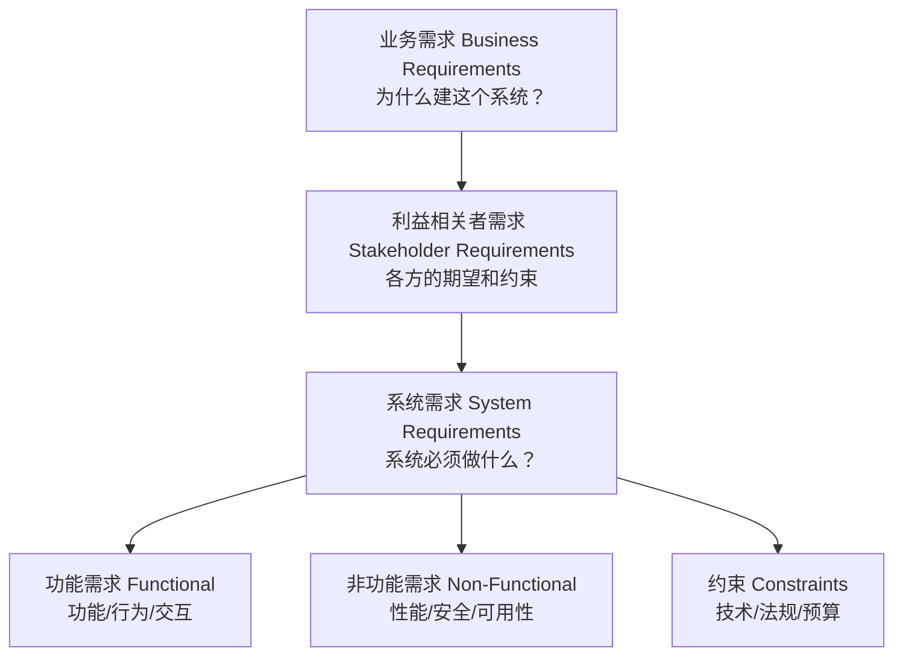
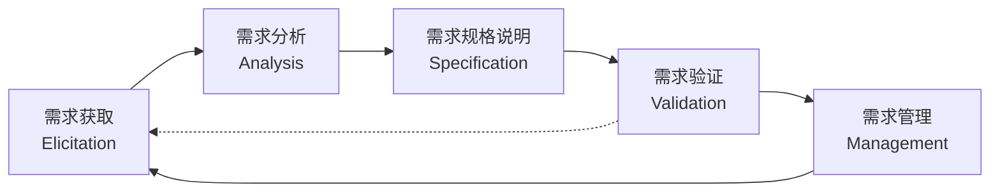
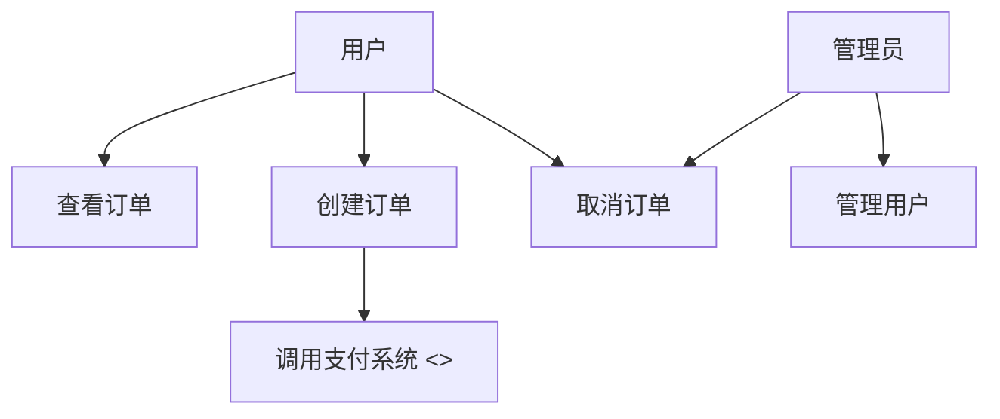

# 需求工程 (Requirements Engineering, RE)

## 一、概述 (Overview)

需求工程是系统化地发现、分析、文档化、验证和管理软件需求的过程。需求是"系统必须做什么（功能性需求）和系统应具有什么属性（非功能性需求）"的正式描述。

### 需求工程的重要性
- **错误修复成本递增**：需求阶段修复成本 = $1\times$，设计阶段 = $5\times$，编码阶段 = $10\times$，测试阶段 = $20\times$，发布后 = $100\times$
- **项目失败主因**：据 Standish Group CHAOS Report，约 40% 的项目因不完整/不准确的需求而失败

## 二、需求层次 (Requirements Levels)



| 层次 | 关注点 | 示例 | 文档 |
|------|--------|------|------|
| 业务需求 (Business) | 组织目标和收益 | "将客户投诉响应时间减少 50%" | Vision & Scope 文档 |
| 利益相关者需求 (Stakeholder) | 各方的需要和期望 | "客服代表能查看客户历史记录" | 用户需求文档 |
| 功能需求 (Functional) | 系统具体功能 | "系统支持按订单号搜索历史记录" | SRS (Software Requirements Specification) |
| 非功能需求 (Non-Functional) | 质量属性 | "搜索响应时间 ≤ 2 秒" | SRS |

## 三、需求工程过程 (RE Process)



### 1. 需求获取 (Elicitation)

| 技术 | 类型 | 适用 | 产出 |
|------|------|------|------|
| **用户访谈 (Interview)** | 一对一会议 | 收集深度洞察 | 访谈记录 |
| **焦点小组 (Focus Group)** | 群体讨论 | 探索共识和分歧 | 讨论纪要 |
| **问卷调查 (Survey)** | 大规模 | 量化优先级和分布 | 统计结果 |
| **观察 (Observation)** | 实地观察用户工作 | 发现隐性需求 | 观察笔记 |
| **原型 (Prototyping)** | 低保真/高保真界面 | 验证需求理解 | 原型反馈 |
| **头脑风暴 (Brainstorming)** | 创意发散 | 探索创新方案 | 创意列表 |
| **文档分析 (Document Analysis)** | 现有文档审查 | 发现已有约束 | 需求清单 |

### 2. 需求分析 (Analysis)

将获取的原始需求分类、排序、建模：

```text
需求分类:   功能 / 非功能 / 约束
需求优先级: MoSCoW 方法
需求建模:   用例图 / 活动图 / 状态图
冲突识别:   检查矛盾需求
```

### 3. 需求规格说明 (Specification)

编写 SRS (Software Requirements Specification)，遵循 ISO/IEC/IEEE 29148 标准。

### 4. 需求验证 (Validation)

| 验证技术 | 方法 | 效果 |
|---------|------|------|
| **评审 (Review)** | 团队逐条审查需求 | 发现模糊/遗漏 |
| **原型 (Prototyping)** | 通过原型检查需求理解 | 确认功能行为 |
| **验收测试定义 (Acceptance Tests)** | 定义"需求是否完成的判定标准" | 防止歧义 |
| **形式化验证 (Formal Verification)** | 数学模型辅助证明 | 安全关键系统 |

### 5. 需求管理 (Management)

管理需求变更（需求蔓延 —— Scope Creep）、可追溯性（Traceability）和版本。

## 四、需求规格模板 (SRS Template)

### 基于 IEEE 29148 的结构
```markdown
1. 引言
   1.1 目的
   1.2 范围
   1.3 定义和缩略语
   1.4 参考资料
2. 总体描述
   2.1 产品视角
   2.2 用户特征
   2.3 假设和依赖
3. 系统特性（按特性组织）
   3.1 特性 A — 用户管理
      3.1.1 功能需求 FR-001: 用户注册
      3.1.2 功能需求 FR-002: 用户登录
      3.1.3 接口需求
4. 外部接口需求
   4.1 用户接口
   4.2 硬件接口
   4.3 软件接口
   4.4 通信接口
5. 非功能需求
   5.1 性能需求: 90% 请求在 500ms 内响应
   5.2 安全需求: 所有通信使用 TLS 1.3
   5.3 可用性: 99.9% 正常运行时间
   5.4 可维护性: 代码测试覆盖率 > 80%

附录 A: 术语表
附录 B: 用例列表
```

## 五、需求建模工具 (Requirements Modeling)

### 用例图 (Use Case Diagram) — UML



### 用户故事 (User Story) — 敏捷

用户故事的标准格式：

```text
作为一个 [角色]，我想要 [功能/目标]，以便 [业务价值]。
验收条件 (Acceptance Criteria):
  1. [场景 1]: Given [上下文], When [操作], Then [期望结果]
  2. [场景 2]: ...
```

**示例**：
```text
作为注册用户，我想要重置我的密码，
以便在我忘记密码时能重新访问帐户。
验收条件:
  - 输入已注册邮箱 → 收到重置链接（有效 30 分钟）
  - 输入未注册邮箱 → 显示"邮箱未注册"提示
  - 新密码不符合要求（< 8 字符）→ 显示密码要求
```

### INVEST 原则（好的用户故事标准）

| 原则 | 含义 |
|------|------|
| **I**ndependent | 独立可排序 |
| **N**egotiable | 可协商细节 |
| **V**aluable | 对用户有价值 |
| **E**stimable | 可估算工作量 |
| **S**mall | 足够小可在 Sprint 内完成 |
| **T**estable | 有明确的验收标准 |

## 六、非功能需求分类 (Non-Functional Requirements)

FURPS+ 分类法：

| 类别 | 子类 | 示例 |
|------|------|------|
| F — 功能性 | 功能完整性、正确性 | 所有用例覆盖 |
| U — 可用性 | 可学习性、可访问性 | 新用户 5 分钟内完成核心任务 |
| R — 可靠性 | 可用性、容错性、可恢复性 | 99.9% uptime, RTO < 1h, RPO < 15min |
| P — 性能 | 响应时间、吞吐量、容量 | 支持 10,000 并发用户，P95 < 500ms |
| S — 可支持性 | 可测试性、可维护性、可部署性 | 部署时间 < 30 分钟 |

## 七、需求可追溯性 (Requirements Traceability)

需求可追溯性矩阵（RTM, Requirements Traceability Matrix）确保每个需求被实现、测试和验证：

| 需求 ID | 来源 | 设计文档 | 测试用例 | 状态 |
|---------|------|---------|---------|------|
| FR-001 用户注册 | 用户访谈 张三 | SDD-3.1 注册模块 | TC-101 注册测试 | 已验证 |
| FR-002 用户登录 | 竞品分析 参考产品A | SDD-3.2 认证模块 | TC-102 登录测试 | 已实现 |
| NFR-001 响应时间 < 2s | 架构要求 | SDD-7.1 性能设计 | TC-901 压力测试 | 已验证 |

## 八、需求优先级排序方法

### MoSCoW 方法

| 优先级 | 含义 | 占比建议 | 示例 |
|--------|------|---------|------|
| **M**ust have (必须做) | 无此功能系统不可用 | ~60% | 用户注册、支付功能 |
| **S**hould have (应该做) | 重要但可暂缓 | ~20% | 密码强度指示器 |
| **C**ould have (可以做) | 锦上添花 | ~15% | 深色模式、动画 |
| **W**on't have (不会做) | 明确排除在本次范围 | ~5% | 多语言支持（v2） |

### Kano 模型

| 需求类型 | 描述 | 满足时 | 不满足时 |
|---------|------|--------|---------|
| **基本型 (Basic)** | 用户期望的"理所当然"功能 | 不提升满意度 | 大幅降低满意度 |
| **期望型 (Performance)** | 用户明确提出的功能 | 满意度线性提升 | 满意度线性下降 |
| **兴奋型 (Delight)** | 用户未预期的惊喜功能 | 大幅提升满意度 | 不影响满意度 |

## 九、常见需求陷阱 (Common Pitfalls)

1. **范围蔓延 (Scope Creep)**：持续增加新需求 → 项目延迟
   - 对策：严格的变更控制流程（CCB, Change Control Board）
2. **黄金镀金 (Gold Plating)**：开发人员添加未要求的"酷"功能
   - 对策：坚持只实现已确认的需求
3. **假设但不验证**：未经确认就默认某些需求
   - 对策：原型验证 + 用户确认签字
4. **模糊需求**：如"系统应响应快"而非"P95 响应时间 < 500ms"
   - 对策：用具体可衡量的指标定义

## 十、需求工程成熟度模型 (RE Maturity Model)

| 级别 | 名称 | 特征 | 典型公司 |
|------|------|------|---------|
| **L1 初始级** | 无正式需求流程 | 需求在讨论中传递，无文档 | 初创团队 |
| **L2 受管理级** | 有基本需求流程 | 有需求文档和简单评审 | 成长型企业 |
| **L3 已定义级** | 标准化需求工程 | SRS 模板、需求评审、版本管理 | 中型企业 |
| **L4 量化管理级** | 指标驱动 | 需求可追溯性、缺陷率统计、交付预测 | 大型企业 |
| **L5 优化级** | 持续改进 | 根因分析、流程自动化、AI 辅助 | 顶尖科技公司 |

## 十一、AI 辅助需求工程 (AI for RE)

| AI 能力 | 应用场景 | 工具示例 |
|---------|---------|---------|
| **NL → 需求结构化** | 从自然语言描述提取功能需求和非功能需求 | NLP 模型 (GPT, Claude) |
| **需求冲突检测** | 分析需求间是否存在冲突或重复 | 语义分析引擎 |
| **优先级预测** | 基于历史数据预测需求的重要性和实现难度 | ML 分类器 |
| **测试用例生成** | 从需求自动生成验收测试（Gherkin） | 代码生成 LLM |
| **用户故事提炼** | 从用户访谈记录提取用户故事 | 对话 AI |
| **可追溯性自动关联** | 自动建立需求-设计-测试的关联链路 | 知识图谱 |

AI 辅助可以大幅提升需求工程效率（预估提升 30-50%），但仍需人类分析师最终确认和决策。

## 相关条目
- [[SoftwareProjectManagement]]
- [[SystemDesign]]
- [[Documentation]]
- [[TechnicalWriting]]
- [[05_ComputerScience/SoftwareEngineering/INDEX]]
