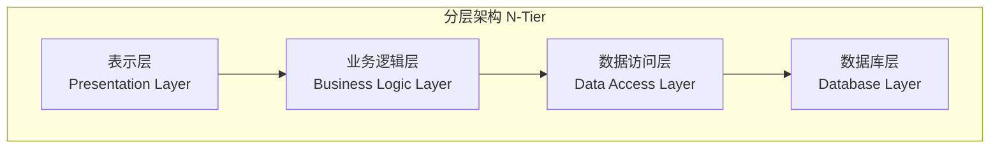
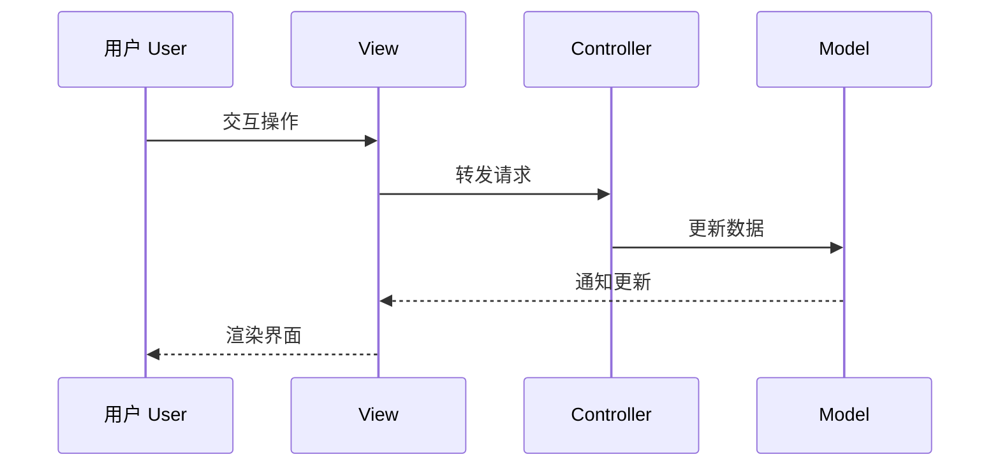
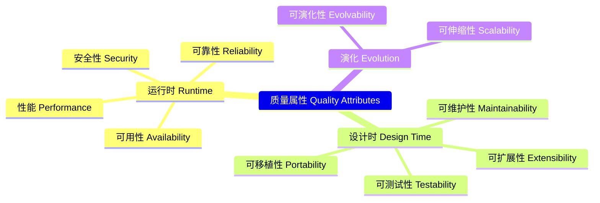

---
aliases:
  - SoftwareArchitecture
  - 软件架构
  - ArchitecturePatterns
  - SystemDesign
tags:
created: 2026-05-17
updated: 2026-05-16
  - '05_ComputerScience'
  - 'SoftwareEngineering'
  - 'Architecture'
---

# 软件架构 Software Architecture

软件架构（Software Architecture）是软件系统的高层结构设计，定义了系统的组件（Components）、组件间的关系（Relationships）及其与环境交互的约定。架构决定了系统的质量属性（Quality Attributes）如性能、可伸缩性、可维护性和安全性。

## 架构模式 Architecture Patterns

### 分层架构 Layered Architecture

每层为上层提供服务，并依赖下层。典型的 N 层架构：

### MVC 模式 Model-View-Controller

| 组件 | 职责 | 示例 |
|------|------|------|
| Model | 数据和业务规则 | Entity, DTO, DAO |
| View | 用户界面展示 | HTML, JSP, React 组件 |
| Controller | 处理用户输入和路由 | Servlet, Spring Controller |

MVC 流程：

### 微服务架构 Microservices

微服务（Microservices）将应用程序拆分为一组小型、自治的服务，每个服务围绕特定业务能力构建。

| 特征 | 单体架构 | 微服务架构 |
|------|----------|------------|
| 部署粒度 | 整体部署 | 独立部署 |
| 扩展性 | 水平扩展整体 | 按服务细粒度扩展 |
| 技术栈 | 单一技术栈 | 多语言多技术栈 |
| 数据管理 | 共享数据库 | 每个服务独立数据库 |
| 通信 | 进程内调用 | REST/gRPC/消息队列 |

### 事件驱动架构 Event-Driven Architecture

组件通过事件（Events）进行异步通信。

- **事件生产者**（Producer）：发布事件到事件总线
- **事件消费者**（Consumer）：订阅并处理感兴趣的事件
- **事件总线**（Event Bus/Message Broker）：Kafka, RabbitMQ, AWS EventBridge

$$ \text{系统吞吐量} \propto \frac{\text{事件处理并发度}}{\text{单个事件平均处理时间}} $$

### 其他模式 Other Patterns

| 模式 | 适用场景 | 关键思想 |
|------|----------|----------|
| 管道-过滤器 Pipeline-Filter | 数据处理 | 每个步骤独立处理并传递 |
| 微内核 Microkernel | 可扩展平台 | 核心最小化，插件扩展 |
| CQRS | 读写分离 | 命令和查询使用不同模型 |
| 事件溯源 Event Sourcing | 审计追踪 | 存储所有状态变更事件 |

## 质量属性 Quality Attributes

质量属性（Quality Attributes）又称非功能需求（Non-Functional Requirements）：

## 架构评估 Architecture Evaluation

- **ATAM**（Architecture Tradeoff Analysis Method）：识别架构决策的权衡点
- **SAAM**（Scenario-based Architecture Analysis Method）：基于场景的架构分析
- **CBAM**（Cost Benefit Analysis Method）：架构决策的成本效益分析

## 架构文档 Architecture Documentation

4+1 视图模型（Philippe Kruchten, 1995）：

| 视图 | 关注点 | 受众 |
|------|--------|------|
| 逻辑视图 Logical | 功能需求 | 架构师 |
| 进程视图 Process | 并发与同步 | 系统工程师 |
| 开发视图 Development | 模块组织 | 开发者 |
| 物理视图 Physical | 部署拓扑 | 运维人员 |
| 场景视图 Scenarios | 用例驱动 | 所有干系人 |

领域驱动设计（Domain-Driven Design, DDD）帮助将业务需求映射到架构设计，其核心战术模式包括实体（Entity）、值对象（Value Object）、聚合（Aggregate）、领域服务（Domain Service）和领域事件（Domain Event）。

## 架构原则 Architecture Principles

- **关注点分离**（Separation of Concerns）：每个模块只关注一个职责
- **开闭原则**（Open/Closed Principle）：对扩展开放，对修改关闭
- **依赖反转**（Dependency Inversion）：依赖抽象而非具体实现
- **接口隔离**（Interface Segregation）：专用接口优于通用接口

## 相关条目

- [[SoftwareEngineering]]
- [[TestingOverview]]
- [[DistributedSystems]]
- [[ProgrammingLanguages]]
- [[DevOps]]
