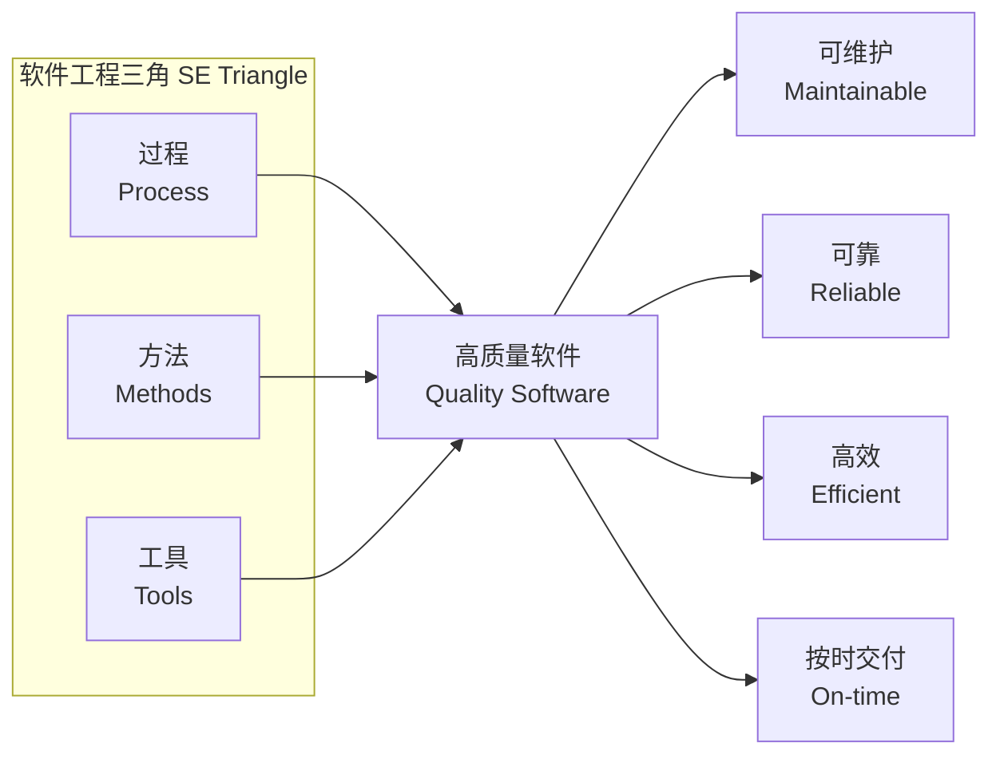
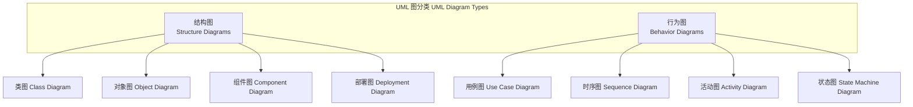
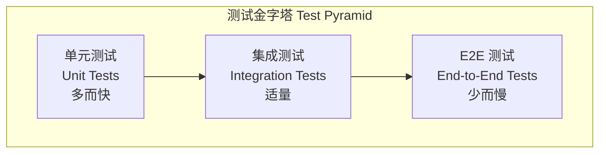
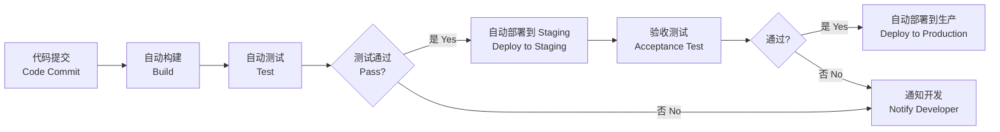

# 软件工程 (Software Engineering)

> 软件工程是应用系统化的、规范化的、可量化的方法来开发、运行和维护软件的工程学科。它将工程原则应用于软件开发的各个阶段，确保软件产品的质量、效率和可维护性。

## 学科概述 (Overview)

### 软件工程的定义
软件工程（Software Engineering）区别于纯粹的编程（Programming），强调工程化方法，包括需求分析、架构设计、质量控制、项目管理与团队协作。

### 软件工程的三大要素



---

## 软件开发生命周期 (Software Development Life Cycle, SDLC)

### 经典阶段模型

| 阶段 | 主要活动 | 产出物 |
|------|---------|-------|
| 需求分析 (Requirements) | 需求获取、分析、规格说明 | SRS（需求规格说明书） |
| 设计 (Design) | 架构设计、详细设计 | 设计文档、UML 图 |
| 实现 (Implementation) | 编码、单元测试 | 源代码 |
| 测试 (Testing) | 集成测试、系统测试、验收测试 | 测试报告 |
| 部署 (Deployment) | 发布、配置、上线 | 部署手册 |
| 维护 (Maintenance) | Bug 修复、功能增强 | 维护记录 |

### 瀑布模型 (Waterfall Model)

```
需求 → 设计 → 实现 → 测试 → 部署 → 维护
```

- **优点**：阶段划分清晰，文档完整，适合需求稳定的项目
- **缺点**：难以应对需求变更，客户反馈延迟，风险暴露晚

### 迭代与增量模型 (Iterative & Incremental)

- **迭代**：反复改进同一功能的质量
- **增量**：逐步添加新功能

### 螺旋模型 (Spiral Model)

结合原型法（Prototyping）与瀑布模型，强调风险分析（Risk Analysis），每一轮螺旋包含：
1. 制定目标
2. 风险识别与评估
3. 开发与验证
4. 计划下一轮

---

## 需求工程 (Requirements Engineering)

### 需求分类

| 类型 | 定义 | 示例 |
|------|------|------|
| 功能需求 (Functional) | 系统应当做什么 | "用户可登录系统" |
| 非功能需求 (Non-functional) | 系统应当怎样 | "响应时间 < 200ms" |
| 业务需求 (Business) | 组织层面的目标 | "提升客户满意度 20%" |
| 用户需求 (User) | 用户的具体需要 | "一键导出报表" |
| 系统需求 (System) | 软硬件约束 | "支持 1000 并发" |

### 需求获取技术

| 技术 | 适用场景 | 优点 | 缺点 |
|------|---------|------|------|
| 用户访谈 | 小规模、关键干系人 | 深度沟通 | 耗时 |
| 问卷调查 | 大规模用户 | 高效收集 | 深度不足 |
| 原型法 | 需求不明确 | 可视化确认 | 可能产生误解 |
| 头脑风暴 | 创新项目 | 激发创意 | 缺乏结构化 |
| 观察法 | 现有流程优化 | 真实场景 | 可能被干扰 |

### 需求规格说明书 (SRS)

SRS 是需求阶段的核心产出，需满足：

- **完整性**：覆盖所有功能与非功能需求
- **一致性**：无内部矛盾
- **无二义性**：每个需求只有一个解释
- **可验证性**：可设计测试用例验证
- **可追踪性**：每个需求可追溯到来源

---

## 软件设计 (Software Design)

### 设计原则

- **模块化** (Modularity) —— 高内聚、低耦合
- **抽象** (Abstraction) —— 隐藏实现细节
- **封装** (Encapsulation) —— 信息隐藏
- **关注点分离** (Separation of Concerns)
- **SOLID 原则**：

| 缩写 | 全称 | 含义 |
|------|------|------|
| S | 单一职责 (Single Responsibility) | 一个类只应有一个变更理由 |
| O | 开闭原则 (Open/Closed) | 对扩展开放，对修改关闭 |
| L | 里氏替换 (Liskov Substitution) | 子类应可替换父类 |
| I | 接口隔离 (Interface Segregation) | 接口应小而专 |
| D | 依赖倒置 (Dependency Inversion) | 依赖抽象而非具体实现 |

### 架构模式 (Architectural Patterns)

| 模式 | 描述 | 适用场景 |
|------|------|---------|
| 分层架构 (Layered) | 按层次组织（表现层/业务层/数据层） | 企业应用 |
| MVC / MVP / MVVM | 模型-视图-控制器分离 | Web 与桌面 UI |
| 微服务 (Microservices) | 独立部署的小型服务 | 大规模分布式系统 |
| 事件驱动 (Event-Driven) | 通过事件异步通信 | 实时系统、IoT |
| CQRS | 命令与查询职责分离 | 高读写负载系统 |
| 六边形架构 (Hexagonal) | 核心业务逻辑与外部适配器分离 | DDD 项目 |

### UML 设计图



---

## 软件测试 (Software Testing)

### 测试金字塔



### 测试层次

| 层次 | 粒度 | 速度 | 目的 |
|------|------|------|------|
| 单元测试 (Unit Test) | 函数/方法 | 毫秒级 | 验证单一逻辑 |
| 集成测试 (Integration Test) | 模块接口 | 秒级 | 验证组件交互 |
| 系统测试 (System Test) | 完整系统 | 分钟级 | 验证整体行为 |
| 验收测试 (Acceptance Test) | 业务场景 | 分钟级 | 验证满足需求 |

### 测试方法

- **黑盒测试** (Black-box)：等价类划分、边界值分析、决策表
- **白盒测试** (White-box)：语句覆盖、分支覆盖、路径覆盖
- **灰盒测试** (Gray-box)：结合内部结构与外部接口
- **回归测试** (Regression Testing)：确保新代码不破坏旧功能
- **性能测试** (Performance Testing)：负载测试、压力测试、稳定性测试

---

## 敏捷开发 (Agile Development)

### 敏捷宣言
- **个体与互动** 重于 流程与工具
- **可工作的软件** 重于 详尽的文档
- **客户合作** 重于 合同谈判
- **响应变化** 重于 遵循计划

### Scrum 框架

| 角色 | 职责 |
|------|------|
| 产品负责人 (Product Owner) | 维护 Product Backlog，确定优先级 |
| Scrum Master | 保障 Scrum 流程顺畅，消除障碍 |
| 开发团队 (Development Team) | 自组织，跨职能，交付 Increment |

**Scrum 事件**：

1. **Sprint 计划会** —— 确定 Sprint Backlog
2. **每日站会** (Daily Scrum) —— 15 分钟同步进度
3. **Sprint 评审会** —— 展示产品增量
4. **Sprint 回顾会** —— 检视与改进流程

### 看板方法 (Kanban)

- **可视化工作流** (Visualize Workflow)
- **限制在制品** (Limit WIP)
- **管理流动** (Manage Flow)
- **明确流程策略** (Make Process Policies Explicit)
- **持续改进** (Improve Collaboratively)

---

## DevOps 与持续交付 (DevOps & Continuous Delivery)

### DevOps 核心理念

DevOps 打破开发（Development）与运维（Operations）之间的壁垒，强调：

- **持续集成** (Continuous Integration, CI) —— 频繁合并代码并自动构建测试
- **持续交付** (Continuous Delivery, CD) —— 代码随时可部署到生产环境
- **基础设施即代码** (Infrastructure as Code, IaC) —— Terraform、Ansible、Pulumi
- **监控与可观测性** (Monitoring & Observability) —— Prometheus、Grafana、ELK Stack

### CI/CD 管道



### 容器化与编排

| 工具 | 用途 |
|------|------|
| Docker | 应用容器化 |
| Kubernetes | 容器编排与调度 |
| Helm | Kubernetes 包管理 |
| Docker Compose | 本地多容器编排 |

---

## 软件质量与项目管理 (Quality & Project Management)

### 软件质量模型

**ISO/IEC 25010** 质量模型：

| 维度 | 子特性 |
|------|--------|
| 功能适用性 (Functional Suitability) | 完整性、正确性、适用性 |
| 性能效率 (Performance Efficiency) | 时间行为、资源利用率、容量 |
| 兼容性 (Compatibility) | 共存性、互操作性 |
| 可用性 (Usability) | 可识别性、易学性、操作性 |
| 可靠性 (Reliability) | 成熟度、可用性、容错性、可恢复性 |
| 安全性 (Security) | 机密性、完整性、真实性、可追溯性 |
| 可维护性 (Maintainability) | 模块化、可复用性、可分析性、可修改性、可测试性 |
| 可移植性 (Portability) | 适应性、可安装性、可替换性 |

### 项目管理三角

$$
\text{质量} = f(\text{范围}, \text{时间}, \text{成本})
$$

改变任一变量将影响其他变量。

---

### 相关条目
- [[05_ComputerScience/SoftwareEngineering/INDEX|05_ComputerScience/SoftwareEngineering 索引]]
- [[05_ComputerScience/SoftwareEngineering/AgileMethodology|敏捷方法论]]
- [[05_ComputerScience/SoftwareEngineering/DevOps|DevOps]]
- [[05_ComputerScience/SoftwareEngineering/SoftwareTesting|软件测试]]
- [[INDEX|当前目录索引]]
