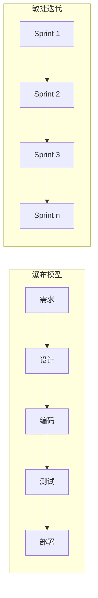

# 软件项目管理 (Software Project Management, SPM)

## 一、概述 (Overview)

软件项目管理是将项目管理原则、方法和工具应用于软件开发生命周期（SDLC），以在时间、预算和质量约束下交付成功的软件产品。核心管理领域包括范围、时间、成本、质量、风险和沟通。

### 项目管理三角 (Project Management Triangle)

$$\text{质量} \propto \frac{\text{范围}}{\text{时间} \times \text{成本}}$$

| 约束 | 说明 | 常见冲突 |
|------|------|---------|
| 范围 (Scope) | 项目要完成的工作 | 增加范围需增加时间或成本 |
| 时间 (Time) | 项目截止日期 | 压缩时间需增加成本或降低质量 |
| 成本 (Cost) | 预算限制 | 降低预算需缩减范围或延长工期 |

## 二、软件开发生命周期模型 (SDLC Models)



| 模型 | 特点 | 适用场景 | 风险 |
|------|------|---------|------|
| **瀑布 (Waterfall)** | 顺序阶段，文档驱动 | 需求明确、低变更项目 | 需求变更是致命伤 |
| **V 模型 (V-Model)** | 瀑布 + 测试左移 | 安全关键系统（航天、医疗）| 仍然刚性 |
| **迭代模型 (Iterative)** | 逐步细化 | 大型系统探索性开发 | 可能缺乏方向 |
| **敏捷 (Agile / Scrum)** | 短迭代、用户故事、自组织团队 | 需求变化快、需要快速反馈 | 团队自律要求高 |
| **看板 (Kanban)** | 持续流、WIP 限制 | 运维团队、支持团队 | 不适合复杂依赖 |
| **螺旋 (Spiral)** | 风险驱动迭代 | 高风险、大型项目 | 过于复杂 |

## 三、敏捷开发 (Agile Development)

### 敏捷宣言 (Agile Manifesto, 2001)

四个价值观：
1. **个体和交互** 胜于 流程和工具
2. **可工作的软件** 胜于 详尽的文档
3. **客户合作** 胜于 合同谈判
4. **响应变化** 胜于 遵循计划

### Scrum 框架

```text
Scrum 角色:
  - 产品负责人 (Product Owner): 定义 Backlog，优先级排序
  - Scrum Master: 流程守护者，清除障碍
  - 开发团队 (Dev Team): 自组织，3-9 人

Scrum 事件:
  Sprint 规划 (Sprint Planning)     → 确定 Sprint 目标
  每日站会 (Daily Scrum)            → 15 分钟同步
  Sprint 评审 (Sprint Review)       → 展示完成功能
  Sprint 回顾 (Sprint Retrospective) → 过程改进

产出:
  Sprint Backlog → Increment (可交付增量)
```

### 敏捷估算技术

| 技术 | 方法 | 复杂度 |
|------|------|--------|
| **故事点 (Story Points)** | 相对估算（Fibonacci: 1,2,3,5,8,13,21）| 中 |
| **规划扑克 (Planning Poker)** | 团队同时出牌，讨论差异 | 低 |
| **T 恤尺寸 (T-shirt Sizing)** | S/M/L/XL | 极低 |
| **类比估算 (Analogous)** | 与历史项目比较 | 低 |
| **参数估算 (Parametric)** | 基于统计模型 | 高 |

### 速度 (Velocity) 与燃尽图 (Burndown Chart)

$$\text{Velocity} = \frac{\text{已完成故事点}}{\text{Sprint 数量}}$$

燃尽图显示剩余工作量随时间的变化：
```text
剩余工作 ↑
    │ ╲
    │  ╲
    │   ╲  ← 实际剩余 (落后计划)
    │    ╲
    │  ── ╲ ← 理想燃尽线
    └─────────→ 时间
```

## 四、项目计划与估算 (Project Planning & Estimation)

### WBS (Work Breakdown Structure)

将项目工作逐级分解为可管理的工作包：

```text
项目 (100%)
├── 需求阶段 (15%)
│   ├── 需求获取
│   ├── 需求分析
│   └── 需求确认
├── 设计阶段 (25%)
│   ├── 架构设计
│   ├── 详细设计
│   └── 设计评审
├── 开发阶段 (35%)
│   ├── 模块 A (12%)
│   ├── 模块 B (13%)
│   └── 模块 C (10%)
├── 测试阶段 (15%)
└── 部署阶段 (10%)
```

### COCOMO II 估算模型

$$\text{Effort} = A \times \text{Size}^B \times \prod EM_i$$

其中：
- $A = 2.94$（常数）
- $\text{Size}$ = KSLOC（千行源码）
- $B$ = 规模指数（有机 1.05, 半分离 1.12, 嵌入式 1.20）
- $EM_i$ = 成本驱动因子（15 个）

## 五、风险管理 (Risk Management)

### 风险识别与评估

$$\text{风险暴露} = \text{概率} \times \text{影响}$$

```text
风险登记册 (Risk Register):
┌──────────┬──────────┬──────────┬──────────┬──────────┐
│ 风险描述  │ 概率     │ 影响     │ 暴露     │ 应对策略  │
├──────────┼──────────┼──────────┼──────────┼──────────┤
│ 关键开发  │ 30%      │ 高(9)   │ 2.7      │ 交叉培训  │
│ 人员离职  │          │          │          │ 文档化    │
├──────────┼──────────┼──────────┼──────────┼──────────┤
│ 需求变更  │ 60%      │ 中(5)   │ 3.0      │ 变更控制  │
└──────────┴──────────┴──────────┴──────────┴──────────┘
```

### 风险应对策略

| 策略 | 说明 | 示例 |
|------|------|------|
| **规避 (Avoid)** | 消除风险源 | 用成熟技术替代新技术 |
| **转移 (Transfer)** | 将风险转移给第三方 | 购买 SLA / 保险 |
| **减轻 (Mitigate)** | 降低概率或影响 | 增加测试覆盖率 |
| **接受 (Accept)** | 承认风险并准备应急预案 | 预留时间缓冲 |

## 六、项目度量 (Project Metrics)

| 指标 | 公式 | 目标 |
|------|------|------|
| **进度偏差 (SPI)** | $EV / PV$ | SPI ≥ 0.95 |
| **成本偏差 (CPI)** | $EV / AC$ | CPI ≥ 0.95 |
| **缺陷密度** | $\text{Defects} / \text{Size}$ | 目标 < 1/KLOC |
| **代码覆盖率** | $\text{Covered Lines} / \text{Total Lines}$ | > 80% |
| **平均修复时间 (MTTR)** | $\sum \text{修复时间} / \text{缺陷数}$ | 越低越好 |
| **团队速度 (Velocity)** | 平均 Sprint 故事点 | 稳定或上升 |

### 挣值管理 (Earned Value Management, EVM)

| 指标 | 含义 | 公式 |
|------|------|------|
| PV (Planned Value) | 计划价值 | 到某时间点应完成的工作价值 |
| EV (Earned Value) | 挣值 | 实际完成的工作价值 |
| AC (Actual Cost) | 实际成本 | 实际花费的价格 |
| BAC (Budget at Completion) | 完工预算 | 项目总预算 |

## 七、团队结构与沟通 (Team Structure & Communication)

### Conway's Law

系统的架构会反映组织沟通结构：
$$\text{系统架构} \propto \text{组织沟通结构}$$

### 团队规模

| 团队大小 | 沟通通道数 | 优缺点 |
|---------|-----------|--------|
| 2-5 人（披萨团队）| $n(n-1)/2 = 10$ | 高效，适合功能团队 |
| 5-9 人（Scrum 推荐）| 36 | 标准 Scrum 团队，自组织 |
| 10-15 人 | 105 | 开始需要分层管理 |
| 15+ 人 | >105 | 需要拆分为多个子团队 |

$$沟通通道数 = \frac{n(n-1)}{2}$$

### 远程团队管理

| 实践 | 说明 |
|------|------|
| **异步优先 (Async-First)** | 文档驱动，减少实时会议 |
| **每日站会 (Daily Standup)** | 15 分钟同步，轮流汇报 |
| **Sprint Demo** | 每迭代展示完成功能 |
| **Retrospective** | 每迭代回顾改进 |
| **一对一会谈 (1:1)** | 每周 30 分钟个人沟通 |

## 八、开源项目管理 (Open Source Project Management)

| 要素 | 说明 | 工具 |
|------|------|------|
| **Issue 跟踪** | Bug/Feature/Enhancement | GitHub Issues, Jira |
| **Pull Request 流程** | Review + CI 检查 | GitHub, GitLab |
| **版本发布** | SemVer 语义版本控制 | GitHub Releases, CHANGELOG.md |
| **社区治理** | 贡献者公约、行为准则 | CODE_OF_CONDUCT.md |
| **文档** | README + 完整文档站点 | MkDocs, Docusaurus |

## 八、项目沟通管理 (Communication Management)

| 会议类型 | 频率 | 时长 | 参与者 | 目标 |
|---------|------|------|--------|------|
| **Sprint Planning** | 每 Sprint 开始 | 2-4h | 产品负责人 + 团队 | 确定 Sprint 目标和 Backlog |
| **Daily Standup** | 每天 | 15min | 全团队 | 同步进展、发现阻塞 |
| **Sprint Review** | 每 Sprint 结束 | 1-2h | 团队 + 利益相关者 | 演示完成的功能 |
| **Sprint Retro** | 每 Sprint 结束 | 1-1.5h | 仅团队 | 回顾改进机会 |
| **1:1 Meeting** | 每周 | 30min | 管理者 + 成员 | 个人成长和反馈 |
| **All Hands** | 每月/每季度 | 1h | 全部门/公司 | 战略对齐和分享 |

### 有效沟通的 RACI 矩阵

```text
R = Responsible (执行者): 实际完成工作的人
A = Accountable (负责人): 最终对结果负责的人
C = Consulted (咨询者): 需要提供意见的人
I = Informed (知情者): 需要被告知进展的人

            CEO  CTO  PM   Dev  QA   DevOps
需求评审     I    I    R    C    C    I
架构设计     I    A    I    R    C    C  
编码实现     I    -    I    A    I    -
功能测试     -    -    I    C    A    I
部署上线     I    -    C    C    I    A
```

## 九、项目管理工具对比

| 工具 | 类型 | 适合方法论 | 功能亮点 |
|------|------|-----------|---------|
| **Jira** | 企业级 | Scrum/Kanban | 高度可定制、自动化规则 |
| **Linear** | 现代 | 异步友好 | 快捷键友好、Git 集成 |
| **Trello** | 看板 | Kanban | 简单直观、初学者友好 |
| **Asana** | 工作管理 | 混合 | 目标管理 (OKR) |
| **Notion** | 知识库+项目管理 | 灵活 | 文档+项目管理一体化 |
| **ClickUp** | 全功能 | 灵活 | 文档、白板、目标视图 |
| **Monday.com** | 可视化 | 混合 | 高可定制化仪表盘 |

## 相关条目
- [[RequirementsEngineering]]
- [[SystemDesign]]
- [[VersionControl]]
- [[05_ComputerScience/SoftwareEngineering/INDEX]]
