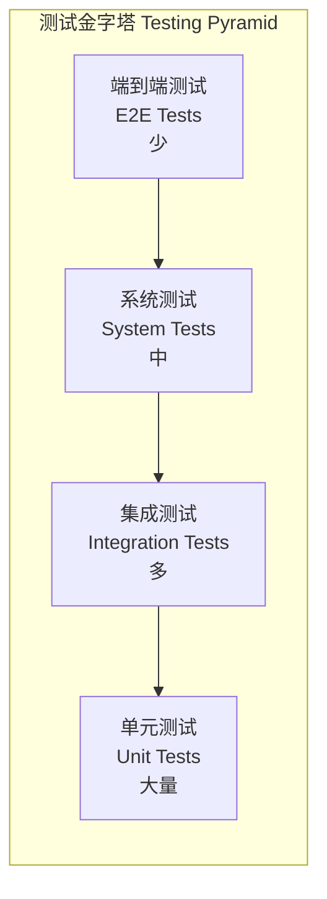
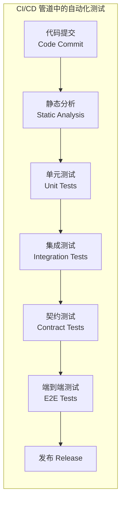

---
aliases:
  - SoftwareTesting
  - 软件测试
  - Testing
  - QA
tags:
created: 2026-05-17
updated: 2026-05-16
  - '05_ComputerScience'
  - 'SoftwareEngineering'
  - 'SoftwareTesting'
  - 'Testing'
---

# 软件测试概述 Testing Overview

软件测试（Software Testing）是评估和验证软件产品是否满足预期需求的过程，是软件质量保证（Quality Assurance）的核心环节。测试旨在发现缺陷（Defects/Bugs），验证功能正确性，评估性能和安全属性，确保软件产品达到发布标准。

## 测试层次 Testing Levels



| 层次 | 测试对象 | 环境 | 执行速度 | 维护成本 |
|------|---------|------|---------|---------|
| 单元测试 Unit | 函数/方法/类 | 隔离 | 毫秒级 | 低 |
| 集成测试 Integration | 模块间接口 | 部分集成 | 秒级 | 中 |
| 系统测试 System | 完整系统 | 类生产 | 分钟级 | 高 |
| 验收测试 Acceptance | 业务需求 | 生产镜像 | 分钟-小时 | 高 |

## 测试方法 Testing Methods

### 白盒测试 White-Box Testing

基于源代码内部结构设计测试用例。

- **语句覆盖**（Statement Coverage）：每条语句至少执行一次
- **分支覆盖**（Branch Coverage）：每个分支条件取真和假各一次
- **条件覆盖**（Condition Coverage）：每个布尔子条件取真和假
- **路径覆盖**（Path Coverage）：所有可能的执行路径

覆盖率公式：

$$ \text{语句覆盖率} = \frac{\text{已执行语句数}}{\text{可执行语句总数}} \times 100\% $$

$$ \text{判定覆盖率} = \frac{\text{已执行分支数}}{\text{总分支数}} \times 100\% $$

### 黑盒测试 Black-Box Testing

基于功能规格设计测试用例，不关注内部实现。

| 技术 | 描述 | 适用场景 |
|------|------|----------|
| 等价类划分 EC Partitioning | 输入域划分为有效/无效等价类 | 输入范围广泛的场景 |
| 边界值分析 BVA | 测试边界值附近数据 | 数值输入校验 |
| 决策表 Decision Table | 逻辑条件组合驱动测试 | 复杂业务规则 |
| 状态转换 State Transition | 基于状态机模型 | 工作流系统 |
| 正交实验 Orthogonal Array | 用最少用例覆盖最多组合 | 多参数组合测试 |

### 非功能测试 Non-Functional Testing

| 类型 | 工具 | 关注指标 |
|------|------|----------|
| 性能测试 Performance | JMeter, k6, Locust | 吞吐量, 响应时间, TPS |
| 负载测试 Load | Gatling, wrk | 并发用户, 资源利用率 |
| 压力测试 Stress | Vegeta, ab | 系统崩溃点和恢复能力 |
| 安全测试 Security | OWASP ZAP, Burp Suite | 漏洞扫描, 渗透测试 |
| 可用性测试 Usability | 用户研究, 热力图 | 任务完成率, 误操作率 |

## 自动化测试 Automated Testing

测试自动化（Test Automation）通过脚本和工具自动执行测试用例。



### 测试驱动开发 Test-Driven Development (TDD)

红-绿-重构（Red-Green-Refactor）循环：

1. **红 Red**：编写一个失败的测试用例
2. **绿 Green**：编写最少代码使测试通过
3. **重构 Refactor**：优化代码同时保持测试绿色

### 行为驱动开发 Behavior-Driven Development (BDD)

使用自然语言描述业务行为，工具如 Cucumber、SpecFlow：

```
Feature: 用户登录
  Scenario: 成功登录
    Given 用户已注册且账号有效
    When 用户输入正确的用户名和密码
    Then 用户成功登录系统
```

## 测试策略 Test Strategy

- **测试范围**（Test Scope）：根据风险评估确定测试深度
- **测试数据**（Test Data）：生产数据脱敏、合成数据生成
- **环境管理**（Environment Management）：开发/测试/预发布/生产环境
- **缺陷管理**（Defect Management）：缺陷生命周期（发现→确认→修复→验证→关闭）
- **回归测试**（Regression Testing）：确保新代码不破坏已有功能

## 相关条目

- [[SoftwareEngineering]]
- [[SoftwareArchitecture]]
- [[DevOps]]
- [[ProgrammingLanguages]]
- [[WebDevelopment]]
