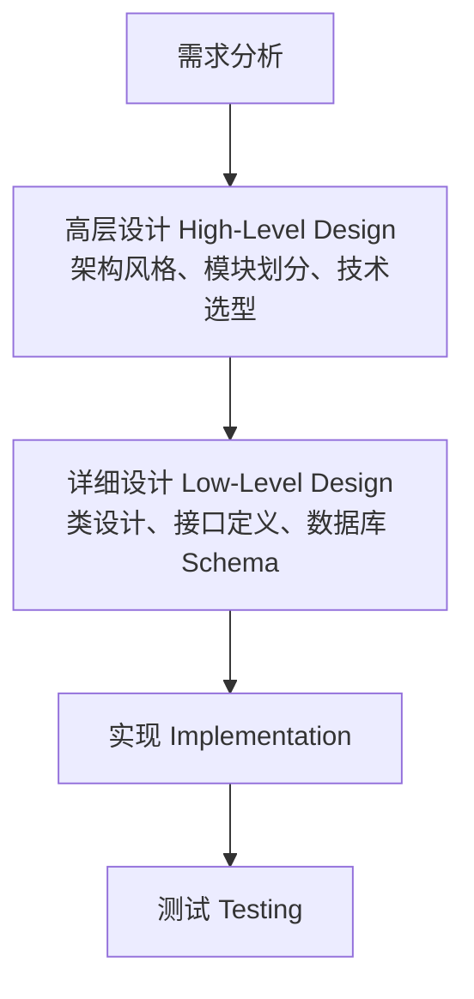

# 系统设计 (System Design)

## 一、概述 (Overview)

系统设计是将需求规格转化为系统架构和组件设计的过程，定义系统的模块划分、接口协议、数据流、技术选型和部署方案。良好的系统设计确保系统满足功能需求和非功能需求（性能、可扩展性、可用性、安全性）。

### 系统设计的层次



## 二、核心架构风格 (Architectural Styles)

| 风格 | 描述 | 优点 | 缺点 | 适用场景 |
|------|------|------|------|---------|
| **分层架构 (Layered)** | 水平分层（展示层/业务层/数据层） | 关注点分离 | 层间耦合可能 | 企业应用 |
| **微服务 (Microservices)** | 小型独立服务，API 通信 | 独立部署，技术异构 | 分布式复杂度 | 大型互联网应用 |
| **事件驱动 (Event-Driven)** | 通过事件总线通信 | 松耦合，异步扩展 | 最终一致性 | 实时数据处理 |
| **CQRS** | 命令查询职责分离 | 读写独立优化 | 复杂度增加 | 读写负载差异大 |
| **六边形架构 (Hexagonal)** | 核心业务逻辑与外部隔离 | 高可测试性 | 抽象层多 | DDD 项目 |
| **管道-过滤器 (Pipes & Filters)** | 数据流经处理链 | 可组合，可重用 | 数据转换开销 | ETL, 编译器 |

### 分层架构 (Layered Architecture)

```text
┌──────────────────────────────┐
│   表示层 (Presentation Layer)      │
│   Controller, 路由, 视图模型        │
├──────────────────────────────┤
│   业务逻辑层 (Business Layer)        │
│   Service, Domain Model, Rules      │
├──────────────────────────────┤
│   数据访问层 (Data Access Layer)     │
│   Repository, DAO, ORM              │
├──────────────────────────────┤
│   基础设施层 (Infrastructure Layer)   │
│   DB, Cache, Queue, External API    │
└──────────────────────────────┘
```

## 三、分布式系统设计要点 (Distributed System Design)

### CAP 定理

分布式系统无法同时满足三个属性：

$$C \land A \land P \leq 2$$

| 组合 | 说明 | 示例 |
|------|------|------|
| **CP** | 放弃可用性，保证一致性 + 分区容忍 | ZooKeeper, etcd |
| **AP** | 放弃一致性，保证可用性 + 分区容忍 | Cassandra, DNS |
| **CA** | 放弃分区容忍（单机） | 传统 RDBMS |

### 一致性哈希 (Consistent Hashing)

分布式缓存/数据分片的关键技术，最小化节点增减时的数据迁移量：

$$\text{hash(key)} \in [0, 2^{32} - 1] \text{（哈希环）}$$

虚拟节点（Virtual Nodes）解决负载不均问题：
$$N_{vn} = N_{physical} \times K \quad (K \text{ 通常 } \geq 100)$$

## 四、可扩展性设计 (Scalability Design)

### 水平扩展 vs 垂直扩展

| 方向 | 方式 | 限制 | 成本 |
|------|------|------|------|
| 垂直扩展 (Scale Up) | 增加单机 CPU/内存/磁盘 | 物理上限 | 成本指数增长 |
| 水平扩展 (Scale Out) | 增加更多机器 | 需无状态设计 + 分布式协调 | 成本线性增长 |

### 数据库扩展策略

```text
读写分离 (Read Replicas):
  ┌─────────┐    ┌───────────┐   ┌───────────┐
  │Primary  │───→│ Replica 1 │   │ 读请求    │
  │ (写)    │    ├───────────┤   ├───────────┤
  │         │───→│ Replica 2 │   │ 读请求    │
  └─────────┘    └───────────┘   └───────────┘

分库分表 (Sharding):
  Shard Key: user_id % 4
  Shard 0: user_id 0, 4, 8, ...
  Shard 1: user_id 1, 5, 9, ...
  Shard 2: user_id 2, 6, 10, ...
  Shard 3: user_id 3, 7, 11, ...
```

### 设计目标 — SLA/SLO/SLI

| 术语 | 含义 | 示例 |
|------|------|------|
| **SLA (Service Level Agreement)** | 对外承诺的服务等级协议 | "99.9% 可用性" |
| **SLO (Service Level Objective)** | 内部设定的服务等级目标 | "99.95% uptime" |
| **SLI (Service Level Indicator)** | 实际测量的指标值 | "本月实际 = 99.92%" |

$$SLA \leq SLO \leq \text{实际能力}$$

### 高可用性计算

$$\text{Availability} = \frac{\text{Total Time} - \text{Downtime}}{\text{Total Time}} \times 100\%$$

| 可用性等级 | 年停机时间 | 俗名 |
|-----------|------------|------|
| 99% (2 nines) | 87.6 小时 | — |
| 99.9% (3 nines) | 8.76 小时 | 企业级 |
| 99.99% (4 nines) | 52.6 分钟 | 电信级 |
| 99.999% (5 nines) | 5.26 分钟 | 高可用 |
| 99.9999% (6 nines) | 31.5 秒 | 容错 |

## 五、系统设计案例 — URL 短链接 (URL Shortener)

```text
需求:
  - 生成短链接: long_url → short_url
  - 短链接重定向: short_url → long_url
  - 分析: 点击统计, 来源统计

估算:
  - 写: 1 亿 URL/月 ≈ 40/s
  - 读: 10 亿请求/月 ≈ 400/s (读:写 ≈ 10:1)
  - 存储: 1 亿 × 500 bytes ≈ 50 GB/月

设计:
  Client → Load Balancer → Web Server → Cache (Redis)
                                          ↓
                                        DB (PostgreSQL)

短链接生成算法: Base62 编码 (a-zA-Z0-9 = 62 字符)
  7 位 Base62 → 62^7 ≈ 3.5 万亿个唯一 URL
  Snowflake ID → Base62 → 短码
```

## 六、负载均衡策略 (Load Balancing)

| 算法 | 原理 | 优点 | 缺点 | 适用场景 |
|------|------|------|------|---------|
| **Round Robin** | 轮流分发请求 | 简单、无状态 | 不考虑服务器负载差异 | 后端配置均匀 |
| **Weighted Round Robin** | 按权重比例分发 | 适应异构服务器 | 权重分配需合理 | 混合配置集群 |
| **Least Connections** | 分发到连接数最少的服务器 | 考虑当前负载 | 连接数 ≠ CPU 负载 | 长连接服务 |
| **IP Hash** | 按客户端 IP 哈希 | 会话保持 | 后端增减影响哈希 | 需要 Session 亲和 |
| **Consistent Hash** | 一致性哈希环分布 | 后端增减影响最小 | 实现复杂 | 分布式缓存 |

### 一致性哈希详解

$$\text{Hash Ring: } [0, 2^{32}-1]$$

虚拟节点解决负载不均：
$$N_{vn} = N_{physical} \times V \quad (V \text{ 通常 } \geq 100)$$

当新增或移除节点时，只需迁移 $\frac{1}{N}$ 的数据（$N$ 为节点数），而非传统哈希的几乎全部数据。

## 七、缓存策略 (Caching Strategies)

| 策略 | 读流程 | 写流程 | 优点 | 缺点 |
|------|--------|--------|------|------|
| **Cache-Aside** | 先读 Cache → Miss → 从 DB 读 → 回填 Cache | 先写 DB → 删除 Cache | 简单 | Cache Miss 代价 |
| **Read-Through** | Cache 从 DB 加载 | 同上 | 应用程序逻辑简单 | Cache 层复杂 |
| **Write-Through** | — | 同时写 Cache 和 DB | 一致性强 | 写延迟增加 |
| **Write-Behind** | — | 写 Cache → 异步写 DB | 写性能高 | 可能数据丢失 |
| **Write-Around** | 同 Cache-Aside | 直接写 DB，Cache 不过 | 避免 Cache 污染 | 读 Miss 概率增大 |

### 缓存淘汰策略

| 策略 | 原理 | 实现复杂度 | 命中率 |
|------|------|-----------|--------|
| **LRU** (Least Recently Used) | 淘汰最久未访问的 | 中（双向链表+哈希表） | 高 |
| **LFU** (Least Frequently Used) | 淘汰访问频率最低的 | 高（计数器+衰减） | 高 |
| **FIFO** (First In First Out) | 淘汰最早进入的 | 低（队列） | 低 |
| **TTL** (Time To Live) | 到期自动失效 | 极低（定时器） | 取决于命中 |
| **Random** | 随机淘汰 | 极低 | 不可预测 |

## 八、设计模式 (Design Patterns in System Design)

| 模式 | 描述 | 应用 |
|------|------|------|
| **Circuit Breaker** | 故障自动熔断，防止级联失效 | 微服务 API 调用 |
| **Bulkhead** | 按服务类型隔离资源池 | 线程池隔离 |
| **Retry with Backoff** | 失败重试 + 指数退避 | 网络调用 |
| **Rate Limiter** | 控制请求速率 | API 网关 |
| **Idempotency Key** | 防重复请求 | 支付/下单 |
| **Saga** | 长事务的补偿方案 | 微服务分布式事务 |
| **Event Sourcing** | 以事件序列存储状态 | 审计日志 |

## 九、系统设计中的可观测性 (Observability)

可观测性三支柱 (Three Pillars of Observability)：

| 支柱 | 描述 | 数据源 | 工具 |
|------|------|--------|------|
| **Logging (日志)** | 记录事件和错误 | App logs, System logs, Access logs | ELK, Loki, Graylog |
| **Metrics (指标)** | 聚合数值数据 | CPU, 内存, 请求数, 延迟 | Prometheus, Grafana, Datadog |
| **Tracing (链路追踪)** | 请求跨服务的路径 | Span, Trace ID, Parent Span | Jaeger, Zipkin, OpenTelemetry |

### 分布式追踪

OpenTelemetry 是 CNCF 的可观测性标准，统一收集日志、指标和追踪。

## 十、系统设计的权衡方法

| 权衡 | 描述 | 选择方向 |
|------|------|---------|
| **延迟 vs 吞吐量** | 延迟越低→吞吐越低 | 批处理提吞吐，流式降延迟 |
| **一致性 vs 可用性** | CP vs AP | 金融选 CP，社交媒体选 AP |
| **写优化 vs 读优化** | 设计影响 | 日志场景写优化，展示场景读优化 |
| **强一致性 vs 性能** | 同步复制 vs 异步 | 根据业务要求选择 |
| **精确 vs 近实时** | 精确计数 vs 近似估计 | HyperLogLog, Count-Min Sketch |
| **冗余 vs 成本** | 多副本 vs 节省资源 | 依据 SLA 要求 |

## 十一、面试高频系统设计题

| 题目 | 核心考察 | 关键设计选择 |
|------|---------|-------------|
| **设计 URL 短链接** | 哈希 + 存储 + 重定向 | Base62, 布隆过滤器, 缓存 |
| **设计新闻信息流** | Fan-out 写/读 + 推送/拉取 | 写时扩散 (Push) vs 读时聚合 (Pull) |
| **设计聊天系统** | WebSocket + 消息存储 + 离线 | 长轮询, WebSocket, 消息序列化 |
| **设计限流系统** | Token Bucket / Leaky Bucket | 令牌桶, 滑动窗口, 分布式限流 |
| **设计分布式 ID** | 唯一 + 有序 + 高可用 | Snowflake, UUID, 数据库序列 |
| **设计秒杀系统** | 高并发 + 超卖防护 | 前端限流, Redis 原子, MQ 削峰 |

## 相关条目
- [[RequirementsEngineering]]
- [[SoftwareProjectManagement]]
- [[Documentation]]
- [[05_ComputerScience/SoftwareEngineering/INDEX]]
