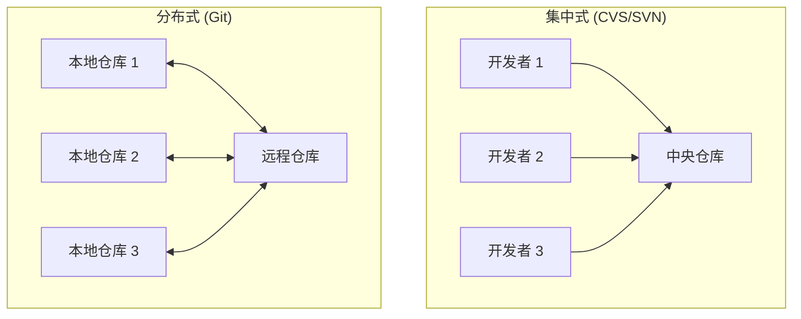
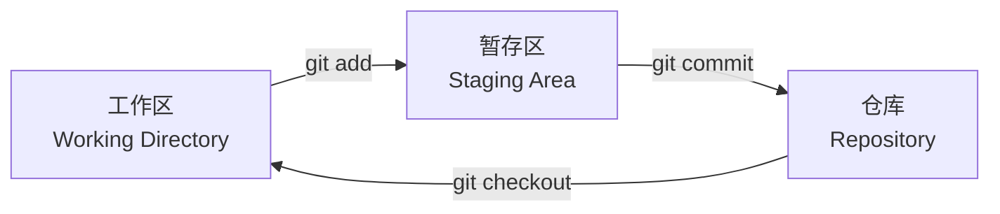
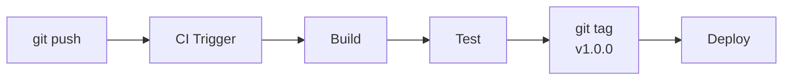

# 版本控制 (Version Control)

## 一、概述 (Overview)

版本控制（Version Control, VC）是跟踪和管理代码/文件变更的系统，允许多人协作、记录历史、回退到任意版本。现代软件工程中，版本控制系统（VCS）是开发流程的基础设施。

### VCS 发展历史

| 时代 | 代表 | 架构 | 特点 |
|------|------|------|------|
| 1970s | SCCS (Source Code Control System) | 本地 | 锁定模式，只能单人编辑 |
| 1980s | RCS (Revision Control System) | 本地 | 单个文件版本管理 |
| 1990s | CVS (Concurrent Versions System) | **客户端/服务器** | 多用户，网络访问 |
| 2000s | SVN (Apache Subversion) | 客户端/服务器 | 原子提交，目录版本 |
| **2005** | **Git** | **分布式 (DVCS)** | 完整仓库副本，离线操作 |
| 2000s | Mercurial (Hg) | 分布式 | Python 实现，一度流行 |

## 二、核心概念 (Core Concepts)

### 版本控制模型



| 特性 | 集中式 (CVS/SVN) | 分布式 (Git/Mercurial) |
|------|-----------------|----------------------|
| 仓库位置 | 仅在服务器 | 每台机器有完整克隆 |
| 离线操作 | 不可用 | 完全可离线 |
| 提交速度 | 需网络，慢 | 本地操作，快 |
| 分支成本 | 高（整个目录复制） | 低（指针） |
| 单点故障 | 服务器宕机无法协作 | 任何节点可恢复 |

## 三、Git 核心概念 (Git Core Concepts)

### Git 对象模型

Git 的核心是一个内容可寻址的文件系统，四种对象类型：

| 对象类型 | 内容 | 存储位置 | 示例哈希 |
|---------|------|---------|---------|
| **Blob** | 文件内容 | `.git/objects/ab/` | `a1b2c3d4...` |
| **Tree** | 目录结构（文件名 → Blob/Tree） | `.git/objects/` | `e5f6g7h8...` |
| **Commit** | 快照（Tree + Parent + Message + Author） | `.git/objects/` | `9i0j1k2l...` |
| **Tag** | 指向 Commit 的标签 | `.git/refs/tags/` | — |

```text
Commit 内部结构:
┌──────────────────────────┐
│ Tree: a1b2c3              │──→ 项目根目录的文件树
│ Parent: 9i0j1k            │──→ 前一个 Commit
│ Author: Alice             │
│ Committer: Alice          │
│ Timestamp: 1700000000     │
│ Message: "Add login API"  │
└──────────────────────────┘
```

### Git 区域 (Three States)



| 区域 | 位置 | 用途 | 命令 |
|------|------|------|------|
| 工作区 (Working Directory) | 文件系统目录 | 实际编辑代码 | `git status` |
| 暂存区 (Staging Area/Index) | `.git/index` | 准备提交的变更 | `git add` |
| 仓库 (Repository) | `.git/objects/` | 历史提交记录 | `git commit` |

## 四、Git 工作流程 (Git Workflows)

### 集中式工作流 (Centralized)

适合小团队，单主分支：
```bash
git clone <url>
# 编辑代码
git add <file>
git commit -m "message"
git push
```

### Gitflow 工作流

```text
main (主分支)  ───────●──────────────●──── 发布
                        \              /
develop (开发分支) ────●──●──●──●──●──●── 每日开发
                         \         /
feature/login           ●──────●      功能开发
                              \     /
release/v1.0                 ●──●    发布准备
                                  \
hotfix/1.0.1                   ●──●   紧急修复
```

| 分支类型 | 用途 | 来源 | 合并目标 | 生命周期 |
|---------|------|------|---------|---------|
| `main` | 生产就绪代码 | — | — | 永久 |
| `develop` | 集成分支 | `main` | `main`（发布时） | 永久 |
| `feature/*` | 新功能开发 | `develop` | `develop` | 功能完成后删除 |
| `release/*` | 发布准备 | `develop` | `develop` + `main` | 发布后删除 |
| `hotfix/*` | 紧急修复 | `main` | `main` + `develop` | 修复后删除 |

### 基于 Trunk 的开发 (Trunk-Based Development)

高级团队的持续集成实践：

```text
main (主干) ──●──●──●──●──●──●──●── 小批量频繁提交
              │  │  │  │  │  │  │
              ●──●──●──●──●──●──●── 短生命周期分支
```

推荐所有开发者每天至少合并一次到主干（短命分支 < 1 天）。

## 五、Git 高级操作 (Advanced Git)

### 交互式变基 (Interactive Rebase)

在推送前整理本地提交历史：
```bash
git rebase -i HEAD~3
# 支持: pick, reword, edit, squash, fixup, drop
```

变基和合并的对比：
$$rebase \subset merge \quad \text{（变基是合并的一种特殊形式）}$$

### 工作树 (Git Worktree)

同时签出多个分支，避免频繁切换：
```bash
git worktree add ../project-hotfix feature/hotfix
cd ../project-hotfix  # 在独立目录中工作
```

## 六、Git 最佳实践 (Best Practices)

| 实践 | 说明 |
|------|------|
| **小而原子的提交** | 每个提交只关注一个逻辑变更 |
| **写好的提交信息** | 主题行 ≤ 50 字，正文每行 ≤ 72 字 |
| **经常推送** | 避免本地大量提交未推送到远程 |
| **不要重写已推送的历史** | 除非只有你在用该分支 |
| **保持提交历史线性** | 使用 `rebase` 而非 `merge` 拉取 |
| **Gitignore 正确配置** | 排除编译产物、IDE 配置、凭据文件 |

### 提交信息规范

```text
<type>: <简短描述>

[可选的正文，说明为什么和如何]

[可选的页脚，引用 Issue]
```

| Type | 用途 |
|------|------|
| `feat` | 新功能 |
| `fix` | Bug 修复 |
| `docs` | 文档变更 |
| `refactor` | 代码重构 |
| `test` | 测试相关 |
| `chore` | 杂项（依赖、构建配置） |

## 七、Git 分布式协作 (Distributed Collaboration)

```bash
# Fork + PR 工作流（开源项目）
1. Fork 上游仓库到自己的 GitHub
2. git clone 自己仓库
3. git remote add upstream <上游仓库 URL>
4. git checkout -b feature
5. # 开发...
6. git push origin feature
7. 创建 Pull Request
8. 维护者审核后合并

# 保持 Fork 同步
git fetch upstream
git rebase upstream/main
git push origin main --force-with-lease
```

## 八、版本控制与 CI/CD 集成



常用标签规范（SemVer）：
$$\text{Version} = \text{Major.Minor.Patch}$$
$$\text{Tag: } v1.2.3$$

## 九、Git 内部原理 (Git Internals)

```bash
# Git 对象存储位置
.git/objects/      # Git 对象数据库
  ab/              # 对象哈希前 2 位作为目录名
    cdef123...     # 完整哈希的剩余 38 位

# 查看对象类型和内容
git cat-file -t a1b2c3d   # 显示对象类型 (blob/tree/commit/tag)
git cat-file -p a1b2c3d   # 显示对象内容

# 查看 .git 目录结构
.git/
├── HEAD                    # 指向当前分支
├── config                  # 本地配置
├── refs/
│   ├── heads/              # 本地分支
│   │   └── main            # main 分支的最新 commit hash
│   ├── remotes/            # 远程分支
│   └── tags/               # 标签
├── objects/                # 对象数据库
├── index                   # 暂存区
└── logs/                   # reflog 日志
```

## 十、Git 常见问题排查

| 问题 | 症状 | 解决方案 |
|------|------|---------|
| Commit 信息写错 | `git commit -m "typo"` | `git commit --amend -m "fixed"` (仅未推送时) |
| 暂存区误添加 | `git add *` 包含私密文件 | `git reset HEAD sensitive.txt` |
| 本地修改冲突 | `git pull` 拒绝合并 | `git stash` → `git pull` → `git stash pop` |
| Detached HEAD | HEAD 指向历史 commit | `git checkout -b new-branch-name` |
| 撤销已推送的 commit | 错误的提交已推送到远程 | `git revert <hash>` (安全) 或 `git push --force-with-lease` |
| 恢复删除的分支 | `git branch -D feature` | `git reflog` → `git checkout -b feature <hash>` |

## 相关条目
- [[Documentation]]
- [[SoftwareProjectManagement]]
- [[ShellScripting]]
- [[05_ComputerScience/SoftwareEngineering/INDEX]]
