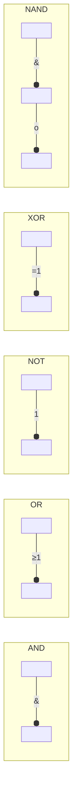
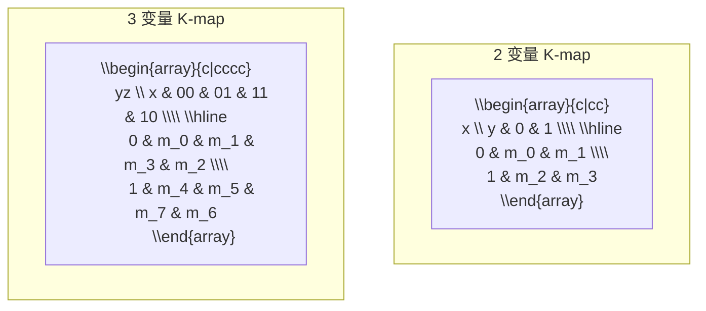
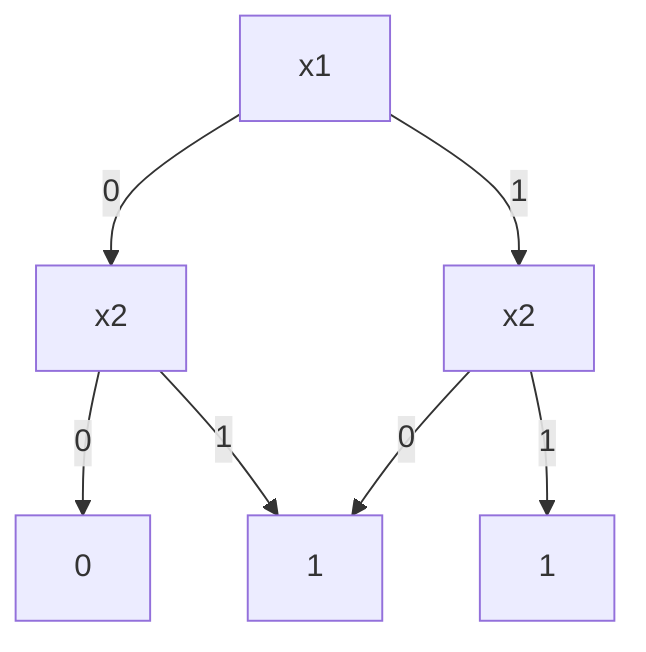
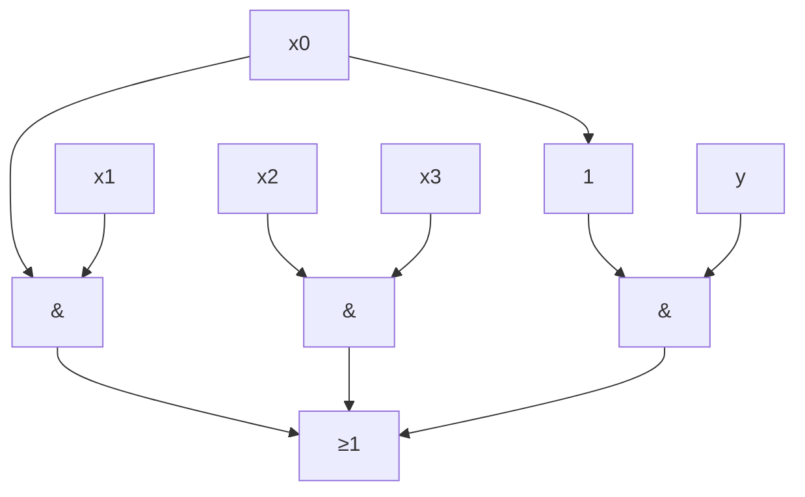
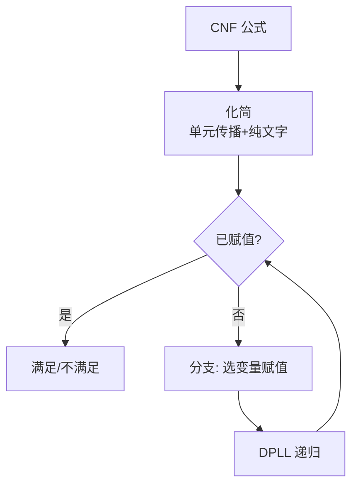
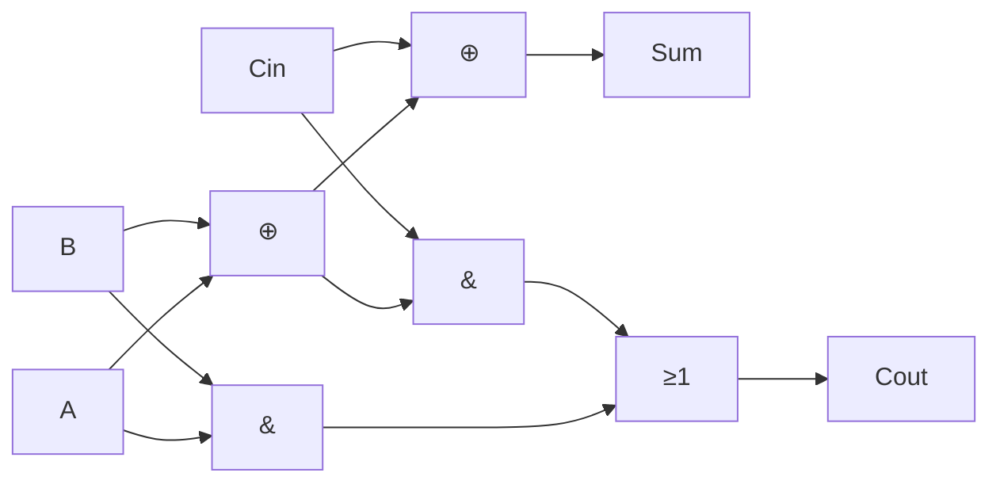

---
aliases: [BooleanAlgebra]
tags: ['05_ComputerScience', 'TheoryOfComputation']
created: 2026-05-17
updated: 2026-05-17
---

# 布尔代数 (Boolean Algebra)

## 一、概述

布尔代数 (Boolean Algebra) 是英国数学家 George Boole 在 1854 年创立的代数系统，研究逻辑运算的代数性质。它是数字电路设计、计算机体系结构和形式化逻辑推理的理论基础。

### 1.1 形式化定义

布尔代数是一个六元组 $(B, +, \cdot, \lnot, 0, 1)$，其中：
- $B$ 是集合（通常 $B = \{0, 1\}$）
- $+$（或 $\lor$）是或运算 (OR)
- $\cdot$（或 $\land$）是与运算 (AND)
- $\lnot$（或 $'$, $\bar{}$）是非运算 (NOT)
- $0$ 是零元，$1$ 是单位元

满足以下公理：

$$\forall a,b,c \in B:$$

| 公理 | 名称 | 表达式 |
|------|------|--------|
| 交换律 | Commutativity | $a + b = b + a,\ a \cdot b = b \cdot a$ |
| 结合律 | Associativity | $(a + b) + c = a + (b + c),\ (a \cdot b) \cdot c = a \cdot (b \cdot c)$ |
| 分配律 | Distributivity | $a \cdot (b + c) = a \cdot b + a \cdot c,\ a + (b \cdot c) = (a + b) \cdot (a + c)$ |
| 单位元 | Identity | $a + 0 = a,\ a \cdot 1 = a$ |
| 补元 | Complement | $a + \lnot a = 1,\ a \cdot \lnot a = 0$ |

## 二、基本逻辑运算

### 2.1 真值表

| $x$ | $y$ | $x \land y$ (AND) | $x \lor y$ (OR) | $x \oplus y$ (XOR) | $\lnot x$ (NOT) |
|-----|-----|-------------------|-----------------|-------------------|----------------|
| 0 | 0 | 0 | 0 | 0 | 1 |
| 0 | 1 | 0 | 1 | 1 | 1 |
| 1 | 0 | 0 | 1 | 1 | 0 |
| 1 | 1 | 1 | 1 | 0 | 0 |

### 2.2 逻辑门符号

## 三、定理与恒等式

### 3.1 基本定理

| 定理 | 表达式 |
|------|--------|
| 幂等律 | $a + a = a,\ a \cdot a = a$ |
| 吸收律 | $a + a \cdot b = a,\ a \cdot (a + b) = a$ |
| 零律 | $a + 1 = 1,\ a \cdot 0 = 0$ |
| 双重否定 | $\lnot(\lnot a) = a$ |
| 德摩根律 | $\lnot(a \cdot b) = \lnot a + \lnot b,\ \lnot(a + b) = \lnot a \cdot \lnot b$ |

### 3.2 德摩根律的扩展

$$\lnot(\bigwedge_{i=1}^{n} a_i) = \bigvee_{i=1}^{n} \lnot a_i$$

$$\lnot(\bigvee_{i=1}^{n} a_i) = \bigwedge_{i=1}^{n} \lnot a_i$$

### 3.3 香农展开 (Shannon Expansion)

任何布尔函数 $f(x_1, x_2, ..., x_n)$ 可展开为：

$$f = x_i \cdot f_{x_i=1} + \lnot x_i \cdot f_{x_i=0}$$

其中 $f_{x_i=1} = f(x_1,...,1,...,x_n)$，$f_{x_i=0} = f(x_1,...,0,...,x_n)$。

## 四、布尔函数表示

### 4.1 规范形式

| 形式 | 英文 | 定义 | 示例 |
|------|------|------|------|
| 最小项和 | SOP (Sum of Products) | 真值表中所有结果为 1 的最小项之和 | $f = \bar{x}yz + xy\bar{z} + xyz$ |
| 最大项积 | POS (Product of Sums) | 真值表中所有结果为 0 的最大项之积 | $f = (x+y+z) \cdot (x+\bar{y}+z)$ |

**最小项** (Minterm)：所有变量恰好出现一次（或正或反）的与项。

$$m_j = \prod_{i=1}^{n} x_i^{b_i} \quad \text{其中 } x_i^1 = x_i,\ x_i^0 = \bar{x}_i$$

**最大项** (Maxterm)：所有变量恰好出现一次（或正或反）的或项。

$$M_j = \sum_{i=1}^{n} x_i^{\bar{b}_i} \quad \text{其中 } x_i^1 = x_i,\ x_i^0 = \bar{x}_i$$

### 4.2 卡诺图 (Karnaugh Map)

卡诺图是真值表的图形化表示，用于化简布尔函数：

相邻格子的最小项仅一个变量不同，可合并消去该变量：

$$xy + x\bar{y} = x(y + \bar{y}) = x$$

### 4.3 Quine-McCluskey 算法

适用于多于 4 个变量的系统化化简算法：

1. 列出所有最小项按 1 的个数分组
2. 相邻组间合并，消去不同位
3. 重复直到无法合并
4. 从质蕴含项表中选择覆盖所有最小项的最小集合

### 4.4 BDD (Binary Decision Diagram)

二叉决策图是布尔函数的图形化表示，使用香农展开的 DAG：

ROBDD (Reduced Order BDD) 通过共享同构子图和删除冗余节点，得到规范形式表示。

## 五、电路实现

### 5.1 逻辑门族

| 门族 | 基本门 | 特点 |
|------|--------|------|
| TTL | NAND | 高速，双极性 |
| CMOS | NAND, NOR | 低功耗，高集成度 |
| ECL | OR-NOR | 超高速 |
| FPGA | LUT | 可编程查找表 |

### 5.2 组合电路

全加器逻辑：

$$S = A \oplus B \oplus C_{in}$$
$$C_{out} = A \cdot B + C_{in} \cdot (A \oplus B)$$

### 5.3 时序电路

由组合逻辑 + 存储元件（触发器）构成：

$$Q_{next} = f(Q, input)$$

SR 锁存器：$Q_{next} = S + \bar{R} \cdot Q$

D 触发器：$Q_{next} = D$

## 六、布尔代数在计算机中的应用

| 领域 | 应用 | 说明 |
|------|------|------|
| 数字逻辑 | 门电路设计 | 布尔函数硬件实现 |
| 体系结构 | ALU 设计 | 算术逻辑单元 |
| 编译优化 | 死代码消除 | $\text{useless} \lor \text{false} = \text{useless}$ |
| 数据库 | 查询优化 | WHERE 条件简化 |
| 密码学 | S-box 设计 | 布尔函数密码学性质 |
| 形式化验证 | SAT Solver | 布尔可满足性问题 |

## 七、SAT 问题 (Boolean Satisfiability)

给定布尔公式 $f(x_1,...,x_n)$，是否存在赋值使 $f = 1$？

- **3-SAT**：每个子句 3 个文字，NP-完全
- **2-SAT**：每个子句 2 个文字，多项式时间求解 ($O(n+m)$)

现代 SAT 求解器使用 CDCL (Conflict-Driven Clause Learning) 算法，结合 2-Watched Literal 数据结构。

## 八、扩展：多值逻辑

| 逻辑系统 | 真值数量 | 说明 |
|----------|----------|------|
| 布尔逻辑 | 2 | $\{0, 1\}$ |
| 三值逻辑 | 3 | $ \{0, 1, X\} $ |
| 模糊逻辑 | $\infty$ | $[0, 1]$ 连续值 |
| 直觉主义逻辑 | — | 排除排中律 |

## 九、布尔代数在数字电路中的工程应用

### 9.1 加法器设计

半加器 (Half Adder)：
$$S = A \oplus B, \quad C_{out} = A \cdot B$$

全加器 (Full Adder)：
$$S = A \oplus B \oplus C_{in}$$
$$C_{out} = A \cdot B + C_{in} \cdot (A \oplus B)$$

### 9.2 比较器

一位比较器：
$$A > B:\ A \cdot \bar{B}$$
$$A = B:\ A \odot B = \overline{A \oplus B}$$
$$A < B:\ \bar{A} \cdot B$$

### 9.3 编码器与译码器

优先编码器 (Priority Encoder) 将多个输入中最高优先级的有效输入编码为二进制输出。译码器 (Decoder) 将 $n$ 位二进制输入映射到 $2^n$ 个输出线中的一条。

## 十、布尔可满足性问题的实际应用

| 应用领域 | 问题实例 | SAT 编码 |
|----------|----------|----------|
| 电路验证 | 等价性检查 | $f_{spec} \oplus f_{impl}$ |
| 自动规划 | 机器人行动序列 | 规划域编码为 CNF |
| 密码分析 | 攻击流密码 | 初始化向量编码 |
| 软件测试 | 符号执行 | 路径条件编码 |
| 组合设计 | 调度问题 | 时间槽约束 |
| 生物信息学 | DNA 比对 | 序列匹配约束 |
| 硬件综合 | 逻辑最小化 | 最小化 SOP 表达 |

### 10.1 MaxSAT 与加权 MaxSAT

MaxSAT 要求在满足最大化加权子句数的前提下求解。用于现实中往往无法满足所有约束的场景：

$$\max \sum_{C \in \Phi} w_C \cdot satisfaction(C)$$

硬约束 (Hard Constraints) 必须满足，软约束 (Soft Constraints) 的满足程度最大化。

## 十一、Reed-Muller 逻辑

异或 (XOR) 运算在布尔代数中具有独特的代数性质：

$$x \oplus y = x\bar{y} + \bar{x}y$$
$$x \oplus y \oplus z = x \oplus (y \oplus z)$$

Reed-Muller 展开（标准 EXOR 范式）：

$$f(x_1, ..., x_n) = a_0 \oplus a_1 x_1 \oplus a_2 x_2 \oplus ... \oplus a_{12} x_1 x_2 \oplus ...$$

这种展开在可测试性设计和通信编码中特别有用。基于 Reed-Muller 的电路通常比基于 AND-OR 的电路更容易测试故障。

## 相关条目
- [[FormalLanguages]]
- [[05_ComputerScience/DataStructuresAndAlgorithms/ComputerAlgebra|ComputerAlgebra]]
- [[INDEX|当前目录索引]]

