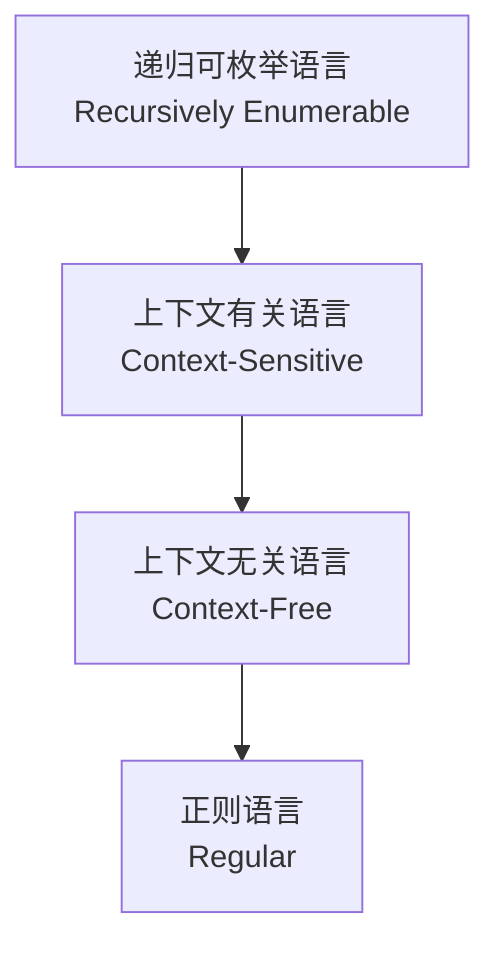
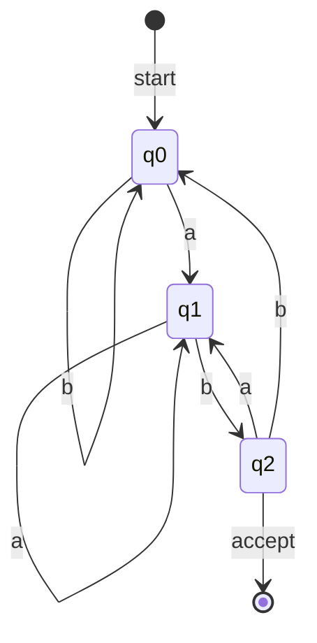
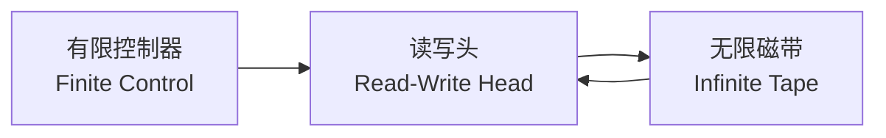

# 形式语言 (Formal Languages)

形式语言（Formal Languages）是计算机科学理论的核心支柱之一，研究抽象语言的语法结构及其识别机制。它与自动机理论（Automata Theory）、可计算性理论（Computability Theory）和计算复杂性理论（Complexity Theory）共同构成了理论计算机科学的基石。

## 基本概念与定义

形式语言由字母表（Alphabet）上的字符串集合定义。字母表 $\\Sigma$ 是一个有限非空符号集合，字符串则是 $\\Sigma$ 中符号的有限序列。

### 核心术语

| 术语 | 英文 | 定义 |
|------|------|------|
| 字母表 | Alphabet | 有限符号集合，记为 $\\Sigma$ |
| 字符串 | String | 符号的有限序列 |
| 空串 | Empty String | 长度为 0 的字符串，记为 $\\varepsilon$ |
| 语言 | Language | $\\Sigma^*$ 的任意子集 |
| 克林闭包 | Kleene Star | 所有可能字符串的集合，记为 $\\Sigma^*$ |

形式语言 $L$ 的克林闭包定义为：

$$
L^* = \bigcup_{i=0}^{\infty} L^i = L^0 \cup L^1 \cup L^2 \cup \cdots
$$

其中 $L^0 = \\{\varepsilon\\}$，$L^i = L^{i-1} \\cdot L$。

## 乔姆斯基层次结构 (Chomsky Hierarchy)

诺姆·乔姆斯基（Noam Chomsky）于 1956 年提出了语言分类的四层层次结构，根据文法的生成能力将形式语言分为四类。

### 四类文法对比

| 文法类型 | 产生式形式 | 自动机 | 典型应用 |
|----------|------------|--------|----------|
| 0 型：无限制 | $\\alpha \\rightarrow \\beta$ | 图灵机 | 通用计算 |
| 1 型：上下文有关 | $\\alpha A \\beta \\rightarrow \\alpha \\gamma \\beta$ | 线性有界自动机 | 自然语言处理 |
| 2 型：上下文无关 | $A \\rightarrow \\gamma$ | 下推自动机 | 编程语言语法 |
| 3 型：正则 | $A \\rightarrow aB$ 或 $A \\rightarrow a$ | 有限自动机 | 词法分析、正则表达式 |

## 正则语言 (Regular Languages)

正则语言是最简单的形式语言类别，可由正则表达式（Regular Expression）、有限自动机（Finite Automaton）或正则文法（Regular Grammar）描述。

### 确定性有限自动机 (DFA)

DFA 由五元组定义：

$$
M = (Q, \Sigma, \delta, q_0, F)
$$

其中：
- $Q$：有限状态集合
- $\\Sigma$：输入字母表
- $\\delta: Q \\times \\Sigma \\rightarrow Q$：状态转移函数
- $q_0 \\in Q$：初始状态
- $F \\subseteq Q$：接受状态集合

### 正则表达式代数

正则表达式遵循以下代数定律：

| 定律 | 表达式 |
|------|--------|
| 交换律 | $R + S = S + R$ |
| 结合律 | $(R + S) + T = R + (S + T)$ |
| 分配律 | $R(S + T) = RS + RT$ |
| 幂等律 | $R + R = R$ |
| 克林星 | $R^* = \\varepsilon + RR^*$ |

## 上下文无关语言 (Context-Free Languages)

上下文无关语言（CFL）在编译器设计中具有核心地位，绝大多数编程语言的语法结构属于此类。

### 上下文无关文法 (CFG)

CFG 由四元组定义：

$$
G = (V, \Sigma, R, S)
$$

其中 $V$ 为非终结符集合，$\\Sigma$ 为终结符集合，$R$ 为产生式规则集合，$S \\in V$ 为开始符号。

典型的算术表达式文法：

$$
\begin{aligned}
E &\rightarrow E + T \mid T \\
T &\rightarrow T \\times F \mid F \\
F &\rightarrow (E) \mid \text{id}
\end{aligned}
$$

### 下推自动机 (PDA)

下推自动机通过栈（Stack）结构扩展了有限自动机的记忆能力，恰好能够识别所有上下文无关语言。PDA 的形式化定义为七元组：

$$
P = (Q, \Sigma, \Gamma, \delta, q_0, Z_0, F)
$$

其中 $\\Gamma$ 为栈字母表，$Z_0$ 为初始栈符号。

### 乔姆斯基范式 (CNF)

任何上下文无关文法都可转化为乔姆斯基范式，其产生式仅限两种形式：

$$
A \\rightarrow BC \quad \text{或} \quad A \\rightarrow a
$$

这种标准化形式在 CYK 算法（Cocke-Younger-Kasami）等语法分析技术中具有重要应用。

## 图灵机与可计算性 (Turing Machines)

### 图灵机定义

图灵机（Turing Machine）是计算能力最强的形式模型，其定义如下：

$$
M = (Q, \Sigma, \Gamma, \delta, q_0, B, F)
$$

转移函数 $\\delta$ 将当前状态与磁带符号映射为新状态、新符号及移动方向：

$$
\delta: Q \\times \\Gamma \\rightarrow Q \\times \\Gamma \\times \\{L, R\\}
$$

### 丘奇-图灵论题

丘奇-图灵论题（Church-Turing Thesis）指出：任何可直观计算的函数都可由图灵机计算。虽然不可形式化证明，但已被广泛接受为计算理论的公理。

### 停机问题

停机问题（Halting Problem）是计算机科学中最著名的不可判定问题。不存在通用算法能够判定任意程序在给定输入下是否会终止运行。

形式化表述为：语言

$$
L_{HALT} = \\{\\langle M, w \\rangle \mid M \text{ 在输入 } w \text{ 上停机}\\}
$$

不是递归语言（Recursive Language），即不可判定。

## 语言运算与封闭性质

形式语言在多种运算下展现不同的封闭性质：

| 运算 | 正则语言 | 上下文无关语言 | 递归可枚举语言 |
|------|----------|----------------|----------------|
| 并集 | 封闭 | 封闭 | 封闭 |
| 交集 | 封闭 | **不封闭** | 封闭 |
| 补集 | 封闭 | **不封闭** | **不封闭** |
| 连接 | 封闭 | 封闭 | 封闭 |
| 克林闭包 | 封闭 | 封闭 | 封闭 |

泵引理（Pumping Lemma）是证明语言非正则或非上下文无关的重要工具。对于正则语言，若 $L$ 是正则语言，则存在泵长度 $p$，使得任何长度不小于 $p$ 的字符串 $s \\in L$ 可分解为 $s = xyz$，满足：

1. $|xy| \\leq p$
2. $|y| \\geq 1$
3. $\\forall i \\geq 0, xy^iz \\in L$

形式语言理论为编译器构造、计算复杂性分析、密码学与计算生物学等领域提供了坚实的数学基础。理解语言的层次结构与自动机的对应关系，是深入掌握计算机科学理论的关键一步。
