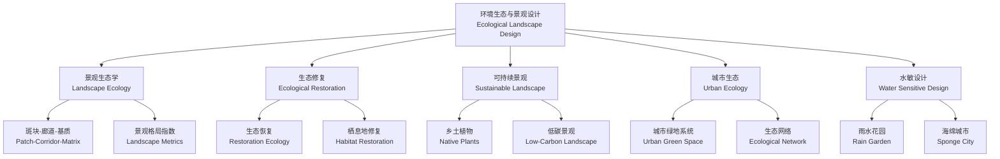

---
aliases: [环境生态与景观设计, EcologicalLandscapeDesign]
tags: ['Design', 'EnvironmentalDesign', 'LandscapeArchitecture', 'EcologicalDesign']
---

# 环境生态与景观设计 (Ecological Landscape Design)

## 概述 (Overview)

环境生态与景观设计 (Ecological Landscape Design) 是将生态学 (Ecology) 原理应用于景观规划与设计 (Landscape Planning and Design) 的综合学科。其核心理念是尊重自然过程、保护生物多样性 (Biodiversity)、促进生态系统服务 (Ecosystem Services) 的可持续供给，同时满足人类的审美和使用需求。该领域融合了景观生态学 (Landscape Ecology)、恢复生态学 (Restoration Ecology) 和可持续设计 (Sustainable Design) 的理论与方法。

## 学科体系框架

## 核心生态学原理 (Ecological Principles)

### 斑块-廊道-基质模型 (Patch-Corridor-Matrix Model)

由 Forman 和 Godron 提出的景观生态学核心范式：

| 景观要素 | 定义 | 生态功能 | 设计应用 |
|:---|:---|:---|:---|
| 斑块 (Patch) | 相对均质的非线性地表区域 | 物种栖息地、资源聚集区 | 公园、湿地、林地斑块 |
| 廊道 (Corridor) | 连接斑块的线性景观要素 | 物种迁徙通道、基因流 | 绿道、生态廊道 |
| 基质 (Matrix) | 景观中面积最大、连通性最强的要素 | 背景环境、控制景观动态 | 城市基质、农业基质 |

**景观格局指数**：

- **斑块密度 (Patch Density)**：$PD = \frac{N}{A}$，衡量景观破碎化程度
- **Shannon 多样性指数 (SHDI)**：$SHDI = -\sum_{i=1}^{m} p_i \ln p_i$，衡量景观异质性
- **聚集度指数 (Contagion)**：$C = 1 + \frac{\sum_{i=1}^{m}\sum_{j=1}^{m} p_{ij} \ln p_{ij}}{2 \ln m}$

### 生态恢复原则 (Ecological Restoration Principles)

恢复生态学指导退化生态系统的修复：

| 恢复阶段 | 核心任务 | 时间尺度 | 成功指标 |
|:---|:---|:---:|:---|
| 评估阶段 | 生态系统退化程度诊断、参照生态系统确定 | 1–6 月 | 基线数据完整 |
| 规划阶段 | 恢复目标设定、恢复路径规划 | 3–12 月 | 方案可行性通过 |
| 实施阶段 | 物理/化学/生物干预措施执行 | 1–5 年 | 土壤恢复、植物定植率 > 70% |
| 监测阶段 | 生态指标长期跟踪与适应性管理 | 5–20 年 | 功能恢复到参照系统的 80% |

## 可持续景观设计策略 (Sustainable Design Strategies)

### 雨水管理与海绵城市 (Stormwater Management & Sponge City)

海绵城市 (Sponge City) 是中国提出的城市雨洪管理理念，目标为年径流总量控制率 70%–85%。

**低影响开发 (Low Impact Development, LID) 技术**：

| LID 措施 | 功能 | 面积占比 | 污染物去除率 |
|:---|:---|:---:|:---:|
| 雨水花园 (Rain Garden) | 滞蓄、净化、下渗 | 5–10% | TSS 80%, N 50% |
| 绿色屋顶 (Green Roof) | 截留、隔热、生物栖息 | 60–80% 屋顶面积 | — |
| 透水铺装 (Permeable Pavement) | 下渗、削减径流峰值 | — | TSS 70–90% |
| 下沉式绿地 (Sunken Green Space) | 集水、促渗 | 10–20% | N 40–60% |
| 植被浅沟 (Swale) | 传输、过滤 | 线性占 2–5% | TSS 60–70% |

**水量平衡方程**：

$$
P = R + E + I + \Delta S
$$

其中 $P$ 为降水量，$R$ 为径流量，$E$ 为蒸发量，$I$ 为下渗量，$\Delta S$ 为蓄水变化量。

径流系数法估算雨水径流量：

$$
Q = C \cdot I \cdot A
$$

其中 $C$ 为径流系数（不透水表面 0.85–0.95，绿地 0.10–0.25），$I$ 为降雨强度，$A$ 为汇水面积。

### 乡土植物与植物群落设计 (Native Plants & Plant Community Design)

**植物群落层次结构**：

| 层次 | 高度 | 生态功能 | 设计密度 |
|:---|:---:|:---|:---:|
| 上层乔木 | > 8 m | 提供遮阴、碳汇、鸟类栖息 | 每 100 m² 1–2 株 |
| 中层灌木 | 1–5 m | 空间界定、果实提供 | 每 100 m² 5–10 株 |
| 下层地被 | < 1 m | 地表覆盖、土壤保持 | 每 m² 9–16 株 |
| 水生植物 | 0–2 m | 水质净化、湿地栖息地 | 按水深分区种植 |

**生态种植设计原则**：
- 选择当地乡土物种 (Native Species)，适应性强且维护成本低
- 构建多层次的复层混交群落，提高生态稳定性
- 增加蜜源植物和寄主植物，支持传粉昆虫和蝴蝶
- 采用林缘效应 (Edge Effect) 布局，创造更多生态位

### 低碳景观设计 (Low-Carbon Landscape)

碳平衡核算：

$$
C_{net} = C_{sequestration} - C_{emission}
$$

其中 $C_{sequestration}$ 为植物和土壤的碳固定量，$C_{emission}$ 为建设维护过程的碳排放。

| 策略 | 减碳途径 | 减碳潜力 (t CO₂/ha/yr) |
|:---|:---|:---:|
| 保留原生树木 | 避免砍伐释放碳 | 5–15 |
| 增加乔木种植 | 提高光合作用固碳 | 3–10 |
| 减少硬质铺装 | 降低建设碳排放 | 1–5 |
| 使用再生材料 | 减少生产碳排放 | 2–8 |
| 有机土壤管理 | 增加土壤有机碳 | 1–3 |

## 生态廊道与生物多样性 (Ecological Corridors & Biodiversity)

**生态网络 (Ecological Network) 规划要素**：

- **源 (Source)**：高生态价值核心栖息地，面积 > 100 ha
- **廊道 (Corridor)**：宽度 ≥ 30 m 可满足小型哺乳动物迁徙，≥ 100 m 支持大型动物
- **踏脚石 (Stepping Stone)**：间距 < 1 km 的中继栖息地斑块
- **缓冲区 (Buffer Zone)**：宽度 50–200 m 减少边缘效应

**生态廊道宽度标准**：

| 保护对象 | 最小宽度 (m) | 推荐宽度 (m) |
|:---|:---:|:---:|
| 草本植物扩散 | 10–30 | 30–60 |
| 鸟类迁徙通道 | 30–60 | 100–200 |
| 中小型哺乳动物 | 60–100 | 200–600 |
| 水系廊道（水质保护） | 30–50 | 100–200 |

## 城市生态修复 (Urban Ecological Restoration)

**棕地修复 (Brownfield Remediation) 流程**：
1. 污染场地调查与风险评估：重金属 (Pb, Cd, As) 和有机物 (PAHs, VOCs) 检测
2. 污染土壤修复：植物修复 (Phytoremediation)、微生物修复、土壤淋洗
3. 地形重塑：构建微地形创造多样生境
4. 植被恢复：先锋种→演替中期种→顶级群落的多阶段种植
5. 长期监测：土壤理化性质、植物多样性、野生动物回归情况

## 景观生态评价方法 (Landscape Ecological Assessment)

### 生态敏感性分析 (Ecological Sensitivity Analysis)
通过多因子叠加评价确定区域生态敏感等级：

| 评价因子 | 高敏感 (5 分) | 中敏感 (3 分) | 低敏感 (1 分) |
|:---|:---|:---|:---|
| 坡度 | > 25° | 10–25° | < 10° |
| 植被覆盖度 | > 80% 原生林 | 40–80% 次生林 | < 40% |
| 水系距离 | < 30 m | 30–100 m | > 100 m |
| 生物多样性 | 珍稀物种生境 | 一般物种丰富区 | 人工干扰区 |

敏感性综合评价：
$$
S = \sum_{i=1}^{n} w_i \cdot s_i
$$

其中 $w_i$ 为因子权重，$s_i$ 为因子评分值。按总分分为高敏感区 ($S > 4$)、中敏感区 ($2.5 < S \leq 4$) 和低敏感区 ($S \leq 2.5$)。

### 生态系统服务价值评估 (Ecosystem Services Valuation)

| 生态系统服务类型 | 具体内容 | 货币化核算方法 | 全球年均价值 (万亿美元) |
|:---|:---|:---|:---:|
| 供给服务 (Provisioning) | 食物、淡水、木材、纤维 | 市场价格法 | 2.5–4.0 |
| 调节服务 (Regulating) | 气候调节、洪水调蓄、水质净化 | 替代成本法 | 8.0–15.0 |
| 支持服务 (Supporting) | 养分循环、土壤形成、初级生产 | 投入价值法 | 4.0–7.0 |
| 文化服务 (Cultural) | 美学、教育、游憩、精神 | 旅行成本法、意愿支付法 | 2.0–4.0 |

数据来源：Costanza et al. 2014, 生态系统服务价值全球评估。

## 景观生态规划经典方法 (Planning Methods)

### 千层饼叠加法 (McHarg's Layer-cake Method)
Ian McHarg 在《Design with Nature》中提出的经典方法：
1. 确定规划目标与范围
2. 分图层收集数据：地质、地形、水文、土壤、植被、野生动物
3. 各图层按适宜性分类（最适/适度/不适合）
4. 叠加分析找到综合适宜性最高的区域
5. 提出开发与保护的空间方案

### 最小阻力路径 (Least-Cost Path, LCP)
用于生态廊道规划的定量方法，计算物种从源地到目标的"最小阻力路径"：

$$
R = \sum_{i=1}^{n} w_i \cdot r_i
$$

其中 $r_i$ 为第 $i$ 个栅格单元的景观阻力值，$w_i$ 为权重。典型阻力赋值：林地 = 1，草地 = 20，农田 = 50，道路 = 300，城市 = 500。

### 人为干扰与生态修复评价 (Anthropogenic Disturbance & Restoration)

**景观干扰指数 (Landscape Disturbance Index)**：

$$
LDI = \frac{A_{disturbed}}{A_{total}} \times 100\%
$$

**生态修复优先度 (Restoration Priority Index)**：

$$
RPI = \alpha \cdot S + \beta \cdot E + \gamma \cdot C
$$

其中 $S$ 为生态敏感性，$E$ 为生态系统服务价值，$C$ 为连通性贡献度，$\alpha, \beta, \gamma$ 为权重系数。

## 经典案例参考 (Classic References)

- 俞孔坚《"反规划"途径》
- Forman R.T.T. 《Land Mosaics: The Ecology of Landscapes and Regions》
- McHarg I.L. 《Design with Nature》
- 王云才《景观生态规划原理》
- 海绵城市建设技术指南 (住建部)

## 设计评价标准 (Design Evaluation)

| 评价体系 | 重点领域 | 认证等级 |
|:---|:---|:---|
| LEED-ND | 社区规划、绿色基础设施 | Certified / Silver / Gold / Platinum |
| SITES | 景观可持续性 | Certified / Silver / Gold / Platinum |
| 中国绿色建筑评价 | 节能、节地、节水、节材 | 一星 / 二星 / 三星 |

## 相关条目 (Related Entries)

- [[04_EngineeringAndTechnology/CivilEngineering/UrbanPlanning/UrbanDesign|UrbanDesign]]
- [[LandscapeArchitecture]]
- [[04_EngineeringAndTechnology/CivilEngineering/UrbanPlanning/RegionalPlanning|RegionalPlanning]]
- [[SustainableDesign]]
- [[EnvironmentalRemediation]]

