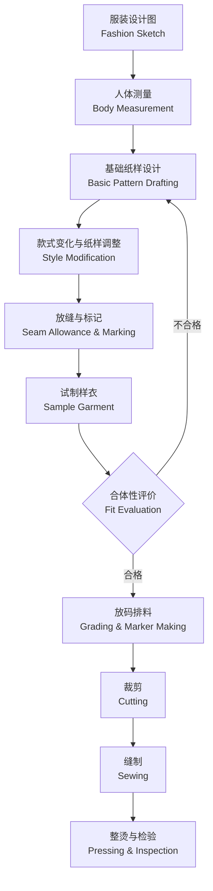

# 服装版型与工艺 (Pattern Making & Tailoring)

## 概述 (Overview)

服装版型与工艺 (Pattern Making and Tailoring) 是将设计图 (Fashion Sketch) 转化为可供裁剪和缝制的平面纸样 (Pattern) 并最终制作成衣的技术体系。它是连接服装设计 (Fashion Design) 与成衣制作 (Garment Manufacturing) 的核心桥梁，直接影响服装的合体性 (Fit)、舒适度 (Comfort) 和外观效果 (Aesthetic Appearance)。完整的版型与工艺流程包括：人体测量 → 基础纸样设计 → 款式变化 → 放缝 → 裁剪 → 缝制 → 整烫。

## 服装制作全流程框架

## 人体测量与体型分类 (Body Measurement & Figure Types)

### 关键测量部位

| 部位 | 测量方法 | 对应基准线 | 档差 (cm) |
|:---|:---|:---|:---:|
| 胸围 (Bust) | 经乳头点水平一周 | 胸围线 (BL) | 4–5 |
| 腰围 (Waist) | 腰部最细处水平一周 | 腰围线 (WL) | 3–4 |
| 臀围 (Hip) | 臀部最丰满处水平一周 | 臀围线 (HL) | 4–5 |
| 背长 (Back Length) | 第七颈椎至腰围线 | — | 1–1.5 |
| 肩宽 (Shoulder Width) | 左肩端点至右肩端点 | 肩宽线 | 1–1.5 |
| 袖长 (Sleeve Length) | 肩端点经肘至腕 | — | 1.5–2 |
| 衣长 (Garment Length) | 第七颈椎至所需长度 | — | 2–4 |

### 体型分类与修正策略

| 体型类型 | 特征 | 纸样修正方法 |
|:---|:---|:---|
| 标准体 | 胸腰差 18–22 cm，胸臀适中 | 原型直接套用 |
| 肥胖体 | 腹部突出，腰围大于臀围 | 前片加长、腹部省量加大 |
| 瘦削体 | 胸腰差 > 25 cm，骨骼感明显 | 减小围度松量 |
| 驼背体 | 背部脊柱后凸 | 后片加长、肩部结构调整 |
| 挺胸体 | 胸椎前屈 | 前片加长、前肩斜度减少 |
| 溜肩体 | 肩斜度 > 22° | 减小肩斜、增加垫肩厚度 |

## 版型体系与绘制方法 (Pattern Systems)

### 三大版型体系对比

| 体系 | 原理 | 代表地区 | 特点 | 适用品类 |
|:---|:---|:---|:---|:---|
| 日本新文化原型 | 立体裁剪+实验数据 | 日本 | 合体度高、省道转移灵活 | 女装、时装 |
| 中国比例法 | 胸围为基础的比例计算 | 中国 | 计算简便、经验性强 | 男装、制服 |
| 英国裁剪法 | 几何绘图+人体工学 | 英国 | 结构严谨、经典规范 | 高级定制、西装 |

### 各类裁剪方法

| 方法 | 工具 | 优点 | 缺点 | 适用场景 |
|:---|:---|:---|:---|:---|
| 平面裁剪 (Flat Pattern) | 纸、尺、曲线板 | 精确可复制，易放码 | 对结构想象力要求高 | 批量化生产 |
| 立体裁剪 (Draping) | 人台、胚布、珠针 | 直观、适合复杂造型 | 耗时长，复制困难 | 高级定制、创意设计 |
| 计算机辅助设计 (CAD) | 软件+数字化仪 | 高效、精确、易修改 | 设备投入高 | 工业制衣 |

## 服装结构设计原理 (Structural Design Principles)

### 省道处理 (Dart Manipulation)

省道 (Dart) 是将平面面料转化为立体形态的关键手段，通过折叠部分面料形成锥体或曲面。

**省道分类**：

| 类型 | 位置 | 功能 | 转移方向 |
|:---|:---|:---|:---|
| 肩省 (Shoulder Dart) | 肩线 | 塑造胸部隆起 | 可转向袖窿、领口 |
| 胸省 (Bust Dart) | 侧缝或腰线 | 女性胸部立体形态 | 可转移至任何方向 |
| 腰省 (Waist Dart) | 前后腰线 | 收腰体现人体曲线 | 前后片配合处理 |
| 臀省 (Hip Dart) | 后裙/裤腰 | 臀部翘起量 | 可转化为侧缝差 |

**省道转移规则**：省尖始终指向凸点（胸点 BP、臀点 HP），沿新省位剪开原型，闭合旧省道，新省自动张开相应角度。

### 分割线与造型 (Seam Lines & Silhouette)

| 分割线类型 | 结构功能 | 造型效果 | 经典应用 |
|:---|:---|:---|:---|
| 公主线 (Princess Seam) | 通过胸点和肩胛骨 | 修身、纵向拉长 | 连衣裙、大衣 |
| 刀背缝 (Panel Seam) | 胸省+腰省一体化 | 极致收腰 | 礼服、旗袍 |
| 侧缝 (Side Seam) | 连接前后片 | 基础分割 | 所有服装 |
| 育克 (Yoke) | 肩部横向分割 | 增加肩部平整度 | 衬衫、牛仔裤 |

### 褶皱处理 (Pleats & Gathers)

褶皱可增加服装的松量 (Ease) 和动态美感：

- **规律褶 (Pleats)**：百褶 (Knife Pleats)、工字褶 (Box Pleats)、对褶 (Inverted Pleats)
- **自然褶 (Gathers/Drapes)**：碎褶 (Shirring)、波浪褶 (Cascade Drape)、垂坠褶 (Cow)

### 领型与袖型结构 (Collar & Sleeve Structures)

**领型分类**：
- 立领 (Stand Collar)：领高 3–6 cm，旗袍领为典型
- 翻领 (Turn-down Collar)：领座高度 + 翻领宽度，衬衫领为典型
- 驳领 (Notch/Lapel Collar)：西装驳领，领嘴角度 70–90°
- 连身领 (One-piece Collar)：与前片连线裁出

**袖型分类**：
- 一片袖 (One-piece Sleeve)：结构简单，袖山高度 10–15 cm
- 两片袖 (Two-piece Sleeve)：大小袖片拼合，合体度佳
- 插肩袖 (Raglan Sleeve)：袖片延伸至领口，活动量大
- 连身袖 (Kimono Sleeve)：与衣身连裁，肩部无接缝

**袖山高与袖肥关系**：袖山越高，袖肥越小，合体度越高；袖山越低，袖肥越大，活动性越好。

袖山弧长计算公式：

$$
L_{cap} = \frac{\pi}{2} \times (H_{cap} + F_{cap})
$$

## 面料特性与工艺匹配 (Fabric & Process Matching)

| 面料类型 | 特性 | 裁剪注意 | 缝制工艺 | 推荐针号 |
|:---|:---|:---|:---|:---:|
| 棉布 (Cotton) | 稳定、易熨烫 | 直纱对齐 | 平缝 12–14 针/英寸 | 80/12 |
| 丝绸 (Silk) | 光滑、易滑脱 | 垫纸裁剪 | 平缝 14–16 针/英寸，细针 | 60/8 |
| 牛仔布 (Denim) | 厚实、缩水率高 | 预缩处理 | 加固缝线，16–18 针/英寸 | 100/16 |
| 针织物 (Knit) | 弹性大、易卷边 | 平铺裁剪 | 之字缝或绷缝，防拉伸 | 75/11 弹力针 |
| 毛料 (Wool) | 厚重、可塑性强 | 归拔处理 | 手缝衬里，11–13 针/英寸 | 80/12 |
| 皮革 (Leather) | 针孔不可逆 | 单层裁剪 | 专用压脚，减少拆缝 | 90/14 皮革针 |
| 蕾丝 (Lace) | 透明、脆弱 | 精细裁剪 | 隐形接缝，细针 | 60/8 |

## 工业化生产流程 (Industrial Production)

### 样板缩放 (Grading)

按尺码规格表将基础纸样缩放为全尺码系列：

$$
\Delta X_i = X_{i+1} - X_i
$$

其中 $\Delta X$ 为两点之间的档差量。各部位缩放值不同，胸围档差 4 cm，腰围 3–4 cm，臀围 4 cm。

### 排料 (Marker Making)

面料利用率优化：

$$
U = \frac{A_{pattern}}{A_{fabric}} \times 100\%
$$

目标面料利用率：一般服装 80–85%，高级定制 75–80%。

### 质量控制体系 (Quality Control)

| 检验阶段 | 检验内容 | 抽样标准 AQL |
|:---|:---|:---:|
| 来料检验 (IQC) | 面料疵点、色差、缩水率 | AQL 2.5 |
| 过程检验 (IPQC) | 缝份宽度、针距、对称度 | AQL 1.0 |
| 最终检验 (FQC) | 尺寸偏差、整烫效果、外观 | AQL 1.0–2.5 |

## 数字技术在制版中的应用 (Digital Technologies)

- **CAD/CAM 系统**：计算机辅助设计 (Gerber、Lectra、力克、博克)
- **3D 虚拟试衣**：CLO 3D、VStitcher、Marvelous Designer 实现虚拟样衣
- **自动裁剪系统**：激光裁剪、刀片裁剪，精度 ±0.1 mm
- **参数化制版**：基于人体 3D 扫描数据的个性化纸样自动生成
- **AI 辅助设计**：智能款式识别、自动放码

## 缝型与线迹工艺 (Seam Types & Stitch Techniques)

### 基础缝型分类

| 缝型 | 结构方式 | 用途 | 缝份宽度 (cm) |
|:---|:---|:---|:---:|
| 平缝 (Plain Seam) | 正面相对缝合后劈开或倒向一侧 | 通用拼接 | 1–1.5 |
| 来去缝 (French Seam) | 反面先缝再正面缝藏住毛边 | 薄料高级服装 | 0.5–1.2 |
| 包缝 (Overlock Seam) | 缝份被包裹在内部不外露 | 衬衫、女士上衣 | 0.6–1 |
| 平接缝 (Flat-felled Seam) | 一条缝份包裹另一条并压双线 | 牛仔裤、工装 | 1.2–1.5 |
| 拉链缝 (Lapped Seam) | 两片重叠缝合，外观可见线迹 | 装饰拼接 | 1–1.5 |
| 滚边缝 (Bound Seam) | 用斜裁布条包裹毛边 | 无衬里服装 | 0.5–0.8 |

### 线迹密度标准 (Stitch Density Standards)

| 面料类型 | 机缝 (针/英寸) | 手缝 (针/英寸) | 特殊要求 |
|:---|:---:|:---:|:---|
| 轻薄面料（丝绸、雪纺） | 14–16 | 10–12 | 使用 60/8 细针，张力适度 |
| 中厚面料（棉、亚麻） | 12–14 | 8–10 | 标准缝纫线 40/2 |
| 厚重面料（牛仔、毛呢） | 8–10 | 6–8 | 加固缝线 20/3，粗针 100/16 |
| 弹性面料（针织） | 12–14 | 8–10 | 之字缝或绷缝，拉伸率需测试 |

## 下摆与边缘处理工艺 (Hem & Edge Finishing)

### 下摆类型对比

| 类型 | 方法 | 适用面料 | 外观效果 |
|:---|:---|:---|:---|
| 卷边 (Rolled Hem) | 折两次后车缝或手缝 | 薄料、雪纺 | 精致、轻盈 |
| 折边 (Straight Hem) | 向上折 2–4 cm 后车缝 | 西裤、半裙 | 干净利落 |
| 暗缝边 (Blind Hem) | 暗缝针迹，正面几乎不可见 | 西装、长裙 | 高级感 |
| 拷边 (Overlock Hem) | 拷边机直接锁边 | 针织、休闲 | 弹性好、易制作 |
| 镰刀边 (Vicuña Hem) | 仅手工完成，不露线迹 | 顶级定制大衣 | 隐形、无痕 |
| 饰边 (Trim Binding) | 斜裁布条或蕾丝包边 | 礼服、童装 | 装饰性强 |

### 粘合衬工艺 (Interfacing Application)
粘合衬 (Fusible Interfacing) 用于增加服装特定部位的挺括度和稳定性。

| 部位 | 衬料类型 | 粘合温度 (°C) | 压力 (s) | 注意事项 |
|:---|:---|:---:|:---:|:---|
| 领子 | 有纺衬 | 150–160 | 10–15 | 避免高温过量渗胶 |
| 前门襟 | 无纺衬/有纺衬 | 150–160 | 10–12 | 距边缘 0.5 cm 不粘合 |
| 袖口 | 薄型有纺衬 | 140–150 | 8–10 | 冷压定型后再粘合 |
| 腰头 | 腰衬 (专用衬) | 160–170 | 15–20 | 弧形腰需预弯定型 |

## 可持续服装工艺 (Sustainable Garment Practices)

| 可持续策略 | 具体做法 | 环保效益 |
|:---|:---|:---|
| 零废料裁剪 (Zero-Waste Cutting) | 优化排料使面料利用率接近 100% | 减少面料浪费 15–30% |
| 使用环保辅料 | 可降解扣子、再生聚酯拉链、有机棉线 | 降低微塑料污染 |
| 可拆解设计 (Design for Disassembly) | 使用可拆卸结构而非熔合工艺 | 便于回收和循环利用 |
| 减少水洗工艺 | 激光洗代替传统石磨洗处理牛仔 | 节水 60–80%，减少化学排放 |
| 一次整烫技术 | 优化熨烫工序合并中间熨烫 | 降低能耗 30–50% |

## 参考资料 (References)

- 刘瑞璞《服装制板与裁剪》(Pattern Making and Cutting)
- 中屋典子《服装造型学理论篇》(Theory of Garment Modeling)
- 张文斌《服装结构设计》(Garment Structural Design)
- Armstrong H.J. 《Patternmaking for Fashion Design》
- Joseph-Armstrong H. 《Draping: Techniques and Creative Design》
- Aldrich W. 《Metric Pattern Cutting》

## 相关条目 (Related Entries)

- [[ArtHistory]]
- [[TextileDesign]]
- [[IndustrialDesign]]
