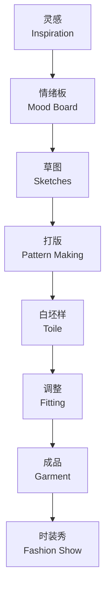
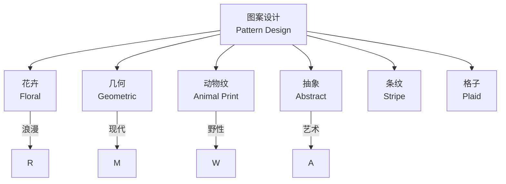

---
aliases:
  - 服装设计
  - Fashion Design
  - 时装设计
  - 服装艺术
tags:
  - design
  - fashion
  - garment
  - textile
  - apparel
---

# 服装设计

## 一、服装设计流程 (Fashion Design Process)

### 1.1 从灵感到成衣

| 阶段 | 核心活动 | 产出物 |
|------|----------|--------|
| 前期研究 (Research) | 趋势调研、灵感收集 | 情绪板 (Mood Board) |
| 设计草图 (Sketching) | 概念构思、款式绘制 | 设计手稿 |
| 打版 (Pattern Making) | 纸样制作、尺寸制定 | 工业纸样 |
| 样衣制作 (Sample Making) | 白坯布样、修改调整 | 样衣 (Toile) |
| 生产 (Production) | 排料、裁剪、缝制 | 成衣 |
| 展示 (Presentation) | 走秀、拍摄、陈列 | 秀场/画册 |

### 1.2 设计流程示意图

---

## 二、轮廓与结构 (Silhouette and Structure)

### 2.1 经典服装轮廓

服装轮廓是设计的第一视觉印象。1950年代 Dior 定义了字母轮廓系列：

| 轮廓类型 | 特征 | 代表时代 |
|----------|------|----------|
| A-Line (A 型) | 上窄下宽呈 A 形 | 1950s Dior |
| H-Line (H 型) | 直筒无收腰 | 1920s Flapper |
| X-Line (X 型) | 收腰放摆 | 维多利亚时期 |
| O-Line (O 型) | 茧型圆润 | 1960s Balenciaga |
| Y-Line (Y 型) | 宽肩窄下摆 | 1980s Power Suit |

### 2.2 结构设计原理

服装结构通过二维布料构建三维形态：

$$
Garment\ Volume = f(Dart, Seam, Gather, Pleat, Drape)
$$

| 结构手法 | 功能 | 视觉效果 |
|----------|------|----------|
| 省道 (Dart) | 平面转立体 | 贴合身体曲线 |
| 褶皱 (Pleat) | 增加余量 | 规律性纹理 |
| 抽褶 (Gather) | 缩短长度 | 蓬松感 |
| 垂坠 (Drape) | 自然垂落 | 流动感 |
| 分割线 (Seam Line) | 结构分割 | 视觉修饰 |

---

## 三、面料与材质 (Fabric and Textiles)

### 3.1 面料分类

| 类别 | 代表面料 | 特性 | 适合款式 |
|------|----------|------|----------|
| 天然纤维 | 棉 (Cotton)、麻 (Linen)、丝 (Silk)、羊毛 (Wool) | 透气、舒适 | 日常、高级定制 |
| 合成纤维 | 涤纶 (Polyester)、尼龙 (Nylon)、氨纶 (Spandex) | 耐用、弹性 | 运动、功能性服装 |
| 混纺 (Blend) | 涤棉混纺、毛混纺 | 综合优点 | 广泛 |

### 3.2 面料性能参数

| 参数 | 定义 | 影响 |
|------|------|------|
| 克重 (GSM) | 每平方米克数 | 厚度、垂感 |
| 纱支 (Count) | 纱线粗细 | 柔软度、耐用度 |
| 密度 (Thread Count) | 每英寸纱线数 | 光滑度、强度 |
| 弹性 (Stretch) | 可拉伸百分比 | 舒适度 |
| 悬垂性 (Drape) | 自然垂落系数 | 轮廓效果 |

---

## 四、色彩与图案 (Color and Pattern)

### 4.1 季节色彩趋势

时尚色彩通常遵循 Pantone 发布的季度趋势报告：

- **SS (Spring/Summer)**：明亮、轻盈、饱和度高
- **AW (Autumn/Winter)**：深沉、浓郁、饱和度高

### 4.2 图案设计

---

## 五、打版与工艺 (Pattern Making and Craft)

### 5.1 平面打版 vs 立体裁剪

| 方法 | 工具 | 优点 | 缺点 |
|------|------|------|------|
| 平面打版 (Flat Pattern) | 纸、尺、曲线板 | 精确、可复制 | 需要经验 |
| 立体裁剪 (Draping) | 人台、坯布、珠针 | 直观、创意自由 | 耗时、材料浪费 |

### 5.2 基础纸样部件

- **前片 (Front Bodice)**：服装正面主体
- **后片 (Back Bodice)**：服装背面主体
- **袖片 (Sleeve)**：一片袖/两片袖
- **领片 (Collar)**：立领/翻领/平领
- **裙片 (Skirt)**：直裙/A 字裙/褶皱裙

### 5.3 缝纫工艺

$$
Seam\ Strength = \frac{Stitch\ Density \times Thread\ Tension}{Fabric\ Thickness}
$$

| 缝型 | 用途 | 外观 |
|------|------|------|
| 平缝 (Plain Seam) | 基础拼接 | 简洁 |
| 包缝 (Overlock) | 防止散边 | 专业 |
| 来去缝 (French Seam) | 高档服装 | 内外整洁 |
| 明线 (Topstitch) | 装饰性加固 | 外露线条 |

---

## 六、时装插画 (Fashion Illustration)

### 6.1 九头身比例

时装插画采用夸张比例，通常为九头身 (9-Head Proportion)：

| 部位 | 比例位置 |
|------|----------|
| 头部 | 1头高 |
| 下巴到胸线 | 1头高 |
| 胸线到腰线 | 1头高 |
| 腰线到胯线 | 1头高 |
| 胯线到膝盖 | 2头高 |
| 膝盖到脚踝 | 2头高 |
| 脚踝到地面 | 1头高 |

### 6.2 插画风格

- **渲染风格 (Rendered)**：真实光影、面料质感表现
- **线条风格 (Line Art)**：简洁轮廓线、注重款式
- **拼贴风格 (Collage)**：结合面料实物、概念表达

---

## 七、可持续时尚 (Sustainable Fashion)

### 7.1 设计中的可持续策略

| 策略 | 方法 | 影响 |
|------|------|------|
| 零废弃打版 (Zero Waste) | 优化排料 | 减少面料浪费 |
| 循环设计 (Circular Design) | 可拆解、可回收 | 延长生命周期 |
| 慢时尚 (Slow Fashion) | 高质量、经典款 | 减少过度消费 |
| 植物染色 (Plant Dye) | 天然染材 | 环保无毒 |

---

## 八、品牌与市场 (Branding and Market)

服装设计不仅是创作，更是商业行为。设计师需要理解市场定位、目标客群和销售渠道。从 Haute Couture 到 Fast Fashion，每个层次都有不同的设计逻辑和商业模型。

---

> **时尚是穿在身上的建筑。** — 卡尔·拉格斐
