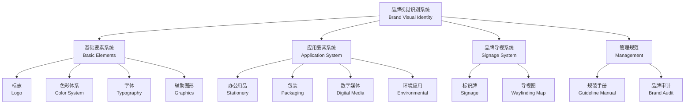

# 品牌视觉识别系统 (Brand Visual Identity System)

## 概述 (Overview)

品牌视觉识别系统 (Brand Visual Identity System, VI) 是品牌战略 (Brand Strategy) 的视觉化表达，将品牌的核心价值 (Core Values)、文化定位 (Cultural Positioning) 和差异化特征转化为统一的视觉语言。一个完整的视觉识别系统能够帮助品牌在市场中建立一致的形象认知，增强消费者的识别度 (Recognition) 和记忆度 (Recall)。视觉识别系统通常分为三个层次：基础要素系统 (Basic Elements)、应用要素系统 (Application System) 和品牌导视系统 (Signage System)。

## 品牌视觉识别体系框架

## 标志设计 (Logo Design)

标志 (Logo) 是品牌视觉识别系统的核心符号，是品牌最浓缩的视觉印记。优秀标志设计需满足以下原则：

| 原则 | 说明 | 评判标准 |
|:---|:---|:---|
| 识别性 (Distinctiveness) | 独特的视觉特征，易于辨认 | 对比测试辨识率 > 70% |
| 适应性 (Adaptability) | 适应不同媒介和尺寸 | 缩小至 1 cm 仍可识别 |
| 时间性 (Timelessness) | 超越短期潮流，保持长期有效 | 设计寿命 ≥ 10 年 |
| 文化性 (Cultural Relevance) | 考虑文化语境与受众认知 | 避免跨文化歧义 |
| 可延展性 (Scalability) | 单一标志衍生多种应用形态 | 适用于印刷、屏幕、刺绣 |

### 标志类型对比

| 类型 | 构成方式 | 优势 | 局限 | 代表品牌 |
|:---|:---|:---|:---|:---|
| 图形标志 (Symbol) | 抽象或具象图形 | 跨越语言障碍 | 认知成本高 | Apple, Nike |
| 文字标志 (Wordmark) | 品牌名称字体设计 | 品牌名称直接强化 | 国际拓展受限 | Coca-Cola, Google |
| 组合标志 (Combination) | 图形 + 文字组合 | 兼顾识别与传播 | 结构复杂 | Starbucks, Adidas |
| 徽章式 (Emblem) | 封闭式图形内含文字 | 正式、权威感 | 应用灵活性低 | Ford, Harley-Davidson |
| 动态标志 (Dynamic) | 可变化和互动的标志 | 数字时代适应性 | 规范维护复杂 | Google Doodle, MTV |

### 标志制图规范

标志的标准制图 (Construction Grid) 确保不同场景下标志比例的一致性。标志与周围元素的最小安全距离 (Clear Space) 通常为标志高度的 1/4–1/2。禁用规则包括：禁止拉伸变形、禁止改变颜色、禁止加阴影效果、禁止替换字体等。

## 色彩体系 (Color System)

品牌色彩是视觉识别中最具情感感染力、传播速度最快的要素。科学的品牌色彩体系需在不同色空间中给出色值规范。

| 色彩空间 | 适用场景 | 示例色值 |
|:---|:---|:---|
| CMYK | 印刷物料、包装 | C:100 M:0 Y:20 K:10 |
| RGB | 数字屏幕、网站 | R:0 G:153 B:204 |
| HEX | Web 开发 | #0099CC |
| PANTONE | 专色印刷、材质确认 | Pantone 307 C |

### 色彩心理学与应用

| 色系 | 心理联想 | 情感效应 | 适用行业 |
|:---|:---|:---|:---|
| 红色系 | 热情、活力、冲动 | 心率上升、食欲增加 | 食品、零售、娱乐 |
| 蓝色系 | 信任、专业、冷静 | 降低焦虑、增强安全感 | 科技、金融、医疗 |
| 绿色系 | 自然、健康、生长 | 放松、恢复平衡 | 环保、农业、有机 |
| 黄色系 | 乐观、温暖、注意 | 提升情绪、吸引视线 | 餐饮、儿童、交通 |
| 紫色系 | 高贵、神秘、创意 | 激发想象力、奢华感 | 奢侈品、美妆、灵性 |
| 橙色系 | 活力、友好、实惠 | 增加冲动消费 | 电商、快餐、运动 |
| 黑白色系 | 极简、高级、现代 | 突出内容、高级感 | 时尚、科技、奢华 |

**色彩对比度数学关系 (WCAG 标准)**：

$$
CR = \frac{L_1 + 0.05}{L_2 + 0.05}
$$

其中 $L_1$ 为较亮颜色的相对亮度，$L_2$ 为较暗颜色的相对亮度。AA 级标准要求普通文本对比度 ≥ 4.5:1，大文本 ≥ 3:1。

## 字体系统 (Typography)

品牌字体包括专用字体 (Custom Font) 和标准字体 (Standard Typeface)。

### 字体风格与品牌调性

| 字体分类 | 风格特点 | 品牌联想 | 经典字体案例 |
|:---|:---|:---|:---|
| 衬线体 (Serif) | 传统、权威、优雅 | 历史感、可信度 | Times New Roman, Garamond |
| 无衬线体 (Sans-serif) | 现代、简洁、亲和 | 科技感、功能性 | Helvetica, Futura |
| 手写体 (Script) | 个性、创意、温暖 | 手工感、人文气息 | Snell Roundhand |
| 装饰体 (Display) | 独特、戏剧、年轻 | 差异化、创意性 | 定制品牌字体 |

**排版层级 (Typographic Hierarchy)**：标题字号为正文的 2–3 倍，字重加粗；副标题比正文大 1.25–1.5 倍；正文 10–12 pt 适用于印刷，16–18 px 适用于网页。

## 辅助图形与版式规范 (Graphics & Layout)

### 辅助图形 (Supporting Graphics)
从标志或品牌核心元素中衍生的装饰性视觉元素，用于丰富品牌视觉表达：
- 几何图形排列组合：从标志提取基本几何形
- 标志局部放大提取：如 Nike Swoosh 的局部曲线
- 纹理与图案：与品牌故事相关的重复图案

### 版式网格系统 (Grid System)
- 栏数：印刷物 4–12 栏网格，网页 12 栏网格
- 基线网格：正文行高 18 pt 基线对齐
- 模块化比例：常用 1:1.618 黄金比例或 2:3 比例

## 应用要素系统 (Application System)

| 应用类别 | 具体载体 | 设计要点 |
|:---|:---|:---|
| 办公用品 (Stationery) | 名片 90×54 mm、信纸、信封、文件夹 | 标志位置一致，信息层级清晰 |
| 包装系统 (Packaging) | 产品包装、礼盒、手提袋、标签 | 货架识别，材质与印刷工艺匹配 |
| 环境导视 (Environmental) | 门店设计、办公空间、展览展台 | 空间尺度适应性，材质耐久性 |
| 数字媒体 (Digital Media) | 网站、APP、社交媒体封面、邮件签名 | 响应式适配，加载速度优化 |
| 广告宣传 (Advertising) | 海报 100×70 cm、广告、宣传册、视频 | 视觉冲击力，CTA 清晰 |
| 服饰礼仪 (Apparel & Gifts) | 员工制服、徽章、礼品 | 穿戴舒适性，刺绣效果验证 |

**名片设计规范**：
$$
W \times H = 90 \text{ mm} \times 54 \text{ mm}
$$

Logo 距边 > 5 mm，信息文字距边 > 3 mm，最小字号 ≥ 7 pt。

## 品牌视觉识别手册 (Brand Guidelines Manual)

品牌手册是规范品牌视觉应用的综合性技术文档，典型结构：

1. 品牌概述与核心理念 (Brand Overview & Core Values)
2. 标志规范：标准制图、色彩、最小尺寸 15 mm、禁用规则
3. 色彩体系：CMYK / RGB / HEX / 潘通色值，色彩使用比例主色 60% 辅助色 30%
4. 字体规范：标题/副标题/正文/标注的四级字体系统
5. 辅助图形与图案：使用场景与方向规定
6. 应用要素规范：各载体设计模板与尺寸标准
7. 摄影与插画风格：光影、色调、构图统一规定
8. 品牌语调与声音指南：文字语气、关键词列表

## 品牌视觉管理 (Visual Identity Management)

### 一致性管理 (Consistency Management)
- 统一视觉资产管理平台 (DAM, Digital Asset Management)
- 定期品牌审计 (Brand Audit)：每季度检查各渠道视觉表现
- 汇报线：品牌经理 → 设计团队 → 外部执行方

### 品牌更新与演化 (Brand Evolution)
- **渐进式 (Evolutionary)**：百事可乐 1905–2024 八代标志延续进化
- **革命式 (Revolutionary)**：Airbnb 2014 年重新设计的 Belo 标志
- **更新周期**：大改 10–15 年一次，微调 3–5 年一次

## 品牌触点矩阵与一致性审计 (Touchpoint Matrix & Consistency Audit)

### 品牌触点矩阵 (Brand Touchpoint Matrix)
品牌与其受众的所有交互节点构成了品牌体验 (Brand Experience) 的完整链路：

| 触点阶段 | 线上触点 | 线下触点 | 核心一致要素 |
|:---|:---|:---|:---|
| 认知 (Awareness) | 搜索引擎广告、社交媒体、信息流 | 户外广告、店面橱窗 | 标志、主色、字体 |
| 考虑 (Consideration) | 官网、产品页面、测评文章 | 实体店、展会 | 视觉层级、辅助图形 |
| 购买 (Purchase) | 电商页面、购物车、支付流程 | 收银台、包装 | 色彩体系、版式规范 |
| 使用 (Usage) | APP、说明书、客服界面 | 产品本身、用户手册 | 功能色、图标系统 |
| 忠诚 (Loyalty) | 会员系统、邮件营销、社群 | 礼品、门店活动 | 持续一致的视觉调性 |

### 品牌审计评分卡 (Brand Audit Scorecard)
品牌视觉一致性审计使用定量评分体系：

| 审计维度 | 评分标准 (1–5) | 权重 (%) | 加权得分 |
|:---|:---:|:---:|:---:|
| 标志使用规范 | 严重违规 = 1, 完全合规 = 5 | 25 | — |
| 色彩值准确性 | 色差 ΔE > 5 = 1, ΔE < 1 = 5 | 20 | — |
| 字体一贯性 | 替换字体 = 1, 严格遵循 = 5 | 20 | — |
| 应用整体协调性 | 视觉断裂 = 1, 完美统一 = 5 | 20 | — |
| 品牌手册执行度 | 严重偏离 = 1, 完全遵循 = 5 | 15 | — |

**色差公式 (CIE76)**：

$$
\Delta E = \sqrt{(\Delta L^*)^2 + (\Delta a^*)^2 + (\Delta b^*)^2}
$$

$\Delta E < 1$ 为人眼不可察觉的色差，$\Delta E < 3$ 为专业印刷可接受范围，$\Delta E > 5$ 为需要修正的明显色差。

## 数字品牌资产管理 (Digital Brand Asset Management)

品牌资产管理平台 (DAM, Digital Asset Management) 是确保品牌视觉一致性的基础设施：

| 功能模块 | 说明 | 代表工具 |
|:---|:---|:---|
| 资产存储与分类 | 按品牌、类别、格式、用途组织素材 | Bynder, Brandfolder |
| 版本控制与审批 | 资产修改记录、多人协作审批流 | Widen, Canto |
| 模板分发 | 预设模板供各地分公司直接使用 | Frontify, Canva Enterprise |
| 使用跟踪与权限 | 监控资产下载使用情况，分区管理 | Asset Bank, MediaValet |

## 品牌识别 ROI 评估 (ROI of Brand Identity)

品牌视觉识别系统的投入产出可从以下维度量化评估：

| 评估指标 | 测量方法 | 改善幅度参考 |
|:---|:---|:---:|
| 品牌识别度 (Brand Recognition) | 消费者对标志/色彩的辨识测试 | 提升 30–60% |
| 品牌一致性评分 | 品牌审计评分卡年度对比 | 提升 20–40% |
| 设计效率 (TAT) | 营销物料制作周转时长 | 缩短 40–60% |
| 跨渠道体验评分 | 客户满意度调查中视觉体验维度 | 提升 15–25% |

## 参考资源 (References)

- Wheeler A. 《Designing Brand Identity: An Essential Guide for the Whole Branding Team》
- 原研哉《设计中的设计》(Designing Design)
- Airey D. 《Logo Design Love》
- Neumeier M. 《The Brand Gap》
- 王受之《品牌识别设计》(Brand Identity Design)

## 相关条目 (Related Entries)

- [[ArtHistory]]
- [[GraphicDesignTheory]]
- [[Typography]]
- [[VisualCommunication]]
- [[InteractionDesign]]
