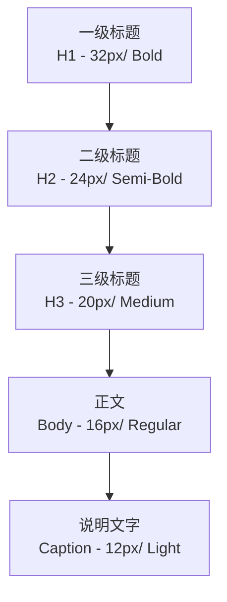
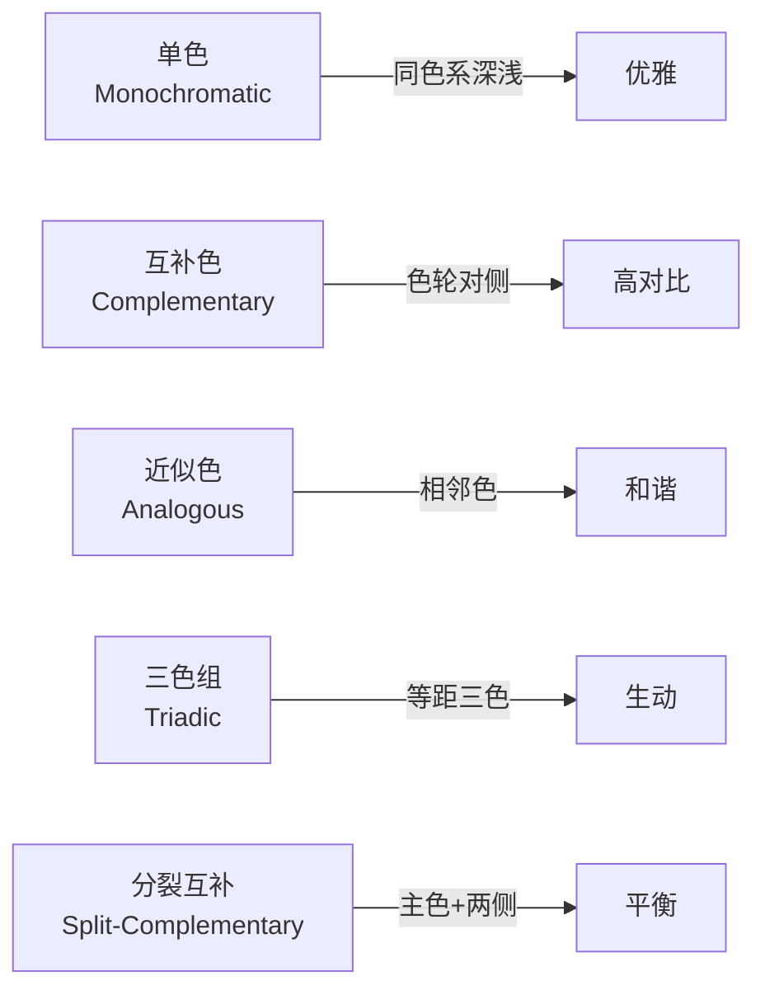

---
aliases:
  - 平面设计
  - Graphic Design
  - 视觉传达
  - 图形设计
tags:
  - design
  - graphic-design
  - typography
  - layout
  - branding
---

# 平面设计

## 一、字体排印 (Typography)

### 1.1 字体分类

字体是平面设计的核心元素。正确的字体选择决定设计的基础调性。

| 字体类别 | 特征 | 情感联想 | 适用场景 |
|----------|------|----------|----------|
| 衬线体 (Serif) | 笔画末端有装饰线 | 经典、正式、权威 | 书籍、报纸、品牌 |
| 无衬线体 (Sans-Serif) | 笔画末端无装饰线 | 现代、简洁、中立 | 网页、UI、指示牌 |
| 手写体 (Script) | 模拟手写笔迹 | 优雅、个性、随意 | 邀请函、标志 |
| 装饰体 (Display) | 高度风格化 | 独特、趣味、醒目 | 标题、海报 |
| 等宽体 (Monospace) | 每个字符等宽 | 技术、编程、机械 | 代码、表格 |

### 1.2 字体排印的参数体系

$$
Readability = \frac{X\text{-}Height \times Letter\ Spacing \times Line\ Height}{Stroke\ Contrast}
$$

| 参数 | 定义 | 推荐值 |
|------|------|--------|
| 字号 (Font Size) | 字符高度 | 正文 10-14pt |
| 行高 (Line Height) | 行间距 | 1.4x - 1.6x 字号 |
| 字距 (Tracking) | 整体字符间距 | 根据字体调整 |
| 字偶距 (Kerning) | 特定字符对间距 | Logo 需要手动调整 |
| 行长 (Measure) | 一行字符数 | 45-75 字符 |

### 1.3 字体层级 (Type Hierarchy)

---

## 二、版面设计 (Layout Design)

### 2.1 网格系统 (Grid System)

网格是版面设计的骨架，为内容提供结构和秩序。

| 网格类型 | 列数 | 用途 |
|----------|------|------|
| 单列网格 (Single Column) | 1 列 | 书籍、文章 |
| 多列网格 (Multi-Column) | 2-6 列 | 杂志、报纸 |
| 模块网格 (Modular Grid) | 行+列 | 信息图表、图册 |
| 基线网格 (Baseline Grid) | 行基准线 | 跨页文本对齐 |

### 2.2 版面设计原则

CRAP 原则是版面设计的核心方法论：

- **对比 (Contrast)**：通过大小、颜色、粗细制造视觉层次
- **重复 (Repetition)**：统一元素重复出现以建立一致性
- **对齐 (Alignment)**：每个元素都应有视觉连接
- **亲密性 (Proximity)**：相关元素放在一起形成组

### 2.3 视觉重量平衡

$$
Visual\ Balance = \sum_{i=1}^{n} (Size_i \times Density_i \times Color_i \times Position_i)
$$

| 平衡类型 | 方法 | 效果 |
|----------|------|------|
| 对称平衡 (Symmetry) | 镜像排列 | 正式、稳定 |
| 不对称平衡 (Asymmetry) | 重量等效分布 | 动态、现代 |
| 辐射平衡 (Radial) | 从中心向外发散 | 聚焦、图案感 |

---

## 三、色彩理论 (Color Theory)

### 3.1 色彩模型

| 模型 | 模式 | 适用场景 |
|------|------|----------|
| RGB | 加色混合 (红+绿+蓝) | 屏幕显示 |
| CMYK | 减色混合 (青+品+黄+黑) | 印刷品 |
| HSB/HSL | 色相+饱和度+亮度 | 设计调色 |
| Pantone | 专色系统 | 品牌色标准化 |

### 3.2 配色方案

### 3.3 色彩的可访问性

WCAG 2.1 标准要求文字与背景的对比度至少为：

- **AA 标准**：普通文字 4.5:1，大文字 3:1
- **AAA 标准**：普通文字 7:1，大文字 4.5:1

对比度计算公式：

$$
Contrast\ Ratio = \frac{L_1 + 0.05}{L_2 + 0.05}
$$

其中 $L_1$ 为较亮颜色的相对亮度，$L_2$ 为较暗颜色的相对亮度。

---

## 四、品牌设计 (Branding Design)

### 4.1 视觉识别系统 (Visual Identity System)

品牌视觉系统由以下层级构成：

| 层级 | 内容 | 交付物 |
|------|------|--------|
| 核心 (Core) | Logo、品牌色、标准字 | Logo 规范手册 |
| 应用 (Application) | 名片、信纸、包装 | 应用模板 |
| 环境 (Environmental) | 店面、指示牌 | 空间设计 |
| 数字 (Digital) | 网站、APP、社交媒体 | 数字资产 |

### 4.2 Logo 设计类型

| 类型 | 特点 | 示例 |
|------|------|------|
| 文字标 (Wordmark) | 品牌名字体设计 | Coca-Cola, Google |
| 图形标 (Symbol) | 抽象/具象图形 | Apple, Nike |
| 组合标 (Combination) | 文字+图形 | Adidas, Starbucks |
| 字母标 (Letterform) | 首字母设计 | IBM, HP |
| 徽章标 (Emblem) | 图文结合徽章 | Porsche, Starbucks |

---

## 五、设计原则 (Design Principles)

### 5.1 格式塔原理 (Gestalt Principles)

| 原理 | 说明 | 设计应用 |
|------|------|----------|
| 接近性 (Proximity) | 相近的元素被视为一组 | 信息分组 |
| 相似性 (Similarity) | 相似的元素被视为一组 | 统一风格 |
| 连续性 (Continuity) | 眼睛沿直线或曲线移动 | 引导视线 |
| 闭合性 (Closure) | 大脑补全不完整的形状 | 极简Logo |
| 图底关系 (Figure-Ground) | 前景与背景的区分 | 正负形设计 |

---

## 六、印刷工艺 (Printing Process)

### 6.1 印刷方式

| 方式 | 原理 | 适合 |
|------|------|------|
| 胶印 (Offset) | 橡皮布转印 | 大批量印刷 |
| 数码印刷 (Digital) | 直接喷墨/激光 | 小批量、可变数据 |
| 丝网印刷 (Screen) | 网版漏印 | 特殊材质、T恤 |
| 凸版印刷 (Letterpress) | 凸起印版压印 | 名片、邀请函 |
| 烫金/烫银 (Foil Stamping) | 热压金属箔 | 高端包装 |

### 6.2 印前检查清单

- [ ] 色彩模式: CMYK (印刷) / RGB (屏幕)
- [ ] 出血: 四周各 3mm Bleed
- [ ] 分辨率: 300dpi
- [ ] 字体: 转曲 (Outline) 或嵌入
- [ ] 叠印检查: 防止白色底框
- [ ] 裁切线: 标注完成尺寸

---

> **设计是形式与功能的统一。** 平面设计师既是艺术家，也是沟通者。
