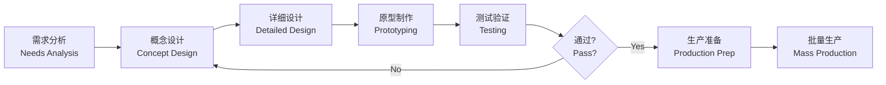

---
aliases:
  - Product Design and Manufacturing Engineering
  - 产品设计与制造工程
tags:
  - industrial-design
  - product-design
  - manufacturing
  - engineering
  - cad
---

# 产品设计与制造工程 (Product Design and Manufacturing Engineering)

## 一、概述 (Overview)

产品设计与制造工程涵盖从概念构思 (Ideation) 到批量生产 (Mass Production) 的全流程。涉及工业设计、机械工程、材料科学和人因工程等多学科交叉。核心目标是在功能、美学、成本和可制造性之间取得平衡。

## 二、设计流程 (Design Process)

## 三、概念设计 (Concept Design)

**创意方法 (Creativity Methods)**：

| 方法 | 描述 | 适用阶段 |
|------|------|----------|
| 头脑风暴 (Brainstorming) | 自由发散，不设限 | 初始创意 |
| SCAMPER | 替代、合并、改造等七种策略 | 改进设计 |
| 类比设计 (Analogy) | 从自然界或其他领域寻找灵感 | 突破性创新 |
| 功能分解 (Function Decomposition) | 将功能拆解为子功能 | 复杂系统 |

## 四、计算机辅助设计 (CAD)

**主流 CAD 软件 (Major CAD Software)**：

| 软件 | 开发商 | 主要应用 |
|------|--------|----------|
| SolidWorks | Dassault | 机械设计、钣金 |
| CATIA | Dassault | 航空航天、汽车 |
| Fusion 360 | Autodesk | 创成式设计、CAM |
| Rhino 3D | McNeel | 曲面建模、工业设计 |
| AutoCAD | Autodesk | 二维工程图 |

**CAD 工作流 (CAD Workflow)**：

1. 草图绘制 (Sketching) — 2D 轮廓
2. 特征建模 (Feature Modeling) — 拉伸、旋转、扫描
3. 装配设计 (Assembly Design) — 约束与配合
4. 工程图输出 (Drawing) — 尺寸标注、公差

## 五、原型制作 (Prototyping)

**原型类型 (Prototype Types)**：

- 快速原型 (Rapid Prototyping)：3D 打印 (FDM, SLA, SLS)
- 功能原型 (Functional Prototype)：CNC 加工、钣金成型
- 外观原型 (Appearance Prototype)：硅胶翻模、喷漆处理

**3D 打印对比 (3D Printing Comparison)**：

| 工艺 | 材料 | 精度 | 成本 |
|------|------|------|------|
| FDM | PLA, ABS, PETG | ±0.2mm | 低 |
| SLA | 光敏树脂 | ±0.05mm | 中 |
| SLS | 尼龙粉末 | ±0.1mm | 高 |
| MJF | 尼龙 | ±0.08mm | 高 |

## 六、材料选择 (Material Selection)

**工程材料分类 (Engineering Materials)**：

$$
\text{Materials} =
\begin{cases}
\text{Metals: Steel, Aluminum, Titanium} \\
\text{Polymers: ABS, PC, PP, Nylon} \\
\text{Ceramics: Alumina, Zirconia} \\
\text{Composites: Carbon Fiber, Fiberglass}
\end{cases}
$$

**选材准则 (Selection Criteria)**：

- 力学性能 (Strength, Stiffness, Toughness)
- 加工性能 (Machinability, Moldability)
- 成本 (Raw Material + Processing)
- 环保 (Recyclability, Carbon Footprint)

## 七、制造工艺 (Manufacturing Processes)

| 工艺 | 特点 | 适用批量 |
|------|------|----------|
| 注塑成型 (Injection Molding) | 高效率、高精度 | 大批量 |
| 压铸 (Die Casting) | 金属件、复杂形状 | 中大批量 |
| CNC 加工 (CNC Machining) | 高精度、柔性强 | 小批量 |
| 冲压 (Stamping) | 薄板成型 | 大批量 |
| 增材制造 (Additive Manufacturing) | 无模具、设计自由 | 单件/小批 |

## 八、DFM (面向制造的设计)

**DFM 原则 (DFM Principles)**：

1. 简化零件数量 (Reduce part count)
2. 避免尖锐内角 (Avoid sharp internal corners)
3. 统一壁厚 (Uniform wall thickness)
4. 合理的拔模斜度 (Draft angle)
5. 避免悬空结构 (Avoid overhangs)

## 九、质量与检测 (Quality and Inspection)

- 尺寸检测 (Dimensional Inspection)：CMM, 游标卡尺, 投影仪
- 表面粗糙度 (Surface Roughness)：Ra, Rz 参数
- 功能测试 (Functional Testing)：寿命测试、环境测试
- 统计过程控制 (SPC)：Control Chart, Cp/Cpk
