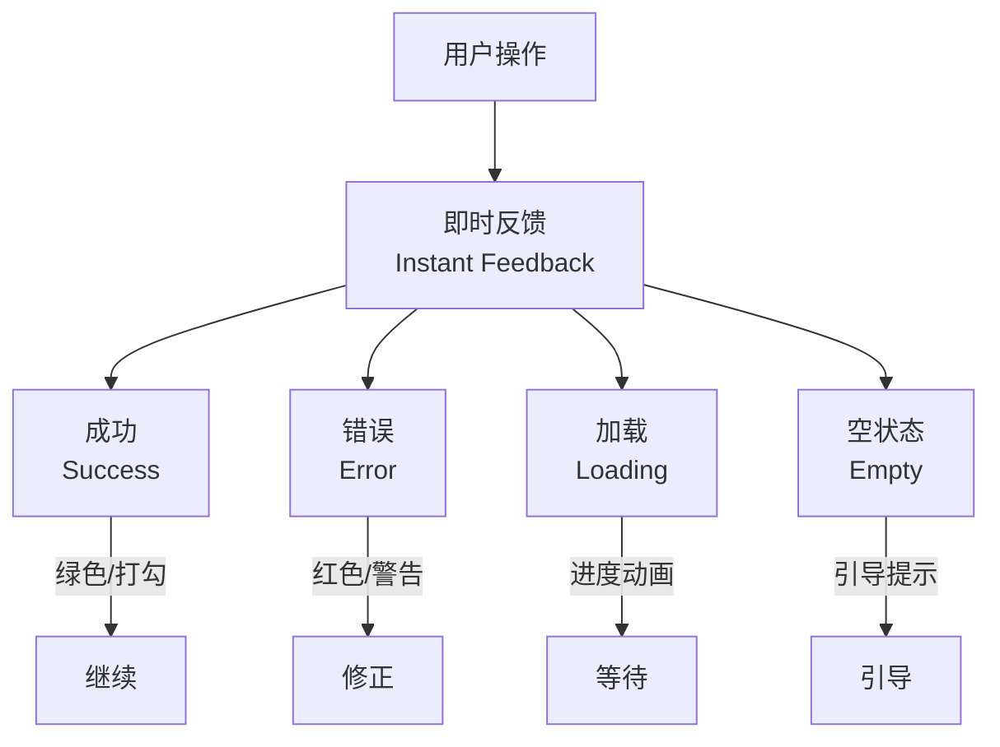

---
aliases:
  - 交互设计
  - Interaction Design
  - UX 设计
  - 用户体验
tags:
  - design
  - interaction-design
  - ux
  - ui
  - user-experience
---

# 交互设计

## 一、用户体验设计流程 (UX Process)

### 1.1 双钻模型 (Double Diamond)

英国设计委员会提出的双钻模型是 UX 设计的核心框架：


| 阶段 | 核心活动 | 产出物 |
|------|----------|--------|
| 发现 (Discover) | 用户研究、竞品分析 | 研究报告 |
| 定义 (Define) | 需求梳理、问题定义 | 用户画像、问题陈述 |
| 开发 (Develop) | 头脑风暴、原型设计 | 线框图、可交互原型 |
| 交付 (Deliver) | 用户测试、迭代优化 | 高保真设计、开发规范 |

### 1.2 用户为中心的设计 (UCD)

设计应始终围绕用户需求展开：

$$
Usability = \frac{Effectiveness \times Efficiency}{Cognitive Load}
$$

---

## 二、用户流程 (User Flows)

### 2.1 流程图的构建

用户流程图描述了用户在系统中完成任务的一系列步骤。

| 元素 | 符号 | 含义 |
|------|------|------|
| 起点/终点 | 圆角矩形 | 用户进入/离开 |
| 操作步骤 | 矩形 | 用户执行操作 |
| 决策点 | 菱形 | 是/否分支 |
| 页面 | 大圆角矩形 | 屏幕视图 |
| 连接线 | 箭头 | 流程方向 |

### 2.2 核心任务流程示例

```
用户注册流程:
[首页] → [点击注册] → [填写表单] → {验证邮箱} → [完成]
                                   ↓ 失败
                                [重试]
```

### 2.3 流程图的最佳实践

- [ ] 每个流程只有一个入口和一个出口
- [ ] 决策点只有两个分支 (是/否)
- [ ] 避免超过 7 个步骤 (Miller's Law)
- [ ] 标注异常流程 (Error State)
- [ ] 标注加载状态 (Loading State)

---

## 三、线框图 (Wireframing)

### 3.1 保真度层级

| 层级 | 详细程度 | 工具 | 用途 |
|------|----------|------|------|
| 低保真 (Low-Fi) | 灰度、方框、占位符 | 纸笔、Balsamiq | 快速验证概念 |
| 中保真 (Mid-Fi) | 灰度、真实布局、注释 | Figma、Sketch | 结构讨论 |
| 高保真 (Hi-Fi) | 真实色彩、图标、内容 | Figma、Adobe XD | 用户测试、开发交付 |

### 3.2 线框图标注规范

每个线框图应包含：

```
屏幕标题: [页面名称]
版本: v1.2
日期: 2024-01-15
状态: [草稿/评审中/已定稿]

标注区域:
① 导航栏 — 固定高度 64px
② 搜索框 — 自动聚焦，下拉建议
③ 内容区域 — 瀑布流加载
④ 底部导航 — 4个图标 Tab
```

---

## 四、设计模式 (Design Patterns)

### 4.1 导航模式

| 模式 | 适用场景 | 优点 | 缺点 |
|------|----------|------|------|
| 底部导航 (Tab Bar) | 3-5个核心页面 | 拇指可达 | 数量受限 |
| 侧边栏 (Drawer) | 大量功能入口 | 内容聚焦 | 发现性差 |
| 顶部标签 (Top Tabs) | 内容分类 | 视觉直接 | 占用垂直空间 |
| 卡片导航 (Card) | 内容聚合 | 灵活布局 | 滚动深度 |

### 4.2 数据输入模式

- **渐进披露 (Progressive Disclosure)**：分步展示表单
- **即时验证 (Inline Validation)**：实时反馈输入正确性
- **自动补全 (Autocomplete)**：减少打字量
- **默认值 (Defaults)**：智能预填

### 4.3 反馈与状态



---

## 五、微交互 (Micro-Interactions)

### 5.1 微交互的四要素

根据 Dan Saffer 的理论，每个微交互包含：

1. **触发器 (Trigger)**：用户或系统发起的动作
2. **规则 (Rules)**：定义如何进行
3. **反馈 (Feedback)**：告知用户发生了什么
4. **循环与模式 (Loops & Modes)**：持续性行为

### 5.2 常见微交互示例

| 交互 | 触发 | 规则 | 反馈 |
|------|------|------|------|
| 点赞 | 点击按钮 | 数值+1，颜色变化 | 动画 + 数值更新 |
| 下拉刷新 | 手指下拉 | 超过阈值触发加载 | 旋转图标 + 加载 |
| 开关切换 | 滑块滑动 | 状态切换 | 颜色变化 + 弹性动画 |

### 5.3 动画曲线与缓动函数

动画的"感觉"很大程度上取决于缓动曲线 (Easing Curve)：

| 曲线类型 | 公式 | 感觉 |
|----------|------|------|
| 线性 (Linear) | $f(t) = t$ | 机械、生硬 |
| 缓入 (Ease-In) | $f(t) = t^2$ | 加速启动 |
| 缓出 (Ease-Out) | $f(t) = 1-(1-t)^2$ | 自然停止 |
| 缓入缓出 (Ease-In-Out) | $f(t) = t^2(3-2t)$ | 平滑完整 |

---

## 六、可用性原则 (Usability Heuristics)

### 6.1 Nielsen 十大可用性原则

| 编号 | 原则 | 说明 |
|------|------|------|
| 1 | 系统状态可见性 (Visibility) | 用户随时知道当前状态 |
| 2 | 系统与现实匹配 (Match) | 使用用户熟悉的语言 |
| 3 | 用户控制与自由 (Control) | 支持撤销/重做 |
| 4 | 一致性与标准 (Consistency) | 相同操作相同效果 |
| 5 | 错误预防 (Error Prevention) | 比好错误提示更好 |
| 6 | 识别而非回忆 (Recognition) | 减少记忆负担 |
| 7 | 灵活与效率 (Flexibility) | 快捷键和定制化 |
| 8 | 美学与极简 (Aesthetic) | 不相关信息减到最少 |
| 9 | 帮助用户识别错误 (Help) | 明确错误原因和解决方案 |
| 10 | 帮助文档 (Documentation) | 必要时的帮助 |

---

## 七、设计系统 (Design System)

### 7.1 设计系统的层级

1. **设计令牌 (Design Tokens)**：颜色、间距、字体等原子值
2. **基础组件 (Base Components)**：按钮、输入框、卡片
3. **复合组件 (Composite Components)**：表单、导航栏、模态框
4. **模板 (Templates)**：页面布局骨架
5. **页面 (Pages)**：最终的屏幕

---

> **好的设计是尽可能少的设计。** — Dieter Rams
