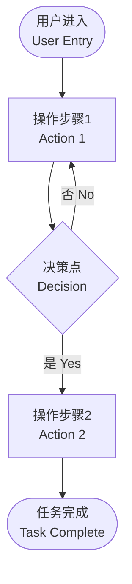

---
aliases:
  - 用户研究与交互原型
  - User Research & Prototyping
  - 用户研究
  - 原型设计
tags:
  - Design
  - InteractionDesign
  - UserResearch
  - Prototyping
---

# 用户研究与交互原型 (User Research & Interactive Prototyping)

## 概述

用户研究（User Research）和交互原型（Interactive Prototyping）是用户体验（User Experience, UX）设计的核心环节。用户研究帮助设计师理解用户需求和行为，而交互原型则用于快速验证设计概念并迭代优化（Iterative Optimization）。

## 双钻模型

## 核心概念表

| 概念 | 英文 | 定义 | 方法/工具 |
|------|------|------|---------|
| 用户画像 | Persona | 基于数据的虚拟用户代表 | 访谈、问卷聚类 |
| 用户旅程图 | User Journey Map | 用户使用产品的全程体验可视化 | 亲和图、同理心图 |
| 低保真原型 | Low-Fidelity Prototype | 灰度线框图快速验证概念 | 纸笔、Balsamiq |
| 高保真原型 | High-Fidelity Prototype | 接近最终产品的可交互模拟 | Figma、Principle |
| 可用性测试 | Usability Testing | 评估产品易用性的系统方法 | 出声思考法、A/B 测试 |
| 启发式评估 | Heuristic Evaluation | 专家根据原则评估界面 | 尼克尔森十大原则 |

## 用户研究方法

### 定性研究方法

定性研究（Qualitative Research）回答"为什么"和"如何"的问题，通过深入理解少量用户的行为和动机来获取深层洞察：

**用户访谈（User Interview）**：一对一的深度谈话，包括结构化（Structured）、半结构化（Semi-Structured）和非结构化（Unstructured）三种形式。半结构化访谈因其灵活性和可控性最为常用。核心技巧包括主动倾听（Active Listening）、追问（Probing）、沉默等待（Silence）和避免引导性问题。

**焦点小组（Focus Group）**：由主持人引导6~10名参与者就特定话题展开讨论。群体互动可激发新想法，但需要注意从众效应（Groupthink）。

**现场观察（Field Observation / Contextual Inquiry）**：在用户的实际使用环境中观察行为，获取最真实的使用情境数据。民族志方法（Ethnography）借鉴人类学研究方法进行沉浸式田野调查。

### 定量研究方法

定量研究（Quantitative Research）回答"多少"和"频率"的问题：

**问卷调查（Survey / Questionnaire）**：大规模收集用户态度、偏好和人口统计信息。设计要点包括问题表述清晰无歧义、避免引导性问题和双重问题（Double-Barreled Question）、合理选择量表（Likert Scale）。

**日志分析（Log Analysis）**：通过后台数据（点击流 Clickstream、停留时间 Dwell Time、转化率 Conversion Rate）揭示用户实际行为模式。

### 研究方法对比表

| 方法 | 类型 | 样本量 | 优势 | 局限 |
|------|------|--------|------|------|
| 用户访谈 | 定性 | 小（5~15人） | 深度洞察、丰富的语境 | 不能泛化到全体用户 |
| 焦点小组 | 定性 | 中（6~10人/组） | 互动启发、群体视角 | 从众效应、主持偏差 |
| 问卷调查 | 定量 | 大（100~1000+人） | 可统计、可泛化 | 表面化、回收率低 |
| 现场观察 | 定性 | 小 | 真实情境、行为数据 | 耗时、观察者效应 |
| A/B 测试 | 定量 | 大 | 因果推断、数据驱动 | 仅适用于特定变量 |
| 日记研究 | 混合 | 中 | 纵向数据、日常生活 | 参与者负担大、流失率 |

## 数据分析与洞察提炼

### 亲和图法

亲和图（Affinity Diagram）将观察笔记、用户语录等数据自下而上归类，发现主题模式：

$$ \text{Raw Data} \rightarrow \text{分组归类} \rightarrow \text{主题提炼} \rightarrow \text{设计洞察} $$

### 用户旅程图

用户旅程图（User Journey Map）可视化用户在使用产品全过程中的行为、触点（Touchpoint）、情绪曲线（Emotional Journey）和痛点（Pain Point）。典型结构包括阶段（Phase）、行为（Action）、想法（Thinking）、情绪（Emotion）和机会点（Opportunity）。

### 人物模型

人物模型（Persona）是基于研究数据创建的虚拟用户代表，包含：

- 人口统计特征（Demographics）：年龄、职业、地域
- 目标与动机（Goals & Motivations）：用户的核心诉求
- 行为模式（Behavior Patterns）：典型的使用习惯
- 痛点（Pain Points）：使用中的困难和不便

## 交互原型设计

### 保真度层级

原型设计（Prototyping）根据详细程度分为三个保真度层级：

| 层级 | 详细程度 | 常用工具 | 用途 | 迭代速度 |
|------|---------|---------|------|---------|
| 低保真 | 灰度线框、方框占位符 | 纸笔、Balsamiq | 快速验证概念和布局 | 极快 |
| 中保真 | 灰度版真实布局、注释 | Figma、Sketch | 结构讨论和流程确认 | 快 |
| 高保真 | 真实色彩、图标、交互动效 | Figma、Principle、Axure | 用户测试和开发交付 | 慢 |

### 原型中的交互流程

线框图（Wireframe）标注规范应包含屏幕标题、版本号、日期和交互说明。用户流程图（User Flow Diagram）描述用户完成任务的步骤序列：

### 微交互设计

微交互（Micro-Interaction）是产品中完成单一任务的小交互，包括四要素：

1. **触发器**（Trigger）：用户操作或系统状态触发
2. **规则**（Rules）：定义交互的逻辑和流程
3. **反馈**（Feedback）：告知用户当前状态
4. **循环与模式**（Loops & Modes）：长时间运行的交互模式

| 微交互 | 触发 | 规则 | 反馈 |
|-------|------|------|------|
| 点赞 | 点击按钮 | 数值+1，颜色变化 | 弹性动画 + 数字更新 |
| 下拉刷新 | 手指下拉 | 超过阈值触发加载 | 旋转图标 + 震动 |
| 开关切换 | 滑动操作 | 状态取反 | 滑块动画 + 背景色变化 |

### 动画与缓动函数

交互原型的动效质量取决于缓动函数（Easing Function）：

$$ \text{Linear: } f(t) = t $$
$$ \text{Ease-In: } f(t) = t^2 $$
$$ \text{Ease-Out: } f(t) = 1 - (1 - t)^2 $$
$$ \text{Ease-In-Out: } f(t) = t^2(3 - 2t) $$

## 可用性测试

### 测试方法

可用性测试（Usability Testing）评估产品的易用程度：

- **实验室测试**（Lab Testing）：在专门环境邀请用户执行任务，记录任务完成率、错误率和满意度
- **远程测试**（Remote Testing）：通过录屏软件进行，分有主持人和无主持人两种
- **出声思考法**（Think-Aloud Protocol）：用户在操作中说出想法和困惑

### 测试方案设计

1. 确定测试目标和假设
2. 招募代表性用户（通常5~8人可发现80%以上的可用性问题）
3. 设计测试任务（真实使用场景，明确的起点和终点）
4. 预设定量指标（任务完成率、时间、错误率、SUS 评分）
5. 预测试验证方案
6. 正式测试并记录数据
7. 撰写可用性报告（研究方法、发现、严重性评级和改进建议）

## 尼尔森可用性原则

1. 系统状态可见性（Visibility of System Status）
2. 系统与现实世界匹配（Match Between System and the Real World）
3. 用户控制和自由（User Control and Freedom）
4. 一致性和标准（Consistency and Standards）
5. 错误预防（Error Prevention）
6. 识别而非回忆（Recognition Rather Than Recall）
7. 灵活性和效率（Flexibility and Efficiency of Use）
8. 简洁美观（Aesthetic and Minimalist Design）
9. 帮助用户识别错误（Help Users Recognize, Diagnose, and Recover from Errors）
10. 帮助文档（Help and Documentation）

## 伦理规范

用户研究必须遵守伦理规范：知情同意（Informed Consent）、隐私保护（Privacy Protection）、避免伤害（Do No Harm）、诚实透明（Honesty）以及数据的负责任使用。

## 原型工具对比

| 工具 | 适用阶段 | 平台 | 协作能力 | 学习曲线 | 价格 |
|------|---------|------|---------|---------|------|
| Figma | 中保真-高保真 | Web | 实时多人协作 | 中等 | 免费/付费 |
| Sketch | 中保真-高保真 | macOS | 插件生态 | 中等 | 付费 |
| Axure RP | 低保真-高保真 | Win/Mac | 逻辑交互 | 较陡 | 付费 |
| Balsamiq | 低保真 | Web/Win/Mac | 快速草稿 | 平缓 | 付费 |
| Adobe XD | 中保真-高保真 | Win/Mac | 集成 Adobe | 中等 | 免费/付费 |
| Principle | 高保真动效 | macOS | 动效设计 | 中等 | 付费 |

## 交互设计原则

### 格式塔原理

格式塔心理学（Gestalt Psychology）在交互设计中的应用原则：

- **接近性**（Proximity）：相邻的元素被视为一组
- **相似性**（Similarity）：外观相似的元素被视为一组
- **闭合性**（Closure）：大脑自动补全不完整的图形
- **连续性**（Continuity）：沿直线或曲线排列的元素被视为一组
- **图底关系**（Figure-Ground）：视觉元素与背景的区分

### 认知负荷理论

认知负荷（Cognitive Load）分为三种类型：

$$ \text{总认知负荷} = \text{内在负荷} + \text{外在负荷} + \text{相关负荷} $$

- **内在负荷**（Intrinsic）：任务本身的复杂度
- **外在负荷**（Extraneous）：信息呈现方式带来的额外负担
- **相关负荷**（Germane）：有助于构建心智模型的积极负荷

交互设计的目标是降低外在负荷，优化内在负荷，增加相关负荷。米勒定律（Miller's Law）指出人类工作记忆容量约为7±2个组块（Chunk）。

## 参考资源

1. 胡飞. *用户研究方法与应用*. 中国建筑工业出版社.
2. Norman, D. *The Design of Everyday Things*. Basic Books.
3. Krug, S. *Don't Make Me Think*. New Riders.
4. 董建明. *可用性测试方法*. 清华大学出版社.
5. Cooper, A. *About Face: The Essentials of Interaction Design*. Wiley.

## 相关条目

- [[06_ArtsAndCreativity/Design/InteractionDesign/交互设计]]
- [[06_ArtsAndCreativity/Design/GraphicDesign/INDEX|GraphicDesign]]
- [[HumanComputerInteraction]]
- [[06_ArtsAndCreativity/Design/IndustrialDesign/INDEX|IndustrialDesign]]
