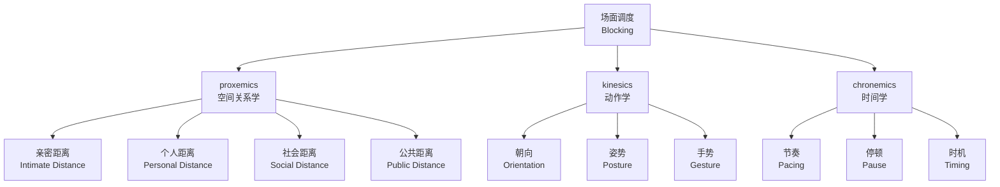
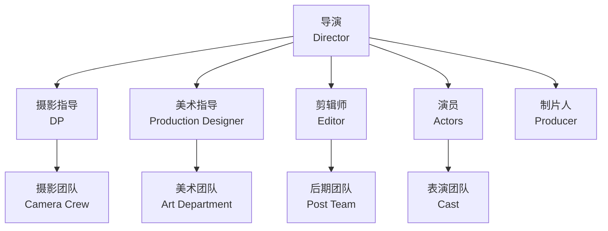

---
aliases:
  - 导演艺术
  - Directing
  - 导演
  - Film Directing
  - Stage Directing
tags:
  - directing
  - film
  - theater
  - leadership
  - visual-arts
---

# 导演艺术 (Directing)

## 概述 (Overview)

导演（Director）是戏剧与影视作品的**总作者**（Auteur），负责将文本转化为舞台或银幕上的综合艺术。导演艺术（Directing）不仅关乎技术决策，更关乎**美学 vision** 的实现与**创作团队**的协调。

导演的核心能力可以用以下公式概括：

$$\text{Directing} = \text{Vision} \times \text{Communication} \times \text{Decision-Making}$$

导演需要在艺术追求与生产限制之间找到平衡，在文本分析与技术实现之间建立桥梁。

### 导演的角色演变 (Evolution of the Director's Role)

| 时期 (Period) | 导演角色 (Role) | 特征 (Characteristics) |

| :-- | :-- | :-- |

| 19世纪末 | 剧场经理 (Stage Manager) | 协调技术元素 |

| 20世纪初 | 作者导演 (Auteur Director) | 个人美学 vision |

| 古典好莱坞 | 工厂导演 (Factory Director) | 制片厂制度下的执行者 |

| 欧洲艺术电影 | 作者 (Auteur) | 个人表达优先 |

| 当代 | 创意总监 (Creative Director) | 跨媒体、团队领导 |

## 导演视野 (Directorial Vision)

### 从文本到概念 (From Text to Concept)

导演工作的第一步是**文本解读**（Textual Analysis），从中提炼出导演概念（Directorial Concept）：

**分析维度：**

1. **主题分析**（Thematic Analysis）：作品的核心议题是什么？
2. **结构分析**（Structural Analysis）：叙事如何组织？
3. **角色分析**（Character Analysis）：人物的动机与转变？
4. **风格分析**（Stylistic Analysis）：文本的语言特征？

**概念发展（Concept Development）：**

导演需要回答三个核心问题：

- **这是什么故事？**（What is the story?）
- **为什么现在讲述？**（Why tell it now?）
- **如何讲述？**（How to tell it?）

### 导演声明 (Director's Statement)

导演声明是将 vision 转化为可沟通文本的工具：

```
这部作品探讨的是 [主题]。

我选择以 [风格/方法] 来讲述这个故事，

因为 [理由]。

我希望观众在离开时感受到 [情感/思考]。
```

## 场面调度 (Blocking)

### 舞台/镜头调度 (Staging and Blocking)

场面调度（Blocking）是导演安排演员在空间中的位置与运动的艺术。它同时服务于叙事、美学与情感表达。

**调度原则：**

| 原则 (Principle) | 说明 (Description) | 效果 (Effect) |

| :-- | :-- | :-- |

| 焦点引导 (Focus) | 观众视线被引导至关键元素 | 强调、悬念 |

| 权力关系 (Power Dynamics) | 高低、前后、中心/边缘 | 社会地位、情感距离 |

| 运动方向 (Movement Direction) | 朝向/远离镜头、交叉/平行 | 接近、疏离、冲突 |

| 空间层次 (Spatial Layers) | 前景、中景、背景的使用 | 景深、信息密度 |

### 场面调度的符号学 (Semiotics of Blocking)

场面调度是一种**空间语言**（Spatial Language），其符号系统包括：



## 与演员合作 (Working with Actors)

### 导演与演员的关系 (Director-Actor Relationship)

导演与演员的关系是创作过程中最微妙、最重要的关系之一。不同类型的导演采取不同策略：

**权威型导演（Authoritarian Director）：**

- 明确指示每个细节
- 演员作为执行工具
- 代表：希区柯克、库布里克

**合作型导演（Collaborative Director）：**

- 与演员共同探索角色
- 鼓励即兴与贡献
- 代表：卡萨维茨、迈克·李

**启发型导演（Inspirational Director）：**

- 通过意象与隐喻启发
- 给予演员创造空间
- 代表：伯格曼、塔可夫斯基

### 排练方法论 (Rehearsal Methodology)

**排练阶段：**

| 阶段 (Stage) | 重点 (Focus) | 方法 (Methods) |

| :-- | :-- | :-- |

| 文本工作 (Text Work) | 理解台词 | 圆桌阅读、文本分析 |

| 角色探索 (Character Exploration) | 构建角色内在 | 情感记忆、即兴练习 |

| 技术排练 (Technical Rehearsal) | 空间与动作 | 标记走位、道具配合 |

| 合成排练 (Dress Rehearsal) | 完整呈现 | 全妆、全服装、全技术 |

**导演的排练语言：**

- **行为动词**（Action Verbs）："诱惑"而非"爱慕"，"威胁"而非"生气"
- **意象引导**（Image Guidance）："想象你是被困的动物"
- **场景目标**（Scene Objective）："在这一场中，你想要得到什么？"

## 制作设计 (Production Design)

### 视觉世界的构建 (Building the Visual World)

制作设计（Production Design）是导演与美术指导（Production Designer）合作构建影片视觉世界的过程。

**设计要素：**

| 要素 (Element) | 功能 (Function) | 导演决策 (Director's Decision) |

| :-- | :-- | :-- |

| 布景 (Set) | 空间环境 | 写实 vs. 风格化 |

| 道具 (Props) | 叙事细节 | 象征意义 |

| 服装 (Costume) | 角色身份 | 时代感、阶级、性格 |

| 色彩方案 (Color Palette) | 情感氛围 | 整体色调 |

| 灯光设计 (Lighting Design) | 视觉风格 | 明暗对比、色温 |

### 风格化设计 vs. 写实设计 (Stylized vs. Realistic Design)

导演需要在风格化与写实之间做出选择：

$$\text{Design Choice} = f(\text{Genre}, \text{Theme}, \text{Budget}, \text{Director's Aesthetic})$$

- **写实设计**（Realistic）：追求可信的物理世界
- **风格化设计**（Stylized）：强调形式美感与象征意义
- **表现主义设计**（Expressionistic）：通过变形表达心理状态

## 导演的技术工具 (Director's Technical Tools)

### 镜头语言 (The Language of Shots)

导演通过镜头选择控制叙事的焦点与情感：

**镜头类型与情感效果：**

| 镜头 (Shot) | 情感效果 (Emotional Effect) | 叙事功能 (Narrative Function) |

| :-- | :-- | :-- |

| 大远景 (ELS) | 渺小、敬畏、孤独 | 建立环境、命运感 |

| 全景 (FS) | 完整、客观 | 展示人物与空间关系 |

| 中景 (MS) | 社交、对话 | 标准对话镜头 |

| 特写 (CU) | 亲密、紧张、揭示 | 强调细节、情感高潮 |

| 大特写 (ECU) | 侵入、不适、强烈 | 心理剖析 |

### 摄影机运动 (Camera Movement)

摄影机运动是导演的**情感笔触**：


**运动的心理学：**

- **推轨前进**（Dolly In）：侵入、强调、紧张
- **推轨后退**（Dolly Out）：疏离、揭示、反思
- **手持摄影**（Handheld）：真实、不安、纪录片感
- **斯坦尼康**（Steadicam）：流畅、梦境、超现实

### 剪辑思维 (Editing Mindset)

导演在拍摄阶段就需要具备**剪辑思维**（Editing Mindset）：

** coverage 策略：**

- **主镜头**（Master Shot）：全景覆盖整场戏
- **过肩镜头**（Over-the-Shoulder）：对话的常规 coverage
- **特写镜头**（Close-Ups）：情感强调
- **插入镜头**（Inserts）：细节、道具、反应

**视线匹配**（Eyeline Match）与**动作匹配**（Action Match）是保持时空连续性的基本原则。

## 导演的领导艺术 (Leadership Art)

### 团队管理 (Team Management)

导演是创作团队的**领导者**，需要管理数百人的团队：

**导演的团队角色：**



**沟通原则：**

- **清晰**（Clarity）：明确表达 vision
- **尊重**（Respect）：认可每个部门的贡献
- **决策**（Decisiveness）：及时做出选择
- **灵活性**（Flexibility）：适应变化与意外

### 危机管理 (Crisis Management)

拍摄现场常出现意外，导演需要冷静应对：

| 危机类型 (Crisis) | 应对策略 (Strategy) |

| :-- | :-- |

| 天气突变 | 调整拍摄顺序，准备室内替代方案 |

| 演员状态不佳 | 调整拍摄计划，沟通疏导 |

| 设备故障 | 备用方案，简化镜头 |

| 预算超支 | 优先核心场景，删减次要内容 |

| 时间压力 | 重新评估 coverage，确保关键镜头 |

## 不同类型导演的特质 (Traits of Different Director Types)

### 作者导演 (Auteur Directors)

作者导演将个人风格贯彻于所有作品：

| 导演 (Director) | 风格特征 (Stylistic Signature) | 主题关切 (Thematic Concerns) |

| :-- | :-- | :-- |

| 英格玛·伯格曼 | 面部特写、室内剧、黑白影像 | 信仰、死亡、亲密关系 |

| 费德里科·费里尼 | 马戏团意象、超现实梦境、自传 | 记忆、欲望、罗马 |

| 王家卫 | 慢快门、跳切、时间母题 | 时间、错过、香港 |

| 大卫·林奇 | 工业噪音、诡异氛围、梦境逻辑 | 美国梦的阴暗面 |

### 类型片导演 (Genre Directors)

类型片导演在特定类型中建立专长：

- **约翰·福特**（John Ford）：西部片
- **阿尔弗雷德·希区柯克**（Alfred Hitchcock）：惊悚片
- **约翰·卡彭特**（John Carpenter）：恐怖片
- **迈克尔·贝**（Michael Bay）：动作片

## 结语 (Conclusion)

导演艺术（Directing）是多重能力的综合：文本分析、视觉想象、人际沟通、技术知识、领导才能。从场面调度（Blocking）的空间语言到与演员的微妙互动，从制作设计（Production Design）的视觉世界到镜头语言（The Language of Shots）的情感编码，导演在每一个决策中留下个人印记。

正如让-吕克·戈达尔（Jean-Luc Godard）所言："导演不是那个说'Action'的人，而是那个说'Cut'的人。"导演艺术的精髓，在于知道何时开始，更在于知道何时结束。
