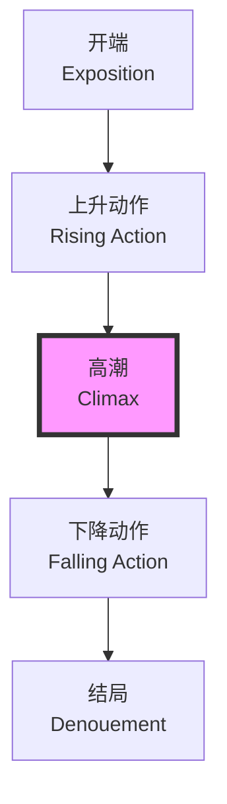
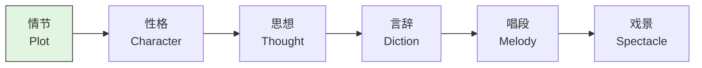

---
aliases:
  - 戏剧理论
  - Drama Theory
  - 剧作理论
  - Theater Theory
tags:
  - drama
  - theory
  - theater
  - arts
  - humanities
---

# 戏剧理论 (Drama Theory)

## 概述 (Overview)

戏剧理论（Drama Theory）是研究戏剧（Theater）艺术本质、结构（Structure）与功能（Function）的学科。从古希腊亚里士多德（Aristotle）的《诗学》（*Poetics*）到现代叙事学（Narratology），戏剧理论始终关注人类如何通过表演（Performance）讲述故事。

戏剧的核心在于动作（Action）。亚里士多德在《诗学》中提出，悲剧（Tragedy）是对严肃、完整、有一定长度的动作的模仿（Mimesis）。

### 戏剧的基本要素 (Elements of Drama)

| 要素 (Element) | 定义 (Definition) | 功能 (Function) |

| :-- | :-- | :-- |

| 动作 (Action) | 戏剧中发生的事件序列 | 推动叙事前进 |

| 角色 (Character) | 行动的承担者 | 承载戏剧冲突与人性探索 |

| 冲突 (Conflict) | 戏剧动作的核心动力 | 创造张力与悬念 |

| 对话 (Dialogue) | 角色之间的语言交流 | 揭示性格、推进情节 |

| 场景 (Setting) | 戏剧发生的时间与空间 | 构建戏剧世界的语境 |

## 戏剧结构 (Dramatic Structure)

### 传统结构模型 (Classical Structure Models)

古典戏剧结构（Classical Dramatic Structure）通常遵循**三一律**（Three Unities）：

- **时间统一**（Unity of Time）：剧情在24小时内完成
- **地点统一**（Unity of Place）：场景限于单一地点
- **动作统一**（Unity of Action）：围绕单一主线展开

亚里士多德在《诗学》中提出的五部分结构：

1. **开端**（Exposition）：介绍背景与人物
2. **上升动作**（Rising Action）：矛盾逐渐积累
3. **高潮**（Climax）：冲突达到顶点
4. **下降动作**（Falling Action）：冲突开始解决
5. **结局**（Denouement）：故事收束

### 弗莱塔格金字塔 (Freytag's Pyramid)

戏剧结构的经典可视化模型：

## 角色理论 (Character Theory)

### 角色类型学 (Typology of Characters)

戏剧中的角色可以根据其功能与深度进行分类：

| 类型 (Type) | 特征 (Characteristics) | 例子 (Examples) |

| :-- | :-- | :-- |

| 扁形人物 (Flat Character) | 单一特征，缺乏发展 | 喜剧中的仆人角色 |

| 圆形人物 (Round Character) | 复杂多面，性格发展 | 哈姆雷特 (Hamlet) |

| 原型人物 (Archetypal Character) | 承载集体无意识 | 英雄、智者、骗子 |

| 功能性角色 (Functional Character) | 推动情节发展 | 信使、反派 |

### 角色弧线 (Character Arc)

角色的内在转变可以用数学模型描述。设角色在时刻 $t$ 的道德状态为 $M(t)$，则角色弧线可表示为：

$$M(t) = M_0 + \Delta M \cdot f(t)$$

其中 $M_0$ 为初始状态，$\Delta M$ 为总变化量，$f(t)$ 为归一化时间函数，满足 $f(0) = 0$，$f(T) = 1$。

## 冲突理论 (Conflict Theory)

### 冲突的类型 (Types of Conflict)

戏剧冲突是戏剧动作的灵魂。常见的冲突类型包括：

- **人与自我**（Person vs. Self）：内心挣扎与道德抉择
- **人与人**（Person vs. Person）： interpersonal 矛盾
- **人与社会**（Person vs. Society）：个体与制度、规范的对抗
- **人与自然**（Person vs. Nature）：与不可抗力、灾难的斗争
- **人与命运**（Person vs. Fate）：与宿命、神意的抗争

### 冲突的强度与节奏 (Intensity and Rhythm)

戏剧张力（Dramatic Tension）可以用信息论中的**熵**（Entropy）来理解：

$$H = -\sum_{i} p_i \log p_i$$

当剧情的不确定性 $H$ 增大时，观众的悬念感增强。优秀的剧作家通过控制信息释放的节奏来调节 $H$ 的值。

## 从古典到现代 (From Classical to Modern)

### 亚里士多德的《诗学》 (Aristotle's *Poetics*)

《诗学》是西方戏剧理论的奠基之作。亚里士多德提出了**卡塔西斯**（Catharsis）概念：悲剧通过引发怜悯（Pity）与恐惧（Fear），使观众的情感得到净化。

悲剧六要素的等级：

### 现代戏剧理论 (Modern Drama Theory)

20世纪以来，戏剧理论经历了重大转型：

| 理论流派 (School) | 代表人物 (Key Figures) | 核心观点 (Core Ideas) |

| :-- | :-- | :-- |

| 表现主义 (Expressionism) | 斯特林堡 (Strindberg) | 外在现实是内心世界的投射 |

| 荒诞派 (Theater of the Absurd) | 贝克特 (Beckett) | 人类在无意义宇宙中的存在 |

| 史诗剧场 (Epic Theater) | 布莱希特 (Brecht) | 间离效果 (Verfremdungseffekt)，理性批判 |

| 残酷剧场 (Theater of Cruelty) | 阿尔托 (Artaud) | 戏剧应直接冲击感官 |

### 布莱希特的间离效果 (Brecht's Alienation Effect)

布莱希特（Bertolt Brecht）反对亚里士多德式的情感沉浸，主张通过间离效果（Verfremdungseffekt）使观众保持理性批判距离。他使用以下技巧：

- **直接对观众说话**（Direct Address）
- **插入歌曲与字幕**（Songs and Captions）
- **历史化**（Historicization）：将当代问题置于历史语境中审视
- **角色扮演的多层性**（Multiple Role Playing）

## 叙事学与戏剧 (Narratology and Drama)

### 叙事视角 (Narrative Perspective)

虽然戏剧主要采用**展示**（Showing）而非**讲述**（Telling），但现代戏剧理论借用叙事学概念分析戏剧文本：

- **聚焦**（Focalization）：谁在看？
- **声音**（Voice）：谁在说话？
- **时间**（Time）：叙事时序与故事时序的关系

热奈特（Gérard Genette）的叙事学理论被广泛应用于戏剧分析，特别是**顺序**（Order）、**时距**（Duration）、**频率**（Frequency）三个范畴。

## 文化维度中的戏剧 (Drama in Cultural Dimensions)

### 跨文化戏剧 (Intercultural Theater)

全球化时代，戏剧理论必须面对跨文化（Intercultural）的复杂性。谢克纳（Richard Schechner）的表演理论（Performance Theory）将戏剧置于更广泛的人类行为（Human Behavior）框架中：

$$\text{Performance} = f(\text{Script}, \text{Score}, \text{Transportation}, \text{Transformation})$$

其中：

- **脚本**（Script）：可重复的文本结构
- **总谱**（Score）：可重复的物理行为序列
- ** transportation **：从日常到表演状态的过渡
- ** transformation **：表演带来的改变

### 中国戏剧理论 (Chinese Drama Theory)

中国传统戏曲理论有其独特的概念体系：

| 概念 (Concept) | 含义 (Meaning) | 对应西方概念 (Western Equivalent) |

| :-- | :-- | :-- |

| 虚拟性 (Virtuality) | 以简代繁，以意代形 | 象征主义 (Symbolism) |

| 程式化 (Conventionalization) | 规范化的表演动作 | 类型化 (Typification) |

| 意境 (Artistic Conception) | 情景交融的审美境界 | 氛围 (Atmosphere) |

| 行当 (Role Types) | 按性格、功能分类 | 原型 (Archetype) |

京剧大师梅兰芳的"移步不换形"理论，体现了传统与现代、东方与西方戏剧理论的对话。

## 结语 (Conclusion)

戏剧理论（Drama Theory）不仅是理解戏剧艺术的工具，更是理解人类如何通过虚构（Fiction）探索真实（Reality）的窗口。从亚里士多德的模仿论到当代的跨文化表演理论，戏剧理论始终在追问：我们如何成为他人？我们如何通过他人的眼睛看见自己？

这些问题的答案，正如布莱希特所言，存在于"戏剧作为一种社会机构"（Theater as a Social Institution）的持续实验之中。
