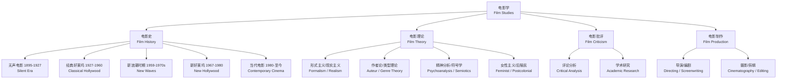

# 电影学（Film Studies）

## 概述

电影学（Film Studies）是研究电影作为艺术形式（Art Form）、文化产物（Cultural Artifact）和工业体系（Industrial System）的学科，涵盖电影史（Film History）、电影理论（Film Theory）、电影批评（Film Criticism）和电影制作（Film Production）等领域。它不仅是关于"看电影"，更是系统性地理解电影的构成、意义和影响。从 1895 年卢米埃尔兄弟的《火车进站》到今天的流媒体时代，电影已经经历了从杂耍娱乐到第七艺术、从胶片到数字的深刻转型。电影学提供了分析电影叙事、视觉语言、声音设计和文化语境的工具框架，帮助我们理解电影如何创造意义、反映社会和塑造集体想象。

## 电影学的学科体系

## 电影分析的维度

### 叙事学分析（Narrative Analysis）

三幕结构是 Syd Field 提出的经典叙事范式。第一幕（建置 Setup）介绍角色、设定和冲突；第二幕（对抗 Confrontation）展开主要冲突，主角面对层层升级的障碍；第三幕（解决 Resolution）冲突达到高潮并收束：

$$ \text{第一幕 (Act I)} \xrightarrow{\text{情节点 I (Plot Point I)}} \text{第二幕 (Act II)} \xrightarrow{\text{情节点 II (Plot Point II)}} \text{第三幕 (Act III)} $$

英雄之旅（Hero's Journey）是 Joseph Campbell 在《千面英雄》（The Hero with a Thousand Faces）中提出的跨文化叙事原型，包括 12 个阶段：平凡世界 → 冒险召唤 → 拒绝召唤 → 导师相遇 → 跨越门槛 → 考验/盟友/敌人 → 最深处 → 严峻考验 → 奖赏 → 回归之路 → 复活重生 → 携灵药而归。当下流行的三幕结构与英雄之旅并非对立，英雄之旅的每一阶段可以映射到三幕结构的不同位置。

非线性叙事（Non-linear Narrative）是现代电影叙事的重要创新，如《低俗小说》的环形结构和《记忆碎片》的倒叙拼接。这些叙事策略挑战观众的记忆和意义建构能力。

### 场面调度（Mise-en-Scène）

"场面调度"（Mise-en-Scène）是法语词，字面含义为"放入场景中"（putting into the scene），指镜头内所有可控制的视觉元素：

$$ \text{Mise-en-Scène} = \begin{cases} \text{布景与道具（Set Design & Props）} \\ \text{灯光设计（Lighting Design）} \\ \text{服装与妆容（Costume & Makeup）} \\ \text{空间构图（Framing & Composition）} \\ \text{演员走位与表演（Blocking & Performance）} \end{cases} $$

布景设计可以建立时代感和社会阶层（如《布达佩斯大饭店》的粉色色调暗示前期辉煌的消逝）。灯光是表现主义美学的核心武器——德国表现主义电影使用高对比度的明暗对比（Chiaroscuro）外化角色的内心焦虑。

$$ \text{三点布光（Three-point Lighting）} = \text{主光（Key Light）} + \text{辅光（Fill Light）} + \text{背光（Back Light）} $$

### 色彩分析（Color Grading）

电影调色（Color Grading）是后期制作中确定影片整体色调的
关键环节。色彩不仅可以营造氛围，还可以引导观众的情绪和对
角色的态度。暖色调（橙色、红色）常用于表现温馨或危险的场景。
冷色调（蓝色、青色）常用于表现孤独、科技感或冷漠的情感。
互补色对比（如《天使爱美丽》中的红绿对比）可以创造强烈的
视觉辨识度。LUT（Look-Up Table）技术使调色师能够在不同
色彩空间之间进行精确的色彩映射。胶片时代的曝光技术和冲印
工艺形成了 Kodak 和 Fuji 各自独特的色彩科学。数字中间片
（DI, Digital Intermediate）技术使调色成为电影制作中独立
且关键的创作环节。调色的数学基础是 RGB 色彩空间的矩阵变换：

$$ \begin{bmatrix} R' \\ G' \\ B' \end{bmatrix} =
\begin{bmatrix} a_{11} & a_{12} & a_{13} \\
a_{21} & a_{22} & a_{23} \\
a_{31} & a_{32} & a_{33} \end{bmatrix}
\begin{bmatrix} R \\ G \\ B \end{bmatrix} $$

理解调色有助于分析导演的画意风格和叙事语调。

### 摄影分析（Cinematography）

摄影指导（Director of Photography, DP）负责电影画面的
视觉呈现，决定镜头的选用、光线的布置和画面的构图。
核心控制参数包括：

| 镜头类型 | 焦段（全画幅等效） | 透视效果 | 叙事功能 |
|----------|-------------------|----------|----------|
| 超广角（Ultra Wide） | ≤ 24 mm | 夸张透视、边缘畸变 | 营造迷失、眩晕感 |
| 广角（Wide） | 24–35 mm | 前景突出、景深大 | 交代环境与大空间 |
| 标准（Normal） | 40–55 mm | 最接近人眼透视 | 自然、客观的叙事视角 |
| 中长焦（Telephoto） | 70–135 mm | 压缩空间、浅景深 | 突出主体、隔离背景 |
| 超长焦（Super Tele） | ≥ 200 mm | 极大空间压缩 | 追逐场面、隐蔽观察 |

摄影机运动包括：横摇（Pan）、俯仰（Tilt）、推轨（Dolly/Tracking）、升降（Crane）、手持（Handheld）和稳定器（Steadicam）等。不同运动方式产生不同的情绪效果——手持摄影营造纪录片式的真实感和不安感，稳定器的平滑运动则营造梦幻般的超然视角。

$$ \text{曝光量} = \text{光圈（Aperture）} \times \text{快门速度（Shutter Speed）} \times \text{ISO 感光度} $$

### 剪辑分析（Editing）

剪辑创造了电影的节奏和时空关系。连续性剪辑（Continuity Editing）通过保持时空的统一和连续，让观众沉浸于故事世界。蒙太奇（Montage/Soviet Montage）则通过镜头的碰撞创造新的意义——爱森斯坦认为镜头 A 与镜头 B 的交汇产生超越二者之和的意涵 C：

$$ \text{蒙太奇效应：} A + B > A \cup B $$

核心剪辑规则包括：180 度法则（180-Degree Rule）保持空间中方向的一致性，避免角色跳跃轴线；30 度法则要求机位角度变化至少 30 度以避免跳跃剪辑；视线匹配（Eyeline Match）确保角色所看方向与下一镜头的视点一致；动作匹配（Match on Action）在运动过程中切换镜头以保持动作的连贯性。

时间压缩通过交叉剪辑（Cross-Cutting）、蒙太奇段落等手段实现。跳接（Jump Cut）作为破坏连续性剪辑的手法，在法国新浪潮（如戈达尔的《精疲力尽》）中被广泛使用以制造间离效果。

### 声音分析（Sound）

| 声音类型 | 定义 | 叙事功能 | 典型例子 |
|----------|------|----------|----------|
| 画内音（Diegetic Sound） | 角色也能听到的声音 | 增强场景真实感 | 对话、脚步声、收音机音乐 |
| 画外音（Non-Diegetic Sound） | 角色听不到的背景音 | 引导情绪与氛围 | 电影配乐、画外旁白 |
| 同步音（Sync Sound） | 与画面同步录制 | 增强真实感与现场感 | 同期录音的对话和音效 |
| 异步音（Asynchronous Sound） | 与画面不匹配 | 制造紧张与不协调感 | 战争画面对宁静音乐 |
| 内部声音（Internal Sound） | 角色内心听到的 | 表现心理活动 | 内心独白、幻听 |

声音蒙太奇（Sound Montage）通过声音的叠加和过渡（叠化、淡入淡出、剪切）控制情绪的转换。沉默（Silence）本身也是有力量的声音设计——在紧张场景中突然的静默往往比音效更令人窒息。

## 电影类型（Genre）的惯例

每个电影类型（Genre）都有一套观众期待的惯例系统。喜剧通常依赖 Happy Ending 和误会型冲突的结构；恐怖片运用未知恐惧与突然惊吓（Jump Scare）的节奏；科幻片建构未来世界或外星文明的技术想象；黑色电影（Film Noir）以低角度布光、阴影构图和愤世嫉俗的侦探/罪犯主角为标志；西部片（Western）在边疆场景中讲述个人正义与文明秩序的冲突。

$$ \text{类型惯例} = \text{视觉风格} + \text{叙事模式} + \text{主题关切} $$

类型并非固定不变——当代电影越来越多地混合类型（Genre
Hybridity）。科幻与恐怖在《异形》中结合，西部与太空歌剧
在《星球大战》中找到融合点，喜剧与恐怖在《僵尸肖恩》中
碰撞。类型电影研究不仅关注惯例的延续，也关注惯例的颠覆
和再创造。科幻电影的社会隐喻功能在《银翼杀手》和《她》
中达到哲学深度。恐怖电影中的"他者"象征反映了特定时代的
社会焦虑。超级英雄电影在 21 世纪成为全球票房主导类型，
其叙事模式融合了神话原型和当代身份政治议题。类型批评为
我们理解电影作为社会文本提供了有效框架。

## 世界电影史重要运动

| 运动 | 时间 | 国家 | 特点 | 代表作 |
|------|------|------|------|--------|
| 德国表现主义 | 1910s–1920s | 德国 | 夸张布景、明暗对比、心理扭曲 | 《卡里加里博士的小屋》 |
| 苏联蒙太奇 | 1920s | 苏联 | 剪辑创造意义、政治宣传 | 《战舰波将金号》 |
| 法国诗意现实主义 | 1930s | 法国 | 写实与诗意的融合、宿命主题 | 《雾码头》 |
| 意大利新现实主义 | 1940s–1950s | 意大利 | 实景拍摄、非职业演员、社会议题 | 《偷自行车的人》 |
| 法国新浪潮 | 1959–1960s | 法国 | 跳接、手持摄影、作者论实践 | 《精疲力尽》 |
| 新好莱坞 | 1967–1980s | 美国 | 反英雄、现实主义、导演主导 | 《教父》《出租车司机》 |
| 中国第五代 | 1980s | 中国 | 历史反思、视觉震撼、象征主义 | 《黄土地》《红高粱》 |
| 丹麦道格玛95 | 1995–2000s | 丹麦 | 手持实景、自然光、拒绝特效 | 《家宴》《破浪》 |

## 电影分析写作指南

一篇标准的电影分析文章包含以下结构：标题点明分析角度和核心论断；导语交代电影基本信息和核心论点；主题分析探讨电影的深层议题（社会批判、性别政治、存在哲学等）；形式分析说明叙事、摄影、剪辑和声音如何服务于主题表达；语境分析将电影置于社会、文化和历史语境中解读；结论做综合评价并提出延伸思考。

$$ \text{优质分析} = \text{敏锐观察} + \text{理论支撑} + \text{清晰论证} $$

## 数字时代的电影变革

数字技术深刻改变了电影的生产、分发和消费方式。数字摄影
（Digital Cinematography）以 ARRI Alexa、RED 等数字摄影机
替代了胶片，后期调色的自由度大幅提高。CGI（Computer-
Generated Imagery）和虚拟制片（Virtual Production）使导演
能够在 LED 虚拟棚中实时看到最终画面。流媒体平台以网飞
（Netflix）为代表的流媒体平台改变了电影发行窗口体系。
AI 技术在剧本分析、剪辑辅助和视觉特效等环节的应用正在
拓展电影创作的新可能性。短视频（Short Video）的崛起改变了
观众的注意力结构和叙事节奏偏好。

## 关键电影理论流派

形式主义电影理论由爱森斯坦和普多夫金发展，强调剪辑的
表意能力。爱森斯坦的蒙太奇理论认为镜头之间的冲突产生新的
意义。巴赞的现实主义电影理论推崇景深镜头和长镜头，认为
电影的本质是记录现实。作者论（Auteur Theory）由特吕弗和
巴赞提出，认为导演是电影的作者，其个人风格贯穿于作品。
精神分析电影理论借助拉康的镜像阶段理论分析观影主体。
女性主义电影理论以穆尔维的"视觉快感与叙事电影"为里程碑，
揭示了好莱坞电影中的男性凝视。这些理论流派为电影分析提供
了不同的批评框架和解读路径。

## 主要参考文献

1. Bordwell, D. & Thompson, K. Film Art: An Introduction.
    McGraw-Hill, 2019.
2. 戴锦华. 电影批评. 北京大学出版社, 2004.
3. Andrew, D. The Major Film Theories. Oxford, 1976.
4. 王志敏. 电影语言学. 北京大学出版社, 2007.
5. Bazin, A. What Is Cinema? Vol. 1–2. UC Press, 2005.
6. Mulvey, L. Visual and Other Pleasures. Palgrave, 2009.

## 电影研究入门步骤

对于初学电影研究的人，建议按照以下步骤系统性地建立分析
能力。第一步是广泛观看不同时期和国家的代表作品，建立基本
的电影史视野。建议按照本书所列的电影运动顺序逐一观看其
代表作，并记录观影感受。第二步是学习基本的分析术语——
场面调度的五个要素、摄影机的运动方式、剪辑的类型和声音的
层次等。第三步是精读几部经典电影学著作，如 Bordwell 和
Thompson 的《电影艺术：导论》和 Bazin 的《电影是什么？》。
第四步是练习写作分析短文，从单一维度的分析逐渐过渡到多
维度综合论述。第五步是了解电影产业和电影节体系——戛纳、
威尼斯、柏林三大国际电影节的选片标准反映了不同的美学取向。
第六步是关注当代电影批评的前沿议题，如流媒体对影院体验的
冲击、AI 在电影创作中的应用、多元文化主义对主流叙事的
挑战等。电影研究是一个永无止境的探索过程——每一部好电影
都值得反复观看，每次观看都能发现新的细节和意义。

## 相关条目
