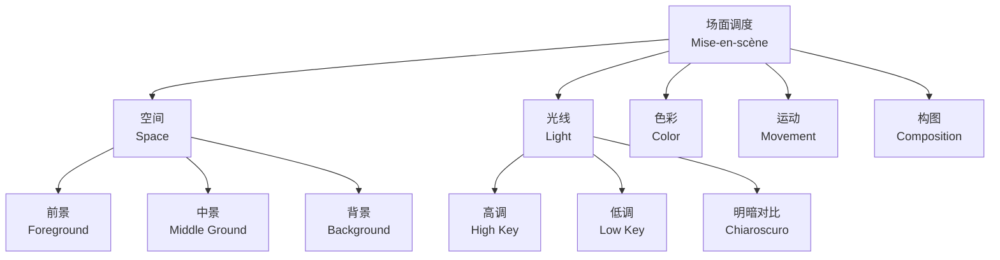
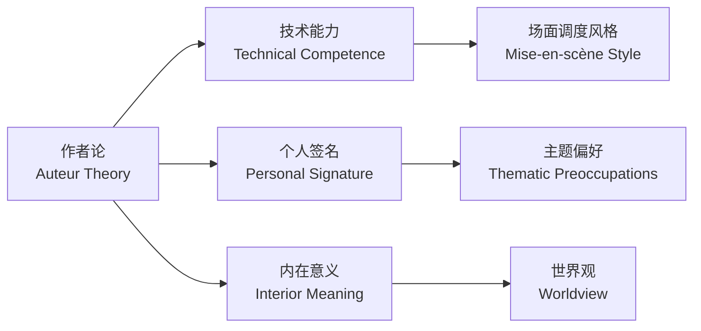

---
aliases:
  - 电影研究
  - Film Studies
  - Cinema Studies
  - 电影学
tags:
  - film
  - cinema
  - theory
  - visual-arts
  - media-studies
---

# 电影研究 (Film Studies)

## 概述 (Overview)

电影研究（Film Studies）是一门跨学科领域，融合美学（Aesthetics）、心理学（Psychology）、社会学（Sociology）与技术（Technology），系统考察电影（Cinema）作为艺术形式、工业体系与文化现象的多重维度。

电影不仅是一种娱乐媒介，更是20世纪最具影响力的文化表达形式。自1895年卢米埃尔兄弟（Lumière Brothers）首次公开放映以来，电影已发展为集叙事、视觉、声音于一体的综合艺术。

### 电影研究的核心议题 (Core Issues)

| 议题 (Issue) | 研究重点 (Focus) | 方法论 (Methodology) |

| :-- | :-- | :-- |

| 电影语言 (Film Language) | 镜头、剪辑、声音 | 形式主义 (Formalism) |

| 电影与社会 (Film and Society) | 意识形态、阶级、性别 | 文化研究 (Cultural Studies) |

| 电影工业 (Film Industry) | 生产、发行、消费 | 政治经济学 (Political Economy) |

| 电影美学 (Film Aesthetics) | 视觉风格、作者性 | 美学分析 (Aesthetic Analysis) |

## 电影理论流派 (Film Theory Schools)

### 形式主义理论 (Formalism)

俄国形式主义（Russian Formalism）对早期电影理论影响深远。形式主义关注电影作为媒介的独特性（Specificity），强调**陌生化**（Defamiliarization）效果：

$$\text{Art} = f(\text{Technique}, \text{Device}, \text{Effect})$$

维克多·什克洛夫斯基（Viktor Shklovsky）认为，艺术的目的是使人感受事物，而非仅仅认知事物。电影通过独特的技术手段（如特写、慢动作）实现这一目的。

### 现实主义理论 (Realism)

安德烈·巴赞（André Bazin）是现实主义电影理论的核心人物。他提出的**完整电影神话**（Myth of Total Cinema）认为：

> 电影的起源在于人类追求完整、真实地再现现实的欲望。

巴赞推崇**景深镜头**（Depth of Field）与**长镜头**（Long Take），认为这些技术尊重时空的连续性，给予观众更多的思考自由：

$$\text{Realism} \propto \frac{\text{Duration of Shot}}{\text{Number of Cuts}}$$

### 精神分析理论 (Psychoanalytic Theory)

20世纪70年代，精神分析进入电影研究。劳拉·穆尔维（Laura Mulvey）在《视觉快感与叙事电影》（*Visual Pleasure and Narrative Cinema*）中提出**凝视理论**（Gaze Theory）：

电影提供三种窥视（Scopophilic）机制：

1. **摄影机之眼**（Camera's Look）：全知视角
2. **角色凝视**（Character's Look）：叙事内视角
3. **观众凝视**（Spectator's Look）：认同机制

## 场面调度 (Mise-en-scène)

### 定义与要素 (Definition and Elements)

场面调度（Mise-en-scène）原意为"置于场景中"，指镜头内所有视觉元素的组织与安排。

| 元素 (Element) | 功能 (Function) | 例子 (Example) |

| :-- | :-- | :-- |

| 布景 (Set Design) | 构建时空环境 | 《银翼杀手》的未来都市 |

| 灯光 (Lighting) | 营造氛围、塑造形体 | 德国表现主义的明暗对比 |

| 服装 (Costume) | 揭示性格、时代、阶级 | 《教父》中的黑色西装 |

| 演员调度 (Blocking) | 空间关系与权力结构 | 《公民凯恩》中的深度构图 |

| 色彩 (Color) | 情感表达与象征意义 | 《布达佩斯大饭店》的粉色调 |

### 场面调度的分析框架 (Analytical Framework)

场面调度的分析可以从以下几个维度展开：

## 蒙太奇理论 (Montage Theory)

### 库里肖夫效应 (Kuleshov Effect)

列夫·库里肖夫（Lev Kuleshov）的著名实验证明了剪辑的心理学基础：

> 同样的面部特写，分别与一碗汤、一具棺材、一个玩耍的女孩剪辑在一起，观众分别读解为饥饿、悲伤、愉悦。

这一效应揭示了电影意义产生于镜头之间的关系，而非单个镜头本身：

$$\text{Meaning} = f(\text{Shot}_A, \text{Shot}_B, \text{Relation}_{A,B})$$

### 爱森斯坦的蒙太奇类型 (Eisenstein's Types of Montage)

谢尔盖·爱森斯坦（Sergei Eisenstein）发展了系统的蒙太奇理论：

| 类型 (Type) | 定义 (Definition) | 例子 (Example) |

| :-- | :-- | :-- |

| 度量蒙太奇 (Metric) | 按镜头长度剪辑 | 《战舰波将金号》的 Odessa 阶梯 |

| 韵律蒙太奇 (Rhythmic) | 按运动节奏剪辑 | 舞蹈序列 |

| 调性蒙太奇 (Tonal) | 按情绪氛围剪辑 | 浪漫场景的柔和过渡 |

| 泛音蒙太奇 (Overtonal) | 综合多种元素 | 复杂场景的多层剪辑 |

| 理性蒙太奇 (Intellectual) | 概念碰撞产生思想 | 《十月》的上帝与偶像序列 |

## 作者论 (Auteur Theory)

### 法国新浪潮与作者论 (French New Wave and Auteur Theory)

1950年代，法国《电影手册》（*Cahiers du Cinéma*）的评论家们提出作者论（Auteur Theory），认为导演（Director）是电影的主要"作者"（Author）：

**作者论的三大标准：**

1. **技术能力**（Technical Competence）：掌握电影语言
2. **个人签名**（Personal Signature）：可识别的风格特征
3. **内在意义**（Interior Meaning）：作品之间的主题连贯性

### 作者论的批评与修正 (Criticism and Revision)

作者论受到的结构主义批评指出：

- 电影是**集体创作**（Collective Creation），导演并非唯一作者
- **作者**概念预设了**浪漫主义的个体天才神话**
- 忽略了**制片体系**（Studio System）对创作的制约

彼得·沃伦（Peter Wollan）提出三种作者类型：

- **结构作者**（Structural Auteur）：风格作为结构功能
- **个人作者**（Personal Auteur）：风格作为自我表达
- **政治作者**（Political Auteur）：风格作为意识形态批判

## 类型分析 (Genre Analysis)

### 类型理论 (Genre Theory)

类型（Genre）是电影工业与观众之间的"契约"（Contract）。类型电影通过可预期的叙事模式、视觉风格与主题关切，降低投资风险，同时满足观众的期待。

主要电影类型及其特征：

| 类型 (Genre) | 核心冲突 (Core Conflict) | 空间 (Space) | 时间 (Time) |

| :-- | :-- | :-- | :-- |

| 西部片 (Western) | 文明 vs. 荒野 | 边疆 (Frontier) | 19世纪末 |

| 黑色电影 (Film Noir) | 宿命 vs. 欲望 | 城市夜境 (Urban Night) | 1940-50年代 |

| 科幻片 (Sci-Fi) | 人类 vs. 技术/外星 | 未来/异世界 | 未来 |

| 恐怖片 (Horror) | 秩序 vs. 混乱 | 封闭空间 | 当代 |

| 歌舞片 (Musical) | 现实 vs. 幻想 | 舞台/都市 | 任意 |

### 类型演变与混合 (Genre Evolution and Hybridity)

当代电影越来越呈现**类型混合**（Genre Hybridity）趋势：

$$\text{Genre}_{\text{Hybrid}} = \alpha \cdot \text{Genre}_A + (1-\alpha) \cdot \text{Genre}_B + \epsilon$$

其中 $\alpha$ 为类型混合系数，$\epsilon$ 为创新扰动项。

例如，《银翼杀手》（*Blade Runner*, 1982）混合了科幻（Sci-Fi）与黑色电影（Noir），创造了"科技黑色"（Tech-Noir）子类型。

## 电影与意识形态 (Film and Ideology)

### 意识形态批评 (Ideological Criticism)

电影不仅是艺术，更是**意识形态国家机器**（Ideological State Apparatuses, Althusser）。电影通过以下机制运作意识形态：

- **叙事闭合**（Narrative Closure）：矛盾在结局中被想象性解决
- **角色认同**（Character Identification）：观众认同主流价值观的承载者
- **奇观化**（Spectacularization）：社会问题转化为视觉消费

### 后殖民电影理论 (Postcolonial Film Theory)

后殖民视角关注电影中的**他者化**（Othering）过程：

| 表征策略 (Representational Strategy) | 效果 (Effect) | 例子 (Example) |

| :-- | :-- | :-- |

| 异国情调化 (Exoticization) | 将非西方文化"他者化" | 《印第安纳·琼斯》中的东方 |

| 野蛮化 (Barbarization) | 将非西方文化"原始化" | 早期西部片中的印第安人 |

| 拯救叙事 (Salvation Narrative) | 西方角色拯救非西方角色 | 《最后的武士》 |

## 结语 (Conclusion)

电影研究（Film Studies）为我们提供了理解这一"第七艺术"的多维框架。从场面调度（Mise-en-scène）的视觉诗学，到蒙太奇（Montage）的心理学机制，从作者论（Auteur Theory）的作者神话到类型分析（Genre Analysis）的工业逻辑，电影理论始终在追问：电影如何在黑暗中创造光明？如何在二维银幕上召唤三维世界？

正如戈达尔（Jean-Luc Godard）所言："电影是每秒24格的真理。"电影研究的任务，正是揭示这每秒24格中蕴含的真理与幻象。
