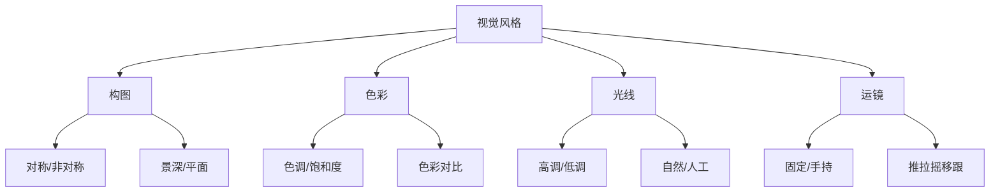

---
aliases:
  - 电影美学与导演
  - Film Aesthetics and Directing
  - 电影美学
  - 导演艺术
tags:
  - film
  - aesthetics
  - directing
  - cinematography
  - visual-style
---

# 电影美学与导演 (Film Aesthetics and Directing)

## 一、视觉风格 (Visual Style)

### 1.1 导演的视觉语言体系

电影导演通过视觉元素建立个人风格。库布里克 (Kubrick) 的单点透视、韦斯·安德森 (Wes Anderson) 的对称构图、王家卫的霓虹色调，都是独特的视觉签名 (Visual Signature)。

| 导演 | 标志性视觉元素 | 代表作品 |
|------|---------------|----------|
| 斯坦利·库布里克 | 单点透视、广角镜头 | 《2001太空漫游》 |
| 韦斯·安德森 | 对称构图、调色板色彩 | 《布达佩斯大饭店》 |
| 王家卫 | 手持摄影、饱和色彩 | 《花样年华》 |
| 克里斯托弗·诺兰 | 交叉剪辑、实景特效 | 《盗梦空间》 |

### 1.2 视觉风格分析框架

## 二、场面调度 (Mise-en-Scène)

场面调度指镜头内一切元素的安排。源自法语"mettre en scène"，意为"放入场景之中"。

### 2.1 四大要素

| 要素 | 说明 | 影响 |
|------|------|------|
| 布景 (Set Design) | 空间环境与道具 | 塑造世界观 |
| 灯光 (Lighting) | 光的方向与质感 | 营造氛围 |
| 服装与化妆 (Costume & Makeup) | 角色的外部形象 | 暗示身份与性格 |
| 演员与走位 (Staging & Blocking) | 演员的位置与移动 | 引导观众视线 |

### 2.2 深焦与长镜头

- **深焦摄影 (Deep Focus)** — 前景、中景、背景全部清晰，强调空间的完整性与人物关系
- **长镜头 (Long Take)** — 连续不间断的拍摄，保留时间的连续性

## 三、摄影技巧 (Cinematography)

### 3.1 镜头类型

| 镜头类型 | 效果 | 典型用途 |
|----------|------|----------|
| 特写 (Close-Up) | 强调细节和情感 | 面部表情、关键道具 |
| 中景 (Medium Shot) | 展示对话与动作 | 两人对话场景 |
| 远景 (Long Shot) | 展示环境与人物的关系 | 开场建立镜头 |
| 极远景 (Extreme Long Shot) | 交代宏大空间 | 风光、战争场面 |
| 过肩镜头 (Over-the-Shoulder) | 建立对话视点 | 对话场景 |

### 3.2 镜头运动

- **推 (Dolly In)** — 拉近与主体的距离，增强戏剧张力
- **拉 (Dolly Out)** — 远离主体，产生疏离或揭示效果
- **摇 (Pan)** — 水平转动摄影机，展示空间
- **移 (Tracking Shot)** — 摄影机平行移动，跟随人物
- **升降 (Crane Shot)** — 垂直方向的运动

### 3.3 焦距与透视

| 焦距 | 视场角 | 空间压缩 | 典型使用 |
|------|--------|----------|----------|
| 广角 (Wide, <35mm) | 宽 | 夸张透视、变形边缘 | 库布里克《闪灵》 |
| 标准 (Normal, 50mm) | 接近人眼 | 自然透视 | 日常场景 |
| 长焦 (Telephoto, >85mm) | 窄 | 压缩空间、虚化背景 | 希区柯克《惊魂记》 |

## 四、剪辑与蒙太奇 (Editing & Montage)

### 4.1 苏联蒙太奇理论

| 类型 | 定义 | 代表 |
|------|------|------|
| 度量蒙太奇 (Metric) | 按固定长度剪辑 | 纯节奏剪辑 |
| 节奏蒙太奇 (Rhythmic) | 根据画面内容节奏剪辑 | 爱森斯坦《战舰波将金号》 |
| 调性蒙太奇 (Tonal) | 根据情感基调剪辑 | 段落过渡 |
| 理性蒙太奇 (Intellectual) | 画面碰撞产生抽象概念 | 《十月》中的"神与上帝" |

### 4.2 连续性剪辑 (Continuity Editing)

- **视线匹配 (Eye-line Match)** — 人物视线方向保持一致
- **动作匹配 (Match on Action)** — 动作跨镜头衔接流畅
- **180度法则 (180° Rule)** — 摄影机保持在轴线一侧
- **正反打 (Shot/Reverse Shot)** — 对话场景的标准剪辑手法

## 五、叙事与导演技法

### 5.1 视点 (Point of View)

视点是观众感知故事的窗口。导演通过选择客观视点、主观视点或受限视点来控制观众获得的信息量。

### 5.2 声音设计 (Sound Design)

| 声音元素 | 功能 |
|----------|------|
| 对白 (Dialogue) | 传递剧情信息 |
| 音效 (Sound Effects) | 增强环境真实感 |
| 配乐 (Score) | 引导情绪、暗示主题 |
| 静默 (Silence) | 制造张力与停顿 |

### 5.3 隐喻与象征

导演通过视觉隐喻 (Visual Metaphor) 和象征符号 (Symbolism) 来传达超越表面的意义。例如费里尼的电影中，马戏团象征人生的荒谬；塔可夫斯基的镜像画面暗示自我的审视。

## 六、经典电影美学流派

| 流派 | 核心理念 | 代表导演 |
|------|---------|---------|
| 德国表现主义 (German Expressionism) | 主观心理的外化 | 弗里茨·朗 |
| 法国诗意现实主义 (Poetic Realism) | 诗意的社会观察 | 让·雷诺阿 |
| 意大利新现实主义 (Italian Neorealism) | 真实外景、非职业演员 | 德·西卡 |
| 法国新浪潮 (French New Wave) | 打破常规、个人表达 | 戈达尔、特吕弗 |
| 日本电影黄金期 | 东方美学与现代叙事 | 黑泽明、小津安二郎 |

---
*导演是用镜头思考的艺术家。理解美学基础，是创造个人风格的起点。*
