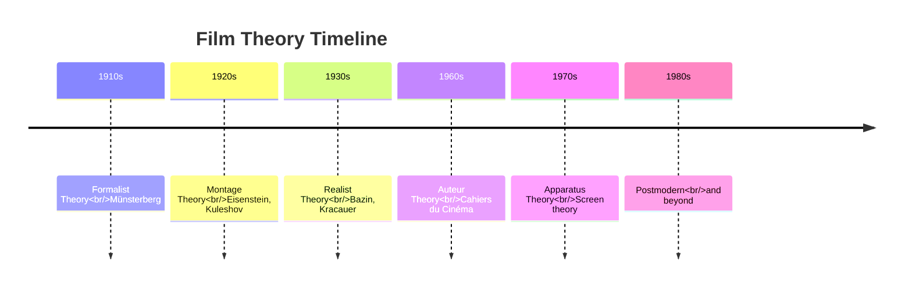
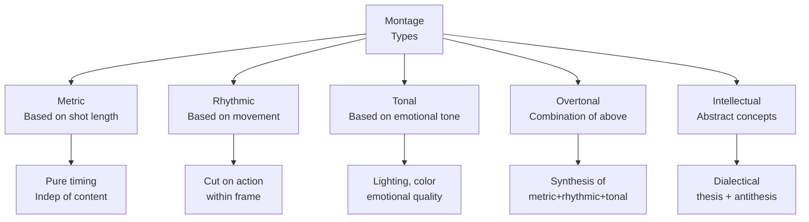
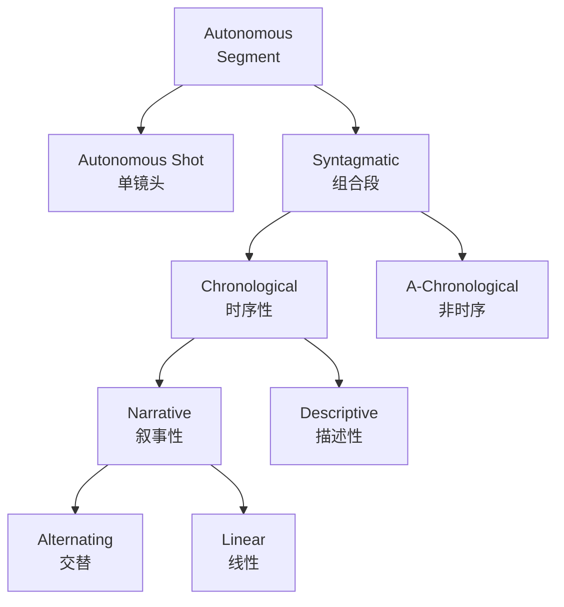
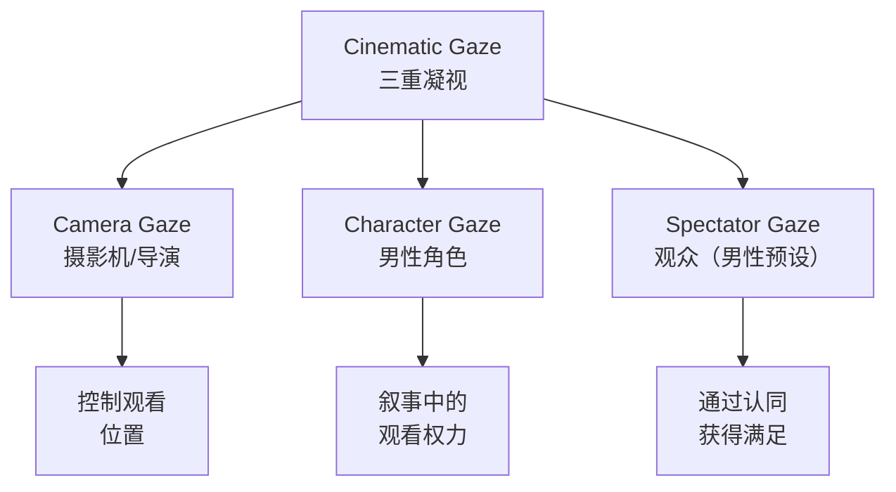

# Film Theory（电影理论）

## 一、概述

**Film Theory（电影理论）** 是研究电影本质、语言、叙事与社会功能的学科体系。与电影批评（Film Criticism）不同，理论追求系统性的普遍原理。

### 1.1 理论 vs 批评

| 维度 | 电影理论 | 电影批评 |
|------|---------|---------|
| 目标 | 建立普遍原理 | 评价具体作品 |
| 方法 | 演绎与归纳 | 文本分析 |
| 对象 | 电影媒介本身 | 特定影片/导演 |
| 输出 | 理论体系 | 评论文章 |

### 1.2 发展脉络

## 二、蒙太奇理论

### 2.1 库列绍夫效应（Kuleshov Effect）

Lev Kuleshov 的实验证明：**镜头的意义不仅来自其本身，更来自前后镜头的组合关系**。同一张面无表情的脸，与不同镜头（食物、棺材、美女）组合，观众读出不同的情绪。

$$ \text{镜头 A} + \text{镜头 B} \neq \text{镜头 A} \oplus \text{镜头 B} $$

两个镜头组合产生了「1 + 1 > 2」的效果。

### 2.2 爱森斯坦的蒙太奇类型

Sergei Eisenstein 将蒙太奇（Montage）分为五类：

**Eisenstein 的辩证蒙太奇（Dialectical Montage）** 公式：

$$ \text{镜头 A（正题）} + \text{镜头 B（反题）} \longrightarrow \text{新概念（合题）} $$

### 2.3 Pudovkin 的联结蒙太奇

Vsevolod Pudovkin 强调蒙太奇的**叙事连贯性**，提出五种联结方式：
1. **对比（Contrast）**：贫富画面的交替
2. **平行（Parallelism）**：两条叙事线的交叉
3. **象征（Symbolism）**：用物体暗示主题
4. **交叉（Cross-cutting）**：同时发生事件的交替
5. **主题（Leitmotif）**：视觉母题的重复

## 三、写实主义理论

### 3.1 André Bazin

Bazin 是写实主义（Realism）电影理论的核心人物，反对蒙太奇的过度使用。

**核心主张**：
- **长镜头（Long Take）** 和**景深镜头（Deep Focus）** 更能保持现实的多义性
- 蒙太奇将导演的解读强加给观众，限制了自由解读
- 电影的本质是「现实的渐近线」——无限接近现实

$$ \text{现实} \xrightarrow{\text{镜头前}} \text{影像} \xrightarrow{\text{剪辑后}} \text{意义} $$

### 3.2 意大利新现实主义

| 特征 | 具体表现 |
|------|---------|
| 实景拍摄 | 街头代替摄影棚 |
| 非职业演员 | 普通人演绎自己 |
| 日常叙事 | 平凡生活的切片 |
| 开放结局 | 拒绝戏剧性圆满 |

## 四、作者论

### 4.1 法国源头

**Auteur Theory（作者论）** 源于 1950 年代《电影手册》（Cahiers du Cinéma）的法国批评家群体。

核心观点：**导演是电影的作者（Auteur）**，其作品展现可识别的一贯风格与主题。

### 4.2 作者 vs 导演

| 导演（Metteur-en-scène） | 作者（Auteur） |
|-------------------------|---------------|
| 忠于剧本的技术执行者 | 在部门内注入个人风格 |
| 风格随项目变化 | 跨影片保持一贯主题 |
| 好莱坞工业化产品 | 好莱坞体制内的艺术创作 |

### 4.3 作者论的评判标准

Andrew Sarris 提出三条标准：

1. **技术能力（Technical Competence）**：导演必须掌握电影语言
2. **个性化风格（Distinguishable Personality）**：作品间存在一致性
3. **内在意义（Interior Meaning）**：技巧与主题间的张力制造深层意涵

## 五、结构主义与符号学

### 5.1 电影语言

Christian Metz 将**符号学（Semiotics）** 引入电影理论：

$$ \text{电影} = \text{语言系统（Langue）} + \text{具体言语（Parole）} $$

但电影是**无语言系统的语言（Langue without a Language）**——电影没有固定的语法规则。

### 5.2 Metz 的大组合段（Grand Syntagmatique）

Metz 将电影叙事分为八种独立段（Autonomous Segments）：

### 5.3 电影符号的三层次

| 层次 | 说明 | 示例 |
|------|------|------|
| 外延（Denotation） | 字面意义 | 画面上是一把枪 |
| 内涵（Connotation） | 联想意义 | 枪代表暴力与权力 |
| 象征（Symbol） | 文化约定 | 枪隐喻男性生殖器 |

## 六、装置理论

### 6.1 核心命题

**Apparatus Theory（装置理论）** 受 Althusser 意识形态理论 和 Lacan 精神分析影响，由 Jean-Louis Baudry 等人提出，认为电影装置本身就是意识形态的工具。

### 6.2 电影与梦境

| 特征 | 梦境 | 观影 |
|------|------|------|
| 环境 | 黑暗、躺卧 | 黑暗影院、坐姿 |
| 感知 | 被动接收 | 被动观看 |
| 现实感 | 信以为真 | 暂时悬置怀疑 |
| 自我 | 退行 | 认同主角 |

### 6.3 凝视理论（Gaze Theory）

Laura Mulvey 在《视觉快感与叙事电影》（Visual Pleasure and Narrative Cinema, 1975）中提出：

> 电影是**男性凝视（Male Gaze）** 的装置：观众通过摄影机之眼，占有性地凝视银幕上被物化的女性。

**三种视觉快感**：
1. **窥淫癖（Scopophilia）**：观看他人的私密时刻
2. **自恋认同（Narcissistic Identification）**：与银幕上的完美形象认同
3. **恋物癖凝视（Fetishistic Gaze）**：将女性部分物化，消解阉割焦虑

## 七、后现代电影理论

### 7.1 关键转向

| 传统理论 | 后现代转向 |
|---------|-----------|
| 宏大叙事 | 微观叙事 |
| 作者权威 | 互文性与作者已死 |
| 现实主义 | 拟像与超真实 |
| 固定身份 | 流动的身份认同 |

### 7.2 Deleuze 的运动-影像与时间-影像

Gilles Deleuze 在《电影1：运动-影像》和《电影2：时间-影像》中提出：

- **运动-影像（Movement-Image）**：经典电影中，时间是运动的从属
- **时间-影像（Time-Image）**：现代电影中，时间从运动中解放

$$ \text{经典电影：时间} = f(\text{运动}), \quad \text{现代电影：时间} = \text{直接呈现} $$

## 八、重要概念对比

| 概念 | 核心问题 | 代表人物 |
|------|---------|---------|
| 蒙太奇 | 剪辑如何创造意义 | Eisenstein, Pudovkin |
| 写实主义 | 电影如何再现现实 | Bazin, Kracauer |
| 作者论 | 谁是电影的创造者 | Truffaut, Sarris |
| 符号学 | 电影如何表意 | Metz, Barthes |
| 装置理论 | 电影如何建构主体 | Baudry, Mulvey |
| 后现代 | 电影如何解构自身 | Deleuze, Baudrillard |

## 九、核心文献

- **Bazin, A.** — What Is Cinema?（《电影是什么》）
- **Eisenstein, S.** — Film Form（《电影形式》）
- **Metz, C.** — Film Language（《电影语言》）
- **Mulvey, L.** — Visual and Other Pleasures
- **Deleuze, G.** — Cinema 1 & 2（《电影1、2》）
- **Bordwell, D.** — Film Art: An Introduction

---

[[06_ArtsAndCreativity/DramaAndFilm/INDEX|当前目录索引]]
