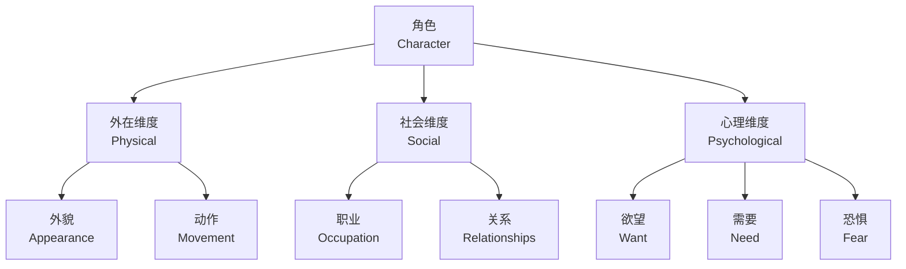

---
aliases:
  - 剧本创作
  - Screenwriting
  - 编剧
  - Scriptwriting
  - 剧作
tags:
  - screenwriting
  - drama
  - narrative
  - film
  - storytelling
---

# 剧本创作 (Screenwriting)

## 概述 (Overview)

剧本创作（Screenwriting）是将故事转化为可供拍摄的电影文本（Screenplay）的艺术与技术。与小说不同，剧本是一种**蓝图文本**（Blueprint Text），它通过动作（Action）与对话（Dialogue）描述视听内容，而非直接呈现之。

好的剧本遵循" economy of means "原则：用最少的文字传达最多的信息。正如编剧大师威廉·戈德曼（William Goldman）所言："剧本即结构。"

### 剧本的功能 (Functions of a Screenplay)

| 功能 (Function) | 说明 (Description) | 受众 (Audience) |

| :-- | :-- | :-- |

| 创作工具 (Creative Tool) | 编剧组织叙事与人物的思维框架 | 编剧 (Writer) |

| 融资文本 (Financing Document) | 向投资人展示项目潜力 | 制片人 (Producer) |

| 制作指南 (Production Guide) | 导演与各部门的工作依据 | 导演 (Director) |

| 表演依据 (Performance Basis) | 演员理解角色与情境的文本 | 演员 (Actor) |

## 三幕结构 (Three-Act Structure)

### 经典三幕剧 (Classical Three-Act Drama)

三幕结构（Three-Act Structure）是剧本创作最经典的叙事模型，源自亚里士多德的戏剧理论：

$$\text{Story} = \text{Act I} + \text{Act II} + \text{Act III}$$

各幕的功能与比例：

| 幕 (Act) | 功能 (Function) | 比例 (Proportion) | 关键节点 (Key Points) |

| :-- | :-- | :-- | :-- |

| 第一幕 (Act I) | 建立、冲突引入 | 25% | 开场画面、主题呈现、催化剂、争执 |

| 第二幕 (Act II) | 对抗、发展 | 50% | 中点、Bad Guys Close In、一无所有 |

| 第三幕 (Act III) | 解决、高潮 | 25% | 高潮、结局画面 |

### 救猫咪节拍表 (Save the Cat Beat Sheet)

布莱克·斯奈德（Blake Snyder）提出的15节拍结构：


### 英雄之旅 (The Hero's Journey)

约瑟夫·坎贝尔（Joseph Campbell）的神话模型被克里斯托弗·沃格勒（Christopher Vogler）应用于剧本创作：

| 阶段 (Stage) | 描述 (Description) | 剧本功能 (Screenplay Function) |

| :-- | :-- | :-- |

| 平凡世界 (Ordinary World) | 英雄的日常生活 | 建立基准状态 |

| 冒险召唤 (Call to Adventure) | 打破平衡的事件 | 催化剂 (Inciting Incident) |

| 拒绝召唤 (Refusal of the Call) | 英雄的犹豫与恐惧 | 争执 (Debate) |

| 导师出现 (Meeting the Mentor) | 获得指导与工具 | 准备转变 |

| 跨越门槛 (Crossing the Threshold) | 进入未知世界 | 第二幕开始 |

| 考验、盟友、敌人 (Tests, Allies, Enemies) | 适应新世界 | 第二幕上升动作 |

| 深入洞穴 (Approach to the Inmost Cave) | 面对最大恐惧 | 接近高潮 |

| 磨难 (Ordeal) | 生死考验 | 一无所有 (All Is Lost) |

| 奖赏 (Reward) | 获得所求之物 | 中点后恢复 |

| 归途 (The Road Back) | 返回平凡世界 | 第三幕开始 |

| 复活 (Resurrection) | 最终考验 | 高潮 (Climax) |

| 携万能药归来 (Return with the Elixir) | 带回改变世界的力量 | 结局 (Denouement) |

## 角色弧线 (Character Arc)

### 角色的内在转变 (Internal Transformation)

角色弧线（Character Arc）描述角色从故事开始到结束的心理与道德变化。它回答了核心问题：**这个角色学到了什么？**

角色弧线的数学表达：

$$\text{Arc}(t) = \text{Initial State} + \int_{0}^{t} \text{Transformation}(s) \, ds$$

角色弧线的主要类型：

| 类型 (Type) | 变化方向 (Direction) | 例子 (Example) |

| :-- | :-- | :-- |

| 正向弧线 (Positive Arc) | 从谬误到真理 | 《肖申克的救赎》安迪 |

| 负向弧线 (Negative Arc) | 从真理到谬误 | 《绝命毒师》沃尔特·怀特 |

| 平坦弧线 (Flat Arc) | 影响周围世界 | 《阿甘正传》阿甘 |

| 变化弧线 (Change Arc) | 从一种状态到另一种 | 《寄生虫》金基泽 |

### 角色塑造的维度 (Dimensions of Characterization)

立体的角色需要在多个维度上设计：

**外在维度（Physical）：**

- 年龄、性别、种族、外貌
- 穿着风格、肢体语言
- 声音特征

**社会维度（Social）：**

- 职业、教育、经济地位
- 家庭关系、社会网络
- 文化背景

**心理维度（Psychological）：**

- 欲望（Want）vs. 需要（Need）
- 恐惧（Fear）与缺陷（Flaw）
- 秘密（Secret）与谎言（Lie）



## 对话 (Dialogue)

### 对话的功能 (Functions of Dialogue)

对话（Dialogue）是剧本中最直接的语言元素，但其功能远超信息传递：

1. **揭示性格**（Reveal Character）：说话方式即人物
2. **推进情节**（Advance Plot）：信息传递与决策
3. **建立关系**（Establish Relationship）：权力动态与情感联系
4. **营造氛围**（Create Atmosphere）：时代感、地域感、文化感
5. **表达主题**（Express Theme）：思想的戏剧化呈现

### 对话写作原则 (Principles of Dialogue Writing)

**省略与潜台词（Subtext）：**

最有效的对话是**关于别的事情**的对话。表面谈论A，实际传达B：

> **直白（On the Nose）：** "我爱你，但我害怕受伤。"
> 
> **潜台词（Subtext）：** "这雨下得太久了。"（暗示情感的压抑与渴望）

**对话的节奏（Rhythm）：**

对话应像音乐一样有节奏。通过以下手段控制：

- **句子长度**（Sentence Length）的变化
- **打断与重叠**（Interruption and Overlap）
- **停顿与沉默**（Pause and Silence）
- **重复与变奏**（Repetition and Variation）

## 情节设计 (Plot Design)

### 情节类型学 (Typology of Plots)

情节（Plot）是事件的组织方式。亚里士多德区分了**简单情节**（Simple Plot）与**复杂情节**（Complex Plot）：

| 特征 (Feature) | 简单情节 (Simple Plot) | 复杂情节 (Complex Plot) |

| :-- | :-- | :-- |

| 认知 (Recognition) | 无 | 有 |

| 突转 (Reversal) | 无 | 有 |

| 结构 | 线性发展 | 包含转折与发现 |

| 例子 | 部分类型片 | 《俄狄浦斯王》、《第六感》 |

### 悬念与惊奇 (Suspense and Surprise)

希区柯克（Alfred Hitchcock）区分了**惊奇**（Surprise）与**悬念**（Suspense）：

- **惊奇**：观众不知道炸弹即将爆炸，爆炸时震惊
- **悬念**：观众知道炸弹即将爆炸，但角色不知道，观众焦虑

悬念的经济学原理：

$$\text{Suspense} = \text{Audience Knowledge} - \text{Character Knowledge}$$

当观众知道得比角色多时， suspense 最大化。

## 剧本格式 (Screenplay Format)

### 标准格式要素 (Standard Format Elements)

专业剧本遵循严格的格式规范：

**场景标题（Scene Heading / Slug Line）：**

```
内景/外景 · 地点 · 时间
INT./EXT. LOCATION - TIME OF DAY
```

**动作段落（Action / Description）：**

用现在时态描述视觉内容，每段不超过4行。

**角色名（Character Name）：**

居中，全大写，位于对话上方。

**对话（Dialogue）：**

缩进，角色名下方。

**转场（Transition）：**

如"切至"（CUT TO）、"叠化"（DISSOLVE TO），通常省略。

### 一页一分钟规则 (One Page = One Minute)

剧本页面的时间换算：

$$\text{Running Time} \approx \text{Page Count}$$

即120页剧本约等于120分钟电影。这一规则帮助编剧控制节奏与长度。

## 类型片写作 (Genre Writing)

### 类型片的叙事契约 (Genre Contracts)

每种类型片（Genre）与观众存在隐含的叙事契约：

| 类型 (Genre) | 观众期待 (Audience Expectation) | 编剧策略 (Writing Strategy) |

| :-- | :-- | :-- |

| 惊悚片 (Thriller) | 持续的紧张感、定时炸弹 | 时间压力、信息不对称 |

| 喜剧片 (Comedy) | 笑料、尴尬情境、圆满结局 | 设定喜剧前提、升级笑料 |

| 爱情片 (Romance) | 相遇、障碍、结合 | 制造障碍、延迟满足 |

| 恐怖片 (Horror) | 恐惧、惊吓、生存 | 建立安全假象、打破它 |

| 科幻片 (Sci-Fi) | 世界观、概念、视觉奇观 | 规则设定、概念探索 |

### 类型混合与创新 (Genre Hybridity and Innovation)

当代编剧常通过**类型混合**创造新意：

$$\text{New Genre} = \text{Genre A} \times \text{Genre B} + \text{Innovation}$$

例如：

- 《瞬息全宇宙》（*Everything Everywhere All at Once*）= 科幻 + 家庭剧 + 功夫片
- 《逃出绝命镇》（*Get Out*）= 恐怖 + 社会讽刺

## 结语 (Conclusion)

剧本创作（Screenwriting）是将无形的想象转化为有形文本的炼金术。从三幕结构（Three-Act Structure）的节奏把控，到角色弧线（Character Arc）的内在转变，从对话（Dialogue）的潜台词艺术到情节（Plot）的悬念设计，编剧在严格的格式规范中创造无限的可能性。

正如罗伯特·麦基（Robert McKee）在《故事》（*Story*）中所说："故事是生活的比喻。"剧本创作的终极使命，是通过虚构的故事揭示真实的人性。
