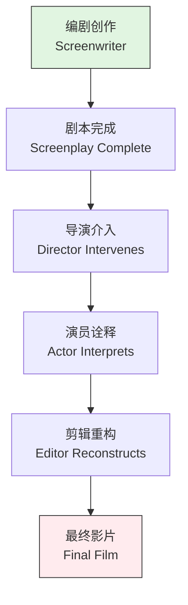
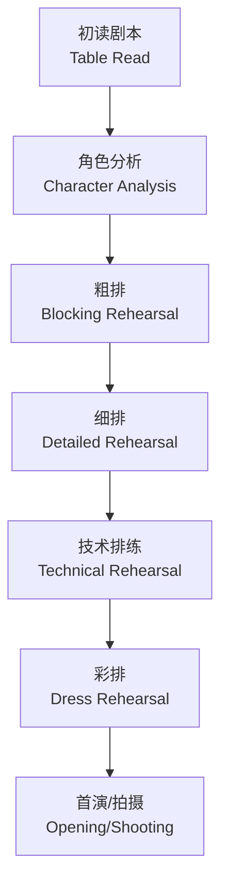

---
aliases:
  - 导演编剧与演员
  - Directing Screenwriting and Acting
  - 创作协作
  - 影视创作
tags:
  - directing
  - screenwriting
  - acting
  - collaboration
  - film-production
---

# 导演编剧与演员 (Directing, Screenwriting and Acting)

## 概述 (Overview)

电影与戏剧是集体艺术（Collaborative Art），导演（Director）、编剧（Screenwriter）与演员（Actor）构成创作铁三角。三者之间的关系既是艺术对话，也是权力博弈。理解这一协作机制，是理解影视制作（Film Production）本质的关键。

这一三角关系的动态可以用博弈论（Game Theory）描述：

$$\text{Creative Outcome} = f(\text{Director}, \text{Screenwriter}, \text{Actor}, \text{Constraints})$$

其中 Constraints 包括预算、时间、制片体系、市场需求等外部因素。

### 协作关系的类型 (Types of Collaboration)

| 模式 (Model) | 特征 (Characteristics) | 例子 (Example) |

| :-- | :-- | :-- |

| 作者模式 (Auteur Model) | 导演主导，编剧与演员服务导演 vision | 库布里克、王家卫 |

| 编剧主导 (Writer-Driven) | 编剧为核心，导演忠实执行剧本 | 早期好莱坞制片厂制度 |

| 演员中心 (Star System) | 明星演员决定项目与表演方向 | 好莱坞明星制 |

| 集体创作 (Collective) | 平等协作，共同决策 |  Dogme 95 运动 |

## 导演与编剧 (Director and Screenwriter)

### 从文本到影像 (From Text to Image)

导演与编剧的关系本质上是**翻译关系**：编剧将故事翻译为文字，导演将文字翻译为视听语言。

这种翻译不是逐字对应，而是**创造性转码**（Creative Transcoding）：

$$\text{Film} = \text{Director's Interpretation}(\text{Screenplay})$$

**导演对剧本的改造方式：**

1. **视觉化**（Visualization）：将描述转化为具体画面
2. **节奏化**（Rhythmization）：通过剪辑控制叙事节奏
3. **空间化**（Spatialization）：通过场面调度构建空间意义
4. **表演化**（Performance-Oriented）：通过演员实现文本潜台词

### 编剧的困境 (The Screenwriter's Dilemma)

编剧常面临**作者性丧失**（Loss of Authorship）的困境：

编剧的文本经过多层中介，最终形态往往与初衷相去甚远。这引发了关于"谁是电影作者"的持续争论。

### 导演编剧一体化 (Director-Screenwriter Integration)

许多伟大的导演同时也是编剧，这种一体化（Integration）减少了创作摩擦：

| 导演/编剧 (Director/Screenwriter) | 代表作 (Masterpiece) | 协作优势 (Collaborative Advantage) |

| :-- | :-- | :-- |

| 比利·怀尔德 (Billy Wilder) | 《日落大道》 | 文本与影像的精确对应 |

| 科恩兄弟 (Coen Brothers) | 《冰血暴》 | 统一的美学世界观 |

| 昆汀·塔伦蒂诺 (Quentin Tarantino) | 《低俗小说》 | 对话风格与视觉风格的统一 |

| 诺兰 (Christopher Nolan) | 《盗梦空间》 | 复杂叙事的完整控制 |

## 导演与演员 (Director and Actor)

### 导演的表演指导 (Directing Actors)

导演指导演员的方法论多种多样，反映了不同的表演哲学：

**方法派导演（Method Direction）：**

鼓励演员从内在体验出发，通过情感记忆（Emotional Memory）实现真实表演。导演李·斯特拉斯伯格（Lee Strasberg）的传承者包括：

- 伊利亚·卡赞（Elia Kazan）
- 西德尼·波拉克（Sydney Pollack）

**技术派导演（Technical Direction）：**

强调外在技巧与精确控制，演员是导演的"工具"：

- 阿尔弗雷德·希区柯克（Alfred Hitchcock）的"演员应当被像牛一样对待"（Actors should be treated like cattle）
- 斯坦利·库布里克（Stanley Kubrick）的多次重复拍摄

**即兴派导演（Improvisational Direction）：**

给予演员创作自由，在框架内即兴发挥：

- 约翰·卡萨维茨（John Cassavetes）
- 迈克·李（Mike Leigh）

### 导演与演员的沟通 (Communication)

有效的导演-演员沟通需要跨越专业语言的鸿沟：

| 导演语言 (Director's Language) | 演员理解 (Actor's Understanding) | 效果 (Effect) |

| :-- | :-- | :-- |

| "再慢一点" | 降低动作速度 | 可能显得做作 |

| "你在这里想要什么？" | 明确角色的目标 | 增强动机感 |

| "记住你失去的一切" | 激活情感记忆 | 增强情感深度 |

| "不要表演，只要存在" | 减少技巧痕迹 | 增强自然感 |

### 权力动态 (Power Dynamics)

导演与演员的权力关系受多重因素影响：

$$\text{Power Balance} = f(\text{Star Status}, \text{Director's Track Record}, \text{Budget}, \text{Studio Support})$$

- **明星制**（Star System）下，大牌演员可能凌驾于导演之上
- **独立制作**（Independent Production）中，导演权威通常更强
- **首次合作的导演与明星**往往存在试探与博弈

## 编剧与演员 (Screenwriter and Actor)

### 从文本到身体 (From Text to Body)

演员是编剧文本的**最终诠释者**。编剧通过以下方式为演员创造条件：

1. **动作描述**（Action Description）：提供行为的物质基础
2. **潜台词设计**（Subtext Design）：在字面之下埋藏真实意图
3. **节奏标记**（Rhythm Markers）：通过标点、段落控制表演节奏
4. **背景信息**（Backstory）：提供角色的心理历史

### 演员对剧本的反馈 (Actor's Feedback)

优秀的演员会向编剧提出建设性反馈：

- **台词的自然度**：口语化 vs. 书面化
- **动作的可行性**：舞台/场景限制
- **角色的连贯性**：动机是否一致
- **情感的真实性**：是否符合人性逻辑

## 选角 (Casting)

### 选角的艺术与科学 (Art and Science of Casting)

选角（Casting）是导演、编剧与制片人共同参与的决策过程。好的选角是"角色找到了正确的人"：

$$\text{Casting Fit} = \text{Physical Match} \times \text{Acting Ability} \times \text{Star Power} \times \text{Chemistry}$$

**选角考虑维度：**

| 维度 (Dimension) | 问题 (Question) | 优先级 (Priority) |

| :-- | :-- | :-- |

| 外貌匹配 (Physical Match) | 是否符合角色描述？ | 高 |

| 表演能力 (Acting Ability) | 能否完成角色的复杂度？ | 高 |

| 明星效应 (Star Power) | 能否吸引投资与观众？ | 中 |

| 化学反应 (Chemistry) | 与其他演员是否协调？ | 高 |

| 可工作性 (Workability) | 是否准时、敬业、合作？ | 高 |

### 类型化选角 vs. 反类型选角 (Type Casting vs. Against Type)

- **类型化选角**（Type Casting）：利用演员既有形象，降低观众认知成本
- **反类型选角**（Against Type）：打破期待，创造新意与惊喜

## 排练 (Rehearsal)

### 排练的方法论 (Methodologies of Rehearsal)

排练（Rehearsal）是将文本转化为表演的工作过程。不同传统有不同的排练哲学：

**戏剧排练（Theater Rehearsal）：**

- 周期长（数周至数月）
- 强调身体训练与角色内化
- 导演与演员深度互动
- 最终成果为现场表演

**电影排练（Film Rehearsal）：**

- 周期短（数天至数周）
- 强调镜头前的精确性
- 可能包含即兴探索
- 最终成果为剪辑后的影像

### 排练阶段模型 (Rehearsal Stage Model)

## 表演 (Performance)

### 表演的理论传统 (Theoretical Traditions of Acting)

**斯坦尼斯拉夫斯基体系（Stanislavski System）：**

康斯坦丁·斯坦尼斯拉夫斯基（Konstantin Stanislavski）创立了现代表演理论的基石：

- **给定情境**（Given Circumstances）：角色所处的客观条件
- **魔法如果**（Magic If）：演员设身处地的想象工具
- **情感记忆**（Emotional Memory）：利用个人经历激活情感
- **超目标**（Super-Objective）：角色贯穿全剧的根本欲望

**布莱希特式表演（Brechtian Acting）：**

贝尔托·布莱希特（Bertolt Brecht）反对情感认同，主张**间离效果**（Verfremdungseffekt）：

- 演员与角色保持距离
- 直接对观众说话
- 揭示社会的因果关系
- 鼓励理性批判而非情感沉浸

**梅耶荷德生物力学（Meyerhold's Biomechanics）：**

弗谢沃洛德·梅耶荷德（Vsevolod Meyerhold）强调身体的机械精确性：

$$\text{Performance} = \text{Physical Score} + \text{External Expression}$$

### 镜头前的表演 (Acting for the Camera)

电影表演与舞台表演有本质区别：

| 维度 (Dimension) | 舞台表演 (Stage Acting) | 电影表演 (Film Acting) |

| :-- | :-- | :-- |

| 观众距离 | 远，需夸张 | 近，需微妙 |

| 时空连续性 | 线性，不可中断 | 非线性，可重拍 |

| 声音控制 | 需投射 | 可自然对话 |

| 动作幅度 | 大 | 小 |

| 最终控制权 | 演员 | 导演与剪辑师 |

## 结语 (Conclusion)

导演、编剧与演员（Directing, Screenwriting and Acting）的三方协作是影视艺术的核心机制。从选角（Casting）的精准匹配到排练（Rehearsal）的深度磨合，从导演的指导到演员的表演，每一环节都关乎最终作品的成败。

正如英格玛·伯格曼（Ingmar Bergman）所言："导演的工作是创造一种氛围，让演员能够自由而真实地表达自己。"在这种理想状态下，导演、编剧与演员不再是分离的个体，而是共同构成一个有机的创作生命体。
