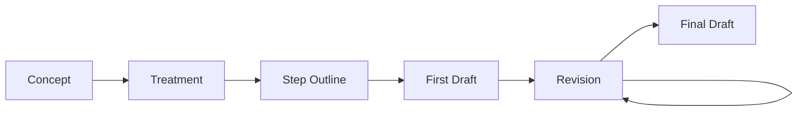
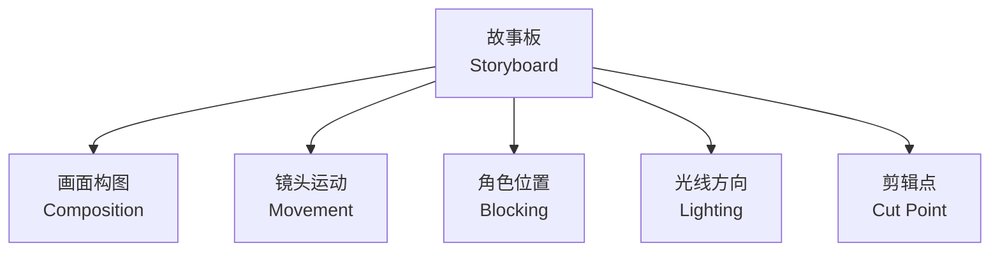
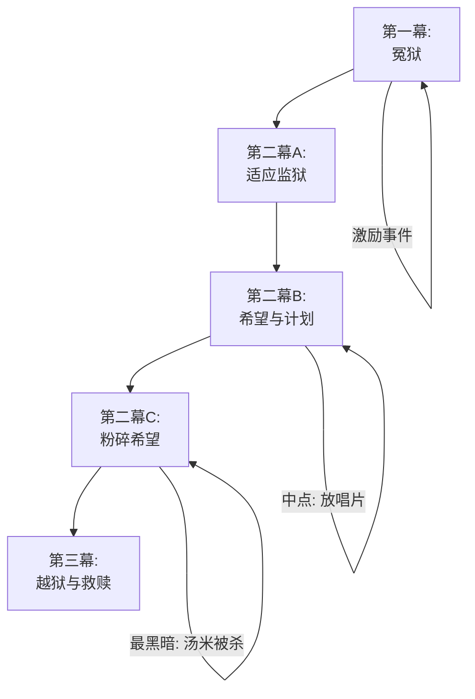
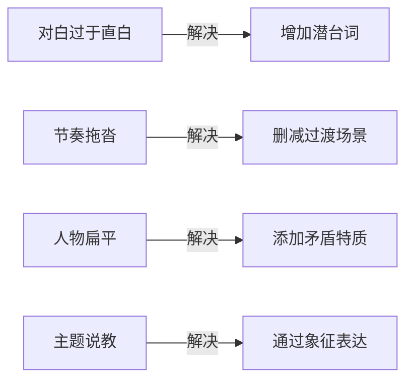

---
aliases:
  - 编剧技巧与案例
  - Screenwriting Techniques and Cases
  - 编剧技巧
  - 剧本创作方法
tags:
  - screenwriting
  - scriptwriting
  - film-writing
  - story-structure
  - case-studies
---

# 编剧技巧与案例

## 一、剧本开发流程 (Script Development Process)

### 1.1 从创意到剧本的完整路径

| 阶段 | 产出物 | 字数/页数 | 说明 |
|------|--------|-----------|------|
| 概念 (Concept) | Logline | 1-2句 | 一句话概括故事 |
| 大纲 (Treatment) | 故事梗概 | 3-10页 | 完整故事脉络 |
| 分场 (Step Outline) | 场景列表 | 每场1-2行 | 场景编号与意图 |
| 初稿 (First Draft) | 完整剧本 | 90-120页 | 不追求完美 |
| 修改稿 (Revision) | 修正版本 | 同上 | 多次迭代 |
| 定稿 (Final Draft) | 拍摄本 | 带编号场景 | 可供拍摄 |



---

## 二、Logline 写作技巧

### 2.1 Logline 公式

经典的Logline结构为：

> **当 [主角] 遭遇 [激励事件]，他/她必须 [核心行动]，否则 [失败后果]。**

例题解析：

| 电影 | Logline | 关键要素 |
|------|---------|----------|
| 《寄生虫》 | 一个贫穷家庭通过伪装身份渗透进富人家，却发现了地下室的秘密 | 伪装 + 阶级冲突 |
| 《盗梦空间》 | 一个盗梦者必须完成"植入想法"这一不可能任务，才能回到孩子身边 | 任务 + 情感动力 |

### 2.2 Logline 质量检查清单

- [ ] 主角是否有明确的欲望？ (Clear Desire)
- [ ] 障碍是否足够强大？ (Strong Obstacle)
- [ ]  stakes 是否足够高？ (High Stakes)
- [ ] 是否有独特的设定？ (Unique Premise)
- [ ] 是否引发了好奇心？ (Curiosity Hook)

---

## 三、Treatment 撰写 (Treatment Writing)

### 3.1 Treatment 的核心要素

Treatment 相当于电影的蓝图，应包括：

1. **标题与类型 (Title & Genre)**
2. **主题陈述 (Theme Statement)**
3. **角色简介 (Character Bios)**
4. **三幕概要 (Three-Act Summary)**
5. **关键场景描述 (Key Scene Descriptions)**

### 3.2 Treatment 示例框架

```
片名: [暂定名]
类型: 悬疑/犯罪
主题: 真相与救赎

第一幕:
- 开场画面: [视觉锚点]
- 主角介绍: [人物速写]
- 激励事件: [转折点]

第二幕:
- A故事: [外部冲突]
- B故事: [情感线]
- 中点: [假胜利/假失败]
- 最黑暗时刻: [低谷]

第三幕:
- 高潮: [关键对决]
- 结局: [情感收束]
```

---

## 四、分镜与故事板 (Storyboarding)

### 4.1 故事板绘制要点



每一个故事板方格应标注：

| 字段 | 内容 |
|------|------|
| 镜头编号 (Shot#) | SC-001 |
| 镜头时长 (Duration) | 3.5s |
| 景别 (Shot Size) | MS |
| 镜头运动 (Movement) | Dolly In |
| 声音 (Audio) | 环境音 + 对白 |
| 备注 (Notes) | 变速后期处理 |

---

## 五、经典案例研究 (Case Studies)

### 5.1 《肖申克的救赎》结构分析



### 5.2 《寄生虫》层级叙事

奉俊昊在《寄生虫》中构建了多层叙事结构：

| 层级 | 内容 | 象征物 |
|------|------|--------|
| 表层 (Surface) | 一个家庭的伪装计划 | 伪造的证件 |
| 中层 (Middle) | 两个家庭的阶级对抗 | 楼梯、气味 |
| 深层 (Deep) | 资本的暴力与人性异化 | 石头、灯光 |

### 5.3 反转技巧 (Plot Twist)

#### 反转的三种类型

| 类型 | 定义 | 案例 |
|------|------|------|
| 信息反转 (Information Twist) | 观众获得新信息 | 《第六感》他是鬼 |
| 视角反转 (Perspective Twist) | 重新解读前情 | 《消失的爱人》日记谎言 |
| 身份反转 (Identity Twist) | 身份揭示 | 《非常嫌疑犯》凯泽·索兹 |

---

## 六、重写技巧 (Rewriting Techniques)

### 6.1 重写的层次

- **宏观重写 (Macro Rewrite)**：调整结构、删除或增设角色
- **中观重写 (Meso Rewrite)**：重写场景、重组对白
- **微观重写 (Micro Rewrite)**：润色台词、删除赘词

### 6.2 重写检查工具

| 工具 | 目的 |
|------|------|
| 朗读测试 (Read-Aloud) | 检查对白自然度 |
| 冷处理 (Cold Read) | 间隔一周后再读 |
| 反馈小组 (Feedback Group) | 获取外部视角 |
| 删减法 (Cut by 10%) | 强制精简 |

### 6.3 常见问题修正指南



---

## 七、格式规范 (Formatting Standards)

### 7.1 标准剧本格式

- **场景标题 (Slug Line)**：INT./EXT. 地点 — 时间
- **动作描述 (Action)**：现在时态，简洁有力
- **角色名 (Character)**：居中大写
- **对白 (Dialogue)**：角色名下居中
- **括号提示 (Parenthetical)**：简短动作提示

### 7.2 一页一分钟原则

剧本写作的一个经验法则是：**一页剧本约等于一分钟银幕时间**。标准电影剧本应在 90-120 页之间。

---

> **好剧本不是写出来的，是改出来的。**
