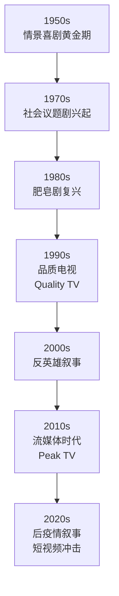
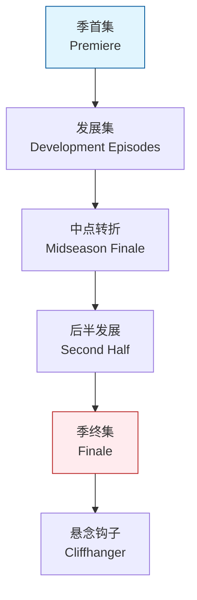

---
aliases:
  - 电视艺术
  - Television Arts
  - TV Arts
  - 电视学
  - Broadcast Arts
tags:
  - television
  - broadcast
  - media
  - visual-arts
  - narrative
---

# 电视艺术 (Television Arts)

## 概述 (Overview)

电视艺术（Television Arts）研究电视（Television）作为媒介、艺术形式与文化机构的特性。与电影不同，电视具有**日常性**（Daily）、**连续性**（Seriality）与**家庭性**（Domesticity）特征，这些特性深刻影响了其叙事方式、视觉风格与观众关系。

电视不仅是技术媒介，更是20世纪最重要的文化基础设施之一。从广播时代的"电子壁炉"到流媒体时代的"算法推荐"，电视始终是塑造集体想象与个体经验的核心力量。

### 电视与电影的区别 (Television vs. Cinema)

| 维度 (Dimension) | 电影 (Cinema) | 电视 (Television) |

| :-- | :-- | :-- |

| 观看环境 | 黑暗的公共影院 | 明亮的家庭客厅 |

| 屏幕尺寸 | 大银幕 | 小屏幕 |

| 叙事单元 | 90-180分钟 | 30-60分钟（单集） |

| 观众关系 | 一次性消费 | 长期陪伴 |

| 经济模式 | 票房驱动 | 广告/订阅驱动 |

| 视觉风格 | 高对比度、大景深 | 适中对比、中景为主 |

| 时间结构 | 闭环叙事 | 开放式连续叙事 |

## 电视类型 (Television Genres)

### 主要电视类型 (Major TV Genres)

电视类型（Genre）的划分反映了观众需求与工业生产的平衡：

| 类型 (Genre) | 格式 (Format) | 特征 (Characteristics) | 例子 (Examples) |

| :-- | :-- | :-- | :-- |

| 情景喜剧 (Sitcom) | 30分钟，多机位 | 固定场景、笑点密集、角色稳定 | 《老友记》、《生活大爆炸》 |

| 剧情连续剧 (Drama Series) | 60分钟，单机位 | 复杂叙事、角色发展、社会议题 | 《黑道家族》、《绝命毒师》 |

| 肥皂剧 (Soap Opera) | 日日播出 | 多条线索、情感戏剧、永不结束 | 《加冕街》、《综合医院》 |

| 真人秀 (Reality TV) | 多变 | 非职业演员、情境设置、"真实"叙事 | 《幸存者》、《老大哥》 |

| 新闻节目 (News) | 固定时段 | 时效性、客观性、公共性 | 《新闻联播》、CNN |

| 纪录片 (Documentary) | 系列或单集 | 非虚构、调查、教育 | 《宇宙时空之旅》 |

### 类型的演变 (Genre Evolution)

电视类型并非固定不变，而是随社会文化变迁而演化：

## 分集结构 (Episodic Structure)

### 连续剧 vs. 系列剧 (Series vs. Serial)

电视叙事的核心区别在于**系列性**（Series）与**连续性**（Seriality）：

**系列剧（Episodic Series）：**

- 每集故事相对独立
- 角色状态在集间基本不变
- 观众可以从任意一集进入
- 例子：《神探夏洛克》早期季、《犯罪心理》

**连续剧（Serial / Serialized Drama）：**

- 故事跨越多集甚至多季
- 角色经历长期发展
- 需要按顺序观看
- 例子：《权力的游戏》、《绝命毒师》

### 分集叙事结构 (Episodic Narrative Structure)

单集电视剧通常遵循以下结构：

$$\text{Episode} = \text{Cold Open} + 3 \times \text{Act} + \text{Tag}$$

| 部分 (Part) | 功能 (Function) | 时长 (Duration) |

| :-- | :-- | :-- |

| 冷开场 (Cold Open) | 吸引注意力，建立悬念 | 2-5分钟 |

| 第一幕 (Act I) | 建立情境，引入冲突 | 8-12分钟 |

| 第二幕 (Act II) | 发展冲突，复杂化 | 8-12分钟 |

| 第三幕 (Act III) | 高潮与解决 | 8-12分钟 |

| 尾声 (Tag) | 情感收束，悬念钩子 | 1-3分钟 |

注：以上时长为去除广告后的净时长。

### 季的结构 (Season Architecture)

整季（Season）作为更大的叙事单元，需要平衡**集内闭合**（Episode Closure）与**季内悬念**（Season Arc）：

## 视觉叙事 (Visual Storytelling)

### 电视的视觉语法 (Visual Grammar of Television)

电视的视觉风格受技术条件与观看环境的制约：

**镜头偏好（Shot Preferences）：**

- **中景与近景为主**：小屏幕需要更近的距离
- **双人镜头**（Two-Shot）：对话场景的常规选择
- **反应镜头**（Reaction Shot）：捕捉观众共鸣

**灯光风格（Lighting Style）：**

- **三点布光**（Three-Point Lighting）：基础配置
- **高调照明**（High-Key Lighting）：喜剧与日间节目
- **低调照明**（Low-Key Lighting）：剧情与夜间节目

### 多机位 vs. 单机位 (Multi-Camera vs. Single-Camera)

| 特征 (Feature) | 多机位 (Multi-Camera) | 单机位 (Single-Camera) |

| :-- | :-- | :-- |

| 拍摄方式 | 同时多机拍摄 | 逐镜头拍摄 |

| 典型类型 | 情景喜剧 | 剧情剧、单镜头喜剧 |

| 视觉风格 | 舞台剧感、固定机位 | 电影感、灵活机位 |

| 表演节奏 | 连续表演，类似戏剧 | 分段表演，类似电影 |

| 观众存在 | 通常有现场观众 | 无现场观众 |

| 剪辑方式 | 直播切换或快速剪辑 | 后期精细剪辑 |

## 广播媒体 (Broadcast Media)

### 电视的传播模式 (Modes of Transmission)

电视作为广播媒体（Broadcast Media），经历了多次技术-制度变革：

**地面广播（Terrestrial Broadcast）：**

- 通过电波免费传播
- 广告支持模式
- 公共电视与商业电视并存
- 频道资源有限

**有线电视（Cable Television）：**

- 付费订阅模式
- 频道数量大增
- 专业化频道出现（HBO、Discovery）
- 突破广告依赖

**卫星电视（Satellite Television）：**

- 覆盖范围广
- 跨国传播
- 全球化内容流动

**流媒体（Streaming）：**

- 互联网点播
- 算法推荐
-  binge-watching 文化
- 数据驱动的内容生产

### 电视的公共功能 (Public Function of Television)

电视作为公共领域（Public Sphere）的一部分，承担社会责任：

$$\text{Television's Public Value} = \text{Information} + \text{Education} + \text{Entertainment} + \text{Integration}$$

**新闻与公共事务：**

- 信息传播与舆论监督
- 选举报道与民主参与
- 危机时刻的公共通知系统

**文化功能：**

- 文化遗产的记录与传播
- 民族认同的建构
- 代际记忆的存储

## 电视叙事理论 (Television Narrative Theory)

### 连续叙事的美学 (Aesthetics of Seriality)

连续叙事（Serial Narrative）创造了独特的美学体验：

**长期角色发展（Long-Term Character Development）：**

与电影的压缩弧线不同，电视剧可以展开**超长线性发展**：

$$\text{TV Character Arc} = \sum_{i=1}^{n} \text{Episode Arc}_i$$

其中 $n$ 可以达到数百集。

**集体记忆与怀旧（Collective Memory and Nostalgia）：**

长期播出的电视剧成为**代际共享文本**：

- 《老友记》（*Friends*）定义了90年代城市青年文化
- 《请回答1988》成为韩国集体记忆的载体

### 品质电视 (Quality Television)

1990年代以来，"品质电视"（Quality TV）概念兴起，模糊了电视与电影的界限：

| 品质电视特征 (Quality TV Features) | 传统电视 (Traditional TV) |

| :-- | :-- |

| 电影化视觉风格 | 标准化视觉 |

| 复杂叙事结构 | 简单线性叙事 |

| 反英雄主角 | 正面英雄 |

| 道德模糊性 | 善恶分明 |

| 作者导演参与 | 制片人中心制 |

| 文学性对话 | 口语化对话 |

代表：《黑道家族》（*The Sopranos*）、《火线》（*The Wire*）、《广告狂人》（*Mad Men*）

## 流媒体时代的电视 (Television in the Streaming Age)

### 平台逻辑 (Platform Logic)

Netflix、Amazon Prime、Disney+ 等平台重塑了电视的生产与消费：

**算法推荐（Algorithmic Curation）：**

$$\text{Recommendation} = f(\text{Viewing History}, \text{Demographics}, \text{Similar Users}, \text{Platform Strategy})$$

** binge-watching 文化：**

- 整季一次性上线
- 观看节奏由观众控制
- 改变了叙事节奏的设计
- "下一集"按钮的心理机制

### 全球电视 (Global Television)

流媒体促进了电视内容的全球化流动：

| 现象 (Phenomenon) | 说明 (Description) | 例子 (Example) |

| :-- | :-- | :-- |

| 非英语内容崛起 | 语言壁垒降低 | 《鱿鱼游戏》、《暗黑》 |

| 文化混杂 | 跨国合作生产 | 《王冠》（英美合作） |

| 类型全球化 | 成功模式的跨国复制 | 韩国丧尸剧、北欧 Noir |

| 粉丝字幕组 | 非官方翻译传播 | 早期美剧在中国 |

## 结语 (Conclusion)

电视艺术（Television Arts）展现了媒介技术的文化可能性。从广播时代的"大众媒介"到流媒体时代的"个性化内容"，电视始终在重新定义叙事、观看与公共生活的边界。

正如雷蒙德·威廉姆斯（Raymond Williams）提出的"流动的藏私"（Mobile Privatization）概念，电视 paradoxically 同时实现了**公共连接**与**私人体验**。这种张力，正是电视艺术最深刻的文化命题。
