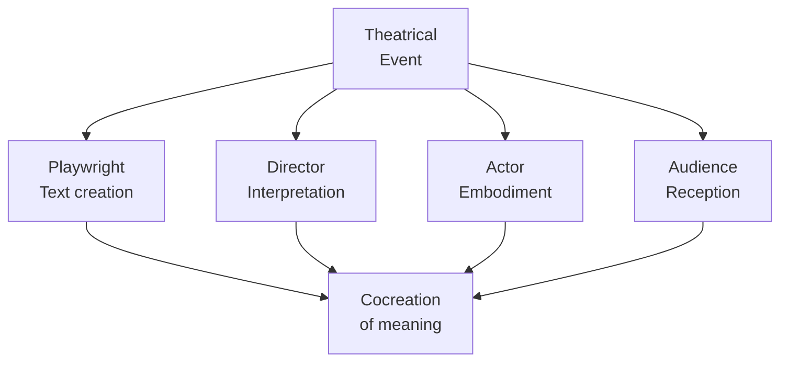
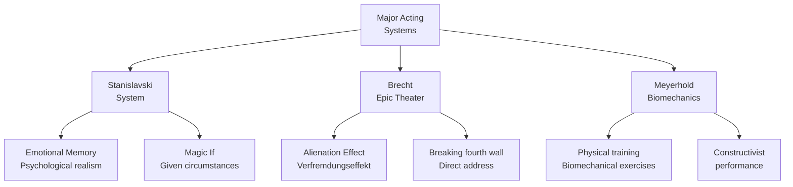
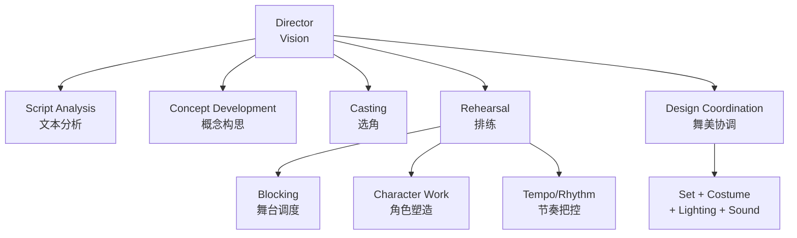
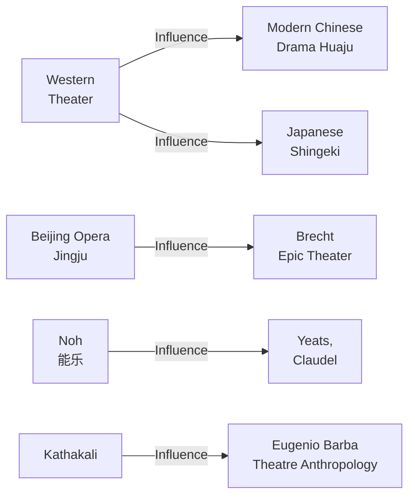

# Theater Studies（戏剧学）

## 一、概述

**Theater Studies（戏剧学）** 是研究戏剧艺术本质、创作方法、表演理论和历史演变的学科。戏剧（Drama/Theater）不同于电影和电视的核心在于：**现场性（Liveness）**——演员与观众在同一时空共同创造体验。

### 1.1 戏剧的三元结构

$$ \text{戏剧} = \text{文本（Text）} + \text{表演（Performance）} + \text{观众（Audience）} $$

### 1.2 与相关学科的关系

| 学科 | 关系 | 区别 |
|------|------|------|
| 文学研究 | 戏剧文学是文本基础 | 戏剧强调演出而非阅读 |
| 电影研究 | 同为表演艺术 | 戏剧是现场，电影是录制 |
| 舞蹈学 | 同为身体的舞台艺术 | 戏剧重语言/叙事 |
| 社会学 | 研究剧场社会功能 | 侧重艺术本体论 |

## 二、戏剧结构

### 2.1 亚里士多德的六要素

Aristotle 在《诗学》（Poetics）中提出悲剧的六要素，按重要性排列：

| 排名 | 要素 | 中文 | 含义 |
|------|------|------|------|
| 1 | Plot | 情节 | 事件的有序安排 |
| 2 | Character | 性格 | 行动的人 |
| 3 | Thought | 思想 | 台词表达的观点 |
| 4 | Diction | 措辞 | 语言表达方式 |
| 5 | Spectacle |  spectacle | 视觉呈现 |
| 6 | Song | 歌曲 | 音乐成分 |

### 2.2 三幕结构

经典的三幕结构（Three-Act Structure）公式：

$$ \text{第一幕（Setup）} \xrightarrow{\text{激励事件}} \text{第二幕（Rising Action）} \xrightarrow{\text{高潮}} \text{第三幕（Resolution）} $$

### 2.3 Freytag 金字塔

Gustav Freytag 的五阶段模型是对亚里士多德结构的完善：

1. **Exposition（交代）**：背景与人物介绍
2. **Rising Action（上升动作）**：冲突逐渐激化
3. **Climax（高潮）**：冲突达到顶点
4. **Falling Action（下落动作）**：紧张释放
5. **Catastrophe / Denouement（结局/收束）**：冲突解决

$$ \text{Exposition} \to \text{Rising} \nearrow \text{Climax} \searrow \text{Falling} \to \text{Denouement} $$

## 三、表演理论

### 3.1 三大表演体系

### 3.2 Stanislavski 体系

Konstantin Stanislavski 的体系（System）是西方现代表演理论的基石：

**核心概念**：
1. **Magic If（神奇的假如）**：演员问自己「如果我是这个角色，在这种情况下会怎样？」
2. **Emotional Memory（情绪记忆）**：从自身经历中调用真实情感
3. **Given Circumstances（给定情境）**：角色所处的全部外部条件
4. **Super-objective（最高任务）**：角色行动的根本动机
5. **Subtext（潜台词）**：台词背后的真实意图

$$ \text{角色行动} = f(\text{最高任务}, \text{给定情境}, \text{潜台词}) $$

### 3.3 Brecht 的间离效果

Bertolt Brecht 反对亚里士多德的净化说（Catharsis），主张**史诗剧场（Epic Theater）**：

**间离效果（Verfremdungseffekt / Alienation Effect）** 的核心：

| 传统剧场 | Brecht 剧场 |
|---------|------------|
| 观众投入情感 | 观众保持理性 |
| 第四堵墙 | 打破第四堵墙 |
| 线性叙事 | 片段式叙事 |
| 角色认同 | 角色批判 |
| 结局不可避免 | 结局可以改变 |

Brecht 的名言：

> 戏剧的目的不是解释世界，而是改变世界。

$$ \text{观众定位：由「我感受到」变为「我观察并判断」} $$

### 3.4 Meyerhold 的有机造型术

Vsevolod Meyerhold 提出**生物力学（Biomechanics）** 表演训练法：

$$ \text{表演} = \text{物理动作} + \text{节奏} + \text{空间关系} $$

**训练三原则**：
1. **拒绝（Otkaz）**：准备动作
2. **实施（Posyl）**：执行动作
3. **结束（Stoika）**：停顿与定型

## 四、导演艺术

### 4.1 导演的职能

导演（Director）是现代戏剧创作的核心协调者：

### 4.2 重要导演流派

| 流派 | 代表 | 理念 |
|------|------|------|
| 自然主义 | André Antoine | 舞台是生活的切片 |
| 象征主义 | Adolphe Appia | 灯光与空间的诗意 |
| 表现主义 | Erwin Piscator | 政治宣传与多媒体 |
| 残酷戏剧 | Antonin Artaud | 感官冲击超越语言 |
| 贫困戏剧 | Jerzy Grotowski | 演员身体是唯一工具 |

## 五、舞台美术

### 5.1 设计要素

舞台美术（Scenography）涵盖五个维度：

$$ \text{Scenography} = f(\text{空间}, \text{灯光}, \text{服装}, \text{音效}, \text{道具}) $$

### 5.2 舞台形式

| 类型 | 观众位置 | 特点 |
|------|---------|------|
| 镜框式（Proscenium） | 正面 | 第四堵墙 |
| 伸出式（Thrust） | 三面 | 更亲密 |
| 圆形剧场（Arena） | 四面 | 环绕 |
| 黑箱剧场（Black Box） | 可变 | 最灵活 |
| 环境剧场（Site-specific） | 不定 | 打破剧场界限 |

## 六、跨文化戏剧

### 6.1 东西方交流

### 6.2 中国戏曲美学

中国戏曲（Chinese Traditional Opera）的核心美学原则：

- **虚拟性（Virtuality）**：一桌二椅象征千军万马
- **程式化（Stylization）**：固定的唱念做打模式
- **写意性（Freehand Expression）**：追求神似而非形似

$$ \text{理论公式：} \frac{\text{表演}}{\text{现实}} \approx \text{写意的比例} $$

## 七、戏剧批评

### 7.1 批评方法

| 方法 | 关注点 | 问题示例 |
|------|--------|---------|
| 形式主义 | 结构、语言、技法 | 剧本结构是否完整？ |
| 再现理论 | 与现实的关系 | 是否真实反映了社会？ |
| 表现理论 | 创作者的表达 | 导演的意图是否清晰？ |
| 接受美学 | 观众的体验 | 观众如何理解？ |
| 文化研究 | 权力与身份 | 剧中的性别/阶级观念？ |

### 7.2 观演关系（Actor-Audience Relationship）

$$ \text{戏剧意义} = \text{演员呈现} \times \text{观众解读} $$

**观演动态**：观众不仅是接受者，也是意义的共同创造者。每次演出的独特之处在于观众的实时反应影响演员的表演。

## 八、当代发展

1. **后戏剧剧场（Postdramatic Theatre）**：Hans-Thies Lehmann 提出，文本不再是中心
2. **沉浸式剧场（Immersive Theatre）**：观众成为参与者，如 Punchdrunk 的《Sleep No More》
3. **数字剧场（Digital Theatre）**：疫情催生的在线剧场实践
4. **应用戏剧（Applied Theatre）**：教育剧场、社区剧场、监狱剧场

## 九、关键概念速查

| 术语 | 中文 | 定义 |
|------|------|------|
| Catharsis | 净化 | 通过怜悯与恐惧获得情感释放 |
| Hamartia | 过失 | 悲剧英雄的致命错误 |
| Anagnorisis | 发现 | 主人公对真相的认识 |
| Peripeteia | 逆转 | 命运的转折 |
| Mimesis | 摹仿 | 对现实的模仿 |

## 十、核心文献

- **Aristotle** — Poetics（《诗学》）
- **Stanislavski, K.** — An Actor Prepares（《演员的自我修养》）
- **Brecht, B.** — A Short Organum for the Theatre
- **Artaud, A.** — The Theatre and Its Double（《戏剧及其重影》）
- **Grotowski, J.** — Towards a Poor Theatre
- **Lehmann, H-T.** — Postdramatic Theatre

---

[[06_ArtsAndCreativity/DramaAndFilm/INDEX|当前目录索引]]
