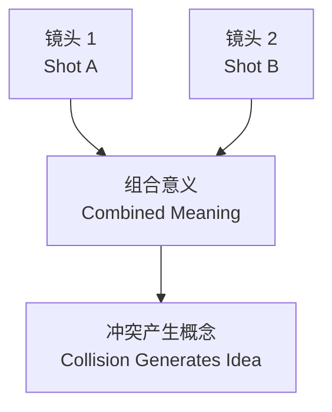

# 电影研究 (Film Studies)

## 一、电影史 (Film History)

### 早期电影 (Early Cinema, 1895–1915)

- **卢米埃尔兄弟 (Lumière Brothers)**：1895 年首次公开售票放映，《火车进站》(Arrival of a Train at La Ciotat)
- **乔治·梅里爱 (Georges Méliès)**：特技与叙事电影先驱，《月球旅行记》(A Trip to the Moon, 1902)
- **埃德温·S·波特 (Edwin S. Porter)**：剪辑技巧创新，《火车大劫案》(The Great Train Robbery, 1903)

### 经典好莱坞 (Classical Hollywood, 1915–1960)

- **D·W·格里菲斯 (D. W. Griffith)**：《一个国家的诞生》(The Birth of a Nation, 1915)，奠定叙事剪辑基础
- **制片厂制度 (Studio System)**：八大制片厂垄断生产、发行、放映
- **类型片 (Genre Films)**：西部片、黑色电影、歌舞片、喜剧片

### 世界电影运动 (World Cinema Movements)

| 运动名称 | 时期 | 代表导演 | 核心特征 |
|----------|------|----------|----------|
| 德国表现主义 (German Expressionism) | 1910s–1920s | F. W. Murnau, Fritz Lang | 夸张光影、倾斜构图 |
| 苏联蒙太奇 (Soviet Montage) | 1920s | Sergei Eisenstein | 剪辑创造意义 |
| 法国新浪潮 (French New Wave) | 1950s–1960s | Godard, Truffaut | 跳切、实景拍摄 |
| 意大利新现实主义 (Italian Neorealism) | 1940s–1950s | Rossellini, De Sica | 非职业演员、社会题材 |
| 日本电影黄金期 | 1950s | 黑泽明, 小津安二郎 | 人文主义、东方美学 |

## 二、电影类型 (Film Genres)

- **西部片 (Western)**：边疆、正义与荒野
- **黑色电影 (Film Noir)**：犯罪、道德模糊、低光摄影
- **恐怖片 (Horror)**：恐惧、超自然、心理惊悚
- **科幻片 (Science Fiction)**：未来科技、外星生命、反乌托邦
- **纪录片 (Documentary)**：真实记录、社会议题、文献价值

## 三、摄影与构图 (Cinematography)

### 镜头类型 (Shot Types)

```
极远景 (Extreme Long Shot)   →  建立环境
远景 (Long Shot)              →  展示主体与环境
中景 (Medium Shot)             →  人物上半身
特写 (Close-Up)                →  面部表情
极特写 (Extreme Close-Up)     →  局部细节
```

### 摄影机运动 (Camera Movement)

- **推轨 (Dolly / Tracking)**：摄影机沿轨道移动
- **摇镜 (Pan)**：机身水平旋转
- **俯仰 (Tilt)**：机身垂直旋转
- **手持 (Handheld)**：纪录感、不稳定感
- **斯坦尼康 (Steadicam)**：平稳跟拍
- **变焦 (Zoom)**：改变焦距

### 构图原则 (Composition Principles)

- **三分法 (Rule of Thirds)**
- **引导线 (Leading Lines)**
- **对称与黄金比例 (Symmetry & Golden Ratio)**
- **景深 (Depth of Field)**

## 四、剪辑 (Editing)

### 连续性剪辑 (Continuity Editing)

- **180 度规则 (180-Degree Rule)**：保持空间关系一致
- **30 度规则 (30-Degree Rule)**：避免同角度跳切
- **视线匹配 (Eye-Line Match)**：角色看向的方向
- **动作匹配 (Match on Action)**：动作连贯剪接

### 非连续性剪辑 (Discontinuity Editing)

- **跳切 (Jump Cut)**：打破时间连续性
- **蒙太奇 (Montage)**：通过镜头组合传达新意义
- **交叉剪辑 (Cross-Cutting)**：平行叙事

### 苏联蒙太奇理论 (Soviet Montage Theory)



爱森斯坦 (Eisenstein) 认为蒙太奇是**冲突 (Collision)**，而非连接。

## 五、声音 (Sound)

| 声音类型 | 定义 | 功能 |
|----------|------|------|
| 对白 (Dialogue) | 人物说话 | 传递信息、塑造角色 |
| 旁白 (Voice-Over) | 画外叙述 | 内心独白、评论 |
| 音效 (Sound Effects) | 环境与动作声音 | 增强真实感 |
| 背景音乐 (Underscore) | 非叙事音乐 | 营造氛围、暗示情绪 |
| 画内音 (Diegetic) | 故事世界内的声音 | 角色能听到 |
| 画外音 (Non-Diegetic) | 故事世界外的声音 | 观众独享 |

## 六、叙事理论 (Narrative Theory)

### 三幕结构 (Three-Act Structure)

```
第一幕 (Act I) —— 建立 (Setup)
   ├── 激励事件 (Inciting Incident)
   └── 转折点 (Plot Point 1)
第二幕 (Act II) —— 对抗 (Confrontation)
   ├── 上升动作 (Rising Action)
   └── 中点 (Midpoint) → 转折点 2
第三幕 (Act III) —— 解决 (Resolution)
   ├── 高潮 (Climax)
   └── 结局 (Denouement)
```

### 俄国形式主义叙事学 (Russian Formalist Narratology)

- **故事 (Fabula / Story)**：按时间顺序的事件
- **情节 (Sjuzhet / Plot)**：叙事呈现的顺序

### 作者论 (Auteur Theory)

强调导演为电影的作者，其个人风格在影片中一贯可辨。代表人物：特吕弗 (Truffaut)、安德鲁·萨里斯 (Andrew Sarris)。

## 七、电影理论流派 (Film Theory Schools)

- **形式主义 (Formalism)**：关注电影媒介本身的特质
- **现实主义 (Realism)**：电影应记录现实（巴赞 André Bazin）
- **结构主义 (Structuralism)**：分析电影的符号系统
- **精神分析 (Psychoanalytic)**：拉康理论在电影中的应用
- **女性主义 (Feminist Film Theory)**：劳拉·穆尔维 (Laura Mulvey) 的男性凝视 (Male Gaze)
- **后殖民理论 (Post-Colonial)**：东方主义在电影中的表现

## 八、分析方法 (Analytical Methods)

1. **文本分析 (Textual Analysis)**：逐镜头分解
2. **语境分析 (Contextual Analysis)**：历史、社会、政治背景
3. **比较分析 (Comparative Analysis)**：跨影片、跨文化对比
4. **接受分析 (Reception Analysis)**：观众反应与解读

### 镜头分解表示法

```
镜头编号 | 景别 | 镜头运动 | 内容描述 | 声音 | 时长
--------------------------------------------------------
SC-01    | MLS  | PAN      | 主角走入房间 | TV BG | 12s
SC-02    | CU   | STATIC   | 发现信件   | SFX   | 8s
```

## 九、重要概念 (Key Concepts)

- **缝合 (Suture)**：观众被纳入电影叙事的过程
- **场面调度 (Mise-en-Scène)**：画面内一切元素的安排
- **电影化空间 (Cinematic Space)**：通过镜头创造的虚构空间
- **长镜头 (Long Take)**：长时间连续拍摄（如《俄罗斯方舟》全片一镜到底）

## 十、经典片目推荐 (Recommended Canonical Films)

- 《公民凯恩》(Citizen Kane, 1941) —— 奥森·威尔斯
- 《迷魂记》(Vertigo, 1958) —— 希区柯克
- 《八部半》(8½, 1963) —— 费德里科·费里尼
- 《东京物语》(Tokyo Story, 1953) —— 小津安二郎
- 《出租车司机》(Taxi Driver, 1976) —— 马丁·斯科塞斯
- 《七武士》(Seven Samurai, 1954) —— 黑泽明
