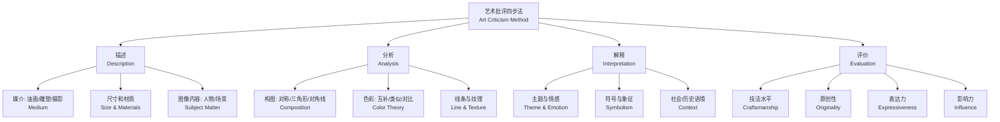

# 艺术批评（Art Criticism）

## 概述

艺术批评（Art Criticism）是对视觉艺术作品进行描述（Description）、分析（Analysis）、解释（Interpretation）和评价（Evaluation）的实践，是连接艺术作品、艺术家与观众之间的桥梁。它不同于艺术史（Art History）——后者追踪艺术发展的时间脉络；也不同于美学（Aesthetics）——后者哲学性地思考"美"的本质和艺术的定义。艺术批评的独特价值在于：它既是知识的应用，也是判断的实践；既是主观的体验表达，也需要客观的论证支撑。从狄德罗（Diderot）的沙龙评论到当代的学术期刊和自媒体批评，艺术批评始终在塑造公众对艺术的理解和艺术市场的走向。

## 艺术批评的方法框架

## 艺术批评的四步法

美国艺术教育家 Edmund Feldman 在其《艺术作为人类经验的变体》（Varieties of Visual Experience）中提出了经典的批评框架。该框架提供了一个从观察到判断的递进逻辑。

### 1. 描述（Description）

描述阶段回答"你看到了什么？"——只陈述客观事实，不加入价值判断：

- **媒介（Medium）**：油画（Oil on Canvas）、水彩（Watercolor）、雕塑（Sculpture）、摄影（Photography）、数字媒体（Digital Media）、混合材料（Mixed Media）等
- **尺寸和材质**：作品的物理尺寸（如 200 × 150 cm）和支撑材料（画布、木板、纸张）
- **可识别元素**：人物（数量、性别、年龄、姿态）、物体、建筑、自然元素、文字
- **色彩基调**：冷色调/暖色调、高饱和度/低饱和度、光泽度/哑光

描述是批评的基础——错误的描述会导致后续三个阶段失真。描述阶段的严谨性决定了批评的客观可信度。

### 2. 分析（Analysis）

分析阶段回答"作品是如何构成的？"——考察形式要素之间的结构关系：

$$ \text{构图（Composition）} \rightarrow \text{对称/不对称/三角形/对角线} $$
$$ \text{色彩（Color）} \rightarrow \text{互补色/类似色/色相对比/明度对比} $$
$$ \text{线条（Line）} \rightarrow \text{直线/曲线/断续/方向性} $$
$$ \text{黄金分割（Golden Ratio）} \rightarrow \frac{a}{b} = \frac{a+b}{a} = \varphi \approx 1.618 $$

色彩分析常用色相环模型。互补色（Complementary Colors）并置时产生强烈的视觉振动感——印象派画家大量运用这一原理：
$$ \text{红色（Red）} \leftrightarrow \text{绿色（Green）} $$
$$ \text{蓝色（Blue）} \leftrightarrow \text{橙色（Orange）} $$
$$ \text{黄色（Yellow）} \leftrightarrow \text{紫色（Purple）} $$

形式主义批评（Formalist Criticism）认为艺术的价值完全在于形式要素及其关系的质量，而非其再现的内容或承担的叙事功能。Greenberg 是这一立场最有力的倡导者。

### 3. 解释（Interpretation）

解释阶段回答"作品试图表达什么？"——探讨作品可能具有的深层含义：

- 作品的核心主题和中心思想
- 艺术家通过形式语言传达的情感和观念
- 符号和象征（Symbols and Allegory）的运用及其文化背景
- 作品的社会、历史、政治或哲学语境

$$ \text{作品的意义（Meaning）} = \text{艺术家的意图（Intention）} \times \text{观众的解读（Interpretation）} \times \text{文化语境（Context）} $$

解释需要避免过度解读（Over-interpretation）——不是画面中的每个物体都具有象征意义。有效的解释应当基于描述和分析阶段确立的扎实证据，并与作品所处的文化语境建立有说服力的关联。

### 4. 评价（Evaluation）

评价阶段回答"这件作品有多好？"——做出综合价值判断：

| 评价维度 | 评估问题 | 判断依据 |
|---------|---------|----------|
| 技法（Craftsmanship） | 技术水平和材料运用是否娴熟？ | 材料掌握度、技术难度、完成度 |
| 原创性（Originality） | 是否提供了新的视角或表达方式？ | 与传统/同代作品比较的差异性 |
| 表达力（Expressiveness） | 是否有效传达了预期的情感或思想？ | 情感共鸣度、意义传达效率 |
| 影响力（Influence） | 对艺术界或社会文化有何影响？ | 后续作品的引用、学术讨论热度 |
| 一致性（Coherence） | 作品的形式与内容是否统一？ | 手段与目的的匹配度 |

## 艺术批评中的描述语言

描述语言的选择本身就包含了批评立场。纯客观的描述在理论上
并不存在——批评家选择描述哪些元素本身就反映了其关注重点。
例如对一幅抽象画，形式主义批评家会描述线条的方向性、色彩
的饱和度和构图的均衡性；而精神分析批评家则会注意画面中的
象征性符号和可能反映的无意识冲突。描述语言的准确性和具体
性直接决定了后续分析和评价的可信度。模糊的描述如"这幅画
很美"缺乏分析价值；而"画面上方的钴蓝色块与右下角的赭石
色块形成了强烈的冷暖对比"则为后续分析提供了可操作的素材。
学习艺术批评的第一步就是掌握准确描述视觉经验的能力。

## 主要批评流派（Critical Approaches）

| 流派 | 关注焦点 | 核心假设 | 代表人物 |
|------|---------|----------|----------|
| 形式主义（Formalism） | 线条、色彩、构图的形式价值 | 艺术价值独立于内容和社会语境 | Clive Bell, Clement Greenberg |
| 语境主义（Contextualism） | 社会、政治、历史背景 | 艺术意义由语境决定 | 多元文化批评 |
| 符号学（Semiotics） | 图像作为符号系统的表意过程 | 意义由符号关系产生而非先天存在 | Roland Barthes, Charles S. Peirce |
| 精神分析（Psychoanalytic） | 无意识动机与观众心理反应 | 艺术作品是潜意识的投射 | Freud, Lacan, Julia Kristeva |
| 女性主义（Feminist） | 性别权力关系在艺术中的再现 | 传统艺术史排斥女性视角 | Linda Nochlin, Griselda Pollock |
| 后殖民（Postcolonial） | 殖民历史对艺术和文化身份的影响 | 非西方艺术被系统性边缘化 | Edward Said, Homi Bhabha |
| 马克思主义（Marxist） | 经济基础与上层建筑的关系 | 艺术反映生产关系和阶级意识形态 | Walter Benjamin, Theodor Adorno |

## 艺术批评文章的写作结构

一篇规范的批判性文章通常包括以下要素：标题表明批评立场或核心观点；导语介绍作品基本信息（艺术家、标题、年份、媒介）并点明核心论点；描述与分析段落有机结合所见与形式关系；解释段落深入解读作品的意义；评价段落基于前述分析做出综合价值判断；结语总结核心观点并提出延伸思考。

$$ \text{批评文章质量} = \frac{\text{论证的深度} \times \text{证据的充分性}}{\text{主观偏见的程度}} $$

## 艺术批评常用术语

$$ \text{Chiaroscuro：明暗对照法——文艺复兴绘画的体积塑造技法} $$
$$ \text{Sfumato：渐隐法——达·芬奇标志性的烟雾效果过渡} $$
$$ \text{Trompe-l'œil：视觉陷阱——极端写实的"骗眼"错觉技法} $$
$$ \text{Impasto：厚涂法——梵高和伦勃朗的厚颜料堆叠质感} $$
$$ \text{Alla Prima：直接画法——湿润画面上一次完成的快速技法} $$
$$ \text{Grisaille：灰色调单色画法——模拟雕塑感的绘画技法} $$
$$ \text{Pentimento：修正痕迹——画布上暴露的先前版本的痕迹} $$

## 艺术批评 vs 艺术史 vs 美学

| 领域 | 核心问题 | 研究对象 | 研究方法 |
|------|---------|----------|----------|
| 艺术批评 | 这件作品好不好？为什么？ | 具体作品 | 描述-分析-解释-评价 |
| 艺术史 | 艺术如何发展变化？ | 历史脉络 | 考证、分期、风格比较 |
| 美学 | 什么是美？艺术如何定义？ | 抽象概念 | 哲学思辨、概念分析 |

艺术批评同时借鉴艺术史的知识背景和美学的理论工具，但最终落脚点在具体的作品判断上。

## 批评写作示例框架

开头段：作品信息（艺术家、标题、年份、媒介）+ 核心论点
（例如"这幅画对传统宗教叙事进行了激进的重写"）。主体段 1
描述所见（媒介、尺寸、可识别内容）。主体段 2 分析形式
（构图、色彩、线条、纹理）。主体段 3 解释含义（符号解读、
主题分析、语境关联）。结论段综合评价 + 开放性问题延伸。

写作时应避免三个常见误区。一是过度描述而缺乏分析——"画面中
有一个人物"是描述而非分析。二是主观判断缺乏论证——"这幅画
很糟糕"需要具体说明糟糕在哪里。三是过度解读——并非画面中
的所有元素都承载象征意义。好的批评写作应当让读者即使没有
亲眼看到作品，也能通过批评家的语言建立起对作品的清晰理解。

## 数字时代的艺术批评

数字技术和社交媒体正在重塑艺术批评的生态。传统的专业批评
话语面临来自社交媒体评论、短视频平台和 AI 评论的竞争。
Instagram 和小红书等平台上的视觉内容评价形成了去中心化的
批评网络。AI 图像识别和自然语言处理技术能够自动生成对
作品的视觉描述和风格分析。然而，算法批评缺乏人类批评家的
文化语境意识和价值判断力。当代艺术批评需要面对日益模糊的
学科边界：艺术与设计、高与低、原创与挪用之间的界限不断
消解。批评家需要在碎片化的信息环境中保持独立判断和深度
思考的能力，同时适应跨媒体、跨学科的对话需求。

## 艺术批评的伦理问题

艺术批评涉及重要的伦理维度。批评家的利益冲突披露是基本
的职业道德要求——评论朋友的作品或受画廊资助的评论都需
明确声明。批评对市场的巨大影响力要求批评家在使用话语权时
保持审慎。社交媒体时代任何人都可以公开发表对作品的评价，
但专业批评家的判断因其知识体系和经验积累而具有独特的参考
价值。批评的多元性要求尊重不同文化背景下的审美标准——以
西方标准评判中国水墨画或非洲部落艺术的优劣是典型的文化
霸权。批评话语中的性别偏见和种族偏见也需要持续的自我反思。
好的批评是在尊重创作者努力的基础上提供有建设性的视角。

## 主要参考文献

1. Feldman, E. B. Varieties of Visual Experience. Abrams,
    1992.
2. Barrett, T. Criticizing Art: Understanding the Contemporary.
    McGraw-Hill, 2010.
3. Danto, A. C. The Abuse of Beauty. Open Court, 2003.
4. 易英. 西方当代艺术批评. 河北美术出版社, 2008.
5. 高名潞. 西方艺术史观念. 北京大学出版社, 2014.
6. Berger, J. Ways of Seeing. BBC/Penguin, 1972.

## 经典批评文章推荐

阅读优秀的艺术批评文章是提高批评写作能力的有效方法。学习
写作之初可参照高名潞的《西方艺术史观念》中对各批评流派的
梳理。罗莎琳·克劳斯（Rosalind Krauss）的《前卫的原创性》
对现代主义的神话进行了深刻的解构。琳达·诺克林（Linda
Nochlin）的《为什么没有伟大的女性艺术家？》是女性主义
艺术批评的里程碑式论文。克莱门特·格林伯格（Clement
Greenberg）的《前卫与媚俗》划定了现代主义批评的基本框架。
约翰·伯格（John Berger）的《观看之道》以通俗的语言揭示了
视觉文化中的权力关系。王南溟的《艺术批评之道》对中国当代
艺术批评话语进行了系统反思。这些文章分别代表了不同的批评
立场和方法论，对照阅读有助于建构多维度的批评视角。

## 相关条目
