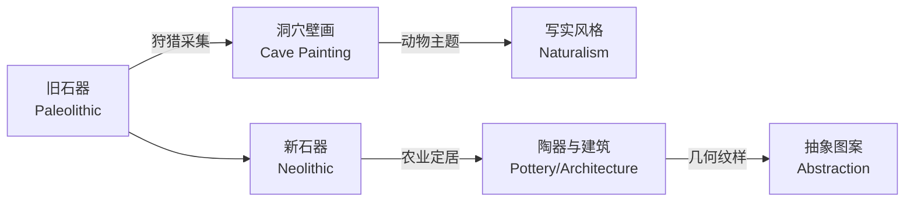
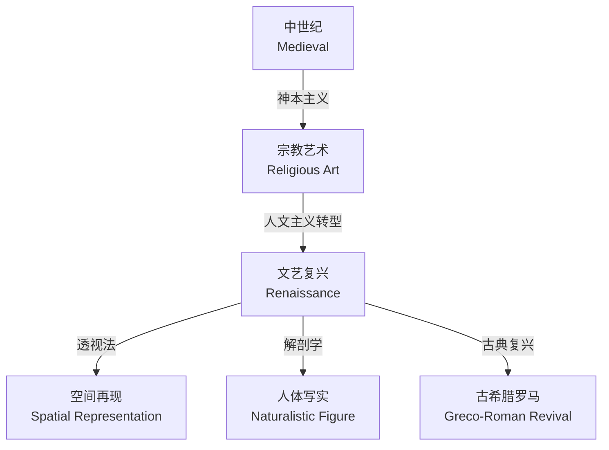

---
aliases:
  - Art History
  - 美术史
  - 艺术史
  - History of Art
tags:
  - art
  - history
  - fine-arts
  - culture
  - visual-arts
---

# 艺术史 (Art History)

## 概述 (Overview)

艺术史（Art History）是研究视觉艺术作品及其历史语境的学科。它不仅关注作品的形式与风格，更探讨艺术与社会、宗教、政治、技术的互动关系。从史前洞穴壁画到当代装置艺术，人类视觉表达的历程折射出文明演进的深层逻辑。

### 研究方法与分支

| 分支 (Branch) | 研究对象 (Subject) | 方法论 (Methodology) |
| --- | --- | --- |
| 风格史 (Stylistic History) | 形式演变、技法发展 | 图像学、形式分析 |
| 社会艺术史 (Social Art History) | 艺术与社会结构 | 马克思主义、社会学 |
| 女性主义艺术史 (Feminist) | 性别视角的艺术生产 | 性别理论、酷儿理论 |
| 全球艺术史 (Global) | 跨文化比较 | 后殖民理论、人类学 |

## 史前艺术 (Prehistoric Art, 距今约40000年–公元前3000年)

### 旧石器时代

旧石器时代（Paleolithic）的洞穴壁画（Cave Painting）是人类最早的视觉艺术遗存。法国拉斯科洞窟（Lascaux Cave）和西班牙阿尔塔米拉洞窟（Altamira Cave）的野牛、野马图像，展现了惊人的写实能力。

主要特征：

- **主题 (Subjects)**：大型动物（野牛、猛犸象、马、鹿）
- **技法 (Techniques)**：矿物颜料、轮廓线、阴影渲染
- **功能推测 (Functions)**：狩猎巫术、图腾崇拜、叙事记录

### 新石器时代

新石器时代（Neolithic）见证了农业革命，艺术也开始反映定居生活：

| 类型 (Type) | 代表 (Examples) | 特征 (Features) |
| --- | --- | --- |
| 巨石建筑 (Megaliths) | 英国巨石阵 (Stonehenge) | 天文学意义、祭祀功能 |
| 陶器 (Pottery) | 中国仰韶文化彩陶 | 几何纹样、动物图案 |
| 雕像 (Sculpture) | 土耳其加泰土丘女神像 | 丰产崇拜、简化造型 |

## 古代艺术 (Ancient Art, 公元前3000年–公元500年)

### 古埃及艺术

古埃及艺术（Ancient Egyptian Art）服务于宗教与来世信仰，遵循严格的程式化规范：

- **正面律 (Frontality)**：人物头部侧面，眼睛正面，躯干正面，腿部侧面
- **等级比例 (Hierarchical Scale)**：重要人物体型更大
- **永恒性追求 (Eternity)**：避免透视缩短，追求完整轮廓

代表作品：吉萨金字塔群（Pyramids of Giza）、图坦卡蒙黄金面具（Mask of Tutankhamun）、纳芙蒂蒂胸像（Bust of Nefertiti）。

### 古希腊与古罗马

古希腊艺术（Ancient Greek Art）确立了西方艺术的古典理想：

| 时期 (Period) | 时间 (Time) | 特征 (Characteristics) |
| --- | --- | --- |
| 古风时期 (Archaic) | 前800–前480 | 库罗斯立像、东方化纹样 |
| 古典时期 (Classical) | 前480–前323 | 理想比例、对立平衡 (Contrapposto) |
| 希腊化时期 (Hellenistic) | 前323–前31 | 戏剧化表情、复杂构图 |

波留克列特斯的《持矛者》（Doryphoros）确立了人体比例的数学理想：

$$\text{头长} : \text{身长} = 1 : 7$$

古罗马艺术（Roman Art）在继承希腊传统的基础上，发展了肖像写实主义（Verism）和建筑技术（拱券、混凝土）。

## 中世纪艺术 (Medieval Art, 500–1400)

### 早期基督教与拜占庭

早期基督教艺术（Early Christian Art）在罗马地下墓室（Catacombs）中发展出象征图像体系：

- **鱼 (Ichthys)**：基督的象征
- **好牧人 (Good Shepherd)**：基督的比喻
- **锚 (Anchor)**：希望的隐喻

拜占庭艺术（Byzantine Art）以镶嵌画（Mosaic）和圣像（Icon）为代表，强调精神性而非自然主义：

| 特征 (Feature) | 表现 (Manifestation) |
| --- | --- |
| 金色背景 (Gold Background) | 神圣光照、超越时空 |
| 正面姿态 (Frontal Pose) | 与观者直接交流 |
| 抽象空间 (Abstract Space) | 拒绝三维透视 |

### 罗马式与哥特式

罗马式（Romanesque, 1000–1200）建筑以厚重墙体、圆拱、小窗为特征。哥特式（Gothic, 1140–1500）则创造了尖拱、肋拱、飞扶壁的体系，使建筑向高空延伸：

$$\text{结构效率} = \frac{\text{垂直荷载传递效率}}{\text{材料用量}}$$

哥特式大教堂的结构革新极大提升了这一比值，圣但尼教堂（Saint-Denis）和巴黎圣母院（Notre-Dame de Paris）是典型代表。

## 文艺复兴艺术 (Renaissance Art, 1400–1600)

### 人文主义与透视法

文艺复兴（Renaissance）标志着艺术从中世纪的神本主义向人本主义转型。线性透视法（Linear Perspective）的发明是这一时期最重要的技术突破：

$$\frac{\text{图像尺寸}}{\text{实际尺寸}} = \frac{\text{视点到画面的距离}}{\text{视点到物体的距离}}$$

布鲁内莱斯基（Brunelleschi）和马萨乔（Masaccio）是透视法的先驱。

### 文艺复兴三杰

| 艺术家 (Artist) | 领域 (Field) | 代表作品 (Masterworks) |
| --- | --- | --- |
| 达芬奇 (Leonardo da Vinci) | 绘画、科学 | 《蒙娜丽莎》《最后的晚餐》 |
| 米开朗基罗 (Michelangelo) | 雕塑、绘画、建筑 | 《大卫》、西斯廷天顶画 |
| 拉斐尔 (Raphael) | 绘画、建筑 | 《雅典学院》《西斯廷圣母》 |

## 现代艺术 (Modern Art, 1860–1960)

### 从印象派到立体主义

现代艺术的突破始于对学院派规则的挑战：

- **印象派 (Impressionism)**：莫奈、雷诺阿，捕捉光色瞬间
- **后印象派 (Post-Impressionism)**：塞尚、梵高、高更，结构、情感、象征的三条路径
- **野兽派 (Fauvism)**：马蒂斯，纯粹色彩的表现力
- **立体主义 (Cubism)**：毕加索、布拉克，多视角同时呈现

### 抽象艺术的诞生

20世纪初，艺术逐渐脱离具象再现：

| 流派 (Movement) | 代表 (Representatives) | 理念 (Idea) |
| --- | --- | --- |
| 表现主义 (Expressionism) | 蒙克、基希纳 | 情感表达优先 |
| 抽象表现主义 (Abstract Expressionism) | 波洛克、德库宁 |  gesture 绘画、行动绘画 |
| 至上主义 (Suprematism) | 马列维奇 | 纯粹几何形式 |
| 构成主义 (Constructivism) | 塔特林、罗德琴科 | 艺术服务社会 |

蒙德里安（Mondrian）的新造型主义（Neoplasticism）将绘画简化为水平垂直线条和三原色：

$$\text{普遍美} = \text{直线} + \text{直角} + \text{原色}$$

## 当代艺术 (Contemporary Art, 1960–至今)

### 多元媒介与概念转向

当代艺术（Contemporary Art）突破了传统媒介的界限：

- **波普艺术 (Pop Art)**：沃霍尔、利希滕斯坦，消费文化与大众图像
- **极简主义 (Minimalism)**：贾德、安德烈，工业材料、减少形式
- **观念艺术 (Conceptual Art)**：科苏斯、勒维特，观念优先于形式
- **装置艺术 (Installation)**：场域特定（Site-Specific）、观众参与
- **数字艺术 (Digital Art)**：算法生成、虚拟现实、NFT

### 全球化与身份政治

当代艺术密切关注：

| 议题 (Issues) | 代表艺术家 (Representative Artists) |
| --- | --- |
| 后殖民批评 (Postcolonialism) | 安尼什·卡普尔、艾尔·安纳祖 |
| 性别与酷儿 (Gender/Queer) | 南·戈尔丁、凯斯·哈林 |
| 生态批评 (Ecocriticism) | 奥拉维尔·埃利亚松 |
| 技术批判 (Technocritique) | 特雷弗·帕格林、黑特·史德耶尔 |

## 中国艺术史概览 (Overview of Chinese Art History)

### 青铜与陶瓷

中国艺术（Chinese Art）拥有独立于西方传统的演进脉络：

- **青铜器 (Bronze Ware)**：商周时期的礼器，饕餮纹、夔龙纹承载宗教与政治意义
- **书法与水墨 (Calligraphy and Ink Painting)**：文人画传统，诗书画印合一
- **陶瓷艺术 (Ceramics)**：从唐三彩到宋瓷（汝、官、哥、钧、定五大名窑），再到元青花、明清彩瓷

| 时期 (Period) | 代表成就 (Achievements) | 美学特征 (Aesthetic Features) |
| --- | --- | --- |
| 先秦 (Pre-Qin) | 青铜器、帛画 | 神秘、庄重、图腾化 |
| 唐宋 (Tang-Song) | 山水画成熟、瓷器巅峰 | 意境、含蓄、自然主义 |
| 明清 (Ming-Qing) | 文人画、宫廷画、工艺品 | 程式化与个性化并存 |

### 东西方艺术对话

丝绸之路（Silk Road）促进了跨文化艺术交流：

- 佛教艺术自印度经中亚传入中国，催生云冈、龙门石窟
- 波斯纹样影响唐代金银器与织物
- 18世纪欧洲掀起「中国风」（Chinoiserie）热潮

## 博物馆与艺术市场 (Museums and Art Market)

### 公共博物馆的诞生

现代博物馆制度（Museum System）起源于18世纪的欧洲：

- **卢浮宫 (Louvre)**：1793年开放，标志着艺术从王室私有走向公众
- **大英博物馆 (British Museum)**：1753年建立，基于汉斯·斯隆爵士的收藏
- **大都会博物馆 (Metropolitan Museum)**：1870年成立，美国最重要的综合性博物馆

### 艺术市场生态

当代艺术市场（Art Market）的运作机制：

| 环节 (Sector) | 功能 (Function) | 代表机构 (Representatives) |
| --- | --- | --- |
| 一级市场 (Primary Market) | 首次销售 | 商业画廊、艺术家工作室 |
| 二级市场 (Secondary Market) | 再销售 | 拍卖行（佳士得、苏富比） |
| 艺术博览会 (Art Fairs) | 集中展示交易 | 巴塞尔、弗里兹、威尼斯双年展 |
| 收藏顾问 (Advisors) | 专业咨询 | 独立顾问、家族办公室 |

## 结语 (Conclusion)

艺术史是一部视觉思维的演进史。从史前洞穴中的野牛轮廓到数字屏幕上的像素矩阵，人类不断发明新的方式来看见、理解并表达世界。艺术史的学习不仅是对过去的回顾，更是培养批判性视觉素养（Visual Literacy）的过程——在图像泛滥的当代，这种能力尤为珍贵。

> 「艺术不是再现可见之物，而是使不可见成为可见。」—— 保罗·克利 (Paul Klee)
