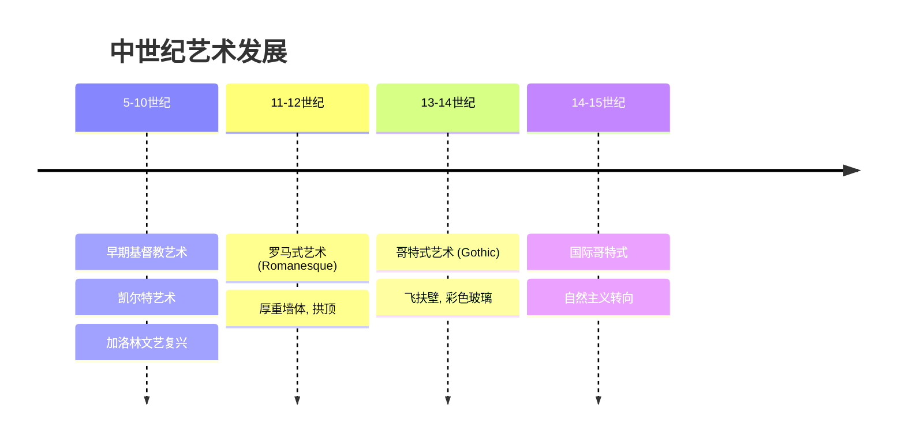
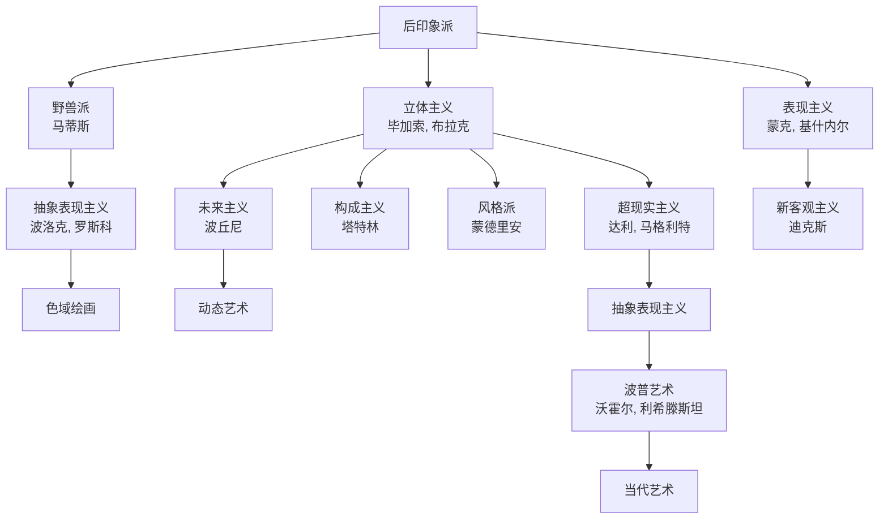

# 艺术史概论

艺术史（Art History）研究人类视觉文化在时间维度上的演变，涵盖绘画（Painting）、雕塑（Sculpture）、建筑（Architecture）、版画（Printmaking）、摄影（Photography）及数字艺术（Digital Art）等多种媒介。艺术史的核心任务是理解艺术作品的形式特征、内容含义、文化语境和历史脉络。艺术史家通过形式分析、图像学研究和社会艺术史等方法来解读作品。

## 艺术史主要时期与运动

### 古代艺术

| 时期 | 时间范围 | 代表作品/特征 |
|:---|:---:|:---|
| 史前艺术 | 前 40000-前 3000 | 拉斯科洞穴壁画、维伦多夫的维纳斯 |
| 古埃及艺术 | 前 3000-前 332 | 金字塔、狮身人面像、墓室壁画 |
| 古希腊艺术 | 前 800-前 146 | 雅典帕台农神庙、米洛的维纳斯 |
| 古罗马艺术 | 前 509-476 | 万神殿、罗马水道、庞贝壁画 |
| 拜占庭艺术 | 330-1453 | 圣索菲亚大教堂、嵌画（Mosaic） |

### 中世纪艺术

### 文艺复兴 （Renaissance， 14-16 世纪）

文艺复兴强调人文主义（Humanism）、透视法（Perspective）和自然主义的再现。

$$ \text{线性透视：} \quad \frac{h}{H} = \frac{d}{D} $$

| 阶段 | 时间 | 代表人物 | 代表作品 |
|:---|:---:|:---|:---|
| 早期 | 1400-1490 | 马萨乔、波提切利 | 《春》《维纳斯的诞生》 |
| 盛期 | 1490-1527 | 达·芬奇、米开朗基罗、拉斐尔 | 《蒙娜丽莎》《大卫》《雅典学派》 |
| 威尼斯画派 | 1450-1600 | 提香、丁托列托 | 《乌尔比诺的维纳斯》 |
| 北方文艺复兴 | 1430-1580 | 凡·艾克、丢勒 | 《根特祭坛画》《四使徒》 |

### 巴洛克与洛可可 （Baroque & Rococo， 17-18 世纪）

- **巴洛克**（Baroque）：戏剧性光线、动态构图、情感强度
  - 卡拉瓦乔（Caravaggio）—— 明暗对照法（Chiaroscuro）
  - 贝尼尼（Bernini）—— 《圣特雷萨的狂喜》
  - 伦勃朗（Rembrandt）—— 《夜巡》
- **洛可可**（Rococo）：轻盈、华丽、感官愉悦
  - 华托（Watteau）—— 《舟发西苔岛》
  - 布歇（Boucher）—— 《维纳斯的梳妆》

### 19 世纪艺术运动

| 运动 | 时间 | 关键特征 | 代表人物 |
|:---|:---:|:---|:---|
| 新古典主义 | 1750-1830 | 理性、清晰线条、古典主题 | 大卫、安格尔 |
| 浪漫主义 | 1790-1850 | 激情、想象力、自然崇高 | 德拉克罗瓦、透纳 |
| 写实主义 | 1840-1870 | 日常现实、社会批判 | 库尔贝、米勒 |
| 印象派 | 1860-1890 | 外光画、即时视觉印象 | 莫奈、雷诺阿、德加 |
| 后印象派 | 1880-1905 | 主观表现、结构探索 | 塞尚、梵高、高更 |
| 象征主义 | 1880-1910 | 神秘、隐喻、梦境 | 莫罗、雷东 |

### 20 世纪现代主义

### 当代艺术 （Contemporary Art， 1960s-至今）

| 运动 | 特点 | 代表艺术家 |
|:---|:---|:---|
| 波普艺术 | 大众文化、商业美学 | 安迪·沃霍尔 |
| 极简主义 | 几何抽象、工业材料 | 唐纳德·贾德 |
| 观念艺术 | 思想优先于形式 | 约瑟夫·科苏斯 |
| 行为艺术 | 身体作为媒介 | 玛丽娜·阿布拉莫维奇 |
| 大地艺术 | 自然与环境 | 罗伯特·史密森 |
| 女性主义艺术 | 性别政治 | 朱迪·芝加哥 |
| 新媒体艺术 | 数字科技 | 白南准 |
| 街头艺术 | 公共空间 | 班克斯 |

## 艺术史分析方法

### 形式分析 （Formal Analysis）

关注艺术品的视觉元素（Visual Elements）和组织原则（Principles of Composition）：

$$ \text{分析维度} = \{线条, 色彩, 形状, 空间, 质感, 光影\} \times \{平衡, 对比, 节奏, 比例, 统一\} $$

### 图像学 （Iconography & Iconology）

Erwin Panofsky 提出的三层解读法：

1. **前图像学描述**（Pre-iconographical）：识别基本物象
2. **图像学分析**（Iconographical Analysis）：识别主题和故事
3. **图像学阐释**（Iconological Interpretation）：揭示文化象征和时代精神

### 社会艺术史 （Social Art History）

将艺术置于社会、政治、经济的宏观语境中考察，探讨艺术的生产体制、赞助制度、观众接受和意识形态功能。

### 当代新方向

- **女性主义艺术史**（Feminist Art History）：挑战男性中心的艺术史叙事
- **后殖民艺术史**（Postcolonial Art History）：解构西方中心主义
- **全球艺术史**（Global Art History）：跨文化比较和网络视野
- **视觉文化研究**（Visual Culture Studies）：扩展至电影、广告、数字图像

## 东亚艺术史概要

### 中国传统绘画

| 时期/朝代 | 代表人物 | 艺术特征 |
|:---|:---|:---|
| 魏晋南北朝 | 顾恺之 | 人物画兴盛，"传神写照" |
| 唐代 | 吴道子、阎立本 | 富丽堂皇，宗教与宫廷艺术 |
| 宋代 | 范宽、郭熙、马远 | 山水画巅峰，"三远"构图法 |
| 元代 | 赵孟頫、倪瓒 | 文人画兴起，诗书画印合一 |
| 明代 | 文徵明、唐寅 | 吴门画派，院体与文人并存 |
| 清代 | 石涛、八大山人 | 个性表达，"四王"正统派 |
| 近现代 | 齐白石、徐悲鸿 | 中西融合、水墨革新 |

### 日本艺术

- **浮世绘**（Ukiyo-e）：葛饰北斋《神奈川冲浪里》、歌川广重《东海道五十三次》
- **琳派**（Rinpa）：俵屋宗达、尾形光琳——装饰性金地屏风
- **侘寂美学**（Wabi-sabi）：茶道、枯山水——不完美中的美感

浮世绘对西方印象派的影响深远——梵高、莫奈、德加都曾收藏和模仿浮世绘版画。

## 艺术创作的技术与材料

### 绘画技法

| 技法 | 描述 | 代表时期 |
|:---|:---|:---|
| 湿壁画（Fresco） | 在湿石灰上作画，颜料与墙体融合 | 文艺复兴 |
| 蛋彩画（Tempera） | 蛋黄为粘合剂 | 中世纪、早期文艺复兴 |
| 油画（Oil Painting） | 亚麻籽油为粘合剂，可反复修改 | 15 世纪至今 |
| 水彩（Watercolor） | 水溶性颜料，透明轻盈 | 18-19 世纪 |
| 丙烯（Acrylic） | 合成树脂，快干，防水 | 20 世纪至今 |
| 喷漆（Spray Paint） | 气溶胶喷雾 | 当代街头艺术 |

### 透视法与空间表现

线性透视（Linear Perspective）由 Brunelleschi 在 15 世纪初系统化：

$$ \text{消失点} = \text{平行线在画面上的交点} $$

空气透视（Atmospheric Perspective）：远处物体色彩淡化、对比降低——达·芬奇在《蒙娜丽莎》中精湛运用。

## 数字时代的艺术

### 数字艺术与新媒体

| 类型 | 描述 | 代表性作品/艺术家 |
|:---|:---|:---|
| 数字绘画 | 使用数位板和绘图软件创作 | David Hockney iPad 作品 |
| 生成艺术 | 算法自主产生图像 | Casey Reas, Processing 社区 |
| 沉浸式装置 | 投影映射、VR/AR 体验 | TeamLab 边界系列 |
| AI 艺术 | 机器学习模型生成 | DALL·E, Midjourney, Stable Diffusion |
| NFT 艺术 | 区块链认证的数字资产 | Beeple《Everydays》6900 万美元 |
| 网络艺术（Net Art） | 以互联网为媒介 | Olia Lialina《我的男友从战场归来》 |

### AI 对艺术史的影响

AI 生成图像引发了关于"创造力"、"原创性"和"作者身份"的激烈辩论：

- AI 训练数据中的版权问题
- 人机协作创作的新型艺术实践
- 算法偏见与艺术多样性
- AI 作为艺术史研究工具——风格分类、归属鉴定、修复辅助

## 艺术市场与制度

### 艺术市场结构

- **一级市场**：画廊、艺术博览会——首次出售
- **二级市场**：拍卖行（佳士得、苏富比）——转售
- **艺术顾问与策展人**：连接艺术家和收藏家

### 著名博物馆

| 博物馆 | 所在地 | 特色收藏 |
|:---|:---|:---|
| 卢浮宫 | 巴黎 | 蒙娜丽莎、断臂维纳斯 |
| 大英博物馆 | 伦敦 | 罗塞塔石碑、帕特农雕塑 |
| 大都会博物馆 | 纽约 | 横跨 5000 年的人类艺术 |
| 故宫博物院 | 北京 | 中国古代宫廷艺术 |
| 乌菲兹美术馆 | 佛罗伦萨 | 文艺复兴绘画宝库 |
| 普拉多博物馆 | 马德里 | 西班牙黄金时代艺术 |
| 冬宫博物馆 | 圣彼得堡 | 俄罗斯宫廷收藏 |

## 艺术批评与理论

### 主要批评流派

- **形式主义**（Formalism）：Roger Fry、Clement Greenberg——关注视觉元素本身
- **制度理论**（Institutional Theory）：George Dickie——艺术由艺术世界赋予地位
- **符号学**（Semiotics）：Roland Barthes——图像作为符号系统分析
- **接受美学**（Reception Aesthetics）：Hans Robert Jauss——观众参与意义建构
- **精神分析**（Psychoanalysis）：Freud、Lacan——无意识与创作动力

### 经典艺术理论文本

- 瓦萨里（Vasari）《艺苑名人传》——最早的艺术史编年
- 温克尔曼（Winckelmann）《古代艺术史》——新古典主义的理论基础
- 贡布里希（Gombrich）《艺术的故事》——最广泛阅读的艺术史入门
- 潘诺夫斯基（Panofsky）《图像学研究》——图像学方法论的奠基之作

## 艺术史学科关键概念

$$ \text{风格} = f(\text{时代}, \text{地域}, \text{艺术家}, \text{媒介}) $$

| 概念 | 定义 | 例证 |
|:---|:---|:---|
| 风格（Style） | 艺术表达的一致方式 | 印象派的碎笔触 |
| 流派（Genre） | 题材类别 | 历史画、肖像、风景、静物 |
| 媒介（Medium） | 材料和技法 | 油画、水彩、大理石、青铜 |
| 赞助人（Patron） | 出资和委托者 | 美第奇家族、教会 |
| 机构（Institution） | 展示和权威体系 | 博物馆、画廊、艺评 |

## 艺术史研究方法论进阶

### 艺术社会史 （Social History of Art）

以 T.J. Clark 为代表的艺术社会史将艺术创作视为社会生产关系的一部分。其核心论点包括：风格变化反映意识形态变迁；视觉再现服务于特定阶级利益；艺术品的生产条件和流通方式决定其意义。

### 全球艺术史 （Global Art History）

全球艺术史挑战线性进化论叙事，主张：
- 多中心视角取代单一的西方中心
- 跨文化接触、贸易和交流作为艺术创新的驱动力
- 殖民和后殖民语境下的艺术生产与身份建构

## 相关条目

- [[Aesthetics|美学]]
- [[ArtCriticism|艺术批评]]
- [[CulturalHistory|文化史]]
- [[Museology|博物馆学]]
- [[VisualCulture|视觉文化]]
- [[Iconography|图像学]]
- [[Conservation|艺术品保护]]
