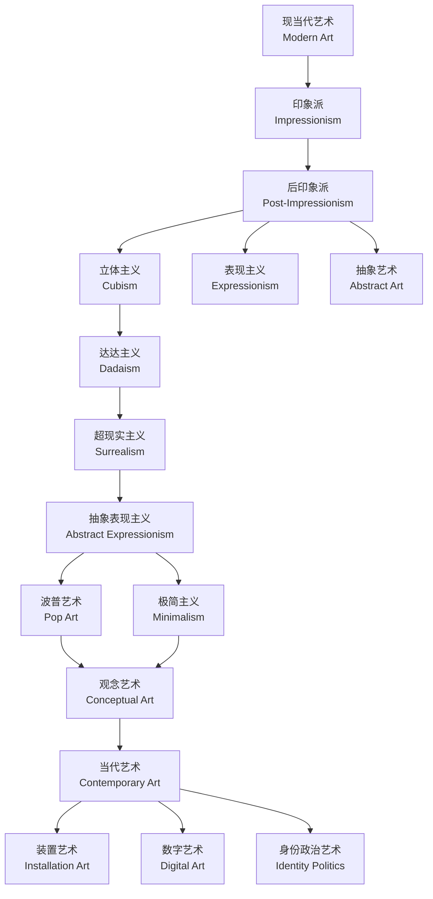

# 现当代艺术流派 (Modern & Contemporary Art Movements)

## 概述

现当代艺术（Modern and Contemporary Art）是指从 19 世纪中后期
至今，艺术家不断挑战学院派古典传统、探索新的视觉语言和观念
表达的艺术发展历程。现代艺术兴起于工业革命与摄影术诞生的时代
背景之下。当摄影能够精确记录现实，绘画便不再以模仿自然为
唯一使命。艺术家转而探索视觉感知、情感表达和形式自主的深层
可能。从印象派对光影的瞬间捕捉，到立体主义对空间的多视角重构，
再到当代艺术中观念、身份与技术的多元交融，现当代艺术始终在
突破边界、重新定义"艺术"本身。本章梳理了自印象派以来的主要
艺术流派、代表人物及其核心主张，流派的演变并非简单线性关系，
而是多种探索方向的同时并存和相互影响。

## 艺术流派的演变脉络

## 主要流派概览

下面按时间顺序列出现代艺术的主要流派、时间范围、核心主张、
代表人物和代表作品。

| 流派 | 时间 | 核心主张 | 代表人物 | 代表作品 |
|------|------|----------|----------|----------|
| 印象派（Impressionism） | 1870s–1880s | 捕捉光影瞬间，户外写生 | 莫奈、雷诺阿、德加 | 《日出·印象》 |
| 后印象派（Post-Impressionism） | 1880s–1900s | 形式自主，主观情感表达 | 塞尚、梵高、高更 | 《星月夜》 |
| 野兽派（Fauvism） | 1905–1907 | 纯色色彩的情感表现力 | 马蒂斯、德兰 | 《舞蹈》 |
| 立体主义（Cubism） | 1907–1914 | 多视点几何重组空间 | 毕加索、布拉克 | 《亚威农少女》 |
| 表现主义（Expressionism） | 1905–1920 | 情感扭曲，内心世界外化 | 蒙克、基希纳 | 《呐喊》 |
| 抽象艺术（Abstract Art） | 1910s– | 非具象形式，纯视觉语言 | 康定斯基、蒙德里安 | 《构图第八号》 |
| 达达主义（Dadaism） | 1916–1923 | 反艺术，质疑艺术定义 | 杜尚、皮卡比亚 | 《泉》 |
| 超现实主义（Surrealism） | 1924–1945 | 潜意识与梦境探索 | 达利、马格利特 | 《记忆的永恒》 |
| 抽象表现主义（Abstract Exp.） | 1940s–1950s | 自动绘画，行动绘画 | 波洛克、罗斯科 | 《薰衣草之雾》 |
| 波普艺术（Pop Art） | 1950s–1960s | 大众文化符号的挪用 | 沃霍尔、利希滕斯坦 | 《金宝汤罐头》 |
| 极简主义（Minimalism） | 1960s–1970s | 最简单的几何形式 | 贾德、斯特拉 | 《无题》 |
| 观念艺术（Conceptual Art） | 1960s– | 观念先于物质形态 | 科苏斯、维纳 | 《一把和三把椅子》 |

## 现代艺术的起源

### 印象派与光影革命

印象派（Impressionism）被视为现代艺术的第一个标志性运动。
1874 年，莫奈（Claude Monet）、雷诺阿（Pierre-Auguste
Renoir）、德加（Edgar Degas）等艺术家在巴黎举办了第一次
独立展览。莫奈的《日出·印象》（Impression, Sunrise）描绘了
勒阿弗尔港日出时的朦胧光影。一位评论家用"印象派"一词嘲讽
这幅画，不料这个蔑称反而成为了艺术史上最著名的流派名称。
印象派画家走出画室，在户外直接对景写生（Plein Air Painting）。
他们捕捉光线在一天不同时刻的瞬间变化。以独立的笔触和明亮的
色彩打破了学院派精细描绘的传统。主题也从历史、宗教题材转向
了日常生活中的场景——火车站、咖啡馆、舞会等现代生活的缩影。

印象派的色彩理论深受现代光学影响。艺术家发现阴影并非黑色或
棕色，而是由互补色（Complementary Colors）构成。当人眼长时间
注视某颜色后，移开视线会看到其互补色的残像。印象派将这一原理
运用到画面中，用紫色表现黄色阳光下的阴影。

印象派对色彩的研究可用公式表示：

$$ L_{\text{total}}(\lambda) = \sum_{i} R_i(\lambda) \cdot
S_i(\lambda) $$

其中 $R_i$ 为不同表面的反射率，$S_i$ 为光源光谱分布。
莫奈的《干草垛》系列（Haystacks）是这一原则的极致体现。
同一堆干草在不同时间、不同天气下呈现出完全不同的色彩。
这种对同一主题反复描绘的做法被称为"系列画"（Series Painting）。
莫奈晚年的《睡莲》系列（Water Lilies）将这一方法推向抽象境界。
白内障手术后的色觉变化反而使他的晚期作品更加自由。

### 后印象派：形式自主的开端

后印象派（Post-Impressionism）并非一个统一的运动，而是对
印象派之后多种探索方向的总称。塞尚（Paul Cézanne）致力于
研究几何结构和空间关系，主张"用圆柱体、球体和圆锥体处理自然"。
其多视角观察法直接启发了立体主义。塞尚被誉为"现代艺术之父"
（Father of Modern Art）。

梵高（Vincent van Gogh）以充满情感张力的短促笔触和强烈色彩
表达内心世界。他使用厚涂法（Impasto）将颜料堆叠在画布上。
其《星月夜》（The Starry Night）将涡旋的天空与宁静的村庄
并置。梵高在生前的最后十年创作了超过 2000 幅作品，但生前
仅售出少数几幅。高更（Paul Gauguin）追求原始主义
（Primitivism）。在塔希提岛寻找现代文明之外的精神家园。
其平涂色彩和简化造型对象征主义产生了深远影响。

## 20 世纪早期前卫运动

### 野兽派：色彩解放

野兽派（Fauvism, 1905–1907）以马蒂斯（Henri Matisse）为核心。
使用纯色、未经调和色彩进行创作，完全不受自然色彩约束。
马蒂斯的《舞蹈》（Dance）以简化红色人体在蓝色背景上起舞。
色彩成为纯粹的情感载体。野兽派的遗产影响了后来的表现主义。

### 立体主义：空间重构

立体主义（Cubism, 1907–1914）由毕加索和布拉克创立。
彻底打破了文艺复兴以来单一的线性透视传统。将物体从多个角度
同时呈现，分析并重组为几何片段。分析立体主义阶段画面呈现
灰褐色碎片化平面。综合立体主义阶段引入拼贴（Collage）技法。
立体主义深刻影响了 20 世纪的绘画、雕塑、建筑和设计。

$$ \text{传统透视：} P(x,y,z) = (x',y') $$
$$ \text{立体主义：} P = \sum_{i=1}^{n} P_i(\theta_i, \phi_i) $$

### 表现主义与未来主义

表现主义（Expressionism, 1905–1920）扭曲自然形态以传达
内在体验。德国表现主义分为桥社（Die Brücke）和青骑士社
（Der Blaue Reiter）。蒙克的《呐喊》是这一方向最具标志性
的图像。未来主义（Futurism, 1909–1914）由马里内蒂创立。
颂扬现代工业文明的速度和动力。波丘尼用流线型表现人体动感。

### 抽象艺术的诞生

康定斯基被认为是第一位抽象画家。他提出色彩与声音的对应关系：
黄色对应小号高音，蓝色对应大提琴低音。蒙德里安的几何抽象
追求垂直线和水平线的宇宙平衡。马列维奇的至上主义以《黑方块》
将抽象推向纯粹几何的形而上学。

## 达达主义与超现实主义

达达主义（Dadaism, 1916–1923）是第一次世界大战期间在苏黎世
兴起的一场反艺术运动。杜尚的《泉》（1917）——一个签了名的
小便池——成为 20 世纪最具争议和影响力的作品之一。核心策略
包括偶然性（Chance）、拼贴和照片蒙太奇。达达主义对艺术体制
的批判深刻影响了观念艺术。

超现实主义（Surrealism, 1924–1945）从达达主义发展而来。
受弗洛伊德精神分析学影响，致力于探索潜意识和梦境世界。
布勒东于 1924 年发表《超现实主义宣言》。达利的偏执批判方法
将日常物体置于非逻辑并置。马格利特的视觉悖论挑战了再现与
真实的关系。米罗的自动绘画探索潜意识的符号世界。

## 战后美国艺术的崛起

二战之后，世界艺术中心从巴黎转移至纽约。抽象表现主义（Abstract
Expressionism）分为行动绘画和色域绘画。波洛克的滴画法让颜料
自由滴洒，创作过程本身就是表演。罗斯科的大色块追求色彩冥想。
波普艺术将大众文化符号引入艺术。沃霍尔的丝网印刷消解了原作
与复制品的等级。极简主义以最简单的几何形式创作。观念艺术
认为艺术的核心是观念而非物质形态。科苏斯的《一把和三把椅子》
提出了艺术作为分析命题的理论框架。

## 当代艺术的多元格局

1980 年代以来，当代艺术呈现全球化和多元化特征。新表现主义
在 1980 年代的欧洲兴起。装置艺术利用空间和多媒体创造沉浸式
体验。数字艺术利用计算机和 AI 拓展创作边界。身份政治艺术
关注性别、种族和性取向等认同问题。关系美学强调观众参与和
社会互动。当代艺术不再有统一的叙事方向，任何风格都是可能的。

## 中国现当代艺术

85 新潮（1985–1989）是中国改革开放后规模最大的前卫艺术运动。
玩世现实主义以方力钧、岳敏君为代表。政治波普借用波普手法
处理政治符号。当代水墨探索传统语言的当代转换。徐冰的《天书》
以伪汉字装置质疑文字与意义的关系。

## 艺术批评关键词

艺术批评（Art Criticism）是连接艺术作品与观众的重要桥梁。
它并非主观感受的随意表达，而是基于描述、分析、解释和评价
四个步骤的系统判断。形式主义批评关注作品的视觉要素本身，
格林伯格（Clement Greenberg）认为现代艺术的核心在于对
媒介特殊性的自我批判。语境主义批评将作品置于社会政治历史
背景中解读。符号学批评分析图像作为符号系统的表意过程，
巴特（Roland Barthes）的"作者之死"理论为观众解读打开了
新的空间。女性主义批评质疑传统艺术史中女性视角的缺失。
后殖民批评挑战西方中心主义的艺术叙事。了解这些批评方法
有助于更深入地理解现当代艺术的多层意义。

## 主要参考文献

1. Gombrich, E. H. The Story of Art. Phaidon, 1995.
2. 高名潞. 中国当代美术史 1985–1986. 上海人民出版社, 1991.
3. Hopkins, D. After Modern Art 1945–2000. Oxford, 2000.
4. 张坚. 西方现代美术史. 上海人民美术出版社, 2009.
5. Foster, H. et al. Art Since 1900. Thames & Hudson, 2016.
6. Danto, A. After the End of Art. Princeton, 1997.

## 相关条目

- [[ArtHistory]]
- [[ArtCriticism]]
- [[Aesthetics]]
- [[VisualCulture]]
- [[INDEX|当前目录索引]]
