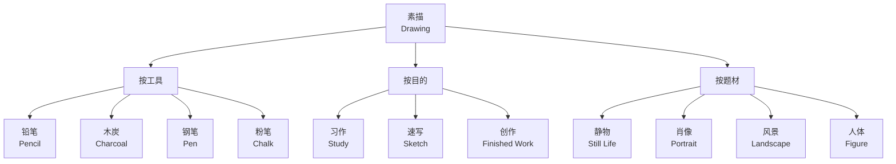
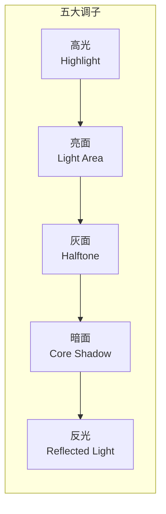

---
aliases:
  - Drawing and Perspective
  - 素描基础
  - 透视原理
tags:
  - drawing
  - sketching
  - perspective
  - shading
  - composition
  - figure-drawing
created: 2025-05-17
---

# 素描基础与透视原理 (Drawing and Perspective)

素描是以线条和明暗塑造形体与空间的基础绘画形式。

## 素描分类 (Drawing Classification)

## 线条基础 (Line Fundamentals)

### 线条类型 (Line Types)

| 类型 | 用途 | 特点 |
| :--- | :--- | :--- |
| 轮廓线 (Contour) | 定义外边缘 | 清晰流畅 |
| 结构线 (Structure) | 暗示内部转折 | 辅助定位 |
| 排线 (Hatching) | 表现明暗 | 密集排布 |
| 交叉排线 (Cross-hatching) | 加深阴影 | 多层交叉 |

### 线的表现力 (Expressiveness of Line)

$$
\text{线条质量} = f(\text{压力, 速度, 方向, 密度})
$$

- 轻线 — 柔和、虚幻
- 重线 — 确定、结实
- 快线 — 流畅、动感
- 断续线 — 犹豫、轻盈

## 明暗素描 (Chiaroscuro Drawing)

### 五大调子 (Five Tones)

明度关系公式：

$$
V_{\text{对象}} = \frac{V_{\text{光源}} \times \cos\theta}{d^2}
$$

其中 $\theta$ 是表面法线与光源方向夹角，$d$ 是距离。

## 透视原理 (Perspective Principles)

### 一点透视 (One-Point Perspective)

$$
\begin{aligned}
&\text{消失点 (Vanishing Point): } VP \\
&\text{视平线 (Horizon Line): } HL = y_{\text{eye}}
\end{aligned}
$$

所有垂直于画面的平行线汇聚于一个消失点。

### 二点透视 (Two-Point Perspective)

物体旋转一定角度，两组平行线分别汇聚于左右两个消失点。

| 类型 | 消失点数量 | 应用场景 |
| :--- | :--- | :--- |
| 一点透视 | 1 | 走廊、街道 |
| 二点透视 | 2 | 建筑转角 |
| 三点透视 | 3 | 仰视高楼、俯视城市 |

### 透视变形的数学原理

$$
y' = \frac{f \cdot Y}{Z}, \quad x' = \frac{f \cdot X}{Z}
$$

其中 $f$ 是焦距，$Z$ 是深度，$(X, Y, Z)$ 是世界坐标，$(x', y')$ 是画面坐标。

## 构图原则 (Composition Principles)

| 原则 | 描述 |
| :--- | :--- |
| 三分法 (Rule of Thirds) | 将画面分为九宫格 |
| 黄金比例 (Golden Ratio) | $\phi = 1.618\ldots$ |
| 对称与均衡 (Symmetry & Balance) | 视觉重量均匀分布 |
| 引导线 (Leading Lines) | 引导视线走向主体 |
| 留白 (Negative Space) | 利用空白区域 |

## 人物素描 (Figure Drawing)

人体比例标准 (Ideal Proportions)：

- 成人身体约**七到八头身**
- 躯干约等于三个头长
- 手臂约等于三个半头长

常见人体素描步骤：
1. 动态线 (Gesture Line) 捕捉整体动势
2. 几何块面 (Geometric Blocks) 概括体块
3. 结构深入 (Structure Refinement) 添补细节
4. 明暗塑造 (Shading) 表现体积
