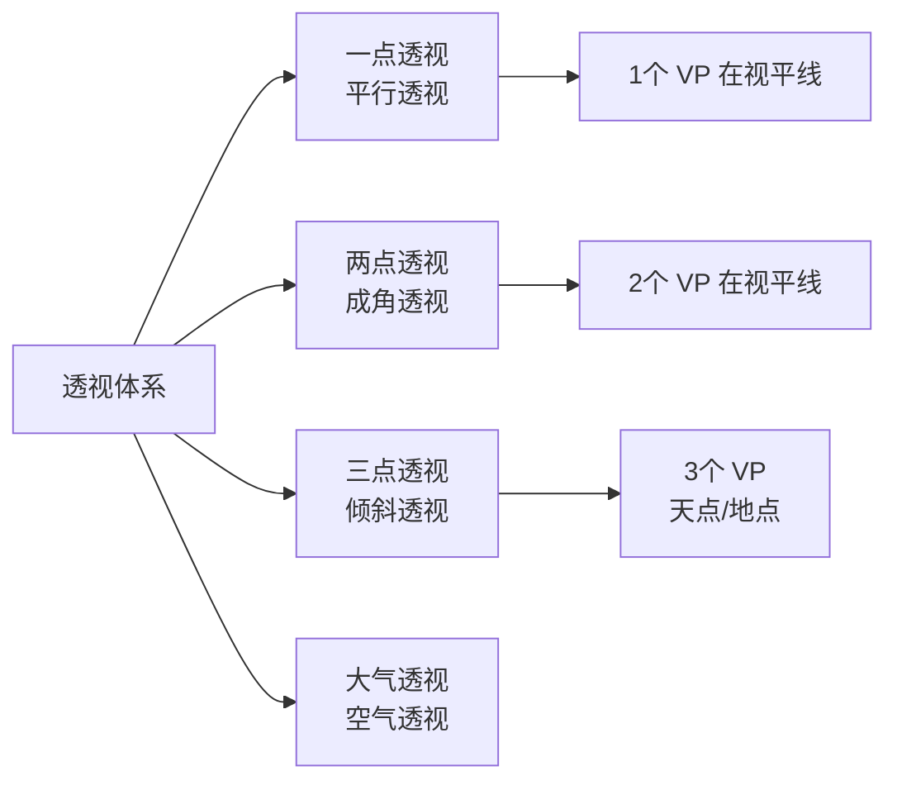

# 素描技法

## 1. 线的类型与运用

### 1.1 线的基本分类

| 线型 | 特点 | 用途 |
|------|------|------|
| 轮廓线（Contour Line） | 沿物体外缘描绘 | 定义形状与边界 |
| 结构线（Structural Line） | 沿内部骨骼/结构走向 | 表现体积与透视 |
| 动态线（Gesture Line） | 快速、流畅、有韵律 | 捕捉动态与姿势 |
| 书法线（Calligraphic Line） | 有粗细/轻重变化 | 增加表现力与节奏 |
| 辅助线（Construction Line） | 轻、可擦 | 起稿、定位 |
| 消失线（Vanishing Line） | 汇聚焦点 | 透视辅助 |

### 1.2 线的表现力

| 线条特征 | 心理效果 | 运用场景 |
|----------|----------|----------|
| 直线 | 刚硬、稳定、理性 | 建筑、机械 |
| 曲线 | 柔和、优雅、流动 | 人体、自然 |
| 粗线 | 有力、突出、厚重 | 前景、阴影 |
| 细线 | 精致、轻盈、后退 | 背景、亮部 |
| 虚线/断续 | 松动、透气 | 辅助、织物 |
| 重叠线 | 动感、探寻 | 动态速写 |

## 2. 明暗与调子

### 2.1 五大调子系统

| 编号 | 调子名称 | 位置 | 表现方法 |
|------|----------|------|----------|
| 1 | 高光（Highlight） | 光源直射最近点 | 留白/白笔/软橡皮提亮 |
| 2 | 亮部（Light） | 受光面 | 浅排线/轻擦抹 |
| 3 | 中间调（Midtone） | 介于明暗之间的过渡区 | 中等密度排线 |
| 4 | 明暗交界线（Terminator） | 亮部转为暗部最深处 | 最密集排线/最用力 |
| 5 | 暗部（Shadow） | 背光面 | 次密排线 |
| — | 反光（Reflected Light） | 环境光反弹入暗部 | 比暗部略亮 |

### 2.2 排线技法

#### 单排线（Hatching）
- 平行线排列，线距决定灰度
- 线距均匀 → 平滑渐变
- 线距渐变 → 体积感

#### 交叉排线（Cross-hatching）

| 层数 | 方向 | 灰度 | 效果 |
|------|------|------|------|
| 第一层 | 任意方向 | 浅灰 | 基础调子 |
| 第二层 | 45°交叉 | 中灰 | 丰富质感 |
| 第三层 | 90°交叉 | 深灰 | 阴影 |
| 第四层 | 任意角多层 | 最深 | 最暗部 |

$$ G = \frac{1}{d} \times n $$

#### 点画（Stippling）
- 点密度控制灰度
- 耗时但细腻自然
- 适合微距级精细素描
- 常用工具：针管笔，0.05–0.5mm

#### 擦抹（Blending）

| 工具 | 效果 | 适用 |
|------|------|------|
| 纸笔（Tortillon/Stump） | 均匀平滑 | 皮肤、天空、过渡区 |
| 纸巾/棉签 | 大面积柔和 | 背景、阴影 |
| 手指 | 可控性差但温暖自然 | 小范围过渡 |
| 软橡皮（Kneaded Eraser） | 提亮/修正 | 高光、调整错误 |

#### 薄擦（Scumbling）
软性材料（炭条/炭精棒）侧锋轻擦纸面，制造斑驳的松散中间调，再用橡皮提亮亮部。

### 2.3 五值灰度系统

| 值 | 名称 | 灰度（0=白 10=黑） | 铅笔硬度参考 |
|----|------|-------------------|--------------|
| 1 | 白/高光 | 0–1 | 纸白/HB 软 |
| 2 | 浅灰/亮部 | 2–4 | 2H–HB |
| 3 | 中灰/中间调 | 4–6 | HB–2B |
| 4 | 深灰/暗部 | 6–8 | 4B–6B |
| 5 | 黑/最暗部 | 8–10 | 8B–9B |

## 3. 透视原理

## 4. 构图基础

### 4.1 三分法（Rule of Thirds）
画面用两条水平线和两条垂直线均分九格。主体/地平线/视觉焦点放在四条线交叉的四个"强点"中。

### 4.2 黄金比例（Golden Ratio）

$$ \phi = \frac{1 + \sqrt{5}}{2} \approx 1.618 $$

| 比例 | 数值 | 应用 |
|------|------|------|
| 黄金比例 φ | 1:1.618 | 画面分割、主体大小 |
| 黄金螺旋 | 斐波那契数列螺旋 | 引导视线到焦点 |
| 黄金矩形 | 长边:短边=φ | 画幅比例选择 |

## 5. 人体比例与速写

### 5.1 人体比例（成人标准）

| 部位 | 比例关系 | 说明 |
|------|----------|------|
| 全身 | 约7.5–8头高 | 8头高为理想化比例 |
| 躯干 | 约3.5头高 | 下巴→乳头→肚脐→会阴 |
| 腿 | 约4头高 | 大转子→膝盖→脚踝 |
| 上肢 | 约3头高 | 肩→肘→腕→指尖 |
| 肩宽 | 约2头宽 | 男性稍宽 |
| 手 | 约1头长 | 指尖到手腕 |
| 脚 | 约1头长 | 脚跟到脚尖 |

### 5.2 动态速写（Gesture Drawing）

| 时间限制 | 重点 | 工具/方法 |
|----------|------|----------|
| 30秒 | 动态线（Line of Action），整体姿势 | 软铅条，大胆流畅 |
| 1分钟 | 动态线 + 主要体块 | 加入头/胸腔/盆腔三大块 |
| 2分钟 | 动态线 + 体块 + 基本比例 | 可加入简单光影 |
| 5分钟 | 动态+比例+轮廓 | 可加入细节与明暗 |

## 6. 素描材料与工具

| 工具 | 用途 |
|------|------|
| 色粉笔（Pastel）/ 索斯（Sanguine）/ 白垩（White Chalk） | 有色素描（如文艺复兴三色画法） |
| 钢笔/针管笔 | 线描、点画、精细排线 |
| 马克笔 | 快速设计速写 |
| 纸笔（Tortillon） | 擦抹柔化 |
| 橡皮（硬/软/电动） | 提亮、修正、纹理 |

## 相关条目

[[06_ArtsAndCreativity/FineArts/Composition/INDEX|Composition]], [[ArtHistory]], ColorTheory
