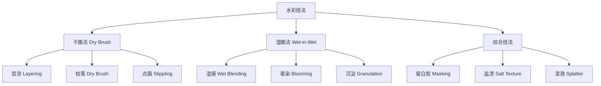
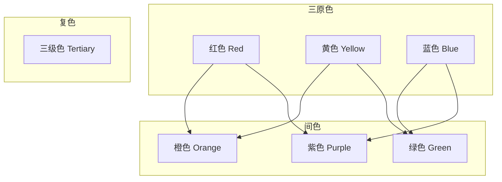

---
aliases:
  - 绘画技巧
  - 油画技法
  - 水彩技法
  - 丙烯画
  - 素描技法
  - Painting Techniques
  - Drawing Methods
tags:
  - Arts
  - FineArts
  - Drawing
  - Painting
  - Techniques
  - ColorTheory
  - Brushwork
---

# 绘画技法

## 一、绘画基础技法概述

绘画技法（Painting Techniques）是艺术家在创作过程中使用的各种方法和技能的总称。不同的媒介（Medium）对应不同的技法体系。

### 主要绘画媒介对比

| 媒介 | 干燥时间 | 覆盖力 | 透明度 | 适合风格 |
|------|----------|--------|--------|----------|
| 油画（Oil） | 数天至数周 | 高 | 低-中 | 写实、古典 |
| 水彩（Watercolor） | 数分钟 | 低 | 高 | 写意、风景 |
| 丙烯（Acrylic） | 15-30分钟 | 中-高 | 中 | 现代、抽象 |
| 水粉（Gouache） | 数分钟 | 中 | 中 | 插画、设计 |
| 色粉（Pastel） | 即时 | 高 | 不透明 | 印象派、肖像 |

---

## 二、油画技法

油画是最重要的西方绘画媒介之一，以其丰富的色彩层次和持久性著称。

### 核心技法

| 技法 | 中文名 | 描述 | 代表画家 |
|------|--------|------|----------|
| Glazing | 罩染法 | 透明薄层叠加 | 伦勃朗 |
| Impasto | 厚涂法 | 厚重颜料堆砌 | 梵高 |
| Scumbling | 薄擦法 | 半干笔触轻擦 | 透纳 |
| Sfumato | 晕涂法 | 边缘模糊融合 | 达·芬奇 |
| Chiaroscuro | 明暗对照法 | 强烈光影对比 | 卡拉瓦乔 |

### 油画步骤

1. **打底（Grounding）**：在画布上涂底料
2. **起稿（Underdrawing）**：用炭条或稀颜料勾轮廓
3. **铺色（Blocking In）**：用大笔铺大色调
4. **深入（Developing）**：逐步刻画细节
5. **罩染（Glazing）**：透明色层调整色彩
6. **上光（Varnishing）**：干燥后涂保护层

$$ \text{油画画层结构} = \text{基底} + \text{底料} + \text{底色} + \text{颜料层} + \text{光油} $$

---

## 三、水彩技法

水彩以其透明灵动、不可预测的特性受到喜爱。

### 干画法与湿画法

### 水彩特殊技法

| 技法 | 方法 | 效果 |
|------|------|------|
| 留白胶（Masking Fluid） | 涂胶后上色，撕去留白 | 保护高光 |
| 撒盐法（Salt Texture） | 湿色上撒盐 | 雪花/斑驳效果 |
| 泼溅法（Splatter） | 蘸颜料弹洒 | 随机肌理 |
| 刮擦法（Sgraffito） | 湿色上刮划 | 细线纹理 |
| 吸水法（Lifting） | 湿色上用笔吸走颜料 | 提亮/修正 |

---

## 四、丙烯技法

丙烯兼具油画和水彩的部分特性，干燥快、适用范围广。

### 丙烯的特性

$$ \text{丙烯颜料} = \text{颜料颗粒} + \text{丙烯酸乳液（Acrylic Polymer Emulsion）} $$

干燥后形成柔韧的塑料薄膜（Plastic Film），不溶于水。

### 常用丙烯技法

| 技法 | 说明 |
|------|------|
| 薄涂（Wash） | 大量水稀释，类似水彩 |
| 厚涂（Heavy Body） | 直接使用管装厚颜料 |
| 拼贴（Collage） | 结合纸张、布料等材料 |
| 浇注（Pouring） | 混合媒介浇注于画布 |
| 刮刀技法（Palette Knife） | 用刮刀涂抹颜料 |

---

## 五、色彩理论

色彩理论（Color Theory）是绘画技法的理论基础。

### 色相环（Color Wheel）

### 色彩三要素

| 要素 | 英文 | 描述 |
|------|------|------|
| 色相 | Hue | 颜色的名称（红、黄、蓝等） |
| 饱和度 | Saturation | 颜色的纯度/鲜艳程度 |
| 明度 | Value | 颜色的明暗程度 |

### 配色方案（Color Schemes）

- 互补色（Complementary）：色环上相对位置的颜色，如红与绿
- 类似色（Analogous）：色环上相邻位置的颜色，如蓝、蓝绿、绿
- 三角色（Triadic）：色环上等距的三个颜色
- 单色（Monochromatic）：同一色相不同明度和饱和度的变化

$$ \text{互补色对比度：} \Delta E = \sqrt{(\Delta L)^2 + (\Delta a)^2 + (\Delta b)^2} $$

---

## 六、笔法与肌理

### 常见笔法

| 笔法 | 英文 | 描述 |
|------|------|------|
| 平涂 | Flat Wash | 均匀涂色 |
| 扫笔 | Scumbling | 松散扫动 |
| 点画 | Stippling | 用点组成画面 |
| 拖笔 | Drag | 笔触拉长 |
| 转笔 | Twist | 旋转笔锋 |

### 肌理制作

- 画布纹理（Canvas Texture）：粗纹/细纹画布的选择
- 基底制作（Ground Preparation）：底料的厚薄与肌理
- 媒介剂（Medium）：使用凝胶、砂子等制作肌理膏
- 综合材料（Mixed Media）：结合不同材质

---

## 七、实践建议

### 新手入门建议

1. **重视素描基础**：素描（Drawing）是所有绘画技法的基础
2. **先掌握一种媒介**：建议从铅笔素描或水彩开始
3. **临摹与写生结合**：Copy from masters & draw from life
4. **建立色彩感觉**：多做调色练习（Color Mixing Exercises）
5. **养成每日练习习惯**：即使每天画15分钟也有进步

### 常见问题

| 问题 | 原因 | 解决方法 |
|------|------|----------|
| 色彩脏/灰 | 颜料调和过多 | 减少调色次数，保持颜料新鲜 |
| 画面太平 | 缺乏明暗对比 | 加强高光与暗部 |
| 笔触杂乱 | 缺乏规划 | 先大后小，先整体后局部 |
| 水彩出水渍 | 干湿控制不当 | 控制纸面湿度，注意接色时机 |
