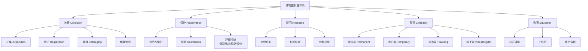

# 博物馆学 (Museology)

> 博物馆学（Museology / Museum Studies）是研究博物馆的历史、使命、功能和管理的学科，涉及收藏（Collection）、保护（Conservation）、研究（Research）、展示（Exhibition）和教育（Education）等多个实践领域。

## 博物馆的定义与核心职能

国际博物馆协会（ICOM）对博物馆的定义：

$$ \text{博物馆} = \text{非营利性、永久的公共服务机构} \times \text{收藏、保护、研究、展示、教育与娱乐} $$

### 五大基本职能

## 博物馆的分类

| 类型 | 主要收藏对象 | 代表案例 |
|------|------------|---------|
| 艺术博物馆 (Art Museum) | 绘画、雕塑、装置 | 卢浮宫、大都会、故宫博物院 |
| 历史博物馆 (History Museum) | 历史文物、档案 | 大英博物馆、中国国家博物馆 |
| 科学博物馆 (Science Museum) | 科技展品、互动装置 | 中国科技馆、Deutsches Museum |
| 自然史博物馆 (Natural History) | 化石、标本、矿物 | 美国自然历史博物馆 |
| 专题博物馆 (Specialized) | 特定主题的收藏 | 电影博物馆、邮票博物馆 |
| 生态博物馆 (Ecomuseum) | 社区文化遗产 | 散布于各国的社区博物馆 |

## 收藏管理 (Collection Management)

### 藏品登记制度

每件藏品进入博物馆后，应登记的唯一标识：

$$ \text{Accession Number} + \text{Description} + \text{Provenance} + \text{Condition Report} + \text{Location} $$

**入藏号编码规范**通常包含：入藏年份 + 入藏批次 + 序列号。例如：2024.12.003 = 2024 年第 12 批第 3 号藏品。

### 藏品来源研究 (Provenance Research)

来源研究是确定藏品历史所有权链条的过程，对于鉴别真伪、确定合法所有权和归还争议文物至关重要。研究途径包括：拍卖记录、收藏家档案、展览历史、文献记载。

### 预防性保护 (Preventive Conservation)

保护重于修复——预防性保护是博物馆保护工作的核心理念：

| 环境因素 | 控制标准 | 影响 |
|---------|---------|------|
| 温度 | 18-22°C（±1°C） | 热胀冷缩对材料的影响 |
| 相对湿度 | 45-55%（±3%） | 过低开裂，过高生霉 |
| 光照照度 | 敏感品 < 50 lux，一般品 < 150 lux | 光化褪色 |
| UV 辐射 | < 75 μW/lm | 紫外线加速降解 |

### 修复伦理 (Conservation Ethics)

现代修复遵循**可逆性原则** (Reversibility) 和**最小干预原则** (Minimal Intervention)。任何修复操作都应可逆，不破坏原物的历史信息。修复前应进行详细记录和科学分析。

## 展览策划流程

$$ \text{概念形成} \rightarrow \text{内容研究} \rightarrow \text{展品选择} \rightarrow \text{空间设计} \rightarrow \text{展品安装} \rightarrow \text{开放运营} \rightarrow \text{效果评估} $$

**策展的核心问题**：
1. 展览要讲述什么故事？——叙事主题
2. 哪些展品最能支持这个故事？——选品策略
3. 观众如何体验这个故事？——参观动线和互动
4. 展览如何与观众产生共鸣？——情感连接

### 展览叙事策略

| 策略类型 | 特点 | 适用场景 |
|---------|------|---------|
| 线性叙事 | 按时间或主题顺序展开 | 历史类展览 |
| 主题集群 | 多个独立主题并行 | 艺术展览 |
| 沉浸式叙事 | 营造环境氛围 | 科技馆、体验展 |
| 互动叙事 | 观众参与决定路径 | 儿童博物馆 |

## 新博物馆学 (New Museology)

1980 年代以来，博物馆学经历了批判性的自我反思：

$$ \text{New Museology} = \text{从"物"到"人"的转向} $$

**核心议题**：
1. **去中心化**：谁来决定博物馆展示什么？——单一权威叙事 → 多元声音
2. **社区参与**：博物馆为谁服务？——从精英到公众
3. **殖民遗产**：藏品来源是否正当？——文物归还（Repatriation）争议
4. **数字化挑战**：数字时代的博物馆如何转型？

## 博物馆的数字化转型

| 技术手段 | 应用场景 | 影响 |
|---------|---------|------|
| 数字化扫描 | 藏品高精度记录保存 | 保护原物，开放访问 |
| 虚拟展览 (VR) | 线上沉浸式观展 | 突破时空限制 |
| AR 增强现实 | 在展品上叠加数字信息 | 丰富现场体验 |
| 智能导览 | AI 语音导览/推荐 | 个性化参观体验 |
| 开放数据 (Open Access) | 公开藏品数字资源 | 促进学术和公众利用 |

## 参观动线设计原则

1. **引导性**：清晰的视觉引导，避免参观者迷路
2. **节奏性**：高潮与舒缓交替，避免"博物馆疲劳"
3. **可达性**：无障碍通道、展品高度和说明文字的多语言
4. **灵活性**：允许参观者自由选择走完全程或重点参观

### 博物馆疲劳 (Museum Fatigue)

博物馆疲劳指参观者在博物馆中因信息过载和体力消耗导致的注意力下降现象。缓解策略包括：设置休息区、控制展览密度、提供多样化的互动方式。

## 博物馆教育

- **导览讲解**：人工导览与语音导览
- **互动体验**：触摸展品、工作坊、角色扮演
- **数字互动**：触摸屏、游戏化学习、AR 寻宝
- **社区项目**：学校合作、社区展览、公众参与

## 博物馆评价体系

博物馆评价从三个维度展开：**观众满意度**（体验质量）、**学习效果**（知识传递）和**社会影响**（社区价值）。评价方法包括问卷调查、焦点小组、访谈和行为观察。

## 相关条目

- [[VisualArts]]
- [[VisualCulture]]
- [[ArtCriticism]]
- [[INDEX|当前目录索引]]
