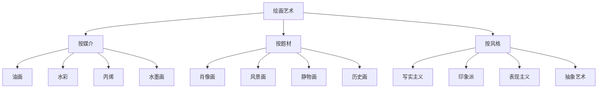
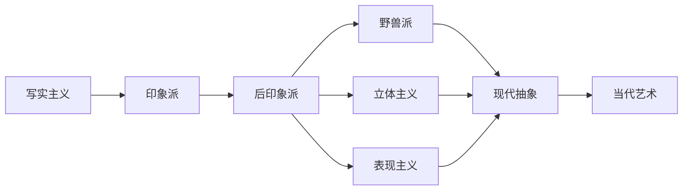

---
aliases:
  - 绘画
  - 艺术绘画
  - 绘画风格
  - 艺术史
  - 绘画美学
  - Painting
  - Painting Arts
  - Art History
  - Painting Styles
tags:
  - Arts
  - FineArts
  - Painting
  - ArtHistory
  - Aesthetics
  - Composition
  - ColorTheory
---

# 绘画艺术

## 一、绘画艺术概述

绘画艺术（Painting Arts）是视觉艺术（Visual Arts）的核心门类，通过色彩、线条、质感在二维平面上创造美和表达情感。

### 绘画的分类

---

## 二、西方绘画史

### 主要时期与风格

| 时期 | 年代 | 代表画家 | 特征 |
|------|------|----------|------|
| 文艺复兴（Renaissance） | 14-16世纪 | 达·芬奇、米开朗基罗 | 透视法、人体解剖 |
| 巴洛克（Baroque） | 1600-1750 | 卡拉瓦乔、伦勃朗 | 戏剧性光影、动态构图 |
| 新古典主义（Neoclassicism） | 1750-1830 | 大卫、安格尔 | 理性、古典主题 |
| 浪漫主义（Romanticism） | 1800-1850 | 德拉克罗瓦、透纳 | 情感、自然力量 |
| 现实主义（Realism） | 1840-1880 | 库尔贝、米勒 | 描绘平凡生活 |
| 印象派（Impressionism） | 1860-1900 | 莫奈、雷诺阿 | 光影与色彩、户外写生 |
| 后印象派（Post-Impressionism） | 1880-1910 | 梵高、塞尚、高更 | 主观表达、结构探索 |
| 现代主义（Modernism） | 1900-1970 | 毕加索、马蒂斯 | 形式革新、多视角 |
| 当代艺术（Contemporary） | 1970-至今 | — | 多元化、跨媒介 |

### 透视法的发展

$$ \text{线性透视} : \frac{h}{d} = \frac{h'}{d'} $$

灭点（Vanishing Point）：平行线在画面中汇聚的点。

---

## 三、构图原理

### 经典构图法则

| 构图法 | 描述 | 适用场景 |
|--------|------|----------|
| 三分法（Rule of Thirds） | 画面分割为9格，主体在交点上 | 通用 |
| 黄金比例（Golden Ratio） | $\phi = 1.618$ 的螺旋构图 | 经典审美 |
| 对角线构图（Diagonal） | 沿对角线布置主体 | 动态画面 |
| S 形构图（S-Curve） | S 形引导线 | 风景、道路 |
| 框架构图（Framing） | 前景形成的自然画框 | 增加层次感 |
| 对称构图（Symmetry） | 左右对称 | 庄严、稳定 |

$$ \phi = \frac{1 + \sqrt{5}}{2} \approx 1.618 $$

### 构图要素

- 平衡（Balance）：视觉重量的均匀分布
- 节奏（Rhythm）：元素重复产生的动感
- 对比（Contrast）：明暗、大小、冷暖的对比
- 统一（Unity）：整体协调一致
- 焦点（Focal Point）：画面视觉中心

---

## 四、色彩体系

### 色彩模型

$$ \text{RGB} \quad \text{（加色混合：光）} $$

$$ \text{CMYK} \quad \text{（减色混合：颜料）} $$

$$ \text{HSV/HSB} \quad \text{（色相/饱和度/明度）} $$

### 色彩与情感

| 颜色 | 英文 | 心理联想 | 文化寓意 |
|------|------|----------|----------|
| 红色 | Red | 热情、危险、能量 | 喜庆（中）、警告（西） |
| 蓝色 | Blue | 冷静、忧郁、理性 | 高贵（中世纪）、科技（现代） |
| 黄色 | Yellow | 快乐、希望、警惕 | 皇权（中）、背叛（西） |
| 绿色 | Green | 自然、平静、生机 | 环保、伊斯兰文化 |
| 黑色 | Black | 神秘、死亡、力量 | 哀悼、优雅 |
| 白色 | White | 纯洁、空无、简洁 | 婚礼（西）、丧事（中） |

---

## 五、绘画流派

### 重要流派

### 中国绘画

- **工笔画（Gongbi）**：细致工整，设色华丽
- **写意画（Xieyi）**：简练奔放，重在神韵
- **水墨画（Ink Wash）**：以墨色浓淡表现物象
- **文人画（Literati Painting）**：诗书画印结合

**南齐谢赫《画品》六法：**

1. 气韵生动（Spirit Resonance）
2. 骨法用笔（Bone Method）
3. 应物象形（Correspondence to Objects）
4. 随类赋彩（Suitability of Coloring）
5. 经营位置（Division and Planning）
6. 传移模写（Transmission by Copying）

---

## 六、创作方法论

### 创作过程

1. **观察（Observation）**：深入理解表现对象
2. **构思（Conceptualization）**：确定主题和表现形式
3. **构图设计（Composition Planning）**：安排画面要素
4. **色彩方案（Color Palette Selection）**：确定主色调
5. **绘制执行（Execution）**：分阶段完成作品
6. **深入调整（Refinement）**：完善细节和整体关系

---

## 七、名作赏析

| 作品 | 画家 | 年代 | 技法特点 |
|------|------|------|----------|
| 蒙娜丽莎 | 达·芬奇 | 1503-1519 | 晕涂法（Sfumato） |
| 向日葵 | 梵高 | 1888 | 厚涂法（Impasto） |
| 睡莲系列 | 莫奈 | 1897-1926 | 外光画法（Plein Air） |
| 亚威农少女 | 毕加索 | 1907 | 立体主义突破 |
| 呐喊 | 蒙克 | 1893 | 表现主义符号 |
| 富春山居图 | 黄公望 | 1350 | 水墨长卷透视 |
