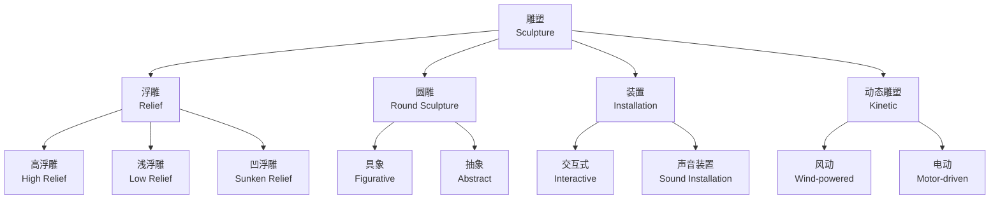
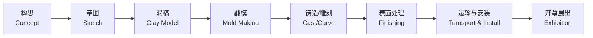

---
aliases:
  - Sculpture and Spatial Art
  - 雕塑艺术
  - 空间艺术
  - 三维艺术
tags:
  - Sculpture
  - FineArts
  - SpatialArt
  - ArtTheory
---

# 雕塑与空间艺术（Sculpture and Spatial Art）

雕塑（Sculpture）是一种三维空间艺术形式，通过物质材料塑造可视、可触的艺术形象。它与建筑（Architecture）、装置（Installation）一并构成空间艺术的核心领域。雕塑的本质在于对物质、体积和空间关系的深度探索——艺术家通过对材料的加工与重组，将抽象概念转化为具有物理实体感的艺术表达。从原始时代的石雕到当代的数字雕塑，这一艺术形式始终在回应人类对自身与世界的认知欲望。雕塑也是唯一一种要求观者围绕其行走的艺术形式——这种身体性的观看方式赋予了雕塑独特的感知时间维度。

## 雕塑类型总览（Types of Sculpture Overview）

## 材料与技术（Materials and Techniques）

### 传统材料（Traditional Materials）

| 材料 | 加工方式 | 特点 | 代表作品 |
| :--- | :--- | :--- | :--- |
| 大理石（Marble） | 雕刻（Carving） | 坚硬、半透光、永恒感 | 米开朗基罗《大卫》 |
| 青铜（Bronze） | 铸造（Casting） | 可复制、耐久、氧化色 | 罗丹《思想者》 |
| 木材（Wood） | 雕刻/拼接 | 温润、自然纹理、轻便 | 非洲木雕面具系列 |
| 黏土（Clay） | 塑造（Modeling） | 可塑性强、需烧制成陶 | 秦始皇陵兵马俑 |
| 石膏（Plaster） | 浇铸/塑造 | 快速成型、过渡材料 | 新古典主义雕塑初稿 |
| 象牙（Ivory） | 雕刻 | 细腻、珍贵、伦理争议 | 中世纪宗教微雕 |

### 现代与当代材料（Modern and Contemporary Materials）

| 材料 | 特点 | 应用案例 |
| :--- | :--- | :--- |
| 不锈钢（Stainless Steel） | 光滑反射表面、耐候性强 | Anish Kapoor《云门》（Cloud Gate） |
| 玻璃（Glass） | 透明与折射、色彩渗透 | Dale Chihuly 玻璃装置系列 |
| 树脂（Resin） | 轻便、可任意着色、可透光 | 当代雕塑模型与量产 |
| 综合材料（Mixed Media） | 现成品组合、语义丰富 | Picasso《牛头》（Bull's Head） |
| 光与投影（Light/Projection） | 非物质化、可变性 | 投影映射（Projection Mapping） |
| 数字材料（Digital Material） | 虚拟建模、3D 打印输出 | 生成式雕塑（Generative Sculpture） |
| 冰与雪（Ice and Snow） | 临时性、环境依赖 | 哈尔滨国际冰雪节 |
| 再生材料（Recycled Materials） | 环保意识、社会批判 | 塑料瓶装置、金属废料雕塑 |

### 创作流程（Creation Process）

## 形式与构成（Form and Composition）

### 雕塑的语言要素（Elements of Sculptural Language）

| 要素 | 定义 | 美学效果 | 控制方法 |
| :--- | :--- | :--- | :--- |
| 体量（Volume） | 占据空间的物理量 | 厚重感、压迫感或轻盈感 | 材料密度与形态体积 |
| 轮廓（Silhouette） | 外边缘线的形状 | 辨识度、剪影效果 | 外形归纳、简化提炼 |
| 质感（Texture） | 表面的触觉属性 | 真实感、视觉层次丰富度 | 工具痕迹、打磨程度 |
| 光影（Light and Shadow） | 光线在表面的分布 | 塑造立体感、戏剧性氛围 | 表面肌理雕刻、展示灯光 |
| 比例（Proportion） | 各部分之间的尺度关系 | 和谐感或张力感 | 黄金分割 $\varphi$、对比缩放 |

雕塑的整体表现力可以形式化地表达为各要素的复合函数：

$$
\text{雕塑表现力} = f(\text{体量}, \text{轮廓}, \text{质感}, \text{光影}, \text{比例})
$$

### 空间关系（Spatial Relations）

| 空间类型 | 定义 | 雕塑实例 |
| :--- | :--- | :--- |
| 正空间（Positive Space） | 实体物质占据的空间 | 圆雕的实体主体部分 |
| 负空间（Negative Space） | 实体之间的空隙区域 | Henry Moore 的孔洞造型 |
| 环境空间（Environmental Space） | 作品所处的宏观物理环境 | 公共雕塑与城市广场 |
| 观者空间（Viewer Space） | 观众与作品的交互区域 | 互动装置中的参与区 |
| 心理空间（Psychological Space） | 作品唤起的情感想象空间 | 极简主义雕塑的"场域" |

传统雕塑理论认为，优秀的雕塑作品应当同时经营正负空间：负空间不仅是"背景"，更是构成整体雕塑语言不可或缺的活跃要素。Henry Moore 的斜倚人体系列最卓越地体现了正负空间的辩证统一——孔洞使得空间本身成为雕塑的"雕刻"对象，而不仅仅是"剩余"。

### 雕塑中的数学与比例

黄金分割比 $\varphi = \frac{1 + \sqrt{5}}{2} \approx 1.618$ 在古典雕塑中被广泛运用。人类面部与身体的比例理想化模型常常以 $\varphi$ 为基准：

$$\frac{\text{身高}}{\text{肚脐至脚底}} = \varphi$$

波利克里托斯（Polykleitos）在其失传的著作《法则》（Kanon）中系统化地提出了人体比例体系，通过《持矛者》（Doryphoros）雕像将数学比例与审美理想完美融合。这一传统影响了从希腊化时期到文艺复兴再到新古典主义的整个西方雕塑史。在当代雕塑中，数学结构（如莫比乌斯带、极小曲面、分形几何）直接作为形式语言出现，成为数字雕塑的重要灵感来源。

## 雕塑史主要流派（Historical Movements）

| 时期/流派 | 时间跨度 | 代表艺术家 | 核心贡献 | 代表作品 |
| :--- | :--- | :--- | :--- | :--- |
| 古典希腊 | 公元前5–4世纪 | Phidias, Polykleitos | 理想化人体比例与动态平衡 | 《持矛者》《命运三女神》 |
| 文艺复兴 | 14–16世纪 | Michelangelo, Donatello | 解剖学精准、情感深度 | 《大卫》《哀悼基督》 |
| 巴洛克 | 17世纪 | Bernini | 动态构图、戏剧性瞬间 | 《圣特蕾莎的狂喜》 |
| 新古典主义 | 18–19世纪初 | Canova | 回归古典简洁与庄重 | 《丘比特与普赛克》 |
| 现代主义 | 1900–1960 | Rodin, Brancusi, Moore | 简化抽象、材料解放 | 《吻》《无尽之柱》 |
| 极简主义 | 1960–1970s | Judd, Serra | 几何纯粹、工业材料 | 《倾斜之弧》|
| 当代 | 1960–至今 | Kapoor, Gormley, Whiteread | 概念主导、跨媒介 | 《云门》《北方天使》|

## 雕塑的观看与空间体验

雕塑的观看不同于绘画的平面观看——观者可以围绕作品行走，从不同角度获得迥异的视觉体验。雕塑的时间性（Temporality）体现在观者的移动过程中：随着视角的变化，轮廓、光影和空间关系不断重组。雕塑的知觉现象学（Phenomenology of Perception）强调身体在场、空间位移和触觉想象在雕塑体验中的根本性地位。Maurice Merleau-Ponty 的知觉理论为理解雕塑体验提供了哲学基础——雕塑不是单纯的视觉对象，而是身体与世界之间的知觉中介。观者与雕塑之间的空间距离 $d$ 决定了感知模式：

- $d > 3h$（$h$ 为雕塑高度）：全景感知——把握整体轮廓
- $h < d < 3h$：中距感知——体察形态与光影关系
- $d < h$：微观感知——接触质感与细节

## 公共艺术（Public Art）的功能分类

| 功能类型 | 目的 | 典型实例 | 设计原则 |
| :--- | :--- | :--- | :--- |
| 纪念性（Monumental） | 承载集体记忆 | 华盛顿方尖碑、人民英雄纪念碑 | 庄重、耐久、象征性 |
| 装饰性（Decorative） | 美化城市空间 | 城市广场抽象雕塑 | 形式美、与环境协调 |
| 功能性（Functional） | 结合城市家具 | 座椅雕塑、照明雕塑 | 人体工学、耐久材料 |
| 互动性（Interactive） | 公众参与 | 触摸发声装置 | 安全、易用、趣味性 |
| 地标性（Landmark） | 城市标识 | 芝加哥《云门》、哥本哈根《小美人鱼》| 高辨识度、公共认同 |

## 当代趋势（Contemporary Trends）

- **数字雕塑（Digital Sculpture）**：使用 Blender、ZBrush、Rhino 等 3D 建模软件创作，通过 3D 打印或 CNC 数控雕刻实现物理化——彻底改变了传统"从石头到形象"的减法逻辑，使设计师可以从数字直接跨越到最终形式。
- **投影映射（Projection Mapping）**：将动态影像投射到雕塑表面，赋予静态形体以时间维度的变化——实现"会呼吸的雕塑"。这一技术模糊了雕塑与影像艺术的边界。
- **生态雕塑（Ecological Sculpture）**：使用可生物降解材料、活体植物或再生材料，探讨人类世（Anthropocene）语境下的生态议题。Patrick Dougherty 的树枝编织装置是这一方向的典范。
- **声音装置（Sound Installation）**：融合听觉维度，雕塑本身成为发声装置或声音的反射界面。观者的进入触发了声场变化，作品在时间中展开。
- **参与式雕塑（Participatory Sculpture）**：观众的互动行为构成作品不可分割的组成部分——Jeppe Hein 的互动装置彻底打破了创作者与观众的传统边界，使作品在每一次互动中被重新"创造"。

## 东西方雕塑传统的比较

| 维度 | 西方雕塑传统 | 中国雕塑传统 |
|:--- |:--- |:--- |
| 核心材料 | 大理石、青铜——追求永恒 | 木、泥、陶——追求"气韵生动" |
| 语言特征 | 解剖学精准、光影塑造体积 | 线条与轮廓的节奏、不求肌肉精确但求神韵 |
| 宗教语境 | 古希腊诸神→基督教圣像→人本主义 | 佛教造像（云冈、龙门）→陵墓仪卫→世俗题材 |
| 空间观念 | 占据空间——圆雕独立于环境 | 与环境共生——石窟雕塑与山体结合 |
| 身体观念 | 裸露作为理想美的载体 | 服饰褶皱的程式化语言——极少裸体 |

中国雕塑传统中最辉煌的篇章是大乘佛教造像传统。从云冈石窟（北魏, 5 世纪）的雄浑粗犷到龙门石窟（唐, 7–8 世纪）的圆润华美，中国雕塑在吸收印度犍陀罗（Gandhara）和笈多（Gupta）风格的基础上完成了本土化转型——佛像的面容从西域特征的深目高鼻演变为汉地特征的慈眉善目。宋代以后，雕塑在中国艺术中的主导地位逐渐被山水画取代，但在民间工艺（泥人张、东阳木雕）和宗教造像中延续至今。

## 雕塑的陈列与照明设计

雕塑的展示是作品创作的延伸环节。照明角度对雕塑的感知有决定性影响：
- **顶光（Top Lighting）**：模拟自然天光——均匀柔和，减弱戏剧性——适合古典雕塑
- **侧光（Side Lighting）**：强化纹理和体积感——创造强烈的明暗对比——适合纹理丰富的现代雕塑
- **底光（Under Lighting）**：反常的光源方向——产生诡异、超现实的氛围——适合当代装置
- **聚光与泛光混合**：焦点照明 + 环境漫射——平衡焦点与语境

## 著名雕塑作品简表

| 作品 | 艺术家 | 材料 | 年代 | 所在地 |
| :--- | :--- | :--- | :--- | :--- |
| 《大卫》（David） | Michelangelo | 大理石 | 1501–1504 | 佛罗伦萨学院美术馆 |
| 《思想者》（The Thinker） | Rodin | 青铜 | 1904 | 巴黎罗丹美术馆 |
| 《泉》（Fountain） | Duchamp | 陶瓷（现成品） | 1917 | 现代艺术史上最具争议 |
| 《云门》（Cloud Gate） | Anish Kapoor | 不锈钢 | 2004 | 芝加哥千禧公园 |
| 《北方天使》（Angel of the North） | Antony Gormley | 耐候钢 | 1998 | 英国盖茨黑德 |

## 雕塑收藏与市场

雕塑收藏市场与绘画市场有本质差异——运输和仓储成本远高于平面作品，这使得雕塑收藏的门槛高于绘画。20 世纪以来最重要的雕塑收藏家和展览包括：Mona Bismarck 收藏（现代雕塑）、威尼斯双年展雕塑花园、明尼阿波利斯沃克艺术中心雕塑花园。近年来，随着 3D 打印和数字雕塑的兴起，雕塑的可复制性和传播方式发生了革命性变化——限量版数字雕塑（NFT 雕塑）正在创造全新的收藏范式。

## 雕塑教育的核心训练

传统雕塑教育的训练体系以"从观察出发"为原则，循序渐进：

1. **素描基础**：石膏像写生——理解光影、比例和结构
2. **泥塑头像**：从几何体归纳到具象表达——训练观察与塑造的关系
3. **人体泥塑**：解剖学训练——理解骨骼与肌肉的体块关系
4. **浮雕临摹**：压缩空间的感知训练——从三维到二维的投射
5. **圆雕创作**：综合运用——材料选择、空间关系和概念表达的独立性

## 相关条目

- [[艺术史|Art History]]
- [[装置艺术|Installation Art]]
- [[公共艺术|Public Art]]
- [[现代艺术|Modern Art]]
- [[建筑美学|Architectural Aesthetics]]
- [[INDEX|当前目录索引]]
