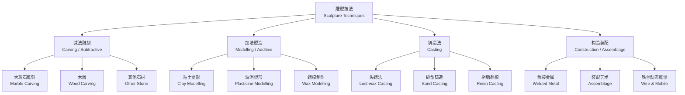

# 雕塑技法与材料（Sculpture Techniques & Materials）

## 概述

雕塑（Sculpture）是一种三维造型艺术，通过对材料的雕、塑、铸、焊、构建等方式创造出具有立体形态的作品。雕塑的历史与人类文明同样悠久——从旧石器时代的维伦多夫的维纳斯到当代的不锈钢抽象装置，雕塑一直在探索体积、空间、质感和材料之间的无限可能。不同的材料具有截然不同的物理和美学特性，决定了与之匹配的技法和表现边界。大理石（Marble）的半透明质感适合细腻的人体表现，青铜（Bronze）的流动性适合铸造复杂的动态造型，钢铁的强度则支撑起大型公共艺术的空间野心。本章系统介绍雕塑的主要技法（减法雕刻、加法塑造、铸造和装配）以及常用材料的性能与应用。

## 雕塑技法的分类体系

## 1. 减法雕刻（Carving / Subtractive）

减法雕刻从整块材料上逐步去除多余部分，具有不可逆性——每一次雕凿都是不可撤销的决定，这要求雕刻者对最终形态有预先的想象和严密的步骤控制。

### 石材雕刻

| 材料 | 莫氏硬度 | 工具 | 特点 | 经典范例 |
|------|----------|------|------|----------|
| 大理石（Carrara Marble） | 3–4 | 尖凿、平凿、齿凿、锤、锉刀 | 半透明质感，适合人体 | Michelangelo《大卫》 |
| 花岗岩（Granite） | 6–7 | 碳化钨凿、锤、角磨机 | 极硬，耐风化，适合户外 | 古埃及方尖碑 |
| 石灰岩（Limestone） | 3 | 凿、锤 | 质地较软，易于雕刻 | 中世纪大教堂雕塑 |
| 砂岩（Sandstone） | 4–5 | 凿、锤 | 颗粒粗，细节表现有限 | 印度石窟造像 |
| 玉石（Jade） | 6–7 | 金刚砂轮、雕刻机 | 极硬，需磨削工艺 | 中国古代玉雕 |

雕刻步骤：制作小稿模型 → 点线仪（Pointing Machine）放大至石料 → 粗凿（Roughing Out）去除大块 → 细凿（Blocking In）塑造基本形 → 精雕（Modeling）处理细节 → 锉刀打磨（Refining）→ 抛光（Polishing）。

$$ \text{雕刻量} = \text{初始体积} - \text{最终体积} $$

石雕中最重要的视觉元素是光线——雕刻师在切割和打磨时不仅是在塑造形态，更是在规划光线如何在不同角度的表面上产生阴影和高光。

### 木雕（Wood Carving）

木材具有纤维方向，雕刻时必须顺应纹理（With the Grain）以避免劈裂。常用木料包括椴木（易雕刻、适合细节）、胡桃木（纹理美观、硬度适中）、橡木（坚硬、耐久、适合户外）和红木（珍贵硬木、适合精雕）。木雕工具包括雕刻刀（Carving Knife）、凿子（Chisel）、圆凿（Gouge）、锯子和木锉。木雕的保存需控制环境相对湿度（RH 45–55%），防止干裂和虫蛀。

## 2. 加法塑造（Modelling / Additive）

加法塑造使用可塑材料逐步添加和调整造型，可反复修改，是雕塑初始阶段和大型作品原模制作的主要方法。

| 材料 | 特性 | 工具 | 代表作/用途 |
|------|------|------|-------------|
| 粘土（Clay） | 柔软可塑，需保持湿润（湿土布包裹） | 雕塑刀、刮刀 | Rodin《思想者》原模 |
| 油泥（Plasticine） | 不干不裂，保持可塑 | 油泥刀、加热工具 | 汽车设计模型 |
| 石膏（Plaster） | 浆状→凝固，可雕可加 | 刮刀、锉刀、砂纸 | 翻模中间材料 |
| 蜡（Wax） | 加热变软，可雕可铸 | 蜡刀、加热笔 | 失蜡法原型 |

加法塑造的关键是骨架（Armature）的制作——骨架提供内部支撑，通常由铁丝、木条或金属管构成，其姿态决定了雕塑的最终动势。骨架设计需考虑材料的重量分布和重心位置。

## 3. 铸造法（Casting）

### 失蜡法（Lost-wax Casting / Cire Perdue）

失蜡法是最精密的金属雕塑铸造工艺，步骤包括：1. 粘土或油泥制作原模 → 2. 用原模翻制硅胶模具（Silicone Mold）→ 3. 向模具中注入蜡液形成中空蜡壳 → 4. 修整蜡壳并粘接浇道系统（Sprue System）→ 5. 反复浸挂陶浆和撒沙（6–8 次），形成耐热陶壳 → 6. 高温烘烤（约 700°C）使蜡熔化流出 → 7. 高温预热陶壳（约 800°C）→ 8. 浇铸熔融青铜（约 1050°C）→ 9. 冷却后破壳取出 → 10. 切除浇道、焊接修整 → 11. 表面处理（热着色/打磨/抛光）。

$$ \text{失蜡法精度} = \phi(\text{模具精度}, \text{蜡壳壁厚}, \text{收缩率}) $$

青铜收缩率约为 1–2%，因此原模需比最终作品略大。蜡壳壁厚均匀性直接影响铸件的质量——过薄会导致浇铸不完全，过厚则浪费材料和增加缩孔风险。

### 其他铸造方法

砂型铸造（Sand Casting）成本低、可处理大型构件，但表面精度低于失蜡法，适合工业雕塑和大型公共艺术品。树脂翻模（Resin Casting）使用硅胶模具和树脂材料，重量轻、成本低、可批量复制，适合现代艺术和道具制作。

## 4. 构造与装配法（Construction / Assemblage）

| 类型 | 材料 | 技法 | 代表人物 |
|------|------|------|----------|
| 金属焊接（Welded Sculpture） | 钢板、钢筋、钢管 | 电弧焊、MIG焊、乙炔焊 | David Smith, Anthony Caro |
| 装配艺术（Assemblage） | 现成品、废金属、日常物件 | 组合、焊接、螺丝固定 | Picasso《山羊》 |
| 铁丝雕塑（Wire Sculpture） | 铁丝、钢索 | 弯曲、缠绕、焊接 | Alexander Calder |
| 动态雕塑（Mobile） | 金属片、连杆、线 | 平衡设计、悬挂系统 | Calder 动态雕塑 |

$$ \text{装配艺术（Assemblage）} = \sum(\text{现成物}) + \text{概念重组} + \text{跨界语义} $$

焊接雕塑的关键技术包括：气体保护焊（MIG/MAG）适合薄板金属，电弧焊适合厚板结构，TIG 焊精度最高适合精细连接。

## 5. 表面处理与后处理

| 处理方式 | 方法 | 效果 |
|----------|------|------|
| 抛光（Polishing） | 砂纸逐级打磨（#80 → #600 → #2000）至镜面 | 高光泽反射 |
| 热着色（Patina） | 化学试剂（硝酸铜/硫化钾）+ 加热 | 青铜绿/棕/蓝黑色锈蚀层 |
| 喷漆（Painting） | 底漆 + 面漆 | 色彩保护与装饰 |
| 打蜡（Waxing） | 天然蜂蜡或卡那巴蜡涂覆 | 保护层和柔和光泽 |
| 金箔贴附（Gilding） | 金箔 + 胶水 + 封护 | 奢华装饰表面 |
| 喷砂（Sandblasting） | 高压砂粒冲击 | 哑光粗糙表面 |

铜绿/热着色（Patina）是青铜雕塑最具魅力的表面效果。稳定的绿色铜绿（碱式碳酸铜 Cu₂(OH)₂CO₃）具有保护性，而可控制的有色锈层（蓝色硝酸铜、黑色硫化铜）则是雕塑师艺术表达的一部分。青铜著名热着色配方：

$$ \text{绿色锈（Verde Green）} \rightarrow \text{硝酸铜 Cu(NO₃)₂ 溶液 + 加热} $$
$$ \text{深棕色} \rightarrow \text{硫化钾 K₂S 溶液 + 加热} $$

## 6. 数字化雕塑技术

| 技术 | 用途 | 代表设备/软件 |
|------|------|--------------|
| 3D 扫描（3D Scanning） | 将实物转化为数字模型 | EinScan, Artec, Photogrammetry |
| 数字雕刻（Digital Sculpting） | 在虚拟空间中雕刻 | ZBrush, Blender, Mudbox |
| 3D 打印（3D Printing） | 数字模型转化为实物 | FDM / SLA / SLS 打印机 |
| CNC 雕刻（CNC Carving） | 精确自动化切割雕刻 | 5 轴 CNC 铣床 |
| 参数化设计（Parametric Design） | 算法生成雕塑形态 | Grasshopper / Rhino |

数字技术并未取代传统雕塑，而是拓展了雕塑的可能性——复杂的有机形态可通过算法生成、3D 打印后作为失蜡法的蜡模，实现传统工艺无法达到的几何复杂度。

## 7. 保存与维护

户外雕塑需定期清洁（低压水 + 中性清洁剂），防鸟粪腐蚀
（鸟粪中的尿酸会侵蚀石材和金属），检查结构裂缝和连接件
松动。青铜雕塑的热蜡层每年重新涂覆 1–2 次；稳定的铜绿
（稳定的碱式碳酸铜锈层）无需处理，其本身即具有保护作用。
石材雕塑需避免酸雨侵蚀——大理石对酸性最敏感，其碳酸钙
成分会被酸溶解，裂缝用环氧树脂修复。木雕控制环境温湿度
（RH 45–55%），定期检查虫蛀和处理防霉。金属雕塑需防止
电化学腐蚀，不同金属接触处需加绝缘垫片。环境监测传感器
可实时跟踪温湿度、UV 辐射和大气污染物浓度，为预防性保护
提供数据支持。古迹保护中的可逆性原则要求所有的修复材料
和操作应可被撤销，不应对原作造成不可逆的改变。

## 世界雕塑重要流派概览

| 流派/时期 | 时间 | 材料特点 | 美学追求 | 代表雕塑家 |
|----------|------|----------|----------|-----------|
| 古希腊古典雕塑 | 前 5–4 世纪 | 大理石、青铜 | 理想化人体比例、和谐 | 菲迪亚斯、波利克里托斯 |
| 文艺复兴雕塑 | 15–16 世纪 | 大理石、青铜 | 自然主义、人体解剖 | 多纳泰罗、米开朗基罗 |
| 巴洛克雕塑 | 17 世纪 | 大理石、青铜 | 动态构图、戏剧性 | 贝尔尼尼 |
| 新古典主义 | 18–19 世纪 | 白色大理石 | 古典理想美、庄重 | 卡诺瓦 |
| 现代雕塑 | 20 世纪 | 多种材料 | 抽象、形式自主 | 布朗库西、摩尔 |
| 当代雕塑 | 1960s– | 现成品、装置 | 观念、空间介入 | 贾德、塞拉 |

雕塑作为最古老的艺术形式之一，在材料、尺度和观念上不断
突破自身的边界。从卡拉拉大理石的开采到数字雕刻软件 ZBrush
的参数化建模，雕塑技法的演变与材料技术的发展始终同步。
古典雕塑追求理想化的自然美，现代雕塑追求形式自主和材料
真实，当代雕塑则打破了艺术与生活的界限。雕塑语言的核心
要素包括形体（Volume and Form）、空间（Positive and
Negative Space）、质感（Texture）、光线（Light and
Shadow）和动势（Movement and Rhythm）。一尊成功的雕塑
能够在触觉和视觉两个层面产生感染力。

## 雕塑的空间与环境

雕塑不仅是物体的造型，更是对空间的重塑。环境雕塑
（Environmental Sculpture）将作品与自然或城市空间融为
一体，塞拉（Richard Serra）的巨型耐候钢板以极简的弧面
改变了观者对空间的感知和行走路线。大地艺术（Land Art）
如史密森的《螺旋防波堤》以自然环境为材料和画布。公共
雕塑（Public Sculpture）需要协调艺术家表达、城市景观、
公众接受度和耐久性等多重诉求。城市雕塑选址应考虑日照
方向、行人动线和视觉背景。户外雕塑的尺度感至关重要——
过小会在开放空间中显得苍白，过大会造成压迫感。

## 主要参考文献

1. Wittkower, R. Sculpture: Processes and Principles. Penguin,
    1977.
2. 陈培一. 雕塑技法. 人民美术出版社, 2003.
3. 吴为山. 雕塑艺术. 高等教育出版社, 2006.
4. Plowman, J. The Sculptor's Bible. A&C Black, 2005.
5. 谭勋. 雕塑综合材料教学. 河北美术出版社, 2005.

## 雕塑艺术家创作流程

雕塑作品从构思到完成通常经历以下阶段。艺术家首先进行概念
构思（Concept Development），通过草图或小稿探索形式可能性。
接着选择材料——材料的选择本身就是表达的一部分，不同材料
承载不同的文化内涵和情感色彩。随后进入制作阶段：减法雕刻
需要分步骤去除材料、加法塑造需要构建骨架后分层添加、铸造
法需要制作模具和浇铸系统。表面处理阶段决定作品的最终视觉
效果——抛光强调材料本身的质感，热着色赋予青铜丰富的色彩
变化，涂覆保护层确保作品持久性。大型雕塑还要考虑结构力学、
运输安装和长期维护等问题。每一座雕塑都是艺术家与材料对话
的产物，材料的"说话"方式决定了作品的最终形态和质感。

## 雕塑名家技法赏析

学习雕塑技法不仅要掌握工艺流程，还要理解大师们如何运用
材料表达观念。米开朗基罗的大理石雕刻以"从石中释放形象"
的理念著称，他相信形象早已存在于石材中。罗丹的粘土原模
保留了手指捏塑的痕迹，将创作过程本身作为表达的一部分。
布朗库西的抛光青铜以极致的简洁追求本质，其《空间中的鸟》
以流线型捕捉了飞翔的纯粹理念。贾科梅蒂的细长人体系列以
减法雕塑呈现存在主义的孤独感。亨利·摩尔的有机抽象在空洞
和实体之间找到了动态平衡。安东尼·戈姆利的《北方天使》以
耐候钢的锈红色融入英格兰北部的天空。这些大师的共同之处
在于材料的选择和使用方式本身就是内容的一部分。

## 相关条目

- [[ArtHistory]]
- [[ArtCriticism]]
- [[Ceramics]]
- [[InstallationArt]]
- [[VisualArts]]
