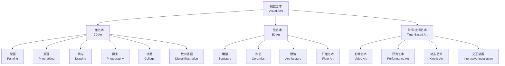

---
aliases:
  - Visual Arts
  - 视觉艺术
  - 造型艺术
tags:
created: 2026-05-17
updated: 2026-05-17
  - VisualArts
  - FineArts
  - ArtHistory
  - ArtTheory
---

# 视觉艺术（Visual Arts）

视觉艺术（Visual Arts）是以视觉感知为核心的创造性表现形式，涵盖绘画（Painting）、雕塑（Sculpture）、版画（Printmaking）、摄影（Photography）、装置艺术（Installation Art）、数字媒体（Digital Media）等多种媒介。它是人类表达情感、思想、记录与想象世界的最古老方式之一——从拉斯科洞穴壁画（约公元前 15,000 年）到 AI 生成艺术，视觉艺术始终在回应人类对"看见"与"被看见"的双重渴望。视觉艺术的独特性在于它同时作用于认知和情感两个层面：我们"看懂"一幅画之前，已经先"感受"了它。

## 视觉艺术的分类体系

## 视觉艺术的形式要素（Elements of Visual Art）

### 设计元素（Elements of Design）

| 元素 | 定义 | 视觉特征 | 艺术实例 |
|------|------|---------|---------|
| 线条（Line） | 点的移动轨迹 | 直线/曲线、粗/细、刚/柔、连续/间断 | 克利《线的叙事》的线条运动 |
| 形状（Shape） | 闭合区域的外轮廓 | 几何形/有机形、正形/负形 | 蒙德里安红黄蓝的几何分割 |
| 色彩（Color） | 光反射的视觉反应 | 色相/明度/饱和度 | 马蒂斯的野兽派色彩解放 |
| 纹理（Texture） | 表面质感与触觉暗示 | 光滑/粗糙、真实/模拟 | 梵高《星空》的厚涂笔触 |
| 空间（Space） | 画面的三维深度感知 | 正/负空间、浅/深空间 | 透视法文艺复兴传统 |
| 明度（Value） | 从亮到暗的灰度渐变 | 高调/低调、明暗对比 | 伦勃朗的 chiaroscuro 布光 |

视觉艺术的感知公式：

$$\text{视觉感知} = \sum(\text{线条} \times \text{形状} \times \text{色彩} \times \text{纹理} \times \text{空间} \times \text{明度})$$

各要素并非独立运作——它们在画面上构成一个互相作用的"力场"。一幅作品的视觉强度来自要素之间的张力：如果线条刚性，色彩的柔和可以形成平衡；如果空间扁平，纹理的厚重可以补偿深度。这正是 Rudolf Arnheim 在《艺术与视知觉》（Art and Visual Perception）中论证的核心论点——视觉艺术是"力的结构"而非静止的图案。

### 色彩理论（Color Theory）

RYB 色环的基本关系：

$$\text{原色（Primary）：红（Red）、黄（Yellow）、蓝（Blue）}$$

$$\text{间色（Secondary）：橙（R+Y）、绿（Y+B）、紫（B+R）}$$

$$\text{补色（Complementary）：红}\leftrightarrow\text{绿、黄}\leftrightarrow\text{紫、蓝}\leftrightarrow\text{橙}$$

色彩和谐搭配策略：

| 配色方案 | 色环关系 | 效果 | 代表艺术家 |
|---------|---------|------|-----------|
| 类似色（Analogous） | 色环上相邻 2–3 色 | 和谐统一、渐变有序 | Monet《睡莲》淡蓝-紫-绿 |
| 补色（Complementary） | 色环上相对 180° | 强烈对比、视觉冲击 | van Gogh《夜间咖啡馆》黄-紫 |
| 三色组（Triadic） | 色环上均匀 120° | 丰富平衡、充满活力 | Mondrian 红-黄-蓝构图 |
| 分裂补色（Split-Complementary） | 一色+补色两侧色 | 对比柔和、层次丰富 | Matisse 窗户与室内场景 |
| 单色（Monochromatic） | 同色系明度/饱和度变化 | 纯粹统一、细腻微妙 | Yves Klein 的国际克莱因蓝 |

### 设计原则（Principles of Design）

| 原则 | 定义 | 实现方法 | 经典例证 |
|------|------|---------|---------|
| 平衡（Balance） | 视觉重量均匀分布 | 对称/不对称/辐射式构图 | da Vinci《最后的晚餐》对称构图 |
| 强调（Emphasis） | 视线聚焦的视觉中心 | 对比焦点、中心/背景分离 | Caravaggio 戏剧性明暗对照 |
| 节奏（Rhythm） | 元素的重复与变奏 | 渐变、交替、放射状排列 | Warhol《金宝汤罐头》网格重复 |
| 比例（Proportion） | 元素间的大小尺度关系 | 黄金分割 $\varphi$、模度系统 | Dürer《人体比例四书》研究 |
| 统一（Unity） | 整体各部分间的协调 | 色彩一致、风格统一 | Cézanne 静物的形式整合 |
| 运动（Movement） | 引导视线在画面流动 | 方向线、重复、渐变序列 | Boccioni《城市的崛起》动态线条 |

黄金分割比 $\varphi = \frac{1 + \sqrt{5}}{2} \approx 1.618$ 在视觉艺术构图中的经典应用：

$$\frac{\text{整体}}{\text{较长部分}} = \frac{\text{较长部分}}{\text{较短部分}} = \varphi$$

这一比例在艺术史上被反复运用——从帕特农神庙的立面比例到塞尚静物中的画面分割——尽管许多艺术家是直觉地而非数学地使用它。

## 视觉艺术史的主要时期

| 时期 | 时间跨度 | 美学特征 | 代表艺术家 |
|------|---------|---------|-----------|
| 文艺复兴（Renaissance） | 14–17 世纪 | 透视法、人体解剖、宗教人文 | da Vinci, Michelangelo, Raphael |
| 巴洛克（Baroque） | 17 世纪 | 戏剧性光线、宏大构图、情感张力 | Caravaggio, Rembrandt, Vermeer |
| 新古典主义（Neoclassicism） | 18–19 世纪初 | 理性构图、古典题材、道德教化 | David, Ingres |
| 浪漫主义（Romanticism） | 1800–1850 | 情感至上、自然力量、个性表现 | Delacroix, Turner, Goya |
| 印象派（Impressionism） | 1870–1890 | 户外写生、瞬间光影、小笔触 | Monet, Renoir, Degas, Pissarro |
| 后印象派（Post-Impressionism） | 1880–1905 | 主观色彩、形式简化、情感表达 | van Gogh, Cézanne, Gauguin |
| 现代主义（Modernism） | 1900–1960 | 形式实验、打破传统、观念先行 | Picasso, Matisse, Kandinsky, Duchamp |
| 抽象表现主义（Abstract Expressionism） | 1940–1960 | 自动书写、色域绘画、行动绘画 | Pollock, Rothko, de Kooning |
| 当代艺术（Contemporary） | 1960–至今 | 多元媒介、观念主导、社会介入 | Warhol, Abramović, Ai Weiwei, Hirst |

## 视觉艺术创作过程

$$I_{\text{灵感}} \rightarrow C_{\text{构思}} \rightarrow S_{\text{草图}} \rightarrow E_{\text{制作}} \rightarrow R_{\text{反思}} \rightarrow W_{\text{完成}}$$

创作过程并非严格的线性序列——艺术家常常在制作阶段返回构思阶段修正原始概念。最优秀的作品往往诞生于"计划"与"发现"之间的辩证张力：既有清晰的方向感，又对偶然性和材料的自主性保持开放。Francis Bacon 曾将这一过程描述为"与偶然性的搏斗"——画家设置初始条件，然后让材料、意外和直觉参与进来。

## 艺术媒介与技术对比

| 媒介 | 基底材料 | 关键特性 | 干燥时间 | 代表画家 |
|------|---------|---------|---------|---------|
| 油画（Oil Painting） | 画布/木板 | 色彩丰富、可反复修改、多层罩染 | 数天至数月 | Rembrandt, Monet |
| 水彩（Watercolor） | 棉浆/木浆纸 | 透明、轻盈、不可覆盖、流动性 | 数分钟 | Turner, Sargent |
| 丙烯（Acrylic） | 多种表面 | 快干、防水、色彩鲜明、可稀释 | 15–30 分钟 | Hockney, Richter |
| 色粉（Pastel） | 纹理纸面 | 柔和粉状质感、无需干燥、易模糊 | 即时 | Degas, Cassatt |
| 坦培拉（Tempera） | 木板（石膏底） | 蛋彩、细腻、持久、色彩明亮 | 极快 | 中世纪圣像画传统 |

油画技术的发展尤其影响深远——凡·艾克（Van Eyck）对油彩媒介的改进使透明罩染法（Glazing）成为可能，画面由此呈现出前所未有的光影深度和色彩层次。此后 500 年，油画一直是西方艺术的统治性媒介。

## 雕塑技術的四类范式

| 技术范式 | 方法 | 材料 | 经典案例 |
|------|------|------|---------|
| 减材法（Subtractive） | 从大块材料中去除多余部分 | 石、木、象牙 | Michelangelo《大卫》 |
| 加材法（Additive） | 通过堆积构建形态 | 黏土、石膏、蜡 | Rodin《思想者》模型阶段 |
| 铸造法（Casting） | 模具复制形态 | 青铜、金、银 | 古希腊青铜雕塑 |
| 装配法（Assemblage） | 现成品的组合拼贴 | 综合材料 | Picasso《牛头》（自行车座+车把）|

## 视觉艺术中的数学结构

除黄金分割外，视觉艺术广泛运用对称群（Symmetry Groups, 如伊斯兰几何图案）、透视投影（Perspective Projection）和分形几何（Fractal Geometry, 如 Jackson Pollock 的滴画）。透视投影的数学建模：

$$y' = \frac{f \cdot y}{z}$$

其中 $y$ 为三维空间中物体的高度，$z$ 为物体到观察者的距离，$f$ 为投影焦距，$y'$ 为画面上的投影高度。Brunelleschi 和 Alberti 在 15 世纪早期对线性透视的数学化系统化打开了西方再现性绘画的新纪元——空间不再是直觉的、零散的，而是可通过几何建构的统一场域。

## 视觉艺术的欣赏方法

视觉艺术的欣赏不是被动的观看，而是主动的感知构建。一个系统的欣赏框架可以沿以下层次展开：

1. **形式分析（Formal Analysis）**：不问"这是什么意思"，先问"这用了什么元素？"——线条、形状、色彩、纹理、空间、明度如何组织——这是所有后续分析的基础。
2. **主题分析（Thematic Analysis）**：作品在说什么？——是历史叙事、宗教故事、社会批判还是个人情感？需要注意的是，现代主义和当代艺术常常刻意逃避单一主题的解读。
3. **语境分析（Contextual Analysis）**：谁创作的？什么年代？什么社会背景？艺术家的意图和观众的接受之间存在怎样的张力？
4. **技术分析（Technical Analysis）**：什么媒介？什么技法？材料的物理特性如何影响了视觉表达的可能性？
5. **个人反应（Personal Response）**：你"感受"到了什么？艺术经验中最不可替代的部分是观者的主观体验——你被感动了吗？困惑了吗？激怒了吗？

## 视觉艺术与当代社会

视觉艺术在当代社会中的角色发生了根本性转变。在数字复制时代（Walter Benjamin 所谓的"机械复制时代"的深化），艺术作品的"灵晕"（Aura）被大规模复制和解构。Instagram、Pinterest 等图像分享平台改变了大众视觉经验的组织方式——每个人都既是图像的消费者也是生产者。当代艺术实践越来越趋向于跨学科性：视觉艺术家与科学家、工程师、社会活动家合作，在生态、政治、技术的前沿领域展开实践。视觉艺术不再仅仅是"墙上的画"，它渗透到公共空间、数字界面、抗议标语和个人身份标识的视觉构造之中。

## 视觉艺术的创作心理

艺术创作涉及复杂的心理过程，融合了知觉、情感、记忆和潜意识。审美认知的研究表明，创作者的"心流状态"（Flow State, Csikszentmihalyi）出现在挑战与技能平衡的时刻——当艺术家完全沉浸在创作中时，时间感知扭曲，自我意识消退，操作与意识融为一体。色彩的心理学效应在创作中具有实用价值：暖色（红、橙、黄）唤起兴奋和温暖感，冷色（蓝、绿、紫）唤起平静和距离感。线条的方向也影响情绪：水平线暗示平静，垂直线暗示庄严，对角线暗示动感和紧张。

## 视觉艺术与认知科学

认知科学的最新发现正在重新定义我们对视觉艺术如何工作的理解。神经美学（Neuroaesthetics）——由 Semir Zeki 开创的交叉学科——通过 fMRI 等脑成像技术研究艺术经验的大脑基础。研究发现：
- 审美判断激活前额叶皮层（Prefrontal Cortex）中的内侧眶额皮层——这与价值判断和情感体验相关
- 观看视觉艺术时，默认模式网络（Default Mode Network, DMN）参与自传体记忆和自我参照思考——解释了为什么艺术作品能够引发强烈的个人联想
- 模糊性和不确定性激活前扣带皮层（Anterior Cingulate Cortex）——这可能是"审美挑战"的心理基础：我们对理解困难的作品投入更多的认知资源，因此获得更大的审美回报

这些发现印证了 Paul Cézanne 的直觉："艺术是与自然的平行和声"——视觉艺术作品不是对自然的复制，而是与人类知觉系统协同工作的、经过组织的视觉结构。

## 视觉艺术的市场与制度

视觉艺术的传播和消费离不开其制度性框架——博物馆、画廊、拍卖行和艺术批评构成了"艺术世界"（Artworld, Arthur Danto）的制度基础。当代艺术市场自 2000 年代以来经历了爆炸性增长：全球艺术品拍卖总额从 2000 年的约 30 亿美元增长至 2022 年的约 170 亿美元。艺术市场的核心矛盾在于：艺术品的"文化价值"与"市场价值"之间的关系——一件作品的天价拍卖纪录是否意味着它同时也是"更好的"艺术？这一没有标准答案的问题在当代艺术批评中持续引发争论。

重要艺术展览制度——威尼斯双年展（La Biennale di Venezia, 1895 年创办）、卡塞尔文献展（Documenta, 1955 年创办，五年一届）、圣保罗双年展（1951 年创办）——不仅是艺术展示的场所，更是全球艺术话语权的竞争场域。这些周期性巨型展览构成了所谓的"双年展制度"（Biennale Institution）——它既是艺术全球化的推动者，也因其欧美中心的策展逻辑而受到去殖民化批判。

## 视觉艺术的哲学基础

围绕视觉艺术的哲学问题可以追溯到柏拉图：艺术是模仿（Mimesis）还是创造（Poiesis）？柏拉图在《理想国》中将艺术驱逐出理想国——因为艺术是"模仿的模仿"，距离理念世界最远。亚里士多德在《诗学》中为艺术辩护——认为悲剧等艺术形式通过"卡塔西斯"（Catharsis, 情感的净化）具有道德教育功能。这一"模仿论"传统持续了两千年，直到浪漫主义开始强调艺术是艺术家主观情感和想象力的表现而非对外部世界的复制。

20 世纪的"语言学转向"深刻影响了艺术理论：艺术不再是视觉现实或作者情感的再现，而是一个自主的符号系统——它的"意义"不是被"表达"出来的，而是在符号关系中"生成"的。这一观念为抽象艺术和观念艺术提供了理论基础——艺术品可以"指称"它不"描绘"的东西。

## 视觉艺术教育的基本框架

视觉艺术教育的核心目标是培养两种能力：视觉素养（Visual Literacy）——理解和分析视觉图像的能力；以及创作表达（Creative Expression）——通过视觉语言表达思想和情感的能力。系统的视觉艺术教育包括以下互为支撑的维度：

1. **艺术制作（Art Making）**：通过实践掌握材料、技法和创作流程——"做中学"是艺术教育的不可替代的核心
2. **艺术史（Art History）**：理解不同时期和文化的艺术传统——知道"之前发生了什么"以避免幼稚的创新主义
3. **艺术批评（Art Criticism）**：学习描述、分析、解释和评价艺术作品的语言和方法——从"我喜欢/不喜欢"走向"为什么"的深度论述
4. **美学（Aesthetics）**：反思"什么是艺术"以及"艺术的价值在哪里"等根本问题——从感性经验升华为哲学思辨

这四个维度构成一个完整的循环——艺术制作产生经验，艺术史提供语境，艺术批评训练分析，美学追问意义——它们共同支撑着视觉艺术教育"全人"的培养目标。

## 相关条目

- [[VisualCulture|视觉文化]]
- [[ArtCriticism|艺术批评]]
- [[06_ArtsAndCreativity/FilmStudies|电影研究]]
- [[Museology|博物馆学]]
- [[Sculpture|雕塑与空间艺术]]
- [[ArtHistory|艺术史]]
- [[INDEX|当前目录索引]]

