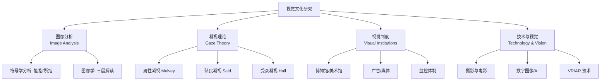

---
aliases: [VisualCulture, VisualStudies, 视觉文化]
tags: ['VisualCulture', 'CulturalStudies', 'ArtsAndCreativity', 'MediaStudies']
created: 2026-05-17
updated: 2026-05-17
---

# 视觉文化 (Visual Culture)

> 视觉文化（Visual Culture / Visual Studies）是文化研究的重要分支，系统探究视觉图像（Images）、观看行为（Viewing）和视觉体制（Visual Regimes）如何在文化中建构意义、身份和权力关系。

## 核心领域

$$ \text{视觉文化} = \text{图像（Image）的制造与流通} + \text{观看（Viewing）的社会建构} + \text{权力（Power）关系} $$

## 关键理论概念

### 视觉性 (Visuality) vs 视觉 (Vision)

- **Vision（视觉—生理）**：眼睛的生理功能——光线 → 视网膜 → 神经信号
- **Visuality（视觉性—社会）**：观看的社会文化建构——我们"学会"如何看

视觉性的概念由法国哲学家 Georges Didi-Huberman 等学者深入发展，强调观看从来不是中立的，而是受到文化、历史和社会条件的制约。

### 凝视理论 (The Gaze)

凝视（Gaze）不等于"看一眼"，而是一种带有权力关系的观看方式。

| 凝视类型 | 权力关系 | 理论家 |
|---------|---------|--------|
| 男性凝视 (Male Gaze) | 男性主体→女性客体 | Laura Mulvey |
| 殖民凝视 (Colonial Gaze) | 西方主体→东方/被殖民客体 | Edward Said |
| 观光客凝视 (Tourist Gaze) | 观看者→被观看的"异域风情" | John Urry |
| 监视凝视 (Surveillance Gaze) | 权力机构→被监控人群 | Michel Foucault |
| 反抗凝视 (Oppositional Gaze) | 边缘群体→主流文化的反击观看 | bell hooks |

### 视觉体制 (Visual Regimes)

Martin Jay 提出的概念，指特定历史时期中主导性的视觉模式。现代性的视觉体制包括：**笛卡尔透视主义** (Cartesian Perspectivalism)、**荷兰静物画** (Dutch Descriptive) 和**巴洛克视觉** (Baroque)。

## 视觉分析方法

### 1. 符号学分析 (Semiotics)

Roland Barthes 的图像意义三层次：

| 层次 | 定义 | 举例：某品牌香水广告中一位女性在花丛中 |
|------|------|--------------------------------------|
| 语言讯息 (Linguistic) | 文字部分 | 品牌名、标语 |
| 明示意 (Denotation) | 直白的"是什么" | 一位年轻女性、花、香水瓶 |
| 隐含义 (Connotation) | 文化联想的意义 | 美丽、浪漫、奢华、青春 |

### 2. 图像学分析 (Iconology)

Erwin Panofsky 的三层分析：

$$ \text{前图像志分析（Pre-iconographic）} \rightarrow \text{识别物体和事件} $$
$$ \text{图像志分析（Iconographic）} \rightarrow \text{理解约定俗成的象征含义} $$
$$ \text{图像学分析（Iconological）} \rightarrow \text{揭示深层的文化/思想意义} $$

### 3. 视觉修辞分析

视觉图像通过特定的修辞手法传达信息：

| 修辞手法 | 定义 | 视觉示例 |
|---------|------|---------|
| 隐喻 (Metaphor) | 一种事物暗示另一种 | 用鸽子代表和平 |
| 转喻 (Metonymy) | 部分代表整体 | 用王冠代表君主制 |
| 提喻 (Synecdoche) | 用局部替代整体 | 用一双鞋代表劳动者 |
| 反讽 (Irony) | 表面意义与真实意义相反 | 广告中刻意夸张的形象 |

## 研究范围

传统上研究"艺术图像"（绘画、雕塑、电影），现在视觉文化研究的对象已经大大扩展：

- **传统对象**：绘画、雕塑、摄影、电影、广告
- **当代对象**：社交媒体图像（Instagram）、表情包（Meme）、自拍、数据可视化、监控影像、AR/VR

## 视觉素养 (Visual Literacy)

在图像爆炸的数字时代，需要培养的六种能力：

1. **解读能力**：分析图像的构成、意义和意识形态
2. **批判能力**：识别视觉修辞和隐性宣传
3. **伦理意识**：尊重图像中的知情权和隐私
4. **创作能力**：有效使用视觉语言表达观点
5. **语境理解**：将图像置于文化、社会、历史中理解
6. **技术素养**：理解数字图像的生成与操作（包括 AI 生成图像）

## 视觉文化中的中国议题

- 从政治宣传画到消费主义视觉文化的转型
- 社交媒体时代的美颜文化（如中国自拍修图现象）
- 短视频平台（抖音/快手）的视觉叙事模式
- 中国传统视觉语言（山水画、书法）的当代再创造

### 案例研究：小红书的美学政治

小红书平台代表了当代中国视觉文化中的独特现象——"种草"文化通过精心策划的视觉图像（产品摄影、生活方式展示）构建消费欲望，同时塑造特定的审美标准和身份认同。

## 当代视觉文化关键议题

### AI 生成图像 (AIGC)

- **DALL-E, Midjourney, Stable Diffusion** 带来了"文本到图像"的革命
- 版权争议：AI 训练数据的合法性和生成物的版权归属
- 视觉真实性的瓦解：眼见不再为实

### 监控社会中的视觉

- 人脸识别技术在社会治理中的应用与隐私争议
- Foucault 的"全景监狱" (Panopticon) 概念在数字时代的变体
- 算法视觉：AI 如何"看"和分类人群

### 社交媒体与自我呈现

- Instagram 视觉美学与消费主义
- 滤镜文化对"真实"的重新定义
- 自拍 (Selfie) 作为身份建构的视觉实践

## 相关条目

- [[VisualArts]]
- [[06_ArtsAndCreativity/DramaAndFilm/FilmTheory|FilmTheory]]
- [[ArtCriticism]]
- [[Museology]]
- [[INDEX|当前目录索引]]

